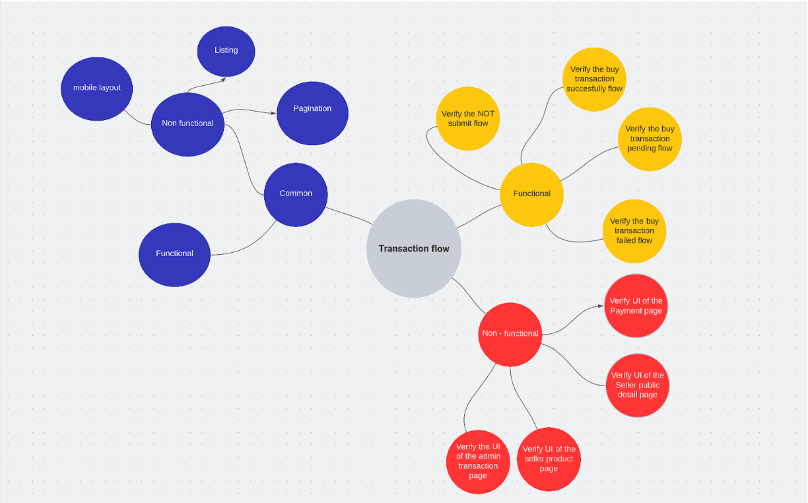

### Note

The self-experience on managing test cases which is using both manual and automation tests in the same project.

### Purpose

Use 1 documentation for the whole testing team (both manual and automation), reduce the effort for writing and maintenance the test cases checklist.

### Strategy

- Use the same term and naming convention as what less changes through time. For example, the requirement (AC). For the project NOT to have much requirement, based on the page's name.
- Separate test cases into 2 parts: functional and non-functional.
  - In functional, all the test cases are the full flow test cases, verified status (mainly). All the steps in between are considered as validation/check points inside.
  - In non-functional, verify all the validation points shown in UI, and mention all the supported devices and viewport.
  - For both, any validation point shows more than 1 time, used as a common validation.
- Start writing test cases as soon as possible ( best cases are parallel by the time the initial stage of requirement).

### Example

Update test cases for feature about the payment flow, through 4 p​​ages, including:

- Seller details public page (product page).
- Payment page.
- Seller product’s management.
- Admin transaction's management.

When it comes through the high level business flow, the user selects the product from **the seller details public page**. After selecting successfully, the **Payment page** displays. After submit, the product’s number will update accordingly in **Seller product’s management** ( logged in as a seller), also the **Admin transaction's management**( when logged in as an admin).

- Flow:
  

- The test cases structure:
  

## Reference

- [Usage Of Heuristics And Mnemonics In Software Testing](https://testmatick.com/usage-of-heuristics-and-mnemonics-in-software-testing/)
- [Test Case Design Techniques](https://www.botplayautomation.com/post/test-case-design-techniques)
- [Software Testing Techniques with Test Case Design Examples](https://www.guru99.com/software-testing-techniques.html)
