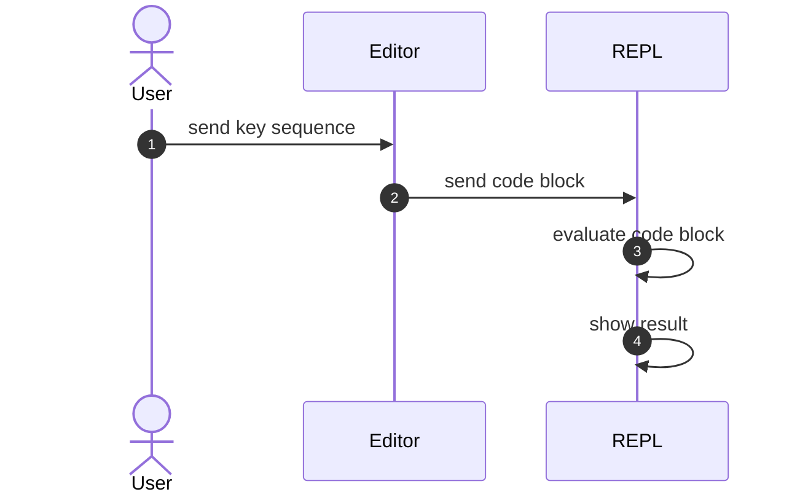

## Introduction

There are two ways that we can use to run computer programs: compiling and
interpreting. Correspondingly, on workflow, for compiled languages, we have a
Edit Compile Execute Loop, and for interpreted languages, we have a Read
Evaluate Print Loop.

REPL is also the name for an interpreted language's fast and small interactive
testing program. For example, in Python, we can start the Python REPL by typing
`python` in the command line:

```python
Python 3.10.9 (main, Dec  6 2022, 18:44:57) [GCC 11.3.0] on linux
Type "help", "copyright", "credits" or "license" for more information.
>>> 1 + 2
3
>>> print("Hello world")
Hello world
```

The same goes for JavaScript, where the command is `node`:

```js
> 1 + 2
3
> console.log("Hello world")
Hello world
undefined
```

Lisp-family languages (Clojure, Racket, Common Lisp, etc.) are the originator of
the term, and they take the concepts further to REPL Driven Development, which
is a workflow where a program is created exploratively part by part. Each part
is put into the REPL, which facilitate unit testing and fast feedback loop.

Emacs is also "the editor" that people think about for this workflow for Lisp is
the editor's DNA from its start (Emacs uses Elisp as its extension language).
However, in this post, I'm gonna be a heretic. I'm going to guide you on how to
do REPL Driven Development on any language that has a REPL ready, using Vim.

## Prerequisites

I'm gonna assume that you, the readers, are proficient command line users. Apart
from working with Vim well (using Vim key bindings everywhere and understanding
Vim plugin installation), you also need to be okay at using tmux (knowing what
is a session and what is a pane).

The main plugin that we are using is `vim-slime`. You are free to add any plugin
for the languages that you use. Later, after you understand the principles, or
the idea behind, `vim-slime` can be replaced with other plugin.

https://github.com/jpalardy/vim-slime

## The General Idea



The idea is that you are going to use a *key sequence* to send a *code block*
from the editor to the REPL. The REPL then is going to evaluate the block, and
display the result, which creates a much faster feedback loop than the
traditional "make sure the whole program works".

REPL Driven Development also encourages the user to split the program's
functionalities into small, "pure" functions (ones that return the same output
for the same input), since they are a natural fit for code block sending.

Let's go back to the main topic, where we specified Vim and tmux and
`vim-slime`, what we are going to do is to have tmux split the screen into two
halves: Vim on the top, and a REPL on the bottom, and `vim-slime` to send the
code block into the bottom REPL.

```goat
+------------------+                                                            
|       VIM        |
|     vim-slime    +---+
|                  |   |
+------------------+   | code block
|       REPL       |   |
|                  |<--+
|                  |
+------------------+
```

## Demonstrations

> Talk is cheap. Show me the ~~code~~ GIFs.

I guess my explanations bored you enough. Here are some demonstrations that I
created. `C-c C-c` (or double `Ctrl C`) is the key binding that I used to send
a code block from Neovim to the second pane of tmux.

### Python


### JavaScript


### OCaml


### Shell


## Conclusion

REPL Driven Development is an interesting and joyful approach to software
development, but I think it has its drawbacks. The main one that I can think of
is the limitations from a language's module implementation: while Clojure has a
`namespace` system, Python or Node or OCaml does not have something like that to
allow a big program to be initially disintegrated, and later be combined as a
whole.

I think REPL Driven Development can still be good tool for programming language
learning purpose: I think the workflow is a perfect way to get yourself familiar
with the language's syntax and standard library.

