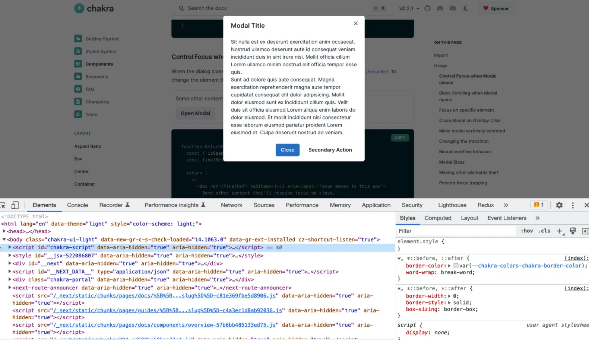

`inert` is a boolean HTML property that makes the browser ignore the user input events for an element, including focus events and events from assistive technologies.

When an element has `inert` attribute, it will be removed from the tab order (interactivity), and from the accessibility tree (discoverability). While discoverability, previously, could be suppressed by `aria-hidden=true`, interactivity is more difficult as developers normally have to combine with `tabindex="-1"` to get it disabled.

The born of `inert` helps to eliminate the need for [[Focus trap | focus trap]] which is being combined with `aria-hidden` to improve the accessibility of a web page containing an open dialog (see the attachment), though we still have to manually move the focus to the dialog and return focus the element that triggered it after the dialog is closed.



```html
<!-- Before -->
<div id="main" aria-hidden="true">...</div>
<div class="dialog">...</div>
<script>
  // ...initiate focus trap for .dialog
</script>

<!-- After -->
<div id="main" inert>...</div>
<div class="dialog">...</div>
```

#### References

- https://developer.chrome.com/articles/inert/
- https://patrickhlauke.github.io/aria/demos/modal/index-aria-inert.html
