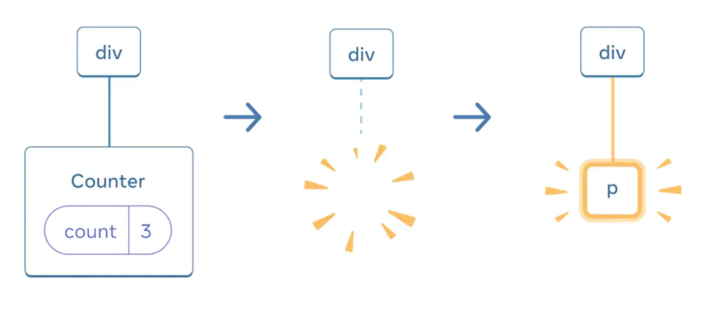
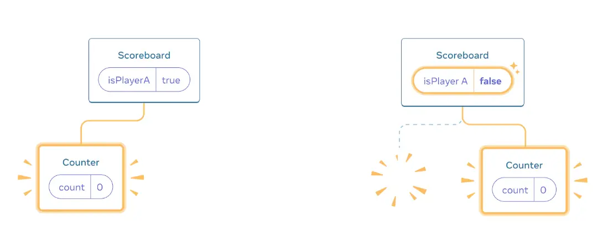

## Why should you read this article?

- Understand how state in React works

```jsx
const [isPlayerA, setIsPlayerA] = useState(true)

function Counter(name) {
  const [score, setScore] = useState(0)
  return (
    <>
      <div>
        {name}: {score}
      </div>
      <button onClick={() => setScore(score + 1)}>+1</button>
    </>
  )
}

// ----------

// Do you think they are the same?
// ----- Approach 1
{
  isPlayerA ? <Counter name="A" /> : <Counter name="B" />
}

// ----- Approach 2
{
  isPlayerA && <Counter name="A" />
}
{
  !isPlayerA && <Counter name="B" />
}
```

## The UI Tree


As you can see in the below picture, the rendering flow of React should be:

JSX --_(React)_--> UI trees --_(React DOM)_--> DOM

## State is tied to a position in the tree

- Actually, the component has _no state_. The state is stored in React and associated with the correct component based on its **position** in the UI tree.
- React preserves a component’s state for as long as it’s being rendered at its position in the UI tree.
- For example:

```js
function Counter() {
  const [score, setScore] = useState(0)

  return <div>...</div>
}

return (
  <div>
    <Counter />
    <Counter />
  </div>
)
```

- Q: Is the two `<Counter />` components the same?
- A: **No!** **These are two separate counters because each is rendered at its own position in the tree** => each of them will get its own, independent `score` state.
- In case the `<Counter />` get removed -> React discards its state

## Preserves state

- Take a look on the below example

```js
const [isFancy, setIsFancy] = useState(false);

 return (
  <div>
    {isFancy ? (
      <Counter isFancy={true} />
    ) : (
      <Counter isFancy={false} />
    )}
  </div>
  ...
)
```

- Q: Are `<Counter isFancy={true} />` and `<Counter isFancy={false} />` the same component?
- A: **Yes!** Because: same component + same position + with React's perspective -> it's the same Counter.
- Q: Why do I say it is the same position?
- A: Take a look at the UI Tree section, that it's the **position of the UI tree**, not in the JSX markup

=> **Same component + Same position -> Preserve state**

## Different components at the same position reset state

```js
const [isPaused, setIsPaused] = useState(false);

 return (
  <div>
    {isPaused ? (
      <p>See ya!</p>
    ) : (
      <Counter />
    )}
  </div>
  ...
)
```

- In this example, we switch between _different_ component types at the same position. Initially, the first child of `<div>` contained a `Counter`. But when swapped in a `p`, React removed the `Counter` from the UI tree and destroyed its state



=> **Different component + Same position -> Reset the state of its entire subtree**

## Resetting state at the same position

By default, React preserves state of a component while it stays at the same position. But we have ability to reset the state.

Back to the example at the beginning of the article

```js
// Approach 1
{
  isPlayerA ? <Counter name="A" /> : <Counter name="B" />
}
```

- Q: If we use approach 1, what happens?
- A: Because the counter component in two case is the same component + same position => The state still the same. That makes a bug, although the name props changed, but the `score` still stay. It's normal in React, but it isn't what we want, right? We have 2 options for it

### Option 1: Rendering component with different positions

- It's exactly what Approach 2 does, rendering component with different positions

```js
{
  isPlayerA && <Counter name="A" />
}
{
  !isPlayerA && <Counter name="B" />
}
```



### Option 2: Resetting state with a key (recommendation)

```js
{
  isPlayerA ? <Counter name="A" key="A" /> : <Counter name="B" key="B" />
}
```

- Keys aren’t just for lists! You can use keys to make React distinguish between any components. By default, React uses order within the parent (first Counter component, second Counter component,...). By using key, React will know A's counter, B's counter => React won't share state between them.

## Reference

- https://beta.reactjs.org/learn/preserving-and-resetting-state
