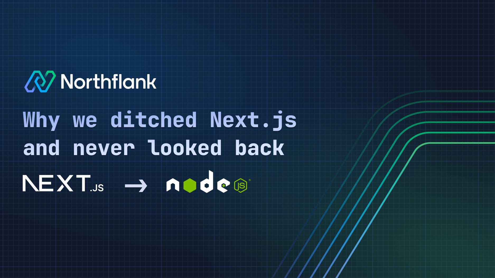

---
tags:
  - frontend
  - market-report
title: "Frontend Report March 2025"
description: "March 2025 brings critical frontend updates! Learn about the Next.js security exploit you must patch nows. Explore TypeScript's upcoming 10x speed boost with Corsa, React Router's game-changing middleware, and why prefetching can surprisingly slow down your site. Plus: CSS functions are finally here, new in Chrome 133, Node.js is dropping Corepack, and TanStack Start finds an official deployment home!"
date: 2025-03-31
authors:
  - hthai2201
---

## React
### [Common React libraries architecture](https://www.felgus.dev/blog/common-react-lib-architecture)

Most React libraries share a similar architecture: a core with the main logic and a binding (hooks/components) for React integration. The core object is often created externally and connected via Context API. Libraries use the Observer pattern to notify React of changes, triggering re-renders with useSyncExternalStore or custom hooks

### [Time to ditch Redux: Why most React apps don't need it](https://www.bennett.ink/its-probably-time-to-stop-recommending-redux)

Redux might be holding your app back! Most **state** is actually API data better handled with caching tools. Modern React can handle complex UI state with useState and custom hooks - no global store needed. Skip the boilerplate and complexity; your team will thank you when they don't have to trace actions through multiple files anymore.

### [Use React 19's cache() to kill waterfall fetching](https://aurorascharff.no/posts/avoiding-server-component-waterfall-fetching-with-react-19-cache/)

React 19's cache() API for Server Components caches data fetches/computations per render, preventing redundant requests. This reduces data coupling between components and enables data preloading to avoid waterfall fetching, improving performance. Use cache() for custom data fetching functions (like database calls), as the built-in fetch() API in Next.js already handles caching

### Quick links

- [Beyond React.memo: Smart performance optimization that actually works](https://cekrem.github.io/posts/beyond-react-memo-smarter-performance-optimization/)
- [The URL: React's underrated state manager](https://iamsahaj.xyz/blog/react-state-in-the-url/)
- [React: The unexpected perfect engine for LLM workflows](https://www.gensx.com/blog/why-react-is-the-best-backend-workflow-engine)
- [Server Actions with Toast: React's useActionState explained](https://www.robinwieruch.de/react-server-actions-useactionstate-toast/)

## Next.js

### [Next.js middleware exploit: CVE-2025-29927 authorization bypass](https://zeropath.com/blog/nextjs-middleware-cve-2025-29927-auth-bypass)

Critical CVE-2025-29927 in Next.js middleware lets attackers bypass security via the x-middleware-subrequest header. This impacts auth, CSP, geo-restrictions, and more. Affects v11.1.4 to unpatched v14/15. Update ASAP to patched versions (≥ 12.3.5, ≥ 13.5.9, ≥ 14.2.25, ≥ 15.2.3) or block the header

### [Next.js 15.2: Error handling that actually makes sense](https://nextjs.org/blog/next-15-2)

Next.js 15.2 transforms your debugging experience with beautiful new error UIs and readable stack traces! The game-changing streaming metadata feature decouples UI rendering from metadata generation for faster page loads. Plus, Turbopack gets massive speed boosts with reduced memory usage and there's experimental support for React View Transitions!

### [Can Next.js handle serious traffic? The surprising answer](https://martijnhols.nl/blog/how-much-traffic-can-a-pre-rendered-nextjs-site-handle)

A pre-rendered Next.js site should handle tons of traffic, right? Wrong! This developer's shocking discovery shows VPS performance limits with barely any improvement after scaling up. After rejecting Cloudflare (privacy concerns) and Vercel (too expensive), a dedicated server finally delivered thousands of requests per second.

### [We ditched Next.js and lived to tell the tale](https://northflank.com/blog/why-we-ditched-next-js-and-never-looked-back)

Sometimes the popular choice isn't right! This team abandoned Next.js and found greater simplicity, better performance, and increased flexibility with their custom solution. Their honest assessment of Next.js limitations might challenge your assumptions about which framework best fits your project's actual needs.

### Quick links

- [Vercel's Fluid Compute: How it slashes AI costs](https://vercel.com/blog/how-fluid-compute-works-on-vercel)
- [How Preply boosted INP without App Router](https://medium.com/preply-engineering/how-preply-improved-inp-on-a-next-js-application-without-react-server-components-and-app-router-491713149875)

## Others

### [Tailwind's hidden cost: The maintainability trade-off](https://measured.co/blog/tailwind-trade-offs)

Tailwind lets you ship blazing fast with predefined styles and no custom CSS files, but at what cost? As projects grow, maintaining those utility-packed class strings becomes increasingly challenging. This honest look at Tailwind's trade-offs will help you decide if the initial velocity boost is worth potential long-term maintenance headaches.

### [CSS just got functions! Here's why it's a game-changer](https://css-tricks.com/functions-in-css/)

CSS is finally getting real functions! Define them with `@function`, pass arguments with type-checking, and return values with the `result` descriptor. Currently in Chrome Canary behind a flag, they'll revolutionize complex CSS logic - especially for fluid typography and dynamic layouts. The CSS preprocessor era might finally be ending!

### [Why prefetching can actually slow your site down](https://www.debugbear.com/blog/prefetch-slower-website)

While prefetching is supposed to improve website performance by loading resources in advance, it can sometimes worsen loading speed by competing with critical content for bandwidth. Despite being assigned the lowest priority, prefetch requests may initiate too early, delaying the loading of important elements like the Largest Contentful Paint (LCP). To prevent this, you can inject prefetch hints via JavaScript after the initial page load to make sure essential content loads first.

### Quick links

- [CSS individual transforms are additive (and awesome)](https://polypane.app/blog/the-css-transform-property-and-individual-transforms-are-additive)
- [CSS relative colors: Dynamic color generation is here](https://ishadeed.com/article/css-relative-colors/)
- [TypeScript: The JavaScript sidekick you didn't know you needed!](https://2ality.com/2025/03/typescript-sales-pitch.html)

## Trending

### [React 2025: Server power unleashed & dev tools evolved!](https://www.robinwieruch.de/react-trends/)

This year, expect **React Server Components (RSC)** to become standard. **React Server Functions (RSF)** will simplify data fetching & mutations. **React 19** brings form improvements. Frameworks beyond Next.js (TanStack Start, React Router) will rise. **Full-Stack React** gains traction. Plus, watch for new styling approaches & tools like **Biome** and the **React Compiler**.

### [TypeScript is getting 10x faster.](https://devblogs.microsoft.com/typescript/typescript-native-port/)

Get ready for `Corsa` - TypeScript's new Go-based compiler that promises 10x faster builds, half the memory usage, and near-instant editor responsiveness! The upcoming native port will transform the TypeScript experience, especially on large codebases. Preview coming mid-2025, with full release by year-end.

### [Corepack unplugged: Node.js rethinks bundled package managers!](https://socket.dev/blog/node-js-tsc-votes-to-stop-distributing-corepack)

The **Node.js TSC has voted to stop distributing Corepack** in future releases (25+), though it remains experimental in v24 and earlier . This move reflects **low adoption**, **distribution concerns**, and the desire for **independent evolution of package managers**. Developers may need to **install Corepack separately** if needed.

### [TanStack Start on Netlify: Official deployment partner](https://www.netlify.com/blog/tanstack-start-netlify-official-deployment-partner/)

**Netlify** is now the **official deployment partner** for **TanStack Start**, the hot new full-stack React framework! Expect seamless, **zero-config deployments** and a killer developer experience.

### Quick links

- [How we migrated 160,000 lines to TypeScript with zero downtime](https://benhowdle.im/migrating-js-to-ts-zero-downtime.html)
- [Prisma replaces Rust with WASM and TypeScript, gets 3.4x faster](https://www.prisma.io/blog/rust-to-typescript-update-boosting-prisma-orm-performance)

## Tools

### [TanStack Form v1: Forms done right, finally](https://tanstack.com/blog/announcing-tanstack-form-v1)

TanStack Form v1 is here and production-ready across React, Vue, Angular, Solid, and Lit! With extreme type safety, schema validation (Zod, Valibot, ArkType), and smart async validation with built-in debouncing, it solves the form headaches that have plagued frontend devs for years.

### [React Router v7: Middleware changes everything](https://react.statuscode.com/link/166745/web)

React Router v7 introduces middleware - a game-changing approach to handling routes that lets you intercept and transform navigation requests before they complete. Perfect for auth checks, analytics, permission verification, and more.

### [TypeScript 5.8: Better return type checks & ESM require() support](https://devblogs.microsoft.com/typescript/announcing-typescript-5-8/)

TypeScript 5.8 enhances code checks with granular return expression analysis, improving bug detection. It boosts Node.js ESM/CJS interop under `--module nodenext`. The `--erasableSyntaxOnly` flag aids Node.js direct TS execution

### [Chrome 133: Enhanced attr() for styling any CSS property](https://css-tricks.com/chrome-133-goodies/)

Chrome 133 enhances CSS with two main features: `attr()` for all properties and scroll state container queries. The `attr()` function can now use HTML attribute values to style any CSS property, not just content. This includes specifying data types and fallback values. Additionally, container queries can now style elements based on their scroll state (e.g., "stuck", "snapped") within a defined container. This allows dynamic styling of elements like sticky headers

### Quick links

- [Why does target="\_blank" have that underscore?](https://kyrylo.org/html/2024/10/25/why-does-target-blank-have-an-underscore-in-front.html)
- [Lynx: Build native mobile & web UIs from one codebase](https://lynxjs.org/)

## Commentary

- [The end of JavaScript fatigue? Don't count on it](https://allenpike.com/2025/javascript-fatigue-ssr)
- [Decoding the debate around signals in the world of React](https://www.felgus.dev/blog/signals-in-react)
- [Local-first is the future (but not without challenges)](https://rxdb.info/articles/local-first-future.html)
