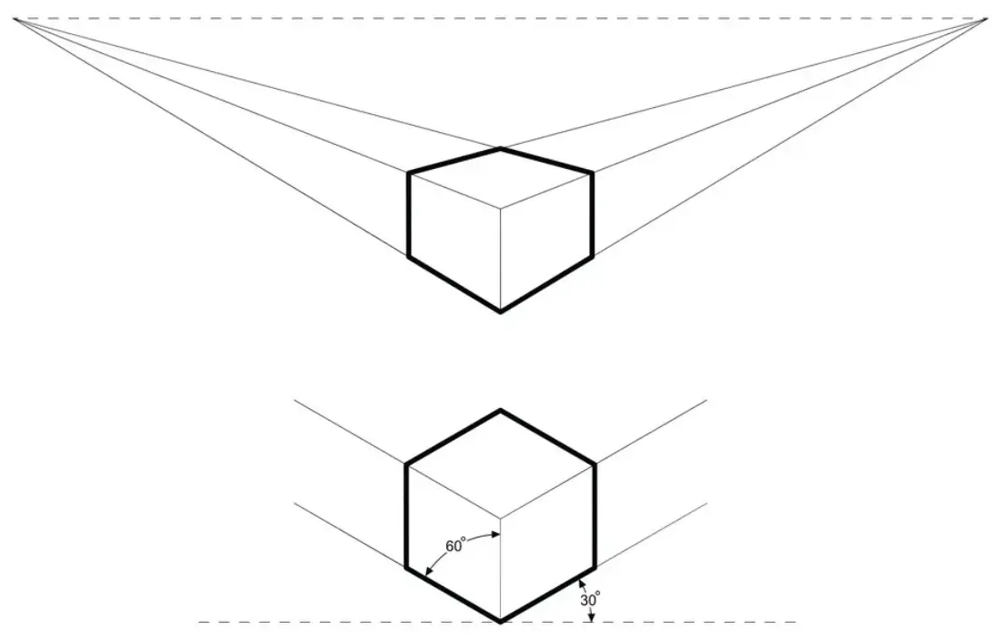
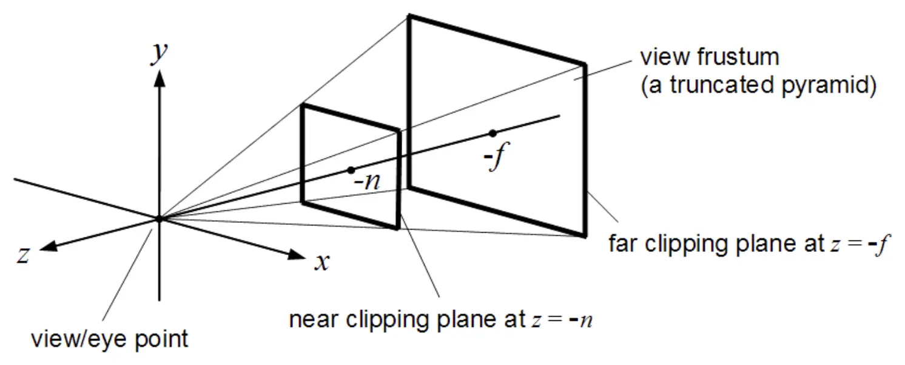
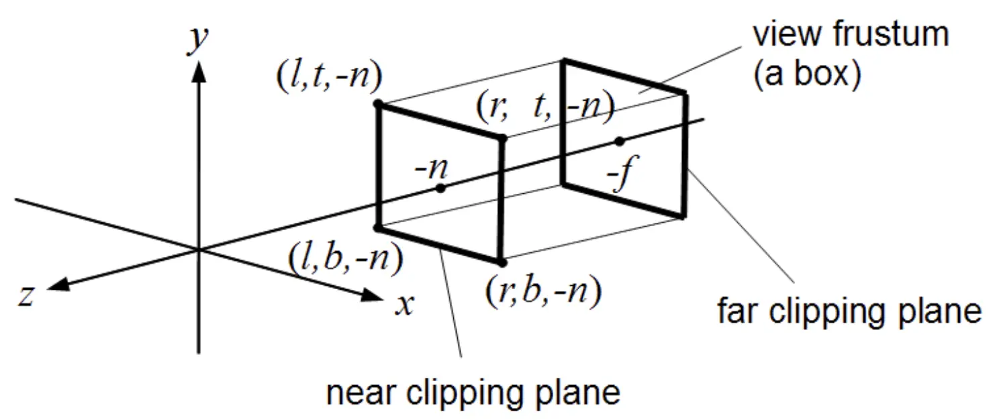

---
tags:
  - frontend
  - threejs
authors:
  - namnd
description: "**ThreeJS** is a JavaScript 3D library that allows developers to develop and describe data in 3 dimensions, and then convert them into 2 dimensions and display them on [HTML Canvas](https://developer.mozilla.org/en-US/docs/Web/API/HTMLCanvasElement). [**Camera**](https://threejs.org/docs/index.html?q=camera#api/en/cameras/Camera) is one of the core elements of a ThreeJS project, beside [Scene](https://threejs.org/docs/index.html?q=scene#api/en/scenes/Scene), [Renderer](https://threejs.org/docs/index.html?q=renderer#api/en/renderers/WebGLRenderer) and 3D objects (can be formed with [Geometries](https://threejs.org/docs/index.html?q=geometry#api/en/geometries/BoxGeometry) and [Materials](https://threejs.org/docs/index.html?q=material#api/en/materials/MeshBasicMaterial))."
title: Cameras in ThreeJS
github_id: nguyend-nam
date: 2022-09-15
---

**ThreeJS** is a JavaScript 3D library that allows developers to develop and describe data in 3 dimensions, and then convert them into 2 dimensions and display them on [HTML Canvas](https://developer.mozilla.org/en-US/docs/Web/API/HTMLCanvasElement). [**Camera**](https://threejs.org/docs/index.html?q=camera#api/en/cameras/Camera) is one of the core elements of a ThreeJS project, beside [Scene](https://threejs.org/docs/index.html?q=scene#api/en/scenes/Scene), [Renderer](https://threejs.org/docs/index.html?q=renderer#api/en/renderers/WebGLRenderer) and 3D objects (can be formed with [Geometries](https://threejs.org/docs/index.html?q=geometry#api/en/geometries/BoxGeometry) and [Materials](https://threejs.org/docs/index.html?q=material#api/en/materials/MeshBasicMaterial)).

This article gives basic information about characteristics of the frequently used types of camera in ThreeJS.

## Most commonly used types of camera in ThreeJS

You cannot use the `Camera` class directly to initialize a new camera in ThreeJS. Instead, use the `PerspectiveCamera` or `OrthographicCamera` specifically. The **perspective camera** gives information about depth, distances, etc. since it represents perspective in **real life**. On the other hand, with an **orthographic camera**, all sizes are projected the same way and we can easily compare them accurately.

The image below shows the object viewed in **perspective camera** (upper) and in **orthographic camera** (lower).



Place them into the **Oxyz** coordinate...


### Perspective camera



Some crucial attributes:

- **fov** (field of view): Camera frustum **vertical** field of view, i.e. the angle of the view in the yOz plane, in degree. The lower the number, the narrower the view. 
- **near** and **far**: Clipping planes at 2 points on the z axis. Note that objects with z position outside the `(near, far)` interval will **not** be displayed.

```javascript
const camera = new THREE.PerspectiveCamera(45, 16 / 9, 1, 1000)
scene.add(camera)
```

In the example above, a perspective camera is initialized with `fov` of 45 degree, `aspect-ratio` of 16 / 9, `near` and `far` of 1 and 1000 respectively.

Perspective camera visualization from [r105.threejsfundamentals.org](https://r105.threejsfundamentals.org/threejs/threejs-cameras-perspective-2-scenes.html) with [`CameraHelper`](https://threejs.org/docs/index.html?q=camera#api/en/helpers/CameraHelper):

<iframe height="400" style="width: 100%;" scrolling="no" title="ThreeJS - Cameras - Perspective 2 views" src="https://codepen.io/nguyend-nam/embed/abGmYBp?default-tab=result" frameborder="no" allowfullscreen="true"></iframe>

### Orthographic camera



Some crucial attributes:

- **left**, **right**, **top** and **bottom**: Horizontal and vertical position of 4 segments of the view.
- **near** and **far**: Same as for perspective camera.

```javascript
const camera = new THREE.OrthographicCamera(-2, 2, 1, -1, 1, 1000)
scene.add(camera)
```

In the example above, an orthographic camera is initialized with `left`, `right`, `top` and `bottom` equal -2, 2, 1 and -1 respectively. The last 2 numbers represent `near` and `far`.

Orthographic camera visualization from [r105.threejsfundamentals.org](https://r105.threejsfundamentals.org/threejs/threejs-cameras-orthographic-2-scenes.html) with [`CameraHelper`](https://threejs.org/docs/index.html?q=camera#api/en/helpers/CameraHelper):

<iframe height="400" style="width: 100%;" scrolling="no" title="ThreeJS - Cameras - Orthographic 2 views" src="https://codepen.io/nguyend-nam/embed/BaxLrWv?default-tab=result" frameborder="no" allowfullscreen="true"></iframe>

## Other types of camera

Beside those 2 most frequently used cameras, ThreeJS also provides various options:

- [ArrayCamera](https://threejs.org/docs/index.html?q=camera#api/en/cameras/ArrayCamera)
- [CubeCamera](https://threejs.org/docs/index.html?q=camera#api/en/cameras/CubeCamera)
- [StereoCamera](https://threejs.org/docs/index.html?q=camera#api/en/cameras/StereoCamera)

## Reference

- https://threejs.org/docs/index.html?q=camera#api/en/cameras/Camera
- https://r105.threejsfundamentals.org/threejs/lessons/threejs-cameras.html
- https://www.vectorstock.com/royalty-free-vector/isometric-and-perspective-drawings-vector-7297379
- https://wiki.freecadweb.org/index.php?title=File:Orthographic_Perspective.gif
- https://www.celestron.com/blogs/knowledgebase/what-is-the-field-of-view-of-a-pair-of-binoculars
