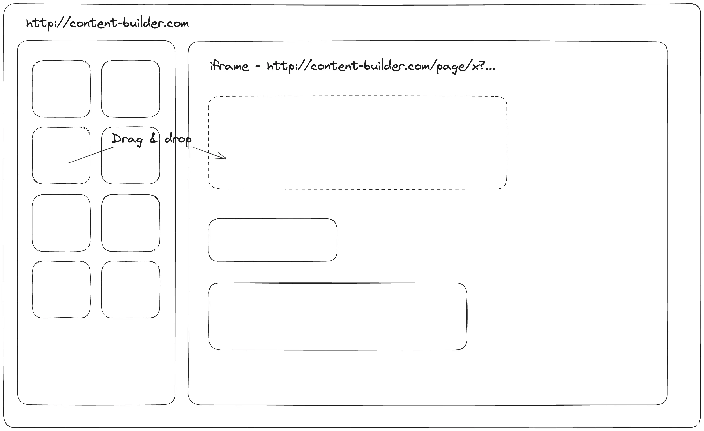

When working with web development, communicating between a main window and an embedded iframe is often necessary for various tasks, such as content creation or widget implementation. This communication can occur between windows and iframes with the same origin or across different origins.

## Same Origin Communication

"Same origin" refers to the scenario where two URLs have the same protocol, domain, and port. For instance, the following URLs have the same origin:

- http://example.com
- http://example.com/
- http://example.com/my/page.html

On the other hand, these URLs do not share the same origin:

- http://example.org (different domain: `.org`)
- http://www.example.com (different subdomain: `www.`)
- https://example.com (different protocol: `https`)
- http://example.com:8080 (different port: `8080`)

In the case of same origin communication:

- If a window comes from the same origin as an iframe, we have full access to the iframe's content, including variables and document. If they don't share the same origin, access to the content is restricted for security reasons.
- The parent window can modify the inner window using the `contentWindow` or `contentDocument` property. Here is an example of same origin communication:

```html
<!-- iframe from the same site -->
<iframe src="/" id="iframe"></iframe>

<script>
  iframe.onload = function () {
    // just do anything
    iframe.contentDocument.body.prepend('Hello, world!')
  }
</script>
```

Use cases for same origin communication include content builder applications where the isolation of CSS and responsive display are essential. 

## Cross Origin Communication

Cross origin communication occurs when the iframe and the parent window come from different origins. The [postMessage](https://developer.mozilla.org/en-US/docs/Web/API/Window/postMessage) interface allows windows to communicate regardless of their origins.

This method is an exception to the "Same Origin" policy, enabling windows from different origins to exchange information if both parties agree and implement corresponding JavaScript functions, ensuring user safety.

Here's how the communication happens:

- Both the iframe and its parent window can communicate using the `postMessage` method.
- The parent window uses `iframe.contentWindow.postMessage` to send messages to the iframe.
- The iframe sends messages to the parent window using `window.parent.postMessage`.
- Both parties receive messages using `window.addEventListener('message')`.

Here's an example of cross origin communication:

```html
<iframe src="http://example.com" name="example"></iframe>
<script>
  let iframe = window.frames.example
  // target origin is *
  iframe.contentWindow.postMessage('message', '*')
</script>
```

```js
// http://example.com internal script
window.addEventListener('message', function (event) {
  if (event.origin != 'http://source.com') {
    // something from an unknown domain, let's ignore it
    return
  }

  alert('received: ' + event.data)

  // can message back using event.source.postMessage(...)
  // or window.parent.postMessage(...)
})
```

Use cases for cross origin communication include embedded widgets like chatboxes. 

In summary, communication between a window and an iframe is facilitated through the `postMessage` interface for cross origin scenarios, and the `contentWindow` property for same origin scenarios. This allows for seamless integration of iframes in various web applications, enhancing user experience and functionality.

## References

- https://javascript.info/cross-window-communication
- https://developer.mozilla.org/en-US/docs/Web/API/Window/postMessage
- [Two way iframe communication](https://gist.github.com/pbojinov/8965299)
