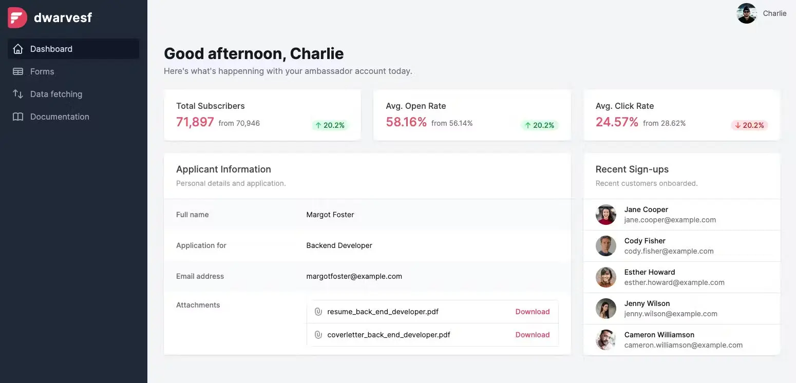
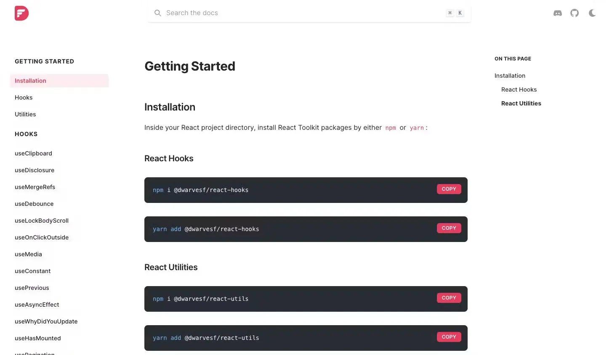
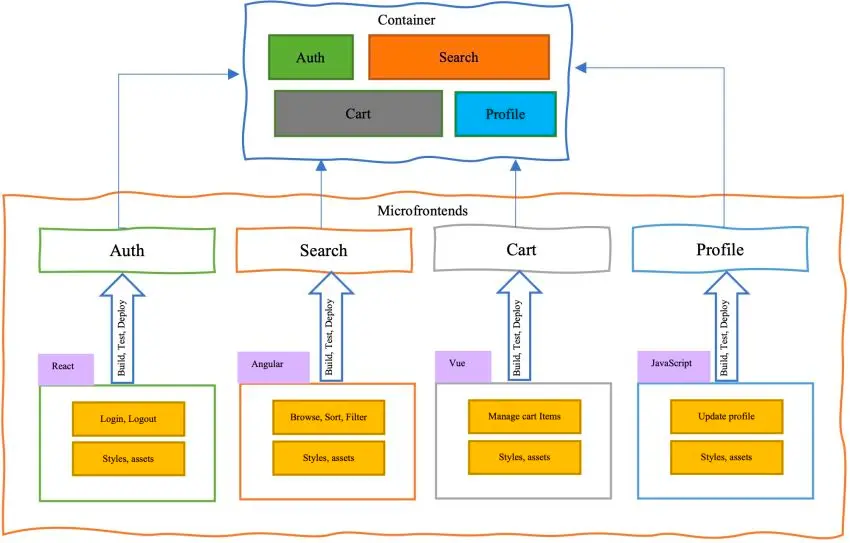

---
tags:
  - engineering
  - micro-frontend
  - architecture
title: Why Micro Frontend
date: 2023-03-20
description: "As web applications become more complex and feature-rich, traditional frontend architectures such as monolithic will become harder to maintain, scale, and evolve. Micro-frontend is an emerging front-end architecture that aims to address these challenges by breaking down the front-end into small, independent and reusable modules."
authors:
  - mashiro5951
---

## Micro-Frontend - What & Why?

As web applications become more complex and feature-rich, traditional frontend architectures such as monolithic will become harder to maintain, scale, and evolve. Micro-frontend is an emerging front-end architecture that aims to address these challenges by breaking down the front-end into small, independent and reusable modules.

In this article, we will explore the concept of micro-frontend, its benefits, design principles, tools and technologies, implementation strategies, and challenges. By the end of this article, you will have a good understanding of what micro-frontend is and why it is important for modern front-end development.

## What is Micro-Frontend?

Micro-Frontend is an architectural pattern for frontend development that emphasizes breaking down the frontend into small, independent and self-contained modules.

Each module is responsible for a specific feature or functionality and can be developed, tested, and deployed independently. The modules can then be composed into a complete frontend application, similar to how microservices are composed into a complete backend application.

To better understand how micro-frontend architecture works, we should first look into what’s **monolithic architecture.**

### The Monolithic Architecture

In a monolith system, everything resides in one repository and all the developers work on the same code base. For every single change, the entire app needs to be built, tested & shipped as a whole.

In a lot of cases, this approach is fine, it works if you do it right and a lot of systems use it efficiently. However, as the software scales, issues might arise. It becomes difficult to upgrade the dependencies due to a big codebase with huge impacts, a lot of time would be spent in coordination between developers, testing and deployments become slower, individual changes cannot be shipped, slowing down the pace of the team bringing value to the clients.

There might be a need for a more efficient solution - by breaking it down:

 

We can see that the backend work has been broken into microservices - a term we are probably too familiar with at this point. However, front-end work is still one big chunk. This is where micro-frontend comes in.

### The Micro-Frontend Architecture

Let’s take the previous monolithic example (The Shop Team), broken into micro-frontends:

   With micro-frontends, codebase, teams, and responsibilities are split vertically in a way that the coupling between them is very low. Each team owns a smaller codebase, and can individually test, deploy and scale according to the needs. Now the teams only need to coordinate the moving parts, which can be kept minimal with a good system design. The teams can easily manage their dependencies and even use a separate tech stack.

Finally, all micro-frontends can be served to the users altogether through a container (shell) app:

Now that we’ve already got the gist of what micro-frontend is, let’s take a closer look at the key benefits it brings.

## Advantages of Micro-Frontend

### Improved Scalability

Micro-frontend allows for individual features or functionalities to be developed, tested, and deployed independently by individual teams, which makes it easier to scale specific areas of the application without affecting others.

On the other hand, it also lets teams express themselves at their best - they can make the best possible decision in terms of architecture, testing, and coding style based on the business logic they have to tackle.

### Enhanced Flexibility

Micro-frontend allows greater flexibility in development, enabling teams to use the best tools for each micro-frontend as each micro-frontend can be built using different frameworks, technologies, and languages.

Teams can opt for a new technology stack without having to translate what was developed previously, eliminating technology lock-in & offering opportunities to pick up newer & better tech stacks. This also helps diversify hiring processes as there are many stacks being used.

### Faster Development & Deployment

Micro-frontend allows independent teams to work on independent features simultaneously, without communication overhead. Teams can deploy faster, at a higher rate, with a smaller size.

### Better Maintainability

Micro-frontend allows greater autonomy and ownership as each micro-frontend is managed by a dedicated team. It is easier to identify and fix issues, as each team is responsible for a specific feature or functionality.

It also helps address challenges related to legacy code by enabling teams to rebuild and replace individual micro-frontends without having to rebuild the entire application from scratch.

Of course, while there are many advantages to using a micro-frontend architecture, there are also several challenges and considerations that must be taken into account.

## Challenges and Considerations

### Increased complexity

While micro-frontends can help break down a large application into smaller, more manageable pieces, they can also introduce additional complexity. Managing the interactions between different micro-frontends, handling cross-cutting concerns like authentication and routing, and coordinating deployment and versioning can all be challenging.

### Performance overhead

Each micro-frontend adds additional overhead to the page, with its own network requests, JavaScript files, and CSS styles. While this can help improve scalability and maintainability, it can also impact page load times and user experience if not managed carefully.

### Browser compatibility

Different micro-frontends may have different dependencies and requirements, making it challenging to ensure compatibility across different browsers and devices. This can require additional testing and development efforts to ensure that the application works correctly on all platforms.

### Security concerns

Each micro-frontend represents a potential attack surface for hackers and malicious actors, so it's important to ensure that each micro-frontend is properly secured and isolated from the rest of the application. This can involve implementing security measures like sandboxing, Content Security Policy (CSP), and other best practices.

### Communication between micro-frontends

Coordinating communication between different micro-frontends can be challenging, especially when dealing with complex workflows or data dependencies. This can require careful planning and design to ensure that each micro-frontend can communicate effectively with the others without creating unintended side effects.

### Tooling and infrastructure

Building and deploying micro-frontends often requires a different set of tools and infrastructure than traditional monolithic applications. This can involve implementing new build processes, deploying microservices, and managing complex deployment pipelines, which can require additional expertise and resources.

So, knowing full well the pros and cons of micro-frontend architecture, how should we approach building one? Let’s move on to some design principles.

## Micro-Frontend Design Principles

### Single Responsibility

Each micro-frontend should be responsible for a single aspect of the user interface, rather than trying to do too much. This helps keep the codebase manageable and ensures that changes to one part of the interface don't have unintended consequences elsewhere.

### Loose Coupling

Micro-frontends should be designed to be as independent as possible, with minimal dependencies on other parts of the application. This allows each micro-frontend to be developed, tested, and deployed separately, without affecting other parts of the system.

### Composability

Micro-frontends should be designed to be easily combined with other micro-frontends to create a complete user interface. This means that they should have clear, well-defined interfaces and be designed with reusability in mind.

### Isolation

Each micro-frontend should be fully isolated from the rest of the application, with its own dedicated DOM element and JavaScript execution context. This prevents conflicts between different parts of the UI and ensures that one micro-frontend cannot affect the behavior of others.

### Standardization

To ensure consistency across different micro-frontends, it's important to establish and adhere to a set of standard design patterns, coding conventions, and UI guidelines. This helps ensure that users have a seamless experience across the entire application.

### Testing

Each micro-frontend should be designed with testing in mind, with a suite of automated tests to verify its functionality and ensure that changes don't introduce regressions. This helps catch bugs early in the development process and ensures that the system remains stable and reliable.

## Conclusion

With that, we hope you now have a clear idea of what micro-frontend is, its pros and cons, as well as some key principles that ensure this architecture is correctly built.

Micro-frontend is a powerful approach to building web applications, with a focus on scalability and maintainability. It is still growing, with companies such as AWS, IKEA, or DAZN which has begun their own adoption of the technology, and we here at Dwarves Foundation are no exception. We are actively practicing the architecture with some of our partners, including [Mudah](https://www.mudah.my/) and [Setel](https://www.setel.com/).

However, please do keep in my that regardless of its strength, Micro-Frontend is not a one-sizes-fit-all solution. Traditional, monolithic architectures still have their charms, and picking which to use for the business remains one of the most important questions we hope to help you answer.

Until next time!

## References

- [5 Reasons You Should Adopt a Micro Frontend Architecture — SitePoint](https://www.sitepoint.com/micro-frontend-architecture-benefits/)
- [5 Pitfalls of Using Micro Frontends and How to Avoid Them — SitePoint](https://www.sitepoint.com/micro-frontend-architecture-pitfalls/)
- [Micro Frontends - A Complete Guide | Hygraph](https://hygraph.com/blog/micro-frontend)
- [Micro-Frontend—Why and How? | Syncfusion Blogs](https://www.syncfusion.com/blogs/post/micro-frontend-why-and-how.aspx)
- [Microfrontends Anti-Patterns: Seven Years in the Trenches](https://www.infoq.com/presentations/microfrontend-antipattern/)
- [Micro Frontends - extending the microservice idea to frontend development (micro-frontends.org)](https://micro-frontends.org/)
