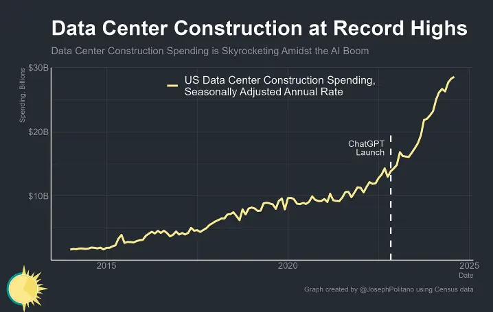
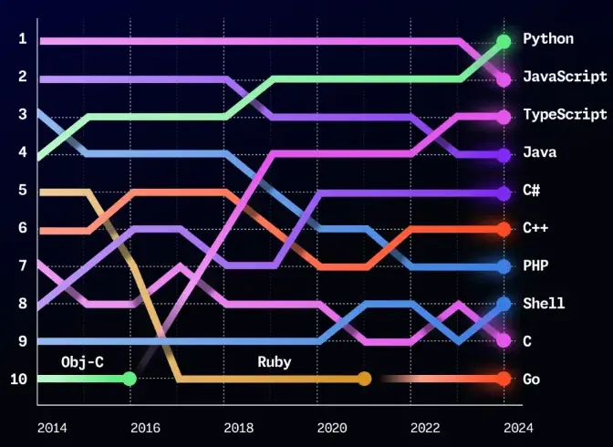

---
tags:
  - labs
  - market-report
  - AI
  - LLM
title: Market Report October 2024
short_title: October 2024
date: 2024-11-04
description: 'Explore the October 2024 Market Report: chatbots as productivity essentials with future potential, AI’s role despite investment bubble concerns, and Python’s rise in modern tech and AI. Learn why coding tools require strong practices, why companies seek versatile engineers, and how Big Tech’s job market favors senior talent, posing challenges for juniors.'
authors:
  - thanh
  - monotykamary
---

## Key Takeaways

- Chatbots are more interactive, becoming essentials for productivity and likely to broaden their roles., showing potential for even broader applications in the future.
- Concerns of a bubble exist, but over investment in computers and infrastructure make AI essential, affordable, and deeply integrated into operations.
- While coding assistance tools have become widespread, teams need to maintain strong engineering practices to prevent quality issues.
- Python has emerged as the most popular programming language, driven by its adoption in modern tech stacks and AI applications.
- Companies are seeking well-rounded engineers with diverse technical expertise, focusing on areas like software engineering, system development, and security.
- A shift in Big Tech employment trends highlights a market divided by seniority, where experienced professionals thrive but juniors face challenges.

## AI Chat Evolves: One Interface to Rule Them All

October brought a wave of new developments in AI, showing just how far chat interfaces have come. **Anthropic** introduced a feature where models can use software in a way that mirrors human interaction. This breakthrough opens up new ways to streamline tasks and make work more efficient.

**OpenAI also rolled out Canvas**, which takes ChatGPT from being a simple chat tool to a collaborative partner in writing and coding. Canvas gives users a shared space to work together, creating a more interactive experience. Meanwhile, **ChatGPT got an upgrade in its web search abilities**, delivering quicker, more accurate answers supported by solid sources. The plan is to continue improving this feature to cover areas like shopping and travel, making it even more practical for everyday use.

These tools are turning into essential companions for tackling all kinds of tasks. Their usefulness is only set to grow, promising to change how we work and interact with computers.

## The Unseen Investment in Tech Infrastructure

The hunger for AI has sparked unprecedented investment in physical infrastructure. Data centers, computing power, and energy supplies are now the backbone of everyday operations.

> Right now, US data center construction is at a record-high rate of $28.6B a year, up 57% from last year and 114% from only two years ago.

Some worry this could lead to a bubble like the one seen in the early days of the internet. But there are differences now: more computing power means smarter, more capable systems. And as infrastructure advances, its cost gradually drops. This paves the way for deeper integration of AI in daily operations, moving it from luxury to necessity. We might soon see these AI tools become as standard as operating systems, opening the door to endless possibilities.

## Python Becomes the No. 1 Programming Language

[**GitHub's October 2024 report**](https://github.blog/news-insights/octoverse/octoverse-2024/) came with big news: Python has overtaken JavaScript as the most popular language. This shift is thanks to a big jump in the adoption of modern tech and a wave of developers moving from JavaScript to TypeScript.

Some key trends from the report:

- Smaller, more specialized models like Meta’s LLaMA are gaining traction.
- **Academic research** continues to be a focus for AI application.
- **Rust** is on the rise, showing the industry’s push for safer, more reliable code.
- **Africa and Latin America** are making waves as emerging hubs for outsourcing and tech innovation.

## Coding Assistance Challenges

Even as new tools become available, some issues have surfaced in how they’re used. Generated code now makes up a big part of work at companies like Google, but it’s not without problems:

- Leaning too heavily on automated suggestions can lead to messy code.
- The idea that tools can replace a second pair of eyes in coding doesn’t hold up.
- Generated code tends to go for brute force rather than well-thought-out solutions, which can bloat projects.

The bottom line? **Teams should double down on solid engineering practices**, including unit testing and other proven quality checks. This helps ensure that these tools boost productivity without adding hidden complications.

## Who is Hiring

[The job market in October](https://docs.google.com/spreadsheets/d/19ZCs7CYyHJBMFfNqcIGleuWpGi5RfXnoGD-Rgz-BGt0/) showed both promise and challenges. There’s still a strong demand for skilled workers, but the focus has shifted to those with specific expertise. **Remote roles** are widely available, keeping the global workforce trend going strong.

When it comes to tech stacks, **Python, TypeScript, and Rust** are highly sought after. These languages have proven their value in building modern, efficient systems. On top of that, there’s a growing call for specialized skills like **WebAssembly** and system-level knowledge, hinting at a shift toward performance-focused work.

Looking at job descriptions, common areas of expertise include **software engineering**, **platform building**, **data management**, **systems work**, and **security**. Companies are searching for well-rounded developers who can tackle complex projects and create solid, dependable solutions.

## Why Techies Are Leaving Big Tech

There is a [discussion](https://newsletter.pragmaticengineer.com/p/leaving-big-tech) around why talent leaving Big Tech, and the reasons go beyond what you might expect. Many professionals spoke about feeling stuck—doing more administrative work and less actual building. The lack of challenging projects has left them frustrated and uninspired.

The generous paychecks at these firms have given many the cushion they need to take bigger career risks, such as joining startups or starting their own ventures. But there’s more to it now: job security isn’t what it used to be. Mass layoffs, once a rarity, are making folks rethink whether Big Tech is as safe as it once seemed. This has led to a job market that splits experienced pros, who remain in high demand, from juniors, who find fewer opportunities. Companies may need to consider investing in mentorship and training to keep fresh talent flowing.

## References

- [https://github.blog/news-insights/octoverse/octoverse-2024/](https://github.blog/news-insights/octoverse/octoverse-2024/)
- [https://newsletter.pragmaticengineer.com/p/leaving-big-tech](https://newsletter.pragmaticengineer.com/p/leaving-big-tech)
- [https://www.thoughtworks.com/insights/blog/technology-strategy/macro-trends-tech-industry-october-2024](https://www.thoughtworks.com/insights/blog/technology-strategy/macro-trends-tech-industry-october-2024)
- [Alphabet 2024 Q3 Earnings Call](https://www.youtube.com/watch?v=wjkf4t8BfLM)
- [https://openai.com/index/introducing-canvas/](https://openai.com/index/introducing-canvas/)
- [https://docs.anthropic.com/en/docs/build-with-claude/computer-use](https://docs.anthropic.com/en/docs/build-with-claude/computer-use)
- [https://www.apricitas.io/p/the-ai-investment-boom](https://www.apricitas.io/p/the-ai-investment-boom)
