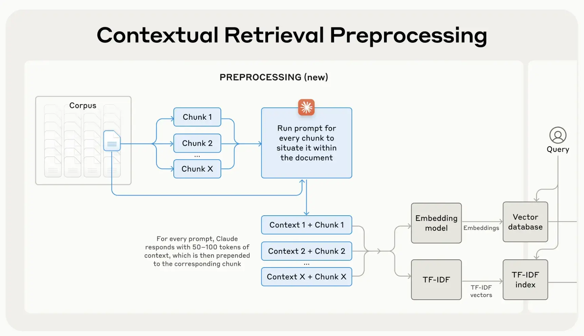

---
tags:
  - labs
  - market-report
  - AI
  - LLM
  - hiring
title: Market Report September 2024
date: 2024-10-08
description: In this month's market report, we've covered the hype and skepticism around OpenAI's reasoning models, the quiet rise of lightweight AI, the misuse of serverless, and the shakeup in web frameworks.
authors:
  - thanh
  - monotykamary
---

## Key Takeaways

- In the latest models from OpenAI (`o1-preview` and `o1-mini`) introduce new trade-offs between cost and performance, and their effectiveness is still being questioned.
- Contextual Retrieval by Anthropic addresses the limitations of traditional Retrieval-Augmented Generation (RAG) systems, improving the accuracy of retrieved information.
- Generative AI is transforming legacy codebases by providing more powerful tools for summarization, understanding complex systems, and aiding in tech stack migrations.
- Smaller AI models, such as Llama family, are gaining popularity for specific tasks where large models aren't necessary, offering cost savings and enhanced privacy.
- Misuse of serverless technology is rising, with many teams adopting it prematurely, leading to inefficiencies.
- OpenAI’s migration from Next.js to Remix brings attention to the need for developers to re-evaluate their frameworks, particularly as Next.js grows more complex.

## LLM Advancement: Reasoning Capability and Contextual Retrieval

### Reasoning capability: Overhyped?

OpenAI's recent release of `o1-preview` and `o1-mini` models sparked interest due to their improved "reasoning" capabilities. While many see these models as the next evolution of AI, it’s important to note that they introduce trade-offs between cost and performance. The key question is whether these reasoning models are truly effective or whether they’ll end up consuming more tokens without delivering significant benefits.

The models seem to build on the "chain of thought" prompting pattern (which literally can be employed with any model), but early adopters are still debating if they’re worth the hype. While reasoning tokens are hidden from the user, they still take up space in the model’s context window and incur costs.

> "People are excited about tokens being 100x cheaper, but now we have models using 100x more tokens."

### Contextual Retrieval: A New Embedding Technique for RAG system

Anthropic's introduction of [Contextual Retrieval](https://www.anthropic.com/news/contextual-retrieval) marks a new advancement in how AI models access and utilize background knowledge. Traditional Retrieval-Augmented Generation (RAG) solutions often strip away context when encoding information, leading to failures in retrieving relevant data.

We see Contextual Retrieval addressing this gap by:

- Prepending chunk-specific explanatory context to each data chunk before embedding.
- Increasing the likelihood of including relevant information by adding more chunks into the context window.

This technique isn't just limited to Anthropic's products but can be a general solution to enhance any RAG system's performance. We expect this to improve the efficiency of AI models in specific contexts, making them more reliable and effective in tasks that require extensive background knowledge.

## Generative AI in Legacy Codebases

One of the most powerful capabilities of Generative AI is its ability to summarize large volumes of text and media. In software delivery, this translates to helping developers and business analysts understand complex or legacy codebases more efficiently.

We are seeing tools like [GitHub Copilot Workspace](https://githubnext.com/projects/copilot-workspace), and [Amazon Q's developer](https://aws.amazon.com/q/developer/) agent revolutionize how we interact with code:

- **Visual Abstractions:** These tools provide visual representations of code, revealing intentions while minimizing technical jargon.
- **Knowledge Preservation:** They mitigate risks associated with the loss of expertise when key developers leave.
- **Tech Stack Migrations:** They simplify the process of migrating to new technologies by providing clearer overviews of existing systems.

Despite these advancements, challenges remain:

- **Abstract Comprehension:** Fully understanding code through abstract concepts is still a hurdle.
- **Generic Problem Solving:** Current AI agents are not yet the universal problem solvers they aspire to be.

We think it's crucial to focus on specific problem spaces where these agents excel, rather than expecting them to handle every coding challenge. Their true value lies in augmenting developer capabilities in targeted areas.

## The Rise of Small Models

While most users rely on commercial giants like ChatGPT, researchers and developers are finding value in running smaller models locally. Tools like [Ollama](https://ollama.com/) are proving that AIs with 8 to 70 billion parameters can run efficiently on personal devices, including laptops. As hardware continues to improve, local models will become an increasingly viable alternative for tasks that don’t require massive computational power.

The immutability of local models also guarantees consistency, making them indispensable in scientific research, where reproducibility is key. With the recent release of [**Llama 3.2**](https://ai.meta.com/blog/llama-3-2-connect-2024-vision-edge-mobile-devices/) supporting vision, we’re seeing even more possibilities for lightweight, portable AI.

## Serverless Overuse is Becoming a Problem

Serverless computing may have once seemed like a silver bullet, but it's now becoming clear that it's not the answer to every problem. We’re seeing a growing number of cases where serverless is being misapplied, particularly in scenarios that require a persistent server.

It’s fine to start with serverless when you're small, but as usage scales, moving to a dedicated server can save a lot of time and money. It’s time for developers to get smarter about where and when to use serverless architectures.

## OpenAI Ditches Next.js for Remix

This month, OpenAI surprised the community by switching the framework behind ChatGPT from **Next.js to Remix**. While the exact reasons haven’t been disclosed, there are a few theories. Remix’s ability to handle server-side rendering more efficiently and reduce the need for API calls seems to have played a part.

Meanwhile, Next.js has grown increasingly complex, with new features like server actions and app routing that have pushed its build times longer. This complexity may have driven developers to look for leaner alternatives like Remix, particularly for client-heavy applications.

## JavaScript in Crisis?

We’ve been following the thought-provoking observations from [Mathias Schäfer](https://molily.de/something-went-wrong/) regarding the current state of JavaScript in web development, and many of his points resonate with us:

- No matter which framework you choose, it will likely be outdated within five years.
- The relentless focus on improving the developer experience is a driving force in the industry.
- The solution lies in web architectures that minimize client-side JavaScript dependency.
- React's performance is often compromised by multiple architectural layers, exacerbating the issue.
- Frameworks should disappear from client-side code, thanks to compilers, leaving only minimal runtime on the client.
- Your JavaScript should work across different runtimes and frameworks—vendor lock-in should be avoided.
- Frameworks should share core APIs and primitives. The Vue community has done excellent work in this regard, with tools like [Vite](https://vitejs.dev/), [Nitro](https://nitro.unjs.io/), [Vinxi](https://github.com/nksaraf/vinxi), and [Vitest](https://vitest.dev/) proving useful across many stacks.

We believe those takeaways should be taken into consideration by any builder who wants to build for the next web.

## Who is hiring?

Our analysis of the latest [job posts](https://news.ycombinator.com/item?id=41425910) in Y Combinator’s hiring thread shows that while the number of job listings has remained steady, it's only a third of what it was in 2022. Some key trends:

- Popular stacks: **Python**, **AWS**, **React**, **TypeScript**, and **C**. Following these are **Rust** and **AI/ML** stack.
- Remote work remains the dominant offering.
- Full-time roles make up the majority, with only 4% of job postings seeking contractors.

The key points indicate that companies will continue to be selective and conservative in their hiring strategies. For more detailed insights, you can view the full dataset [here](https://docs.google.com/spreadsheets/d/1HKOd5-xy5rvsHgJjTbNkGmcoubdL0oVPt10fwC1iB0M).

## References

- [https://openai.com/index/learning-to-reason-with-llms/](https://openai.com/index/learning-to-reason-with-llms/)
- [https://simonwillison.net/2024/Sep/12/openai-o1/](https://simonwillison.net/2024/Sep/12/openai-o1/)
- [https://www.anthropic.com/news/contextual-retrieval](https://www.anthropic.com/news/contextual-retrieval)
- [https://www.nature.com/articles/d41586-024-02998-y](https://www.nature.com/articles/d41586-024-02998-y)
- [https://x.com/dhh/status/1834019299876573198](https://x.com/dhh/status/1834019299876573198)
- [https://ai.meta.com/blog/llama-3-2-connect-2024-vision-edge-mobile-devices/](https://ai.meta.com/blog/llama-3-2-connect-2024-vision-edge-mobile-devices/)
- [https://martinfowler.com/articles/legacy-modernization-gen-ai.html](https://martinfowler.com/articles/legacy-modernization-gen-ai.html)
- [https://molily.de/something-went-wrong/](https://molily.de/something-went-wrong/)
- [https://www.reddit.com/r/nextjs/comments/1f92jdv/chatgptcom_switched_from_nextjs_to_remix/](https://www.reddit.com/r/nextjs/comments/1f92jdv/chatgptcom_switched_from_nextjs_to_remix/)
