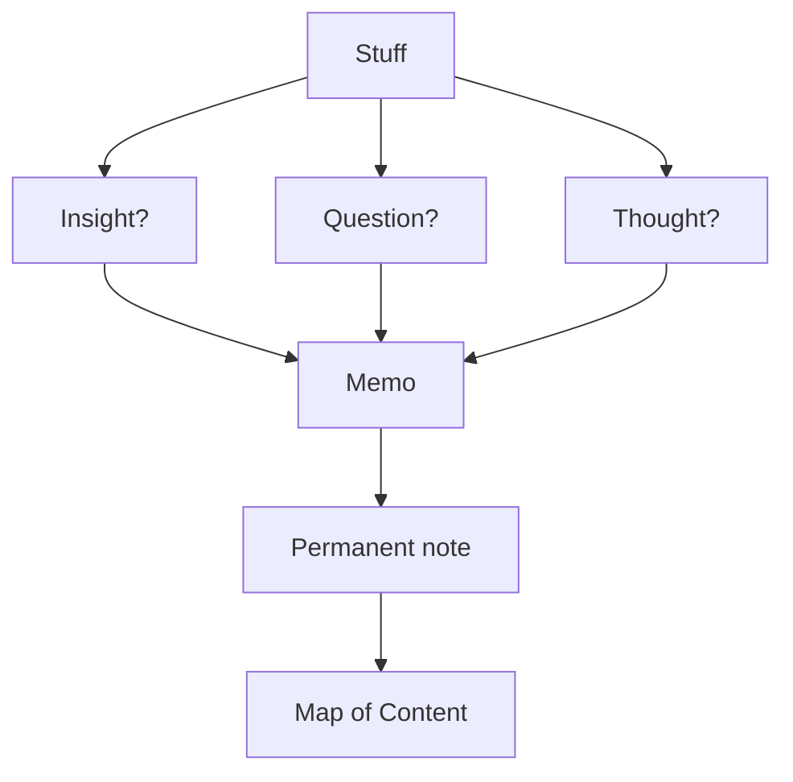

<h1 align="center">
    The Dwarves Brainery
</h1>

    
    

Welcome to the Dwarves Brainery. Dwarves are a group of technology innovation advocates. This project is a part of our continuous learning engine, where we want to build up the 1% improvement habit, learning in public.

We believe that behind every success comes great preparation, accumulation and compound every single day. This brain repo contains our notes and studies for any upcoming challenges.

Applying the Zettelkasten method to construct our reference neuron network, we collect learning pieces from articles, books, papers, videos and then put them here to evaluate before boarding them on our technology adoption radar. We also adopted the LYT method with an initial setup and notes from Moby Diction Publish. It sets a great standard and we find it very helpful.

### Workflow

### Contributing
At Dwarves, we encourage our people to read, write, share what we learn with others, and [contributing to the Brainery](CONTRIBUTING.md) is an important part of our learning culture. For visitors, you are welcome to read them, contribute to them, and suggest additions. We maintain a monthly pool of $1500 to reward contributors who support our journey of lifelong growth in knowledge and network.

### Love what we are doing?
- Check out our [products](https://superbits.co)
- Hire us to [build your software](https://d.foundation)
- Join us, [we are also hiring](https://github.com/dwarvesf/WeAreHiring)
- Visit our [Discord Learning Site](https://discord.gg/dzNBpNTVEZ)
