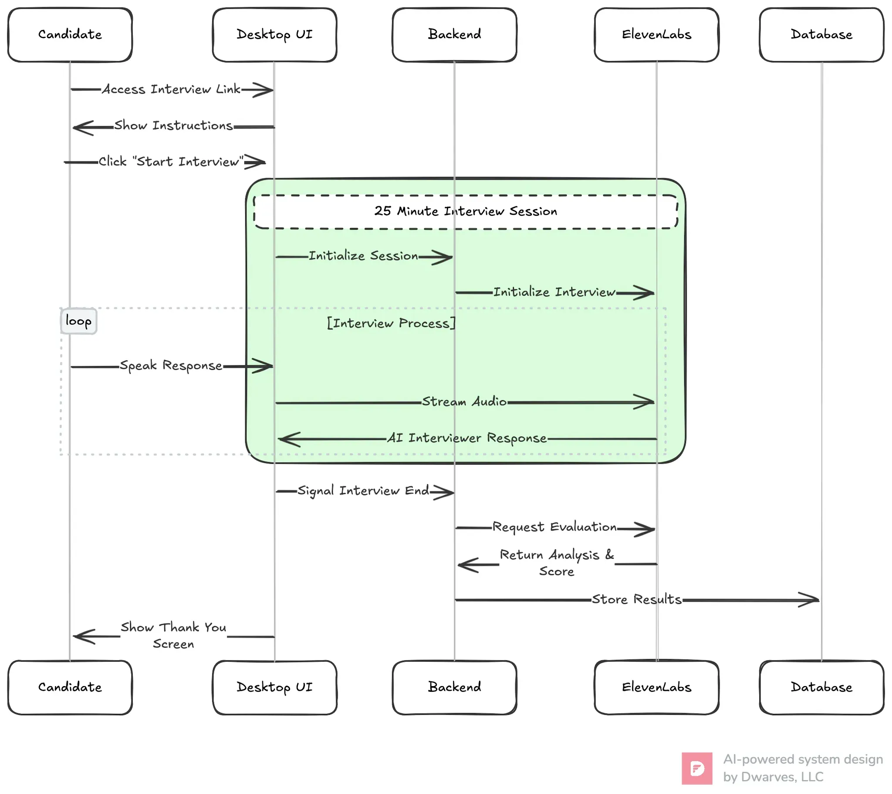
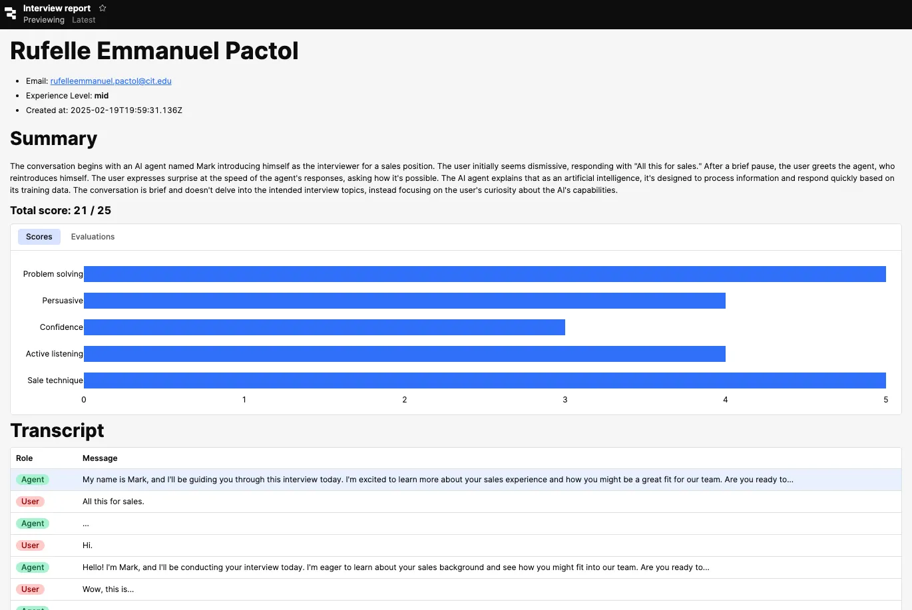

---
authors:
  - 'thanh'
date: '2025-03-04'
description: 'Discover how our two-week MVP harnesses AI-driven, real-time voice processing to streamline interviews, reduce bias, and accelerate hiring success'
tags:
  - ai
  - llm
title: 'Building MVP for AI-driven interview platform'
---

Our engineering team collaborated with a confidential HRTech client to create an **MVP** for AI-based, real-time voice interviews. Built in just **two weeks** to validate the concept, the solution leverages advanced **AI** and **AI voice processing** to conduct sales-specific interviews. Despite the short development timeline, the initial results have been very promising.

### Challenges

1. **Time-consuming screening**: Traditional processes took weeks to screen and evaluate candidates.
2. **Inconsistent assessment**: Evaluations often varied due to human bias and fluctuating criteria.
3. **Manual processes**: Recruiters spent excessive time on repetitive screening tasks, detracting from strategic decision-making.

### Our MVP solution

We developed an automated interview system using real-time voice processing to evaluate candidates. By integrating with [ElevenLabs](https://elevenlabs.io/)’ voice technology, the platform simulates realistic sales conversations and measures performance through consistent AI-driven scoring. Key benefits include:

- **Faster hiring**: Automated screening accelerates the time-to-hire.
- **Objective evaluations**: AI-driven scoring removes bias and maintains uniform standards.
- **Scalable & efficient**: Repetitive tasks are automated, freeing recruiters for strategic activities.

### Architecture highlights

1. **Serverless backend**: A Node.js (Next.js) backend processes interviews and orchestrates AI-based evaluations.
2. **Real-time voice processing**: Integrations with ElevenLabs’ API handle immediate speech input and feedback.
3. **Data storage**: TimescaleDB provides scalable, high-performance data management for sessions and analytics.
4. **Analytics & frontend**: [Retool](https://retool.com/) dashboards offer real-time insights, while a Next.js interface ensures a smooth user experience

Architecture diagram

Main flow

### Screenshots

### Key lessons & future enhancements

**Edge cases with silent or uncooperative participants**

Some candidates tested the system by remaining silent, causing the interview to stall. While adjusting ElevenLabs’ settings (e.g., time bounds, prompts) can mitigate this, a more robust solution would involve an independent agent monitoring the interview and making decisions if participants remain idle.

**Video processing requirements**

For a more comprehensive evaluation, video data (e.g., posture, facial expressions) should be captured. However, ElevenLabs currently supports voice mode only, so a separate data pipeline would be necessary for video-based assessments.

**Role-based agent assignment**

Future versions could include a dynamic, “agentic” system that tailors the interview agent to each candidate’s CV and desired role. This would enhance relevance and improve the quality of feedback.

### Outcomes

- **Promising early results**: The MVP drastically reduced screening time and demonstrated the potential for unbiased, real-time AI assessments.
- **Scalable foundation**: A serverless architecture, combined with voice-based AI, positions the platform for future growth and enhancements.

### Conclusion

Within just two weeks, we delivered a functioning MVP that effectively tests the concept of **AI-driven, real-time voice interviews** for sales candidates. Despite its rapid development, the solution has already shown considerable potential in reducing hiring bottlenecks, providing objective evaluations, and opening doors for more advanced features like video analysis and role-based interview agents. This success confirms our commitment to leveraging cutting-edge AI technologies to drive efficient, unbiased hiring solutions.
