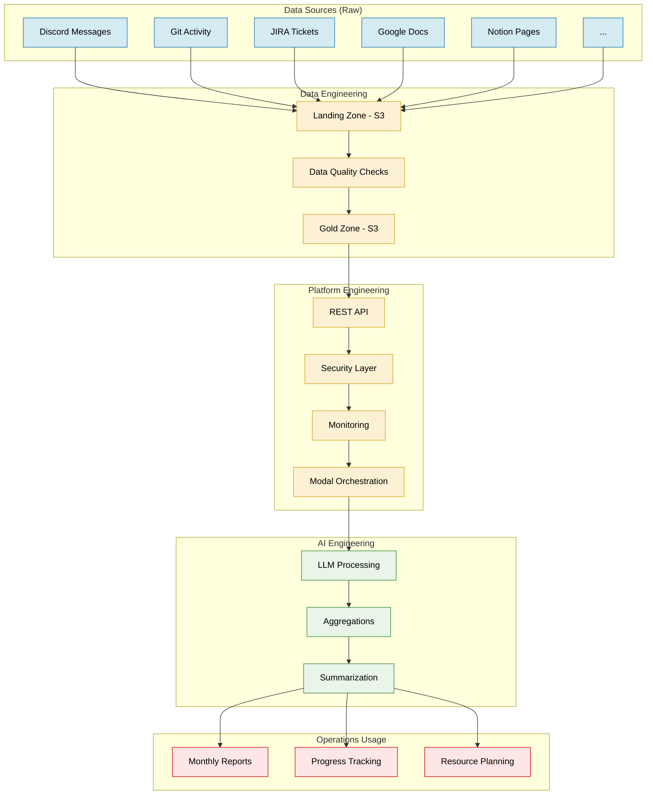
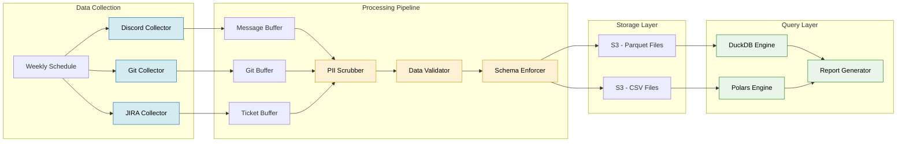
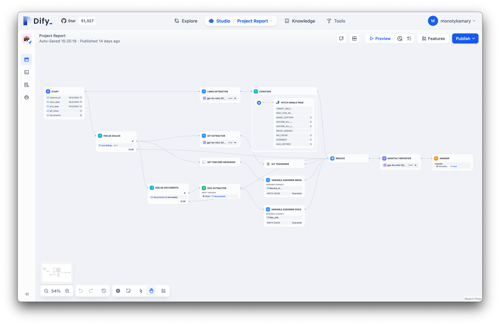
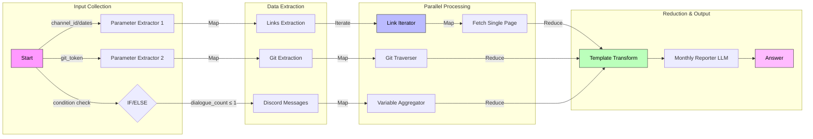

---
authors:
- "monotykamary"
date: "2024-11-14"
description: "An in-depth look at Dwarves' monthly Project Reports system - a lean, efficient system that transforms communication data into actionable intelligence for Operations teams. This case study explores how we orchestrate multiple data streams into comprehensive project insights while maintaining enterprise-grade security and cost efficiency."
tags:
- "data-engineering"
- "project-management"
- "case-study"
title: "Project reports system: a case study"
---

At Dwarves, we've developed a monthly Project Reports system - a lean, efficient system that transforms our communication data into actionable intelligence for our Operations team. This system orchestrates multiple data streams into comprehensive project insights while maintaining enterprise-grade security and cost efficiency.

## The need for orchestrated intelligence

Our engineering teams generate thousands of Discord messages daily across multiple projects. These messages contain critical technical discussions, architectural decisions, and implementation details that traditionally remained trapped in chat histories. While Discord excels as a communication platform, its real-time nature makes it challenging to track project progress against client requirements or ensure alignment between ongoing discussions and formal documentation.

This challenge sparked the development of our Project Reports system. Like a skilled conductor bringing order to complex musical pieces, our system coordinates multiple data streams into clear, actionable project intelligence

## The foundation: Data architecture

Our architecture follows a simple yet powerful approach to data management, emphasizing efficiency and practicality over complexity. We've built our system on three core principles:

1. **Lean Storage**: S3 serves as our primary data lake and warehouse, using Parquet and CSV files to optimize for both cost and performance
2. **Efficient Processing**: DuckDB and Polars provide high-performance querying without the overhead of traditional data warehouses
3. **Secure Access**: Modal orchestrates our serverless functions, ensuring secure and efficient data processing

### Data Flow Overview



The system begins with raw data collection from various sources, primarily Discord at present, with planned expansion to Git, JIRA, Google Docs, and Notion. This data moves through our S3-based landing and gold zones, where it undergoes quality checks and transformations before feeding into our platform and AI engineering layers.

### Detailed Processing Pipeline



Our processing pipeline emphasizes efficiency and security:

1. **Collection Layer**: Weekly scheduled collectors gather data from various sources
2. **Processing Pipeline**: Data undergoes PII scrubbing, validation, and schema enforcement
3. **Storage Layer**: Processed data is stored in S3 using Parquet and CSV formats
4. **Query Layer**: DuckDB and Polars engines provide fast, efficient data analysis

## Dify - Operational Intelligence through Low-code Workflows

We use Dify to transform our raw data streams into intelligent insights through low-code workflows. This process bridges the gap between our data collection pipeline and the operational insights needed by our team.





Our Dify implementation provides a few key advantages:

- **Rapid Iteration**
The low-code nature of Dify allows us to quickly adjust workflows based on operational feedback. When our operations team needs new types of insights, we can modify templates and processing logic without extensive development cycles.
- **Flexible Integration**
The workflow system easily integrates with our existing data pipeline, pulling from our S3 storage and utilizing DuckDB/Polars for efficient data processing before applying intelligence templates.
- **Maintainable Intelligence**
Templates and workflows are version-controlled and documented, making it easy for team members to understand and modify the intelligence generation process. This ensures our reporting system can evolve with our organizational needs.

## Operational Impact

The Project Reports system serves as the foundation for our Operations team's project oversight. It provides:

- **Real-time Project Visibility**: Operations can track progress across multiple projects through consolidated communication data, enabling early identification of potential issues or bottlenecks.
- **Data-Driven Decision Making**: By analyzing communication patterns and project discussions, we can make informed decisions about resource allocation and project timelines.
- **Automated Reporting**: The system generates comprehensive monthly reports, reducing manual effort and ensuring consistent project tracking across the organization.

## Technical Implementation

### Secure Data Collection

The cornerstone of our system is a robust collection pipeline built on Modal. Our collection process runs weekly, automatically processing Discord messages through a sophisticated filtering system that preserves critical technical discussions while ensuring security and privacy.

```python
@app.function(
    schedule=modal.Cron("0 1 * * 1"),  # Weekly Monday collection
    secrets=[secrets],
)
def weekly_discord_collection():
    category_id = get_category_id.local()
    channels = get_category_channels.remote(category_id)
    channel_args = [(channel, year, month) for channel in channels]
    saved_files = process_channel_monthly_data.starmap(channel_args)

```

Through Modal's serverless architecture, we've implemented separate landing zones for different project data, ensuring granular access control and comprehensive audit trails. Each message undergoes content filtering and PII scrubbing before being transformed into optimized Parquet format, providing both storage efficiency and query performance.

### Query Interface

The system provides a flexible API for accessing processed data:

```python
@app.function(
    volumes={MOUNT_PATH: modal.CloudBucketMount("dwarvesf-discord", secret=secrets)},
    secrets=[secrets],
)
@modal.web_endpoint(method="POST")
def query_messages(item: QueryRequest, token: str = Depends(verify_token)) -> Dict:
    parquet_files = get_relevant_files.remote(
        channel_id=item.channel_id,
        category_id=item.category_id,
        start_date=item.start_date,
        end_date=item.end_date,
    )

```

## Measured Impact

The implementation of Project Reports has fundamentally transformed our project management approach. Our operations team now have greater visibility into project progress, with tracking and early issue identification becoming the norm rather than the exception. The automated documentation of key decisions has significantly reduced meeting overhead, while the correlation between discussions and deliverables ensures nothing falls through the cracks.

## Future Development

We're expanding the system's capabilities in several key areas:

- **Additional Data Sources**: Integration with Git metrics, JIRA tickets, and documentation platforms will provide a more comprehensive view of project health.
- **Enhanced Analytics**: Implementation of advanced pattern recognition and trend analysis will improve our predictive capabilities.
- **Automated Insights**: Deeper AI integration will enable more sophisticated report generation and context understanding.

We also don’t plan to be vendor-locked using entirely Modal. The foundations we’ve layed out to create our landing zones and data lake makes it very easy to swap in-and-out query and API architectures.

## Conclusion

At Dwarves, our Project Reports system demonstrates the power of thoughtful data engineering in transforming raw communication into strategic project intelligence. By combining secure data collection, efficient processing, and AI-powered analysis, we've created a system that doesn't just track progress – it actively contributes to project success.

The system continues to coordinate our project data streams with precision and purpose, ensuring that every piece of information contributes to a clear picture of project health. Through this systematic approach, we're setting new standards for data-driven project management in software development, one report at a time.
