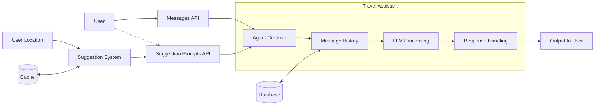
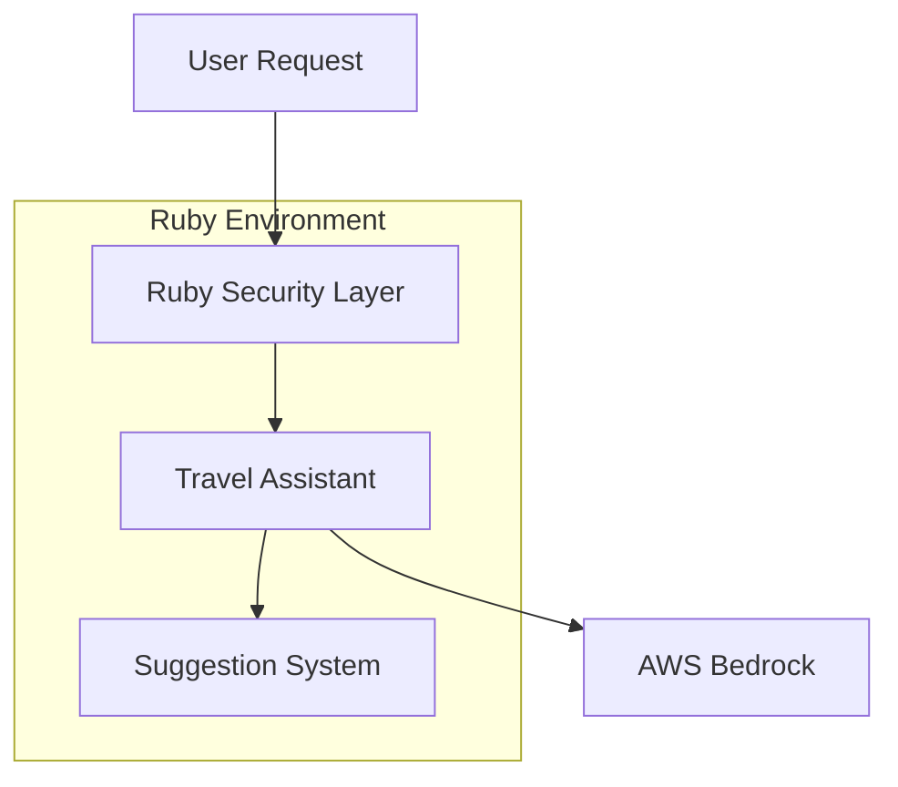

---
authors:
- "monotykamary" 
date: "2024-11-21"
description: "A case study exploring how we built an AI-powered travel assistant using Ruby and AWS Bedrock, demonstrating how choosing the right tools over popular choices led to a more robust and maintainable solution. This study examines our approach to integrating AI capabilities within existing Ruby infrastructure while maintaining enterprise security standards."
tags:
- "ruby"
- "ai-engineering"
- "ai"
- "case-study"
title: "AI-powered Ruby travel assistant"
---

> "When the easy path isn't the right path, true engineering shines in adapting the right tools for the job."

## The challenge: Beyond the obvious choice

In AI development, Python is often the default choice. A leading financial services provider approached us to build an AI-powered travel assistant, their initial technical specification centered around Python's rich AI ecosystem. However, reality proved more complex.

The client's infrastructure wasn't just built on Ruby—it was deeply entrenched in it. Their security systems, authentication layers, and core services were all Ruby-based. Their choice of AWS Bedrock as the AI provider was intrinsically tied to their security requirements. The seemingly simple option of using Python would have meant creating unnecessary complexity, additional security layers, and potential points of failure.

## The vision: More than just a chatbot

The client's vision extended beyond a simple query-response system. They wanted an intelligent travel assistant that could not only answer questions but actively engage users with relevant suggestions based on their context, location, and historical interactions. This dual approach of reactive responses and proactive suggestions would set their platform apart from conventional travel booking systems.



## Building an engaging experience

The system architecture reflected this dual nature. The core Travel Assistant handled direct interactions through the Messages API, providing detailed responses to user queries. Alongside this, we implemented a Suggestion System that continuously generated contextual prompts to spark user engagement.

The Suggestion System was particularly innovative. It took into account the user's location and previous interactions to generate relevant conversation starters. For instance, a user in Singapore might receive suggestions about weekend getaways to Bali, while another in Tokyo might see prompts about cherry blossom season travel deals.

Here's how we implemented the suggestion generation:

```ruby
module LLM
  module TravelAssistant
    class SuggestionService
      def generate_suggestions(user_location:, user_context:)
        cached_suggestions = fetch_cached_suggestions(user_location)
        return cached_suggestions if cached_suggestions.present?

        location_based_prompts = generate_location_prompts(user_location)
        context_based_prompts = generate_context_prompts(user_context)

        merge_and_rank_suggestions(location_based_prompts, context_based_prompts)
      end
    end
  end
end
```

## The technical implementation

Instead of forcing Python into an environment optimized for Ruby, we enhanced Ruby's AI capabilities to meet our needs. Working with LangchainRB alongside with their team, we evolved it from a promising library into an enterprise-grade solution.

The core assistant implementation showcased Ruby's elegant syntax while handling complex operations:

```ruby
def create_an_assistant(messages, context)
  Langchain::Assistant.new(
    llm: LLM::Bedrock.client,
    instructions: format_instructions(context),
    messages:,
    tools: create_tools
  )
end
```

## Intelligent caching strategy

One key innovation was implementing a caching system that served both the main assistant and the suggestion system. We used Redis here, as some of their previous architecture had integrated that as their main KV database. Location-based suggestions were cached with appropriate time-to-live values, ensuring quick response times while maintaining relevance:

```ruby
def fetch_cached_suggestions(location)
  cache_key = generate_location_cache_key(location)
  Rails.cache.fetch(cache_key, expires_in: 6.hours) do
    generate_fresh_suggestions(location)
  end
end
```

## Security and integration

By staying within the Ruby ecosystem, we leveraged the client's existing security infrastructure seamlessly. Both the main assistant and the suggestion system inherited all the security benefits of the main application, from authentication to audit logging.



## The results

The dual approach of reactive assistance and proactive suggestions proved highly effective. We found that:

The suggestion system successfully prompted users to explore new travel possibilities they hadn't considered. The contextual relevance of suggestions led to higher conversion rates compared to static prompts. The caching strategy ensured that both systems maintained quick response times even under heavy load, albeit costing a bit to cache combinatronically every variation.

## Impact on the Ruby community

Both the client and our work has had lasting effects beyond this project. The improvements both of us contributed to LangchainRB have made enterprise-grade AI more accessible to the Ruby community. We've shown that organizations heavily invested in Ruby don't need to pivot to Python for AI capabilities—they can build sophisticated AI applications while leveraging their existing expertise and infrastructure.

## Key learnings

This project taught us valuable lessons about choosing the right tool for the context rather than the most obvious tool for the task. The decision to enhance Ruby's capabilities rather than introduce Python complexity paid dividends in terms of system reliability, security, and maintainability.

The suggestion system proved that AI assistants can do more than just respond—they can proactively enhance user experience through contextual awareness. The careful balance between fresh and cached suggestions showed how performance optimization doesn't have to come at the cost of relevance.

## Conclusion

This project stands as a testament to the power of working with, rather than against, existing infrastructure. By choosing to enhance Ruby's AI capabilities rather than force-fitting Python into a Ruby environment, we delivered a solution that ultimately was more engaging for end users.

The success of this implementation proves that with the right engineering approach, Ruby can be a formidable platform for enterprise AI applications. More importantly, it demonstrates that sometimes the best path forward isn't the most obvious one—it's the one that best fits the entire ecosystem while pushing the boundaries of what's possible.