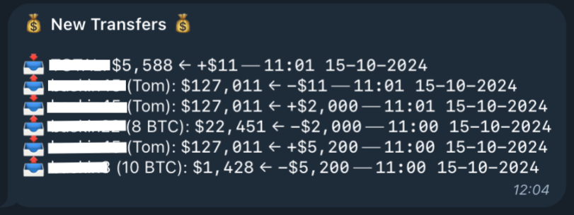
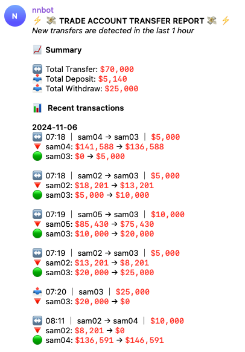
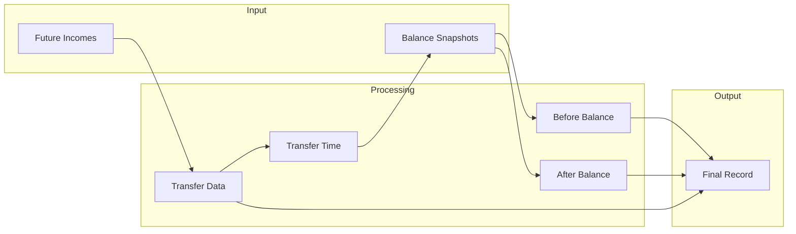
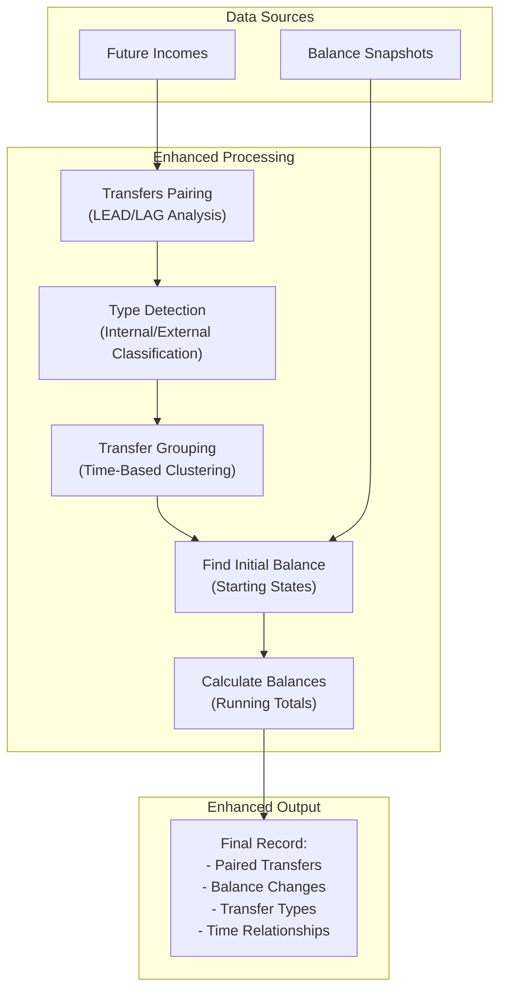

Binance is one of the most popular Decentralized Exchanges worldwide, so the demand for building Binance-integrated applications is growing daily. My team is also onboarding. We have a deal that requires us to build a Binance trading application with the ability to trade on multiple accounts simultaneously. In this way, our clients can optimize their trading progress as much as possible.

Everything worked well at the beginning, motivating the clients to increase the amount of trading accounts and assets. The nightmare came at this moment. The funds began transferring between accounts to balance the strategies, making the client hard to control the fund and its flow. They must log in to each Binance account to track the transfer history manually. This behavior looks bad. 

This emergency lets us begin record every transfers between accounts in the system, then notify to the clients continuously.

### Limitations of Binance income history
---
To record every transfers, we need the help of Binance APIs, specifically is [Get Income History (USER_DATA)](https://developers.binance.com/docs/derivatives/usds-margined-futures/account/rest-api/Get-Income-History). Once calling to this endpoint with proper parameters, we can retrieve the following `JSON` response.

```JSON
[
	{
    	"symbol": "",					// trade symbol, if existing
    	"incomeType": "TRANSFER",	// income type
    	"income": "-0.37500000",  // income amount
    	"asset": "USDT",				// income asset
    	"info":"TRANSFER",			// extra information
    	"time": 1570608000000,		
    	"tranId":9689322392,		// transaction id
    	"tradeId":""					// trade id, if existing
	},
	{
   		"symbol": "BTCUSDT",
    	"incomeType": "COMMISSION", 
    	"income": "-0.01000000",
    	"asset": "USDT",
    	"info":"COMMISSION",
    	"time": 1570636800000,
    	"tranId":9689322392,
    	"tradeId":"2059192"
	}
]
```
*Code 1: JSON response of Binance API Get Income History (USER_DATA)*

Our job is just passing `TRANSFER` as `incomeType` to filter out other types of Binance transactions. Then we can store these records for use later. But when looking at this response, can you imagine the limitations that I mentioned in the title of this part? Yes! you actually can't know where the fund comes from or move to? Just only can detect whether it is a deposit or withdrawal by using the sign, which is not enough in our system where every account is under our control. If it is hard for you to understand, the result of the transfer notification is look sus as below screenshot.


*Figure 1: Sporadic and confusing transfer logs that lack clear relationships between transactions*

To me, it looks bad. Ignore the wrong destination balance because of another issue with the data, this logging is too sporadic, hard to understand, and confusing. We can't understand how the fund is transferred. In my expectation, at least, it should like following.


*Figure 2: Clear and connected transfer logs that show the complete flow of funds between accounts*

If you pay attention to the `JSON` response of Binance API, an idea can be raised in your mind that "*Hmm, it looks easy to get the better version of logging by just only matching the transaction ID aka tranId field value*". Yes, it is the first thing that popped into my mind. Unfortunately, once the transfer happens between two accounts, different transaction IDs are produced on each account side.

### Our approach to transfer history mapping
---
#### Current implementation
It can make you a bit of your time at the beginning when looking at the response of Binance API and ask yourself "Why does Binance give us a bad API response?". Bit it is not a dilemma. And Binance API is not as bad as when I mentioned it. This API serves things enough for its demand in the Biance. And more general means can serve more use cases at all.

Enough to explain, now, we get to the important part: matching transfers to make the transfer history logging becomes more robust. I think we have more than two ways to do it. But because this issue comes from a data aspect, we will use a database solution to make it better.

Of course, we need to know the current query first. But it is inconvenient when sharing the source code here. So I will use a flow chart to replace it. This chart can also help us easy to imagine what's happening. It is easy, but the real query is not just to get from transfer history and show everything directly. To know the balance change, one needs to do some additional steps.


*Figure 3: Current flow to build transfer history*

The flow chart above shows how the current system produced transfer tracking logging.
- From `Future Incomes`, we simply query transfer information such as amount, time, and its sign.
- Using the time of transfer, query `Balance snapshots` to detect balance before and after it is changed by the transfer.

#### How to make it better?

To do it better, we need to match the transfers together to know the source and destination of the fund. To match the transfers together, we need to specify what is the transfer before and after it (**with the assumption that transfers of the same fund on the send and receive side happen in a small gap of time, and two transfers can't happen in the same time**). We are lucky that Postgresql provides us with two convenient window functions, LEAD and LAG. LEAD is used to access a row following the current row at a specific physical offset. On the other hand, LAG helps with previous row access. With simple syntax and better performance, it is our choice to do transfer paring.

```sql
WITH matched_transfers AS (
    SELECT
        ...,
        LEAD(...) OVER (ORDER BY fi.time) AS next_...,
        LAG(...) OVER (ORDER BY fi.time) AS prev_...,
```
*Code 2: SQL query to match transfer by using LEAD and LAG*

Once we match each transfer with its previous and follows, we can easily detect type of each transfer by following script.

```sql
CASE
    WHEN amount < 0
        AND next_amount > 0
        AND (amount + next_amount = 0)
        AND (next_time - time < interval '5 seconds')
    THEN 'INTERNAL_TRANSFER'
```
*Code 3: SQL query to detect type of each transfer depend on it transaction before and after it*


It is not enough, we can list the following types, and each type has a separate way of detecting:
* Internal transfers (between accounts)
* External transfers out (withdrawals)
* External transfers in (deposits)

Everything is fine, from the two above queries, we can produce the record of the transfer with sender and receiver information. But don't miss the balance change. To do it, we need to select proper before and after balances depending on the time of transfer. Imagine we have 100 transfers, and the total amount of records of balance snapshot reaches million or more, it is a real nightmare. 

There is a more subtle way. We can group close transactions of the same account together into a group, then just only need to query the balance of the account at the beginning of the group and calculate other balances by accumulating the amount.

```sql
SUM(CASE
    WHEN sender_time_gap > interval '20 seconds' THEN 1
    ELSE 0
END) OVER (
    PARTITION BY from_account
    ORDER BY time
) AS sender_group
```
*Code 4: SQL to group transfers of the same account and order by time*

```sql
FIRST_VALUE(
    COALESCE(
        (SELECT current_balance
         FROM account_current_balance_snapshots bs
         WHERE bs.account_id = from_account
             AND bs.created_at <= time
         ORDER BY bs.created_at DESC
         LIMIT 1),
        0
    )
) OVER (...)
```
*Code 5: SQL to find balance for the first record of each transfer group that is the result of Code 4*

Now, we have transfer history, in this, each record has its type, and information of the records before and after it. These records are also grouped together, and the leader of each group has its balanced information. Everything readies for querying the final result. Before going to the result, we may be missing a important step that is calculate balance for each transfer in the transfer group. To do it, Postgresql provides us some other interesting window functions. Tale a look following code. 

```sql
GREATEST(0, (
    sender_initial_balance +
    SUM(signed_amount) OVER (
        PARTITION BY from_account, sender_group
        ORDER BY time
        ROWS BETWEEN UNBOUNDED PRECEDING AND CURRENT ROW
    )
))
```
*Code 6: SQL to calculate balance for each transfer in the transfer group by using window functions ROWS BETWEEN UNBOUNDED PRECEDING AND CURRENT ROW* 

Let's break down the window frame `ROWS BETWEEN UNBOUNDED PRECEDING AND CURRENT ROW`:
- `UNBOUNDED PRECEDING` means "start from the very first row in the partition". In our case, it starts from the first transfer in the group
- `CURRENT ROW` specifies "up to the transfer we're currently calculating"
- Together, they create a sliding window that grows as we move through the transfers, always starting from the first transfer and including all transfers up to the current one

This black magic save us from the danger from self join and `RECURSIVE` when calculating the accumulated total.

After all, every we are building can be wrapped in the below chart.


*Figure 4: Upgraded process to build transfer history*

### Conclusions
From the problem to the idea and finally is the implementation, nothing is too difficult. Every normal software developer can do it even better. But to do the huge thing, we first should begin from the smaller and make it done subtly and carefully. From this small problem, I learned some things:
- **The answer may lie in the question itself.** Instead of blaming Binance API for being so bad, we can take a sympathetic look at it, and see if there is anything we can get out of it.
- **One small change can make everything better.** When comparing the original transfer tracking log, and the version after upgrading with some small changes in the DB query, there is a huge difference when seeing the new one. This reminds uss that impactful solutions don't always require complex architectures – sometimes they just need careful refinement of existing approaches.
- **Data challenges are often best addressed through data-driven solutions**. Rather than seeking fixes elsewhere, the key is to leverage the inherent patterns and structure within the data itself.
