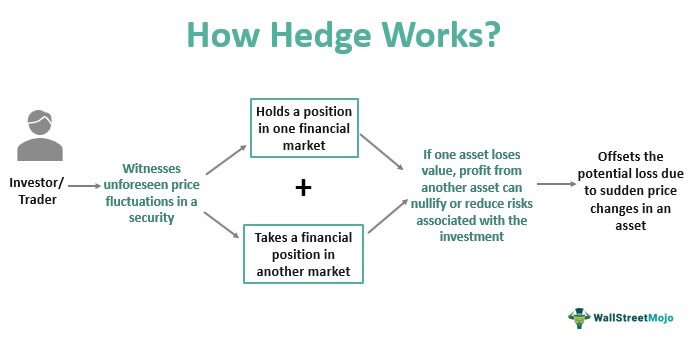
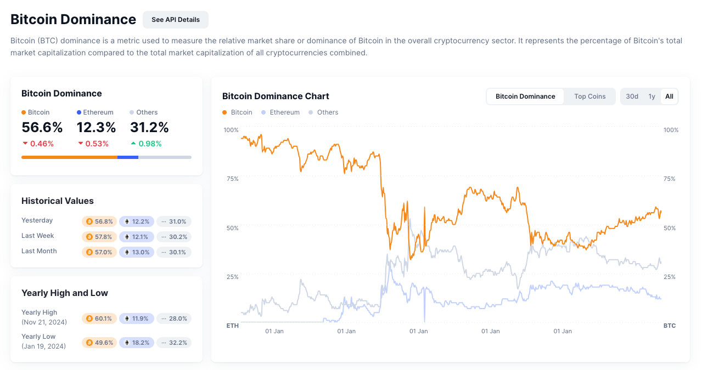
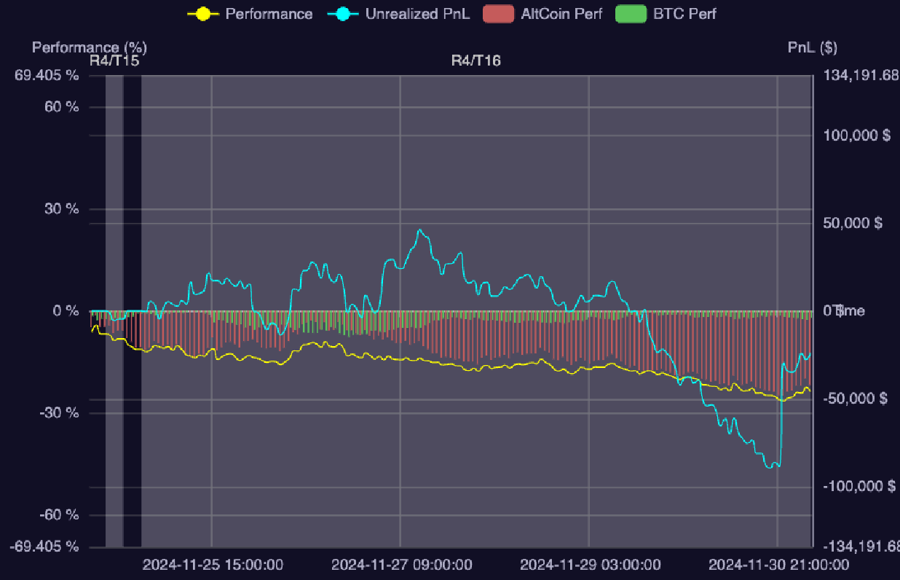

In recent years, alongside the growth of blockchain technology, the cryptocurrency market has attracted significant attention from investors and traders. These market participants develop strategies based on their experience and knowledge, primarily demonstrated through their ability to analyze market indicators. One valuable indicator is the BTC-Altcoins outperform metric. This article examines the importance of tracking Bitcoin-Altcoin performance indicators in a trading strategy known as **Hedge**, and explains how to visualize this data effectively.

### What is "Hedge"?

In financial markets, tradeable assets are categorized as **financial instruments**. These instruments primarily fall into two categories: **cash instruments** and **derivatives instruments**, distinguished by how their value is determined.

Cash instruments, including stocks, bonds, or currencies, derive their value directly from the underlying asset through market supply and demand. While these values fluctuate, investors maintain ownership of the actual asset, providing inherent value.

> Example: When you own 100 shares of Apple stock, your investment value changes based on Apple's market price. Even during price declines, you retain ownership of these shares, including rights to potential dividends and future value appreciation. Similarly, bondholders receive ongoing interest payments and principal at maturity, regardless of market price fluctuations.

Derivatives, however, base their value on the performance of another asset without conferring direct ownership. This characteristic means their value can diminish completely if the underlying asset moves unfavorably.

> Consider an agreement to purchase Tesla stock at \$500 in the future. If Tesla's stock price falls below this amount, the agreement loses its practical value since the same stock could be purchased at a lower market price. This type of agreement, known as a call option, could become worthless, resulting in the loss of the initial investment. Unlike owning Tesla stock directly, this agreement holds no residual value under unfavorable conditions.

In volatile markets like cryptocurrency, derivative risks increase substantially. This volatility necessitates risk management strategies, leading investors to seek hedging opportunities. **Hedge** refers to a strategy where investors minimize potential losses by investing in assets that typically move in opposite directions to their primary investment.

### How "Hedge" works?

 _Figure 1: How Hedge works in general_

Let’s dive into the hedging in cryptocurrency markets to understand it clearly through a practical example.

Imagine you’re an investor excited about **Bitcoin (BTC)**. The current price is \$50,000, and you believe it will go higher. To profit from this, you decide to take a position in BTC by purchasing a derivative contract. This contract represents 1 BTC and allows you to earn if Bitcoin's price goes up. However, if the price drops below \$50,000, the contract loses value, and your funds could even be liquidated. Essentially, your success depends on BTC’s price staying above \$50,000. The risk is clear: if BTC’s value falls, your investment takes a hit.

To protect against potential losses, you implement a hedge by investing \$50,000 in various alternative cryptocurrencies (altcoins). This decision stems from the observation that altcoins often exhibit different price movements from Bitcoin. This diversification creates a secondary position that can offset potential losses in your primary Bitcoin position.

The hedging mechanism functions through balanced exposure:

- When Bitcoin's price decreases, negatively affecting your derivative contract, your altcoin investments may appreciate, providing compensatory gains.
- Conversely, during Bitcoin price increases, profits from your BTC position can offset potential decreases in altcoin values.

This balanced approach reduces exposure to Bitcoin's price volatility. Portfolio diversification across altcoins serves as protection against significant losses in Bitcoin positions. **Hedging** functions as a risk management tool, allowing continued market participation while maintaining a safety margin against adverse price movements.

### The nature of price volatility

After exploring the example, you might wonder _Why do we chose Bitcoin and Altcoins?_, and _Why do their price movements behave this way in the scenario?_ To answer this, let’s look at the nature of price volatility and the dynamics between Bitcoin and Altcoins.

 _Figure 2: The dominance of Bitcoin (BTC) in the cryptocurrency market_

Bitcoin functions as the cryptocurrency market's cornerstone. According to CoinMarketCap:

> Bitcoin dominance is a metric used to measure the relative market share or dominance of Bitcoin in the overall cryptocurrency market. It represents the percentage of Bitcoin's total market capitalization compared to the total market capitalization of all cryptocurrencies combined. Since Bitcoin was the first asset, it has remained the largest by market cap, which is why its dominance in the market is a number that many people follow. We describe the assets tracked in this chart as cryptoassets because it includes tokens and stablecoins, not just cryptocurrencies.

In simpler terms, Bitcoin’s dominance reflects its central role in the market. When BTC’s price moves, it often triggers a ripple effect across other cryptocurrencies (altcoins). However, the exact behavior of BTC and altcoins can vary depending on market scenarios. Here are some common scenarios that explain the interplay between Bitcoin and Altcoins:

**Money Flow Scenarios:**

- BTC to Altcoins: Fund transfers from Bitcoin to altcoins typically result in decreased Bitcoin prices alongside altcoin appreciation.
- Altcoins to BTC: Capital movement back to Bitcoin often leads to Bitcoin appreciation while altcoin values decline.

**Market Entry Scenarios:**

- BTC-Focused: New capital entering primarily through Bitcoin can increase BTC prices while altcoin values remain stable.
- Altcoin-Focused: Fresh investments targeting altcoins may drive their prices upward without significantly affecting Bitcoin.

**Market Exit Scenarios:**

- BTC Withdrawal: Bitcoin liquidation for external markets can decrease BTC prices.
- Altcoin Withdrawal: Altcoin selloffs may reduce their values while Bitcoin maintains stability.

Understanding these market scenarios proves crucial for effective hedging. The strategy works optimally when price movements follow predictable patterns. For instance, during fund flows between Bitcoin and altcoins, losses in one position often balance with gains in the other. However, certain market conditions can challenge hedging effectiveness.

### The downside of hedging

Hedging strategies present an inherent trade-off between risk reduction and profit potential. While protecting against losses, hedging inherently limits maximum gains from favorable market movements. The more comprehensive the hedge protection, the more constrained the profit potential becomes.

Furthermore, market-wide withdrawals can negate hedging benefits when both Bitcoin and altcoins experience simultaneous value declines. Additionally, unexpected market events causing concurrent sharp movements in both assets can transform hedging positions into permanent losses. While advanced hedging techniques can address some of these risks, they require additional expertise and careful strategy implementation.

These limitations emphasize the importance of reliable market indicators for guiding hedging decisions. Performance metrics, particularly the outperforming chart comparing Bitcoin and altcoin movements, provide essential data for strategy refinement. These tools enable traders to navigate market volatility while optimizing their risk-reward balance.

### Why use BTC-Altcoin outperformance?

The significance of performance indicators in derivative market hedging stems from the direct relationship between contract values and underlying asset performance. This connection makes performance analysis fundamental to precise hedging strategy execution.

The BTC-Altcoin outperformance metric is comprised of two key components: Bitcoin performance (BTCp) and altcoin performance (ALTp). These components are calculated separately and then compared to determine the relative strength of the two assets.

Bitcoin performance (BTCp) measures the performance of Bitcoin relative to its historical average. It is calculated as a percentage change from the historical mean. A positive BTCp indicates that Bitcoin is outperforming its historical average, while a negative BTCp suggests that it is underperforming.

Altcoin performance (ALTp) measures the performance of altcoins relative to their historical average. It is also calculated as a percentage change from the historical mean. A positive ALTp indicates that altcoins are outperforming their historical average, while a negative ALTp suggests that they are underperforming.

$$BTC/Altcoin_{outperformance} = \frac{BTC_{profit}}{BTC_{init}}-\frac{Altcoin_{profit}}{Altcoin_{init}}$$ _Formula 1: BTC-Altcoin outperformance calculation_

The BTCp - ALTp calculation provides clear insight into Bitcoin's relative market position, enabling strategic hedge adjustments. For example, a positive BTCp - ALTp indicates Bitcoin outperformance, suggesting capital flow from altcoins to Bitcoin. This scenario requires adjusting hedge positions to favor Bitcoin exposure. A negative BTCp - ALTp suggests altcoin outperformance, indicating the need to protect altcoin positions more actively.

This relative performance measurement enhances hedging precision. Rather than maintaining static position balances, traders can dynamically adjust allocations based on market strength indicators. This approach improves hedge efficiency and reduces exposure to unexpected market movements.

### How can we find and render this metric to a chart?

To visualize the BTC-Altcoin outperformance metric, we need to systematically track and calculate the relative performance of Bitcoin and altcoins. Here’s a step-by-step guide to obtaining and rendering this metric on a chart:

**1. Create an Account on a Cryptocurrency Marketplace:** Start by creating an account on a platform that supports derivatives trading for Bitcoin and a wide variety of altcoins. Ensure the platform allows both long and short positions, as this is critical for collecting performance data.

**2. Open a Position on Bitcoin (BTC):** Take a long or short position on Bitcoin with a specific amount, say 1 BTC. This position will serve as the benchmark for tracking Bitcoin’s performance.

**3. Open Positions on All Altcoins:** Simultaneously, take the opposite position on all available altcoins. The total value of these altcoin positions should equal the Bitcoin position, but divide this equally among the altcoins for fair comparison.

**4. Track the Profit/Loss on Positions Intervally:** At regular intervals (e.g., every minute), collect the profit or loss data for the Bitcoin position and for the combined altcoin positions. This data will form the basis of the performance calculation.

**5. Calculate Bitcoin’s Performance (BTC Performance):** The profit or loss on the Bitcoin position relative to the starting value represents Bitcoin’s performance over the tracked interval.

**6. Calculate Altcoins’ Performance (Altcoin Performance):** Add up the profit or loss from all the altcoin positions to calculate the total altcoin performance for the same interval.

**7. Convert to Percentage Gains or Losses:** For both BTC and altcoins, calculate the percentage profit or loss relative to the initial position value. This standardizes the performance metrics and makes them directly comparable.

**8. Compute BTC-Altcoin Outperformance:** Subtract the percentage performance of altcoins from the percentage performance of Bitcoin.

**9. Render the Data as a Chart:** Plot this BTC-Altcoin outperformance metric on a line chart over time. This chart will visually represent whether Bitcoin is outperforming or underperforming relative to altcoins at each interval.

 _Figure 3: BTC-Altcoin outperformance chart_

### Conclusions

In this post, we discussed the importance of tracking Bitcoin-Altcoin outperformance and how it can be used to inform trading decisions. We walked through the process of collecting the necessary data, calculating the performance metrics and rendering the data as a chart. This process is applicable to various platforms and can be adapted to the specific requirements of each. By tracking the outperformance of Bitcoin relative to altcoins, traders can gain valuable insights into market trends and make more informed decisions about their investments.

The techniques and knowledge presented in this post are valuable for:

- Traders and investors who are interested in creating a trading strategy based on the outperformance of Bitcoin relative to altcoins.
- Developers who are tasked with building a trading platform that provides this information to its users.
- Data analysts who are looking to gain insights into the performance of Bitcoin relative to altcoins.

The post is designed to be accessible to readers with a basic understanding of trading and investing. No technical knowledge is required to follow the discussion.
