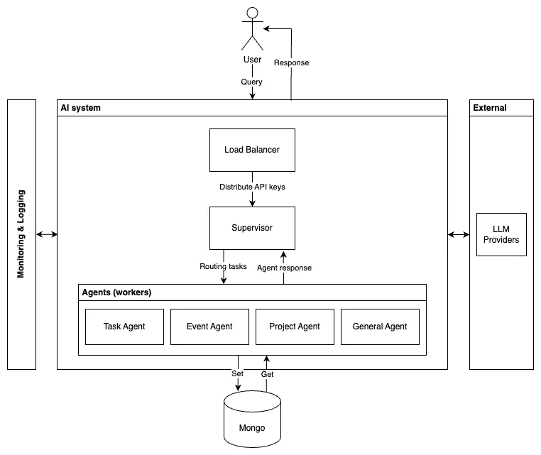
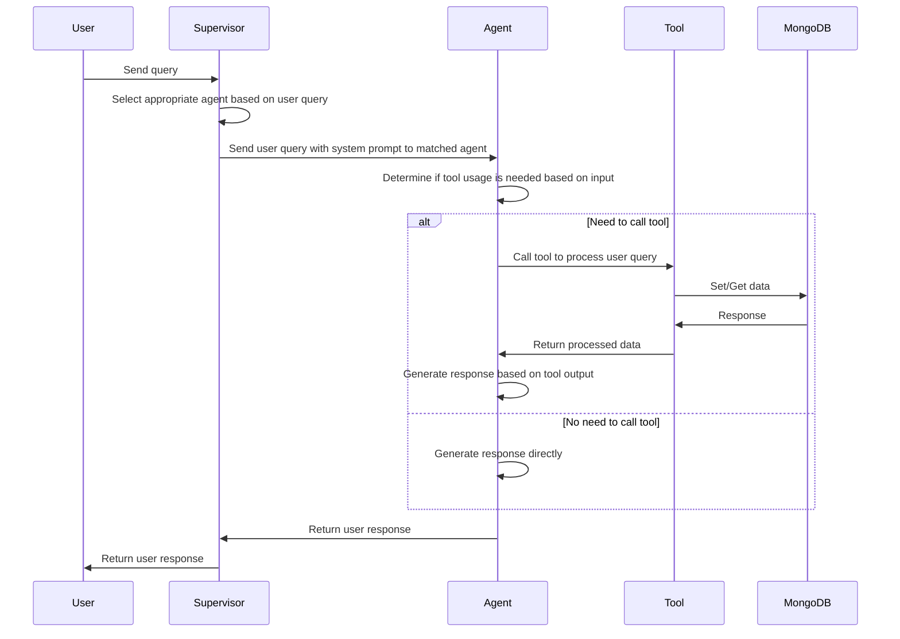

---
authors:
  - 'thanh'
  - 'hoangnnh'
date: '2024-11-21'
description: 'A technical case study detailing the implementation of an AI chatbot agent in a project management platform. Learn how the team leveraged LangChain, LangGraph, and GPT-4 to build a multi-agent system using the supervisor-worker pattern. '
tags:
  - 'ai-agents'
  - 'aiops'
  - 'langchain'
  - 'case-study'
title: 'Building chatbot agent to streamline project management'
---

Umbrella is a project management platform tailored for athletes, musicians, creatives, and businesses alike, bringing everything from team collaboration to secure document sharing under one roof. As our user base grew to a substantial number of active users managing a significant volume of projects and tasks, we identified an opportunity to leverage generative AI to enhance our platform's capabilities and streamline project management workflows.

The challenge was to natively integrate a generative AI chatbot that could assist users in brainstorming ideas, generating project proposals, and performing tasks directly within the chat interface. By enabling users to seamlessly switch between research, ideation, and execution, we aimed to boost productivity and simplify project management.

Implementing the chatbot agent involved key technical domains such as developing an interface to communicate with external AI platforms like OpenAI, creating an agentic system to interpret and execute user requests, and setting up usage monitoring to control AI token consumption and track chatbot performance.

## System requirements
### Business requirements

- Chatbot should be able to answer general questions about project management, such as writing project proposals or epic planning.
- Chatbot should assist users in managing tasks, events, and projects by intelligently clarifying user questions, performing tasks accurately, and providing helpful suggestions when needed.
- Chatbot should generate project proposals, provide task recommendations, and assist with event planning.

### Technical requirements

**Scalability**

- The chatbot functionality should scale with the increase in system functions, following a supervisor-worker design pattern to modularize chatbot capabilities.
- The system should ensure the response time under 4-6 seconds.
- Implement multiple API keys combined with a load balancer to distribute API usage and prevent reaching rate limits.

**Reliability**

- Integrate LangSmith for logging and monitoring to track model performance metrics and analyze conversation success rates.
- Implement A/B testing for prompts to optimize chatbot performance.

**Security**

- Implement user authentication and authorization to prevent unauthorized access and prompt injection attacks.
- Add guardrails to restrict chatbot usage to activities within the system's scope.
- Implement data encryption and access control measures to protect user data.

**Integration**

- Utilize the GPT-4o model for general logic and reasoning tasks, considering cost-benefit analysis.
- Leverage the LangChain framework for coding LLM agents due to its large community and comprehensive documentation.

## Architecture overview

### System components

**Supervisor**

- Acts as the central coordinator and decision-maker, breaking down complex tasks into smaller subtasks and assigning them to appropriate workers.
- Monitors and evaluates worker outputs to ensure accuracy and coherence.

**Worker agents**

- **Task agent**: Handles tasks related to the Task module, such as creating tasks, validating tasks, and providing task recommendations.
- **Event agent**: Manages events within the Event module, including creating events, validating events, and assisting with event planning.
- **Project agent**: Deals with project-related functions in the Project module, such as listing projects, creating projects, querying project attributes, and checking project members.
- **General agent**: Handles general Q&A within the scope of the system, providing informative responses and guidance.

**Load balancer**

- Distributes LLM API keys using the Least Frequency Used (LFU) technique to optimize API usage.
- Acts as a gateway to check user token limits and prevent excessive usage.

**LLM providers**

- Utilizes the GPT-4o model from OpenAI for its strong performance in general logic and reasoning tasks.

**Monitoring & logging**

- Integrates LangSmith for tracing input and output of AI systems, monitoring system metrics, and evaluating overall performance.

**Database**

- Uses MongoDB to store data, including chat history and token usage, enabling efficient retrieval and analysis.

The data flows from the user to the Supervisor, which routes the request to the appropriate worker agent. The worker agent processes the request, interacting with the necessary tools and the database, and generates a response. The response is then returned to the Supervisor and finally to the user.

## Technical implementation
### Core workflows

The workflow diagram illustrates the core interaction between the user, Supervisor, worker agents, tools, and the database. The Supervisor analyzes the user's query and routes it to the appropriate worker agent. The worker agent determines if tool usage is necessary and generates a response based on the processed data or directly, depending on the query. The response is then returned to the user via the Supervisor.

### Technical challenges & solutions

**Managing long conversation threads**

To address the challenge of endless conversations reaching the LLM model's context limit due to the UI design not splitting conversations into separate threads, we implemented a cronjob that runs every minute to close threads where the last message is more than 10 minutes old and limited the history context to the last 25 messages. This solution successfully prevented context limit errors and maintained conversation manageability

**Maintaining chatbot accuracy/performance while adding functions**

As the number of function modules increased, the chatbot's scope expanded, leading to longer system prompts, increased hallucination, reduced accuracy, and difficult codebase maintenance. To overcome this challenge, we implemented a supervisor-worker pattern using LangGraph, a library of LangChain, to build a multi-agent AI system. By dividing the AI workload among multiple agents and using a supervisor to orchestrate and route tasks, we successfully reduced hallucination, maintained stable accuracy, and improved codebase maintainability even with the addition of new chatbot functions.

**Widget-based display**

To address the need for displaying custom UI elements instead of text-only responses in chatbot conversations, we configured the chatbot to respond with HTML widget strings, allowing the frontend to render custom UI elements within the chat. For example, when a user requests to create a task, the chatbot generates an HTML widget string, based on which the frontend can render a polished UI card containing all the relevant task information and a link to the task detail. This solution enhanced chatbot responses with visually appealing and informative custom UI blocks, improving user experience and comprehension.

## Technology stack

- Core Technologies:
  - **TypeScript**: Primary programming language for development.
  - **Node.js**: Backend runtime environment.
  - **React**: Frontend library for building user interfaces.
- Key Frameworks/Libraries:
  - **LangChain**: Framework for developing LLM-based agents, providing a structured approach to building conversational AI systems.
  - **LangGraph**: Library within LangChain used to build LLM systems based on graph structures, enabling multi-agent architectures.
  - **LangSmith**: Platform developed by LangChain for debugging, testing, evaluating, and monitoring LLM applications, ensuring robustness and reliability.
- Infrastructure Components:
  - **Next.js**: Framework for building server-rendered React applications, providing seamless integration between frontend and backend.
  - **MongoDB**: NoSQL database for storing chat history, token usage, and other relevant data, offering flexibility and scalability.

## Lessons learned
### What worked well

1. Implementing the supervisor-worker pattern using LangGraph allowed us to build a scalable and extensible multi-agent AI system that could handle increasing functionalities without compromising performance.
2. Leveraging popular AI frameworks like LangChain and platforms like LangSmith accelerated development and provided robust tools for debugging, testing, and monitoring the chatbot agent.
3. Structuring the chatbot's responses as HTML widgets significantly enhanced the user experience by enabling visually appealing and informative custom UI elements within the chat interface.

### Areas for improvement

1. Managing long conversation threads remains a challenge due to the UI design limitations. In the future, we plan to explore text summarization techniques and implement a more user-friendly thread management system.
2. While the current implementation handles scalability well, there is room for optimization in terms of resource utilization and load balancing. We aim to investigate advanced load balancing techniques and fine-tune the system architecture.

### Future considerations

1. Building a Retrieval-Augmented Generation (RAG) system to enable the chatbot to access real-time knowledge and provide more up-to-date and contextually relevant responses.
2. Implementing a feedback system to gather user input and continuously improve the chatbot's accuracy and performance based on real-world interactions and user preferences.

## Conclusion

The implementation of the chatbot agent has significantly streamlined project management workflows within the Umbrella platform. By leveraging generative AI and a multi-agent architecture, we have enabled users to seamlessly brainstorm ideas, generate project proposals, and perform tasks directly within the chat interface.

The scalable and extensible architecture, built using the supervisor-worker pattern and powered by LangChain and LangGraph, allows for future enhancements and the addition of new functionalities without compromising performance. The integration of LangSmith ensures robust debugging, testing, and monitoring capabilities, maintaining the chatbot's accuracy and reliability.

The successful adoption of the chatbot agent has resulted in increased productivity, improved user satisfaction, and reduced cognitive load for project managers and team members alike. As we continue to iterate and improve upon the chatbot agent, we remain committed to delivering a seamless and intelligent project management experience for our users.
