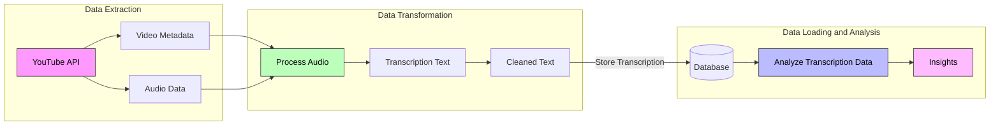
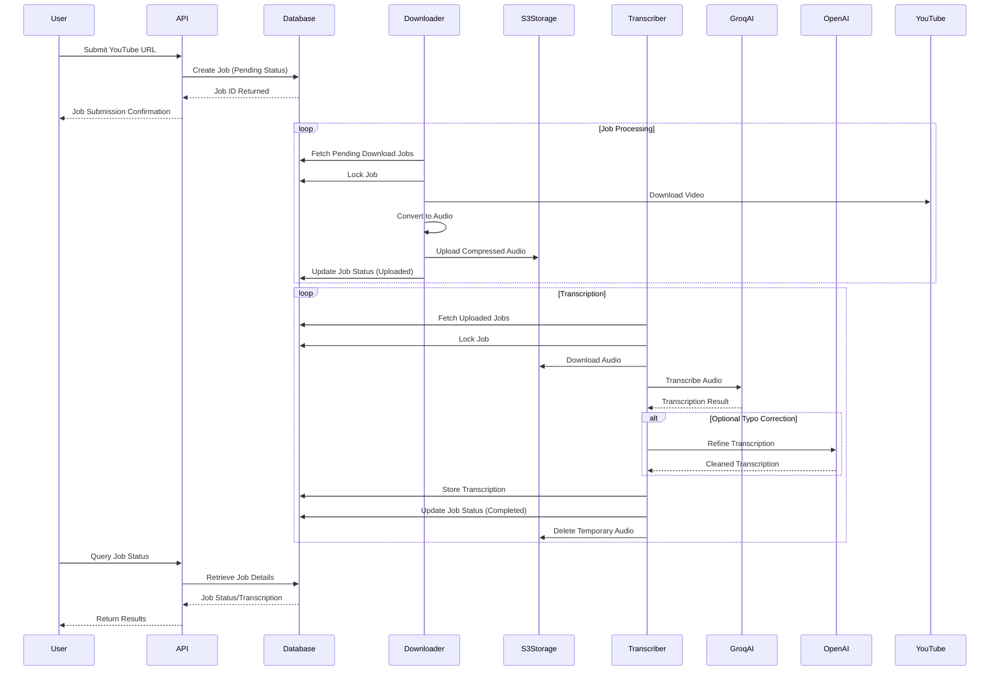

---
authors:
  - 'thanh'
  - 'quang'
date: '2024-11-21'
description: 'A technical case study of creating an automated system that downloads videos, processes audio, and generates transcripts using AI services like Groq and OpenAI.'
tags:
  - 'data-engineering'
  - 'project-management'
  - 'case-study'
title: 'Building data pipeline for OGIF Transcriber'
---

At Dwarves, we needed an automated way to transcribe and summarize the recordings of our weekly OGIF events for our Brainery knowledge hub. The key challenge was to build a scalable data pipeline that could efficiently process YouTube videos, extract audio, transcribe the content using AI models, and store the results for downstream analysis and search.

The pipeline needed to handle diverse video formats and lengths, support high-volume concurrent requests, and integrate with our existing data storage and access patterns. The solution would democratize access to valuable OGIF content, reduce manual transcription effort, and enable new content discovery and analytics capabilities.

## Data pipeline design

The transcription data pipeline is part of a larger system that includes a REST API for job management, a task queue for asynchronous processing, and a web interface for user interaction. The pipeline architecture can be divided into three main stages: Data Extraction, Data Transformation, and Data Loading and Analysis.

### Data extraction

The data extraction stage involves fetching video metadata and audio data from the YouTube API. The Video Downloader component interacts with the YouTube API to retrieve the necessary information.

1. **Video metadata**: The Video Downloader fetches the video from YouTube using the provided URL. It downloads the video file and extracts the video duration. The downloaded video is then passed to the next stage of the pipeline for audio extraction.
2. **Audio data**: The Video Downloader extracts the audio data from the YouTube video. It retrieves the audio stream in a suitable format for further processing.

### Data transformation

The data transformation stage takes the extracted audio data and performs various processing steps to prepare it for transcription and analysis.

1. **Audio processing**: The Audio Preprocessor component compresses the extracted audio data to minimize its size. This compression step optimizes the audio for efficient transmission to Groq's transcription service while maintaining the necessary audio quality for accurate transcription.
2. **Transcription**: The Transcription Engine takes the preprocessed audio data and converts it into text using AI-based transcription models. It may utilize services like [Groq AI](https://groq.com/) to perform accurate speech-to-text conversion.
3. **Text cleaning**: The transcribed text undergoes a cleaning process to remove any artifacts, formatting issues, or inconsistencies. The cleaned text is then ready for storage and analysis.

### Data loading and analysis

The data loading and analysis stage involves storing the transcribed text in a database and performing various analyses to derive insights from the transcription data.

1. **Database storage**: The cleaned transcription text is stored in a PostgreSQL database along with relevant metadata. This allows for efficient retrieval and querying of the transcription data.
2. **Text analysis platform**: The stored transcription data is made available to a text analysis platform, which performs various analytics tasks to extract insights and generate meaningful results.
3. **Insights generation**: The text analysis platform applies techniques such as sentiment analysis, topic modeling, and keyword extraction to derive valuable insights from the transcription data. These insights can be used for content summarization, trend analysis, and data-driven decision-making.

## Core workflow

The transcription workflow involves the User, API, Database, Downloader, S3Storage, Transcriber, GroqAI, and OpenAI.

The main steps are:

**Job submission:**

- User submits YouTube URL to API
- API creates a new "Pending" job in Database
- API confirms job submission to User with Job ID

**Job processing - Downloader:**

- Downloader fetches pending jobs from Database
- Downloader locks job, downloads video, converts to audio
- Compressed audio uploaded to S3Storage
- Job status updated to "Uploaded"

**Transcription - Transcriber:**

- Transcriber fetches uploaded jobs from Database
- Transcriber locks job, downloads audio from S3 Storage
- Audio sent to GroqAI for transcription
- Transcription refined by OpenAI
- Final transcription stored in Database
- Job status updated to "Completed"
- Temporary audio file deleted from S3 Storage

**Result retrieval**:

- User queries job status through API
- API retrieves job details and transcription from Database
- API sends transcription results to User

The API acts as the intermediary between User and backend components. The Database stores job information and transcriptions. The Downloader handles video downloading and audio conversion, while the Transcriber manages transcription, interacting with GroqAI and OpenAI. S3Storage is used for temporary audio storage.

The workflow ensures efficient job processing through asynchronous processing and job locking. The separation of Downloader and Transcriber allows for parallel processing and scalability. The optional typo correction step with OpenAI enhances transcription quality.

## Performance and scaling

The system is designed to handle the following benchmarks:

- 100 simultaneous transcription jobs
- Videos from 5 minutes to 2 hours in length
- Processing time under 5 minutes per video
- Transcription accuracy of 90% or higher
- API response times under 500ms
- Job completion within 15 minutes

To ensure the pipeline could handle the expected scale and provide timely results, several optimizations were implemented:

1. **Parallel Processing**: The Video Downloader, Audio Preprocessor, and Transcription Engine were designed to process multiple jobs concurrently. The number of parallel workers can be dynamically adjusted based on load.
2. **Asynchronous API Calls**: The interactions with external services (YouTube, Groq, OpenAI) were made asynchronous to avoid blocking the main pipeline flow.
3. **Intelligent Chunking**: Dynamic chunking of audio files allowed optimizing for the input constraints of the AI transcription services while minimizing total API calls.
4. **Temporary File Management**: Audio files were stored in S3 only for the duration of processing and deleted afterwards to minimize storage costs.
5. **Database Connection Pooling**: A pool of reusable database connections was used to avoid the overhead of establishing new connections for each operation.

Robust error handling and monitoring were critical to ensure pipeline reliability and maintainability:

1. **Retry Policies**: Each stage of the pipeline was configured with appropriate retry policies to handle transient failures from external services or temporary resource constraints.
2. **Dead-Letter Queues**: Jobs that repeatedly failed even after retries were moved to a dead-letter queue for manual inspection and intervention.

## Technology stack

The transcription service leverages the following technologies and tools:

- **Core**: Python 3.9+, Flask framework, Asynchronous processing with Python threading
- **AI/ML**: Groq AI for transcription, OpenAI for text refinement
- **Data**: PostgreSQL database, AWS S3 storage
- **Infrastructure**: Docker, Gunicorn HTTP server, Token-based authentication
- **CI/CD**: GitHub Actions

Key libraries used include `psycopg2` for Postgres, `Boto3` for S3, and `yt-dlp` + `pydub` for video downloading and audio processing.

## Lessons learned

Key successes of the project include:

1. Modular decoupling of downloader, transcriber and API logic improved scalability and maintainability. Issues could be identified and fixed quickly in each module.
2. Optimized resource allocation by isolating components and catering to their specific needs. This led to efficient performance without over or under-provisioning.
3. Asynchronous architecture allowed non-blocking processing of long-running jobs. Users receive immediate job ID and can poll for status without holding up resources.

An area for improvement is the current video chunking implementation, which needs refinement to ensure perfectly synced transcription. The team is exploring alternatives to split videos more intelligently based on breaks and allow finer-grained processing.

## Conclusion

Building the YouTube transcription data pipeline required carefully orchestrating the interaction between several system components and external services. The ETL pattern provided a clear structure to reason about the data flow and transformation steps.

The asynchronous, event-driven architecture allowed each stage of the pipeline to scale independently and handle failures gracefully. Techniques like parallel processing, intelligent chunking, and connection pooling helped achieve the required performance and throughput.

The end result was a robust and efficient data pipeline that could reliably transcribe a high volume of YouTube videos and make the content searchable and accessible across the organization. The pipeline unlocked new ways to distill insights from previously opaque video content.
