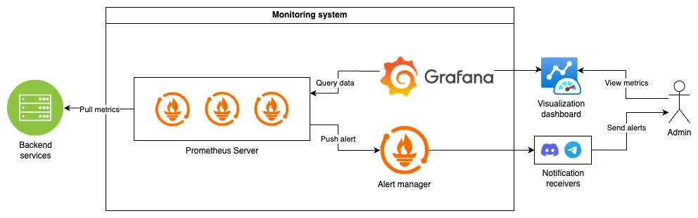
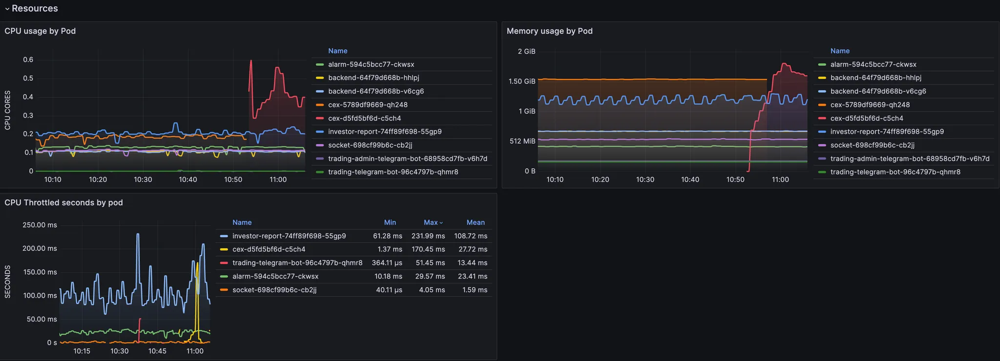
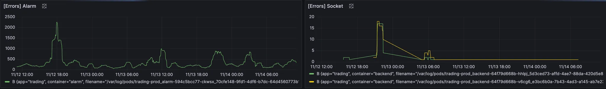
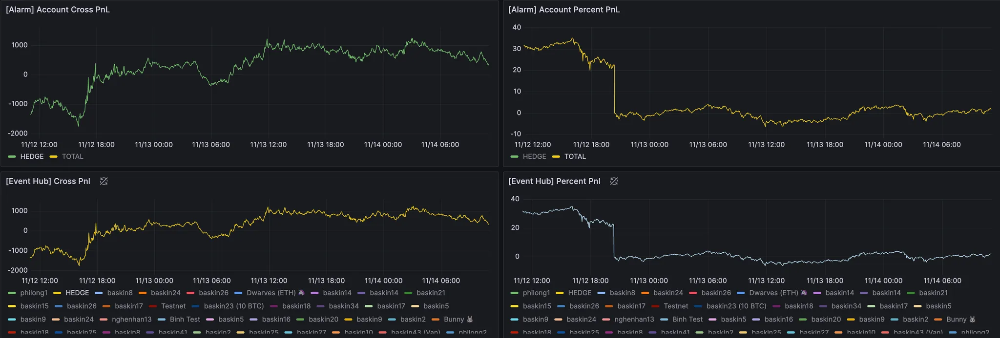
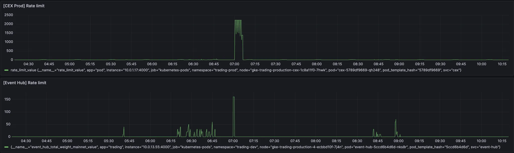
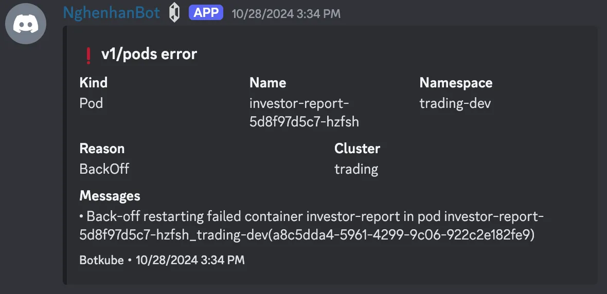
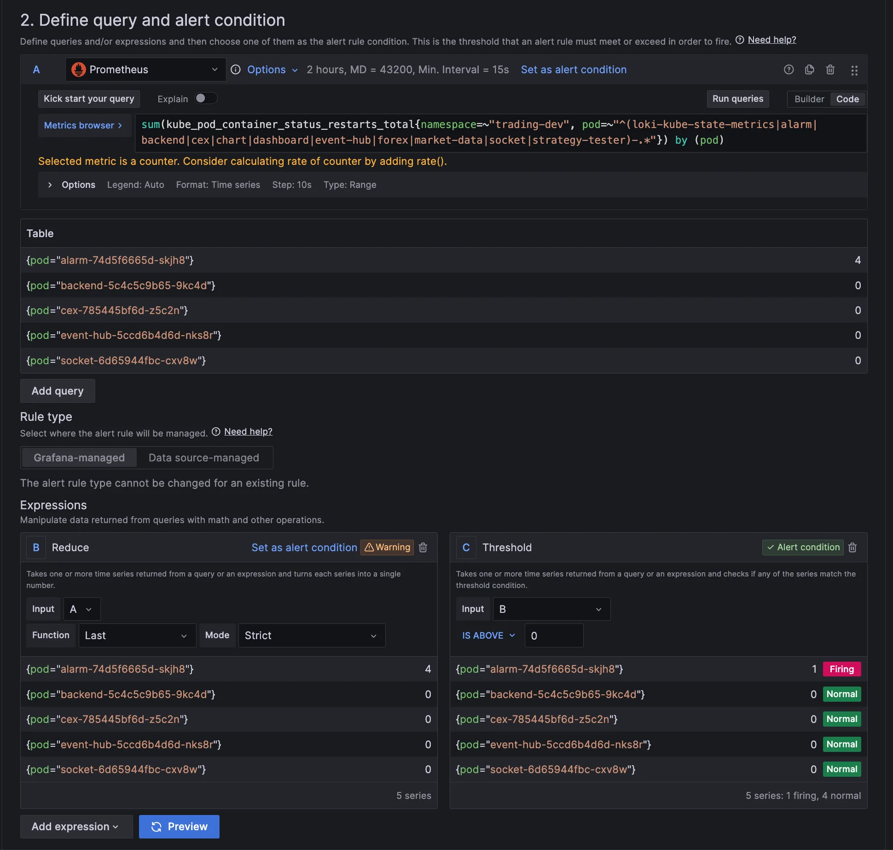
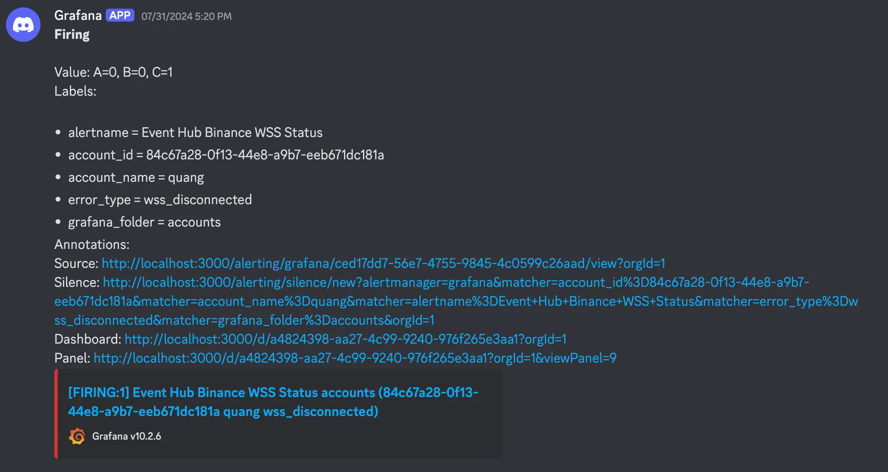
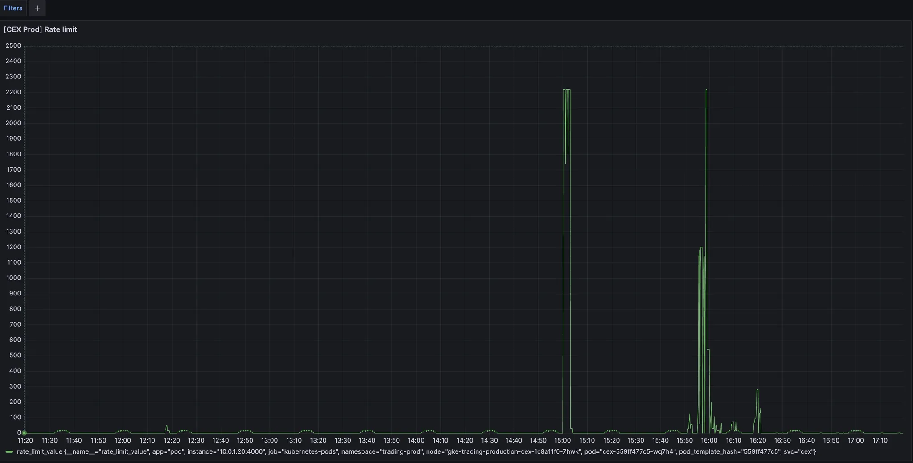
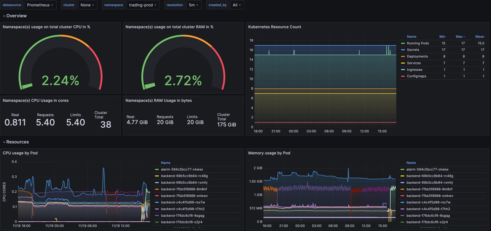

---
authors:
  - 'thanh'
  - 'quang'
date: '2024-11-21'
description: 'A technical case study for implementing centralized monitoring for a trading platform using Grafana and Prometheus, focusing on real-time alerts, data integrity, and resource optimization to prevent financial losses.'
tags:
  - monitoring
  - fintech
title: 'Setup centralized monitoring system for Hedge Foundation trading platform'
---

Hedge Foundtion, a private trading platform serving select traders, required a robust centralized monitoring system to ensure platform reliability and prevent financial losses. Given the high-stakes nature of trading operations, the system needed to provide real-time alerts, maintain data integrity, and optimize resource allocation to protect traders from potential monetary losses.

## Understanding the unique challenges

As a privately-owned platform with a limited user base, Nghenhan faces unique challenges:

1. **High-stakes trading**: Each user represents a significant portion of the platform's trading volume. Any system failure or data loss can lead to substantial financial losses for these traders.
2. **Reputational risk**: With a smaller user base, any issues with the platform can quickly erode trust and lead to user attrition. Maintaining a stellar reputation is essential for Nghenhan's long-term success.
3. **Resource allocation**: While the user base is limited, the platform must still be equipped to handle peak usage times and spikes. Efficient resource allocation is critical to ensure reliable performance without overspending on infrastructure.

## Mitigating financial losses through proactive monitoring

To address these challenges, Nghenhan must implement a proactive monitoring strategy that focuses on:

1. **Real-time alerts**: The monitoring system must provide instant notifications for any anomalies or threshold breaches. This allows the team to react swiftly and minimize the duration and impact of any issues.
2. **Data integrity**: Ensuring the accuracy and synchronization of trading data is paramount. Any data loss or discrepancies can trigger false alarms or missed opportunities, leading to financial losses for traders.
3. **Resource optimization**: Monitoring resource utilization helps Nghenhan allocate resources effectively during peak times while avoiding over-provisioning during normal usage.

## Implementing Grafana and Prometheus for robust monitoring

Integrating Grafana and Prometheus provides Nghenhan with a powerful centralized monitoring solution. Let's dive deeper into how these tools work together and examine the system diagram:

- **Backend services**: The backend services of Nghenhan's trading platform expose metrics through an HTTP endpoint, which Prometheus scrapes at regular intervals.
- **Prometheus server**: The Prometheus server scrapes the metrics from the backend services and stores them as time series data. It also handles the querying and alerting functionality.
- **Alert manager**: The Alert Manager is a component of Prometheus that handles the routing and management of alerts. It receives alerts from Prometheus and sends notifications to the configured receivers, such as the admin or notification channels.
- **Grafana**: Grafana fetches data from Prometheus to create visualizations and dashboards. It also allows users to set up alerts and explore historical data.
- **Notification receivers**: The notification receivers are the endpoints or channels where alerts are sent, such as email, Discord, or custom webhooks. The admin can also receive notifications and take appropriate actions based on the alerts.

### Prometheus as Data collector

Prometheus serves as the primary data collection and monitoring tool, scraping metrics from various services and recording health and performance information. The setup involves configuring Prometheus to gather data on key metrics, including:

**CPU and Memory usage**

Making sure that system resources are not reaching critical thresholds.

**Error rates**

Tracking the number of errors in real time to quickly detect discrepancies.

**Data synchronization status**

Monitoring the synchronization of data from Binance to ensure its latest version without any data loss.

**Binance rate limit monitoring**

Implementing a rate limit monitoring system to ensure that requests to Binance are still compliant with the rate limits. This will prevent data loss during periods of high network traffic.

**Service back-off restarting**

due to multiple issues, such as resource limits, configuration errors, or dependency failures.

### Grafana as Data Visualizer for insightful observations

Grafana complements Prometheus by providing robust data visualization capabilities. With Grafana, Nghenhan can create dynamic dashboards that display real-time data on service performance. These dashboards include:

**Real-time alerts**

Configured alerts notify our team of any anomalies, such as sudden increases in CPU usage or error rates, etc. that exceed established thresholds.

Here’s an example of how we configured conditions on Grafana to trigger an alert using the Alert Manager

The setup above will trigger an alert if data exceeds the threshold, and the Alert Manager will send it to Discord by webhook.

**Interactive graphs**

We utilize visual representations of data that help us easily identify trends during peak trading times and spikes.

**Historical data analysis**

Grafana’s capabilities allow us to analyze historical data to understand system behavior and improve resource allocation strategies.

## Conclusion

To sum up, Nghenhan's decision to adopt a centralized monitoring system powered by Grafana and Prometheus is a testament to its dedication to providing a reliable and efficient trading platform. By focusing on real-time monitoring and ensuring data synchronization, Nghenhan can proactively identify and resolve potential issues, minimizing downtime and financial losses for its users. This monitoring system not only bolsters Nghenhan's operational capabilities but also serves as a foundation for future growth.
