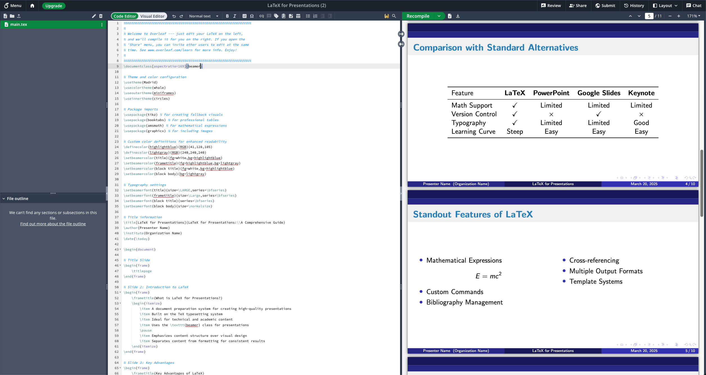

## My workflow with Overleaf and ChatGPT

A few weeks ago, I was asked to make a slide deck for a team meeting. Normally, I usually use [Google Slides](https://workspace.google.com/products/slides/) or [Markdown via Marp](https://marp.app/) to make a simple slide for presentation. But this meeting is more serious, so I needed to make a professional, high-standard slide deck. This requirement *made* me think of using [Overleaf](https://www.overleaf.com/), a tool that helps create slides in a professional format. It worked so well that I want to share my experience. This is my story, walking through the problems I faced, the solution I found, and some tips that might help you too.

### Consistent and polished slides

While tools like [Google Slides](https://workspace.google.com/products/slides/) are great for quick presentations, ensuring a consistently professional and polished look for a more serious meeting can present its own set of challenges. Even seemingly simple tasks, like maintaining uniform fonts, precise spacing, and a cohesive design across all slides, can become surprisingly time-consuming and require meticulous attention to detail. This can detract from the core task of crafting compelling content.

I experimented with markdown via [Marp](https://marp.app/), hoping for a more efficient way to create slides. I found the writing process faster, but I struggled to achieve the level of visual refinement needed for a professional presentation. The output, while functional, lacked the polished aesthetic that would convey the seriousness of the meeting. This experience underscored the need for a tool that could not only streamline the creation process but also inherently produce a high-quality, professional visual output. That's why I decided to explore Overleaf. I knew it was designed to create professional documents and slides with built-in themes that ensure consistency and a polished appearance with minimal effort. Furthermore, its features like online collaboration, and debugging tools made it an even more attractive option for ensuring a smooth and efficient workflow.



But to make it work, normally, we need to know how to use LaTeX. Not everyone is familiar with it, and it can be a barrier to entry for some. But this is the age of AI, and we can use it to make it easier. Let's see how.

### A two-step solution

I came up with a simple way to make things easier, after some trial and error late at night. I decided to use ChatGPT to write the content and Overleaf to handle the formatting. It felt like having one helper for ideas and another for design. Here’s how it worked. First, I asked ChatGPT to help me. I’d give it a request like: "Write a 3-slide presentation in a format I can use, about implementing a data snapshot pattern to persist historical data, with 3 bullet points per slide." It quickly gave me a draft with titles, points, and a structure I could use. It wasn’t perfect, but it was a great starting point. Then, I’d take that draft and put it into Overleaf. I’d pick one of its predefined themes, hit “Recompile,” and get clean slides fast. Overleaf’s live preview let me make small changes as I went, and its online setup made it easy for my team to join in. No more confusion over file versions. It all came together smoothly.

This method worked well for a few reasons. ChatGPT saved me time on writing, turning hours into minutes. It gave me a clear structure, so I didn’t have to plan everything myself. Overleaf made the slides look good with its exporter and themes, without me needing to do much. And it made teamwork simple, keeping us all on the same page. It turned a slow task into something quick and manageable. I was really happy with how it turned out.

### A real example

Let me share one time I used this method, preparing slides on persisting historical data for a tech talk. I’d been working on a project about using the data snapshot pattern to store historical data, like in a cryptocurrency trading system, and I wanted to explain it. I asked ChatGPT: "Write a 3-slide presentation in a format I can use, on implementing a data snapshot pattern to persist historical data, 3-4 points per slide." It gave me something I could work with, like this:

```latex
\begin{frame}{Slide 2: Why Use Snapshots?}
    \begin{itemize}
        \item Captures data at a specific time
        \item Prevents recalculation errors
        \item Speeds up report generation
    \end{itemize}
\end{frame}
```

I copied it into Overleaf, picked a nice predefined theme, and watched it turn into proper slides. I made a few small changes and added a point about how snapshots help with long-term trend analysis. In about 15 minutes, I had a finished deck. I exported it as a PDF, presented it at the tech talk, and the audience found it clear and useful. It didn’t feel like a chore. It felt like a small win, and I left the talk feeling good.

### Turning this article into slides

Here’s where it gets interesting. I used this very article to test my workflow again, turning it into a slide deck with Overleaf. I wanted to see if it could handle something I’d already written, and it did. I asked ChatGPT: "Take this article and make a 4-slide presentation in a format I can use, with 3 points per slide, summarizing my workflow." It gave me a good starting point, like this:

```latex
\begin{frame}{Slide 1: The Struggle with Slides}
    \begin{itemize}
        \item Writing content takes too long
        \item Organizing ideas is hard
        \item Teamwork gets messy
    \end{itemize}
\end{frame}
```

I pasted it into Overleaf, chose a clean predefined theme, and added a slide for each section: the problem, the solution, an example, and tips. I adjusted the wording a bit and recompiled it. In under 20 minutes, I had a deck ready to share with you. It shows that this method works, even on itself. You could do the same with this article. Try it, and you’ll see how fast it comes together.

### Automating with Dify


If you want to take this even further, I’ve streamlined the whole process using a tool called Dify. It automates the workflow, making it even easier for anyone to follow. The process starts with your content idea, which gets analyzed and optimized by a content tool. Then, it’s turned into a format you can use, styled, and finalized. After that, it’s uploaded to a gist for easy access, and you get the code as a result. If something goes wrong, it retries up to three times to ensure it works. This setup saves so much time, especially if you’re not comfortable with the manual steps. If you’re feeling lucky, you can try our Dify workflow directly [here](https://prompt.d.foundation/app/eb483740-3915-4aea-9fc4-5c50eb4700f5/workflow). It’s a great way to see the process in action without doing all the steps yourself. You can also check the example result [here](https://www.overleaf.com/read/jhywvqsdvwxk#8a280e), this is the result of the workflow when I typed "introduce latex for presentation generation".

### Tips that helped

After using this a few times, I found some ways to make it better. Be specific with ChatGPT. Tell it to keep things short or use lists, and it’ll save you cleanup time. Play with Overleaf’s predefined themes to make slides look nicer without extra work. I’ve found ones like “Copenhagen” or “Berlin” work well. For my tech talk slides, I asked ChatGPT to summarize key points, which saved me from digging through details. And I kept ChatGPT’s raw text in a separate file, just in case something went wrong in Overleaf. These small steps made the process smoother and more reliable.

### Making it useful for you

To help you get the most out of this, I’ve added a few things. You’ll see real examples, like the snapshot slide or the article summary above. Try them out yourself and see how they work. Picture a simple flow: prompt goes to ChatGPT, then to a format you can use, then to Overleaf, and finally to slides. That’s the process in a nutshell. If you’re working on a topic like data persistence, change the prompt to fit your needs, like “snapshot patterns for e-commerce.” One time, this saved me when I made a full deck in two hours instead of two days. Just check ChatGPT’s work. It’s good, but it can miss details if you don’t guide it. You’ll catch those quickly with a little practice.

#### Wrapping it up

That’s my story. It’s how I turned slide-making from a hassle into something simple with Overleaf and ChatGPT. It’s not complicated, just a practical fix that gets the job done. Next time you’ve got a presentation coming up, maybe about data patterns or your own project, try this out. It’s helped me more than once, and I think it could help you too. What do you think? Give it a go, adjust it to fit you, and tell me how it works. See you at the next meeting. Your slides will be done, and the stress won’t be there.
