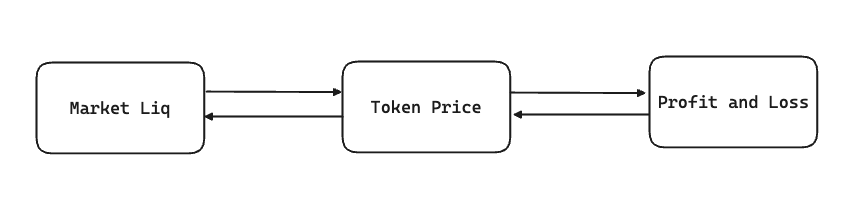
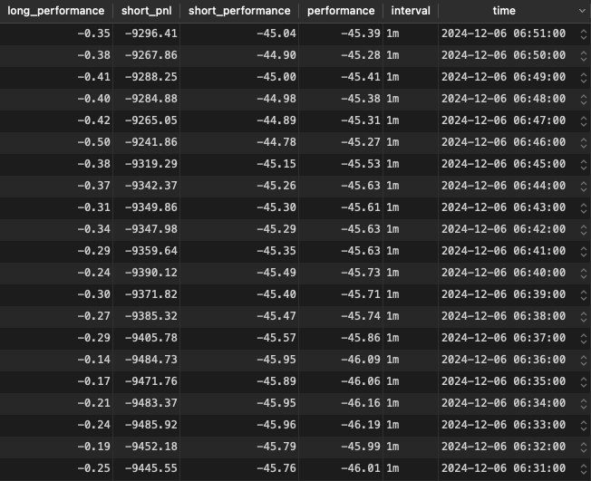

Crypto trading is not just gambling. It has strategies. Once traders can take advantage of it effectively, they can earn. One of the most popular strategies in cryptocurrency is **Hedge**, which is often mentioned with the name **Hedge Bitcoin**.

In simple words, assuming that we are living in a world where we can only just buy/sell salt and pepper. As a merchant, you buy one for speculation. But the risk happens when the price of your holding asset decreases; you lose. With the **Hedge** strategy, you buy both of them with the belief that if one of them decreases, the other will increase. For example, if the price of salt increases while the price of pepper decreases, you buy more pepper and sell a part of your salt.

The real strategy is more complex than my example. But we can understand that **Hedge Bitcoin** means trading entirely other assets on the exchange in the inverse direction to decrease the risk of Bitcoin trading. **To execute this strategy effectively, traders must monitor how liquidity flows between Bitcoin and Altcoins across the exchange, revealing their relative performance patterns.**

### How can we extract market-wide insights from trading data

Performance, in our context, represents the token's profit and loss. For example, if I say, _Performance of BTC is 10%,_ it means BTC has profited 10% since we placed the order. This number closely relates to the asset's liquidity in the market. If you can't imagine the relationship between them, try thinking about the price first. The price of an asset only increases when its total liquidity in the market rises. The change can come from scenarios such as the following:

- Liquidity is moved from other assets to this asset
- Liquidity from new buyers entering the market

 _Figure 1: Relationship between asset liquidity, price, and trading PnL_

Price movements serve as indicators of liquidity flows between assets. When capital moves between Bitcoin and Altcoins, it triggers price changes that result in trading profits or losses. This chain reaction works in reverse too. Trading PnL patterns reveal price movements, which in turn expose the underlying liquidity shifts in the market.

Finally, market performance can be calculated using the following formula:

```math
market_{perf} = BTC_{perf} - Alt_{perf} = \frac{BTC_{pnl}}{BTC_{init}} - \frac{\sum {Alt_{pnl}}}{\sum{Alt_{init}}}
```

_Formula 1: Formula to calculate market performance_

This formula serves as a powerful indicator, revealing liquidity movements across the market whether capital is flowing from Bitcoin to Altcoins, from Altcoins to Bitcoin, or entering/exiting the market entirely. Unlike evaluating price, which provides a general view of trends, performance allows us to quantitatively assess the market. For example:

- When market performance is 5% and BTC performance is 2.5%, this means 2.5% of the funds are moved from Altcoins to BTC, and no new funds have entered the market.
- When market performance is -10% and BTC performance remains unchanged, this means 10% of funds are poured into the market from outside.

Now we have our framework to hedge. How can we obtain this data? Based on _Formula 1_, we need the trading PnL of BTC and all Altcoins. So our business is to prepare a Binance account; depositing money into it; opening a BTC long position with 50% of our funds, and splitting the rest 50% among short positions on all Altcoins. Finally, we wait for PnL changes at each interval, usually a minute; calculate the performances from the PnLs, and record them in our database for later use.

### From data to dashboard: implementing a Go web interface to render performance charts

At the end of the previous part, we mentioned the data gathering. Let me show you how was it constructed.

 _Figure 2: Market performance data_

In _Figure 2_, you can easily see that a large amount of liquidity has been pumped into the market. So, how easy is it to get an overview of the market when these figures are visualized? This is the reason why we are trying to do it here, until now.

Market performance alone is not enough. In addition to estimating future market trends for trading, we also need to evaluate the performance of past trades. To achieve this, I have integrated our trading history into the charts. These include:

- **Trade round**: The time period from the beginning to the end of each trade.
- **Trading account PnL history**: The PnL changes of a specific Binance account over time.

By visualizing both market trends and historical trading data, we gain a more comprehensive understanding of our trading efficiency and decision-making process. The first step is selecting the most appropriate type of chart. It must ensure that when multiple data sources are combined, the visualization retains clarity, readability, and meaning. A mixed chart is ideal for this purpose, combining lines to represent market performance and trading PnL changes over time with a double bar chart that juxtaposes BTC and Altcoin performance to highlight their variations. Finally, scoping each trade within a separate window allows us to analyze individual trading periods in detail.

 _Figure 3: The mixed chart that represent the relationship between market performance and trading effective_

#### Aggregating lines from multiple sources

We will begin the implementation with aggregating and aligning data from different source. The performance data, round period and PnL records each come with their own structure and time frames. To ensure everything aligns properly on the time axis, the data is mapped using time-based Golang map as following.

```go
performanceMap := make(map[string]Performance)
for _, perf := range performances {
    performanceMap[perf.Time.Format("2006-01-02 15:04:05")] = perf
}

pnlMap := make(map[string]Pnl)
for _, pnl := range pnls {
    pnlMap[pnl.Time.Format("2006-01-02 15:04:05")] = pnl
}
```

_Code 1: Simple mapping value of performance and pnl to the time axis_

#### Construct the chart

```go
line := charts.NewLine()
line.SetGlobalOptions(
    charts.WithTitleOpts(opts.Title{Title: "Performance and PnL"}),
    charts.WithXAxisOpts(opts.XAxis{Name: "Time"}),
    charts.WithYAxisOpts(opts.YAxis{
        Name: "Performance (%)",
        Min: -maxPerf,
        Max: maxPerf,
    }),
)

line.ExtendYAxis(opts.YAxis{
	Name: "PnL ($)",
	AxisLabel: &opts.AxisLabel{
		Formatter: "{value} $",
	},
	Min: -maxPnL,
	Max: maxPnL,
	AxisLine: &opts.AxisLine{
		Show:            &trueval,
		OnZeroAxisIndex: 1,
	},
})

line.AddSeries("Performance", yAxisPerf)
line.AddSeries("Unrealized PnL", yAxisPnl, charts.WithLineChartOpts(opts.LineChart{YAxisIndex: 1}))

bar := charts.NewBar()
bar.SetXAxis(xAxis).
    AddSeries("AltCoin Perf", yAxisShortPerf).
    AddSeries("BTC Perf", yAxisLongPerf)

line.Overlap(bar)
```

_Code 2: Code snippet demonstrates how to create a mixed chart using the **go-echarts** library_

To combine line and bar charts to visualize market performance, PnL, and BTC/Altcoin performance. The process begins with defining a line chart using the `charts.NewLine()` function. This line chart is configured with global options such as the title, X-axis for time, and a Y-axis labeled "Performance (%)", which ranges from `-maxPerf` to `maxPerf`. This setup ensures that the performance data is plotted on a dedicated axis, making it easy to interpret trends over time.

Next, a secondary Y-axis is added to represent PnL, labeled "PnL ($)". This axis is configured with its own range (`-maxPnL` to `maxPnL`) and includes an axis line centered on zero for better visual balance. By extending the Y-axis with this configuration, the chart supports two distinct datasets on different scales, ensuring both performance and PnL are displayed clearly without visual clutter.

The `line.AddSeries` method is used to add the performance data and unrealized PnL data to the chart. Each dataset is represented as a separate line, with the PnL data assigned to the secondary Y-axis using `charts.WithLineChartOpts(opts.LineChart{YAxisIndex: 1})`. This approach ensures that performance and PnL are plotted on their respective axes, maintaining the clarity of the visualization.

To include BTC and Altcoin performance data, a bar chart is created using `charts.NewBar()`. This bar chart shares the same X-axis as the line chart and is populated with series for "AltCoin Perf" and "BTC Perf" using the `AddSeries` method. The bar chart highlights how the performance of these two asset classes changes over time, complementing the overall visualization.

The `line.Overlap(bar)` method combines the line and bar charts into a single cohesive visualization. This allows the user to analyze market trends, PnL changes, and asset performance simultaneously within one chart.

After all, we may still missing something. Yes it is the area to represent the boundaries of trade rounds. It is a bit easy, **go-echart** provides us the option `charts.WithMarkAreaNameCoordItemOpts` to integrate the mark areas to the line chart. Our business is construct each area boundaries by specify its coordinates using trade round start, end time.

```go
opts.MarkAreaNameCoordItem{
				Coordinate0: []interface{}{trade.OpenedTime.Format("2006-01-02 15:04:05"), -maxYAxis},
				Coordinate1: []interface{}{trade.ClosedTime.Format("2006-01-02 15:04:05"), maxYAxis},
				ItemStyle: &opts.ItemStyle{
					Color: "rgba(255, 255, 255, 0.3)", // White color with blur effect
				},
			},
```

_Code 3: Code snippet to construct MarkAreaNameCoordItem depend on trade period_

### Conclusions

This project demonstrates how we can combine Golang and go-echarts to build powerful visualizations that provide deep insights into crypto trading performance. By integrating market trends, historical PnL data, and trading rounds into a single chart, we create a tool that allows traders to make informed decisions with clarity and precision.

The challenges of aligning multiple datasets, ensuring readability, and maintaining meaningfulness were overcome with careful design and thoughtful implementation. This visualization not only simplifies the analysis of complex trading data but also empowers users to refine their strategies and improve efficiency. As the crypto market continues to evolve, tools like these will be indispensable for staying ahead of the curve.
