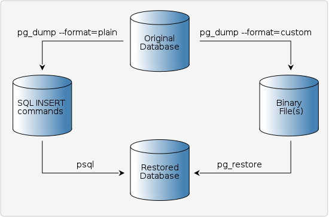
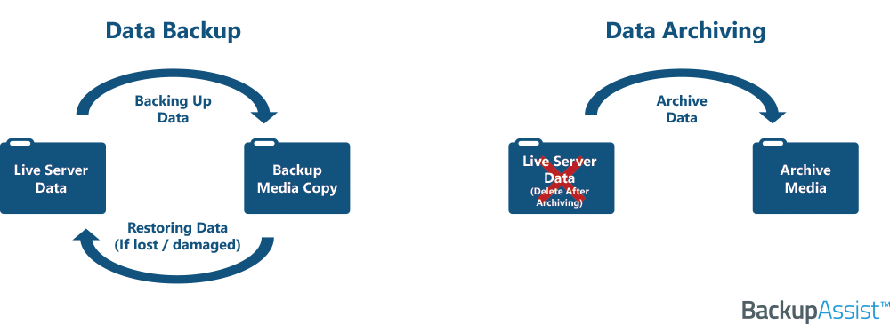
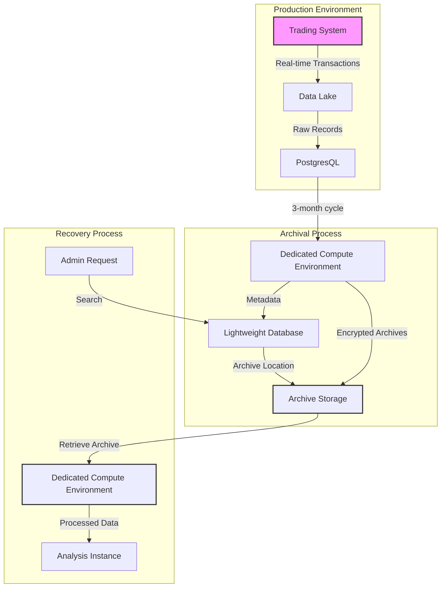

### Data safeguarding strategies
--- 

Data is an important part of software development and one of the most valuable assets for any organization, especially in economics and finance. Along with the growth of business models, a large amount of data is generated diversely. Keeping data safe is critical for business. Data is lost or becomes wrong, which can cause irreversible loss. For example, in the banking system or stock marketplace, if one transaction record is missed, it can lead to a chain of consecutive wrong behaviors. It can even cause money losses for individual users as well as organizations.

In software development, we have many strategies to safeguard the data. Depending on each use case, some strategies can be listed here: 

- **Data Encryption** marks the original data by ciphertext, making it harder to access.
- **Data security policy** defines rules to manage data access and role-based permissions.
- **Data lifecycle management** defines the framework to manage data from creation to destruction.
- **Data backup and recovery** regularly backs up key data to restore them once any critical issue happens.

Each strategy aligns with specific stages of the data lifecycle and can be combined to maximize protective capabilities. 

This overview provides some strategies to protect the data safely. We will continue delving into a more specific problem in the rest of this post, and explore the way we deal with it.

### Problem with storing large amounts of transactional data that are not accessed frequently
---
#### What problem are we solving?

Imagine you are developing a financial application that produces tens of thousands of transactions per day by users because of their cryptocurrency trades. These transactions are firstly stored in the data lake as raw records. Once a trade round (normally 3 months of trading) is over, the raw transactions in this period will be used to produce the final reports and persist to the database. After this time, these records will not be used anymore in both the trading process and summary calculation except for data auditing or report recovery in the future. 

Once the project continues running, the amount of data becomes bigger. It requires us to spend more money to expand the database. The amount of data grows quickly also leading to decreased performance of any operation that needs to interact with the database. 

This situation lets us think about the data archive which is a strategy helping to offload unused data into long-term storage at minimal cost.

#### Data archive, why do we need it?

We first take a look at **data backup** which is the cyclic process of duplicating the entire or a part of data, wrapping it in a stable format then storing it in a secure place. This process is scheduled periodically to make sure we always have at least a copy of production data readies to restore at any time one issue happens.

*Figure 1: Simple example in SQL to represent the data backup and recovery process*

In my point of view when writing this post, backup leans toward the action that captures the state of the database for rolling back to the specific point in the past. By using the backup data, we can do the "disaster recovery" in time when a critical problem needs to hotfix. It is often complex and expensive. Backup and recovery in this context can also impact the ongoing work on the production. Data can be lost or wrong if the strategy is not executed carefully.

The **data archive** may or may not be similar to **data backup**, depending on your definition for each of them. For me, they are similar but with some differences.

While backup comes from production data hotfix problems, data archive focuses on long-term data-keeping. With the growth of production data, especially in transactional applications, a lot of data is not needed for normal execution. However, they are required to reproduce important metrics and auditing in the future. **The data archive is the progress of shelving data that has reached the end-of-life in an organized manner to be easy to use later.**

*Figure 2: Visualization the differences between data backup and data archiving*

By implementing the **data archive** strategy, we can decrease the live database's pressure significantly and optimize storage costs while still ensuring long-term data availability.

#### Recovery using archived data

Archived data is normally not used for production data hotfix or rollback application state. Instead, it is used to recover critical data such as data snapshots, market reports, or even legal matters like audits.

This progress is often executed manually. This means that the data is archived automatically each time it persists after an operational phase is completed. This period is determined depending on your application. It can be monthly, yearly, or each trading round in the trading application. However, once the recovery is required to execute, it should be run manually by the administrator. 

This data recovery strategy mainly focuses on calculating instead of restoring. The calculated result usage depends on your use case. However, once it is used to recover the database directly, it must be ensured that it does not interfere with the normal operation of the application or alter any online information as when rolling back the system state using backup data. This process has another name that is called **forward recovery**.

This approach has some advantages:

- Can regenerate data even without having direct backups
- Provides data validation through reprocessing
- Often results in cleaner data since it goes through current business rules
- Can be useful for audit purposes

### Implementing archive-based recovery strategy for trading application
---

Back to the first example that was used at the second part to raise the problem. Assume we have a high-frequency cryptocurrency trading platforms that produce 50,000 transactions per day, which accumulates to approximately 4.5 million transactions in a single trading cycle of three months. At an average size of 2KB per transaction, this translates to nearly 9GB of raw data every cycle.

To deal with this situation, we can design a simple archive and recovery strategy as following:

*Figure 3: diagram to visualize the workflow of a archive and recovery strategy implementation to resolve the problem with the data of high-frequency cryptocurrency trading platforms*

- Archiving Workflow:
    - After each trading cycle (e.g., 3 months), transactional records are processed and moved to cloud-based storage. These records are compressed and encrypted for security and cost optimization.
    - Metadata for these archived transactions is maintained in a lightweight database for quick lookup.

- Recovery Workflow:
    - When data is required, administrators search the metadata for the relevant archive.
    - The archived records are retrieved and reprocessed using a dedicated compute environment to generate the required reports or validate metrics.
    - If needed, the processed data can be restored to a separate database instance for further analysis without affecting the production environment.

### Conclusion
---

From this discussion, we have seen how archive and recovery strategy can address specific challenges such as efficiently handling large volumes of rarely accessed data. Implementing a robust archive and recovery system provides several benefits, including long-term data availability, cost-effective storage, and support for audits or legal requirements. This strategy is particularly valuable for industries like finance, healthcare, and e-commerce, where data integrity and accessibility are critical.

This knowledge is essential for system architects, database administrators, and developers who manage large-scale applications with growing data needs. Understanding and implementing this strategy equips teams to handle data growth effectively, ensuring their systems remain reliable, secure, and future-ready.
