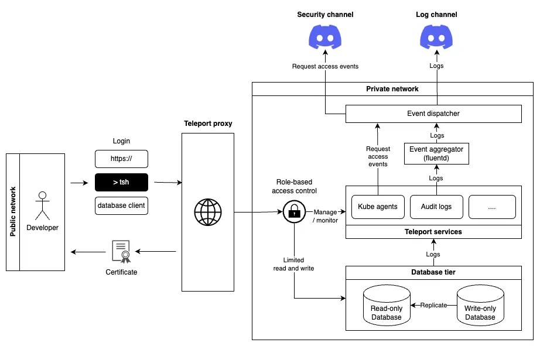
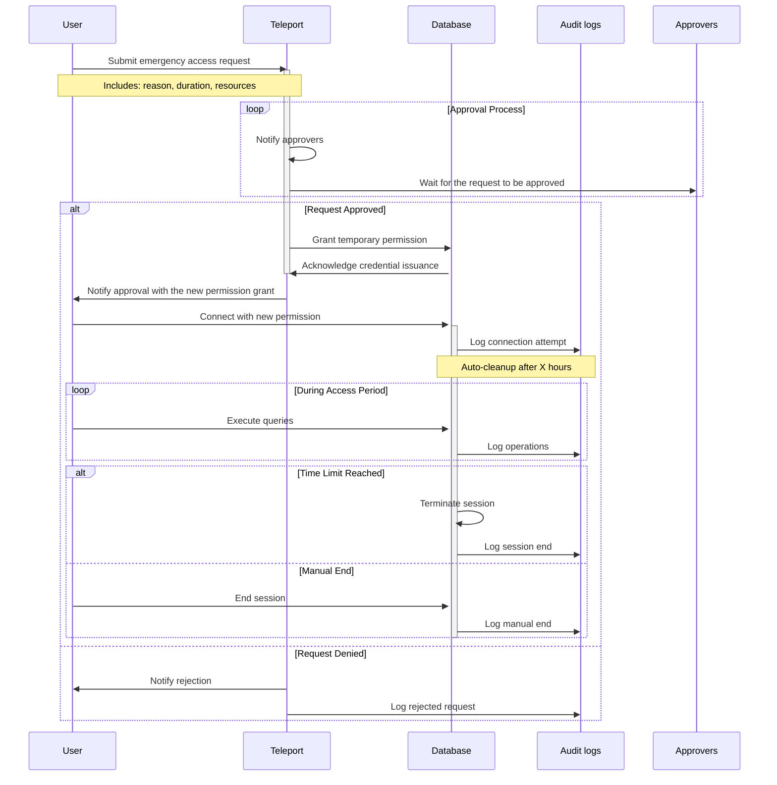

---
authors:
  - 'thanh'
date: '2025-01-02'
description: 'Discover how a trading platform mitigated database access risks, enhanced security, and ensured data integrity through role-based access control, network isolation, MFA, and robust logging. Learn about the strategies and tools, like Teleport, that transformed operational efficiency and reinforced client trust.'
tags:
  - 'security'
  - 'database'
  - 'case-study'
title: 'Database hardening for a trading platform'
---

## Introduction

This case study explores how a trading platform identified and mitigated critical risks in its database access and control practices. Initially, developers had unrestricted access to sensitive data and operations, exposing the system to significant vulnerabilities such as data manipulation, loss, and lack of traceability. These risks threatened financial stability, client trust, and operational continuity. The organization implemented a structured approach to address these challenges, improving security and maintaining data integrity.

## Problem statement

The current database access and control practices pose the following challenges:

1. **Unrestricted access to sensitive data**

   Developer accounts can access sensitive information, including user funding and personal data. This unrestricted access risks intentional misuse or unintentional exposure.

2. **Data manipulation**

   Developer accounts with write permissions can inadvertently or maliciously alter critical data, such as trade records, causing inconsistencies and potential financial discrepancies.

3. **Data loss**

   Permissions to perform destructive actions, such as dropping tables, expose the system to irreversible data loss, service outages, and heightened recovery costs, especially in the absence of adequate backups.

4. **Lack of auditability**

   The absence of logging and traceability mechanisms hinders the ability to identify or attribute actions, creating accountability gaps when database issues arise.

> Developer accounts refer to accounts from the development team, which includes both developers and system administrators (devops). We use the term “account” to denote that it can potentially be exploited by unauthorized individuals.

### Considerations for operational needs

While access should be minimized, it is recognized that developers occasionally need to:

- **Manipulate data** to fulfill client requests (e.g., updating specific records).
- **Query data** to trace production issues when source code analysis is insufficient.

These activities must be conducted under strict safeguards to prevent "oops" moments, where accidental actions result in catastrophic data loss or manipulation.

### Risk assessment

| **Type**                   | **Impact**                                                                     | **Cause**                                         |
| -------------------------- | ------------------------------------------------------------------------------ | ------------------------------------------------- |
| **Fund loss**              | Misuse of sensitive funding data for personal gain                             | Unrestricted developer access                     |
| **Data loss**              | Irreversible deletion of critical data                                         | Developer accounts performing destructive actions |
| **Information loss**       | Exposure of sensitive client data                                              | Unregulated read access                           |
| **Operational disruption** | Downtime caused by accidental or malicious actions                             | Developer accounts with write permissions         |
| **Operational cost**       | Increased expenses for data recovery, incident response, and breach mitigation | Lack of log trails and recovery mechanism         |

## Proposed approach

To address the identified challenges and mitigate risks effectively, the following approach is proposed. This strategy directly tackles the **causes** outlined in the risk assessment table while emphasizing their **impact** to underline the importance of the measures.

### **Role-based access control**

Unrestricted developer access leads to fund loss and information loss.

**Solution**:

- Enforce least-privilege principles to ensure developers only access data relevant to their role
- Provide standby database for debugging (read-only)
- Differentiate access levels:
  - **Read-only access**: For troubleshooting non-sensitive data.
  - **Sensitive data access**: Granted with explicit approval.
  - **Write permissions**: Restricted to authorized roles with explicit approval.

### **Network isolation**

Unregulated access points create opportunities for data loss and operational disruptions.

**Solution**:

- Restrict database access to approved endpoints and IP addresses
- Mandate VPN usage or secure proxy for all database interactions

### **Multi-factor authentication**

Insufficient authentication measures lead to unauthorized access, causing fund loss and data manipulation.

**Solution**:

- Require MFA for all database logins to prevent unauthorized access.

### **Database observability and audit logging**

Lack of logging and traceability leads to operational disruptions and high operational costs.

**Solution**:

- Implement robust logging to track every database interaction, including query execution, data manipulation, and administrative actions
- Use monitoring systems to:
  - Identify and alert on suspicious activities, such as bulk deletions or schema modifications
  - Provide detailed action histories for troubleshooting
- Ensure logs are tamper-proof and securely stored to prevent alteration or loss

### **Break glass access**

Emergency situations may require immediate database access, which, without safeguards, can cause operational disruptions.

**Solution**:

- Define a documented and auditable "break glass" process for emergencies
  - Multi-party approval required to activate access
  - Time-limited access to minimize risk exposure
  - Comprehensive logging of all actions to ensure accountability

## Technical implementation

### System architecture

The technical implementation leverages [**Teleport**](https://goteleport.com/) as the primary approval system and authorized platform to manage database access securely. Teleport provides seamless integration with multi-factor authentication, role-based access controls, and logging mechanisms:

1. **Public network**
   - **Developers**: Log in via HTTPS, CLI (`tsh`), or database clients
   - **Certificates**: Issued upon successful authentication via Teleport
2. **Teleport proxy**
   - Serves as the approval gateway, ensuring only authorized personnel can access the private network. It enforces MFA and role-based permissions
3. **Private network**
   - **Teleport services**: Handle access requests, manage roles, and log activities
   - **Audit logs**: Record all database interactions for compliance and security
   - **Event aggregator (Fluentd)**: Processes and routes logs
   - **Database tier**: Divided into read-only and write-only instances to enforce separation of duties
4. **Notification system**
   - **Security channel**: Alerts administrators about suspicious activities or access requests
   - **Log channel**: Stores logs in tamper-proof systems for audit trails

**Workflow**

1. A developer logs in via HTTPS, `tsh`, or a database client. After successful authentication, they get a certificate.
2. The developer accesses the system through the Teleport proxy, which enforces role-based permissions.
3. Inside the private network, Teleport services handle requests, manage resources, and record logs.
4. Logs and events go to the **Event aggregator (fluentd)**, which processes and forwards them to security and log channels.
5. Database operations are controlled by roles, ensuring data access is limited to read-only or write-only permissions.

### Masking data

We hide some sensitive information in our tables to keep data safe. Most of these fields stay hidden forever. However, a few can be accessed with special permissions when needed. Right now, we use [postgresql-anonymizer](https://postgresql-anonymizer.readthedocs.io/en/latest/) for data masking and follow this process:

**How to request access**

1. Identify the Table: Find out which table you need access to.
2. Request the Right Role: Use the table name with unmasked\_ as the role name.

For example, if you need to see hidden fields in the `deposits` table, request the `unmasked_deposits` role.

### Request a new role for extensive access

If there is a special request for an action beyond the permissions of the existing role, the requester must follow this protocol to perform the action:

**Workflow summary:**

1. Developer initiates the request.
2. Approvers evaluate and approve the request via Teleport.
3. Developer performs required actions with temporary permissions.
4. All activities are logged, and permissions are automatically revoked after expiration.

## Results and benefits

The implementation of these measures delivered the following benefits:

- **Enhanced security**: Reduced risks of unauthorized access, data breaches, and misuse.
- **Data integrity**: Maintained through role-based access controls and data masking.
- **Operational efficiency**: Developers can perform essential tasks without compromising security.
- **Improved traceability**: Comprehensive logging enables accountability and quick issue resolution.
- **Client trust**: Reinforced by demonstrating robust data protection practices.

## Conclusion

This case study demonstrates the value of integrating tools like Teleport into a robust database hardening strategy. By combining role-based access, network isolation, and detailed logging, the organization significantly improved its security posture. These measures not only mitigated immediate risks but also established a foundation for secure, scalable operations, fostering client confidence and ensuring long-term success.
