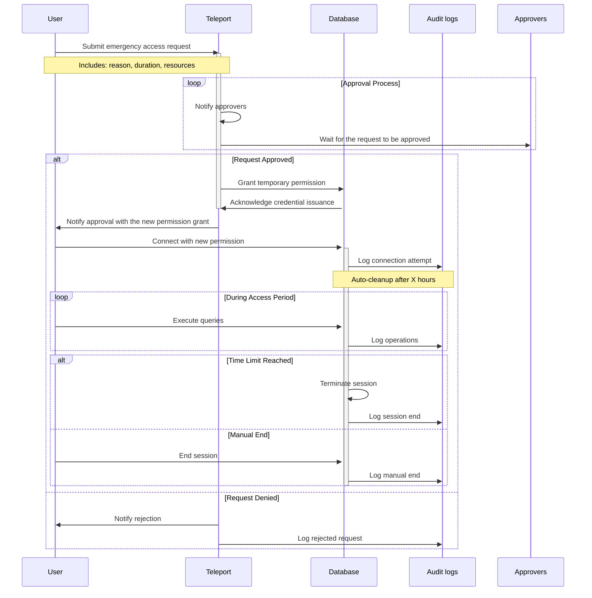

---
authors:
  - 'thanh'
date: '2025-01-02'
description: 'Discover how a trading platform mitigated database access risks, enhanced security, and ensured data integrity through role-based access control, network isolation, MFA, and robust logging. Learn about the strategies and tools, like Teleport, that transformed operational efficiency and reinforced client trust.'
tags:
  - 'security'
  - 'database'
  - 'case-study'
title: 'Database hardening for a trading platform'
---

## Introduction

Database vulnerabilities are a silent threat in trading platforms. They lurk in unrestricted access controls, posing risks of data breaches, operational disruptions, and loss of client trust. This case study examines how we identified these risks and implemented a structured, practical approach to mitigate them. By integrating tools like Teleport, enforcing strict access controls, and embedding detailed logging mechanisms, we significantly enhanced our security posture and operational resilience.

## Problem statement

Every trading platform depends on its database to handle sensitive operations—from storing client funds to managing trade records. Yet, our initial access controls had critical gaps:

**Unrestricted access to sensitive data**

Developer accounts could access client funding information, exposing the platform to intentional misuse or accidental exposure.

**Data manipulation**

Developers with write permissions could inadvertently or maliciously alter critical data, risking financial discrepancies.

**Data loss**

Permissions to execute destructive commands, such as table deletions, left the system vulnerable to catastrophic data loss.

**Lack of auditability**

Without logging and audit trails, accountability gaps hindered issue resolution and increased operational risks.

> Developer accounts refer to those belonging to engineers and DevOps personnel. These accounts, if compromised, could act as vectors for unauthorized access.

### Operational needs vs. security risks

While access should be minimized, it is recognized that developers occasionally need to:

- **Manipulate data** to fulfill client requests (e.g., updating specific records).
- **Query data** to trace production issues when source code analysis is insufficient.

These activities must be conducted under strict safeguards to prevent "oops" moments, where accidental actions result in catastrophic data loss or manipulation.

### Risk assessment

| **Type**                   | **Impact**                                                                     | **Cause**                                         |
| -------------------------- | ------------------------------------------------------------------------------ | ------------------------------------------------- |
| **Fund loss**              | Misuse of sensitive funding data for personal gain                             | Unrestricted developer access                     |
| **Data loss**              | Irreversible deletion of critical data                                         | Developer accounts performing destructive actions |
| **Information loss**       | Exposure of sensitive client data                                              | Unregulated read access                           |
| **Operational disruption** | Downtime caused by accidental or malicious actions                             | Developer accounts with write permissions         |
| **Operational cost**       | Increased expenses for data recovery, incident response, and breach mitigation | Lack of log trails and recovery mechanism         |

## Proposed approach

Addressing these risks required a phased approach. Each step introduced a new layer of security, designed to mitigate specific vulnerabilities.

### **Role-based access control**

Unrestricted developer access was the root cause of several risks. To address this:

- Enforce least-privilege principles: Developers accessed only the data essential to their roles.
- Differentiate access levels:
  - **Read-only access**: For troubleshooting non-sensitive data.
  - **Write permissions**: Granted only with explicit, time-limited approval.
- Provide standby databases: Developers used a read-only copy of the production database for debugging.

### **Network isolation**

Open access points created opportunities for unauthorized interactions with the database. To minimize exposure:

- Restricted database access to approved endpoints or IP addresses.
- Mandated VPN usage or secure proxy connections for all database interactions.

### **Multi-factor authentication**

Insufficient authentication measures left accounts vulnerable to compromise. Implementing MFA added an extra layer of security by requiring developers to verify their identities using multiple factors before accessing the database.

### **Database observability and audit logging**

Lack of visibility into database interactions hindered accountability. To address this, we:

- **Implemented robust logging**: Tracked every database interaction, including queries, data changes, and administrative actions.
- **Set up alerts**: Suspicious activities, such as bulk deletions or schema modifications, triggered instant notifications.
- **Made logs tamper-proof**: Ensured secure storage to prevent alterations.

### **Break glass access**

In emergencies, developers needed immediate access to resolve critical issues. However, such access carried risks if not carefully managed. We implemented a "break-glass" process:

- **Multi-party approval**: Emergency access required sign-offs from multiple stakeholders.
- **Time-limited access**: Permissions expired automatically after a set duration.
- **Comprehensive logging**: Every action during emergency access was logged for accountability.

## Technical implementation

### System architecture

We used [**Teleport**](https://goteleport.com/) as the central platform for managing access controls and monitoring database interactions. The architecture featured:

- **Public network**: Developers authenticated via HTTPS or CLI (tsh) to obtain access certificates.

- **Teleport proxy**: Served as the gateway, enforcing MFA, role-based permissions, and secure connections.

- **Private network**: Hosted the database tier, segregated into read-only and write-only instances, and the logging infrastructure.

- **Event aggregator**: Used Fluentd to process and route logs to tamper-proof storage and notification systems.

- **Notification system**: Alerted administrators to suspicious activities and provided actionable insights.

**Workflow**

1. A developer authenticated via Teleport, receiving a temporary certificate.
2. The Teleport proxy validated their permissions before granting access to the private network.
3. Logs of all interactions were processed by the event aggregator and stored securely.
4. Alerts were sent to the security team for any suspicious activities.

### Masking data

We hide some sensitive information in our tables to keep data safe. Most of these fields stay hidden forever. However, a few can be accessed with special permissions when needed. Right now, we use [postgresql-anonymizer](https://postgresql-anonymizer.readthedocs.io/en/latest/) for data masking and follow this process:

1. **Identify the table**: Find out which table you need access to.
2. **Request the tight role**: Use the table name with `unmasked_` as the role name.

For example, if you need to see hidden fields in the `deposits` table, request the `unmasked_deposits` role.

### Request a new role for extensive access

If there is a special request for an action beyond the permissions of the existing role, the requester must follow this protocol to perform the action:

**Workflow summary:**

1. Developer initiates the request.
2. Approvers evaluate and approve the request via Teleport.
3. Developer performs required actions with temporary permissions.
4. All activities are logged, and permissions are automatically revoked after expiration.

## Results and benefits

The implementation delivered measurable benefits:

- **Enhanced security**: Reduced risks of unauthorized access, data breaches, and misuse.
- **Improved data integrity**: Maintained through RBAC and robust logging.
- **Operational efficiency**: Developers performed essential tasks without compromising security.
- **Accountability and traceability**: Comprehensive logs enabled rapid issue resolution.
- **Increased client trust**: Demonstrated commitment to safeguarding sensitive data.

## Conclusion

This case study highlights how robust access control measures can transform database security in a trading platform. By layering tools like Teleport, enforcing RBAC, and integrating detailed observability, we not only mitigated immediate risks but also established a secure foundation for future growth. These measures underscore the importance of proactive security in maintaining operational resilience and client trust.
