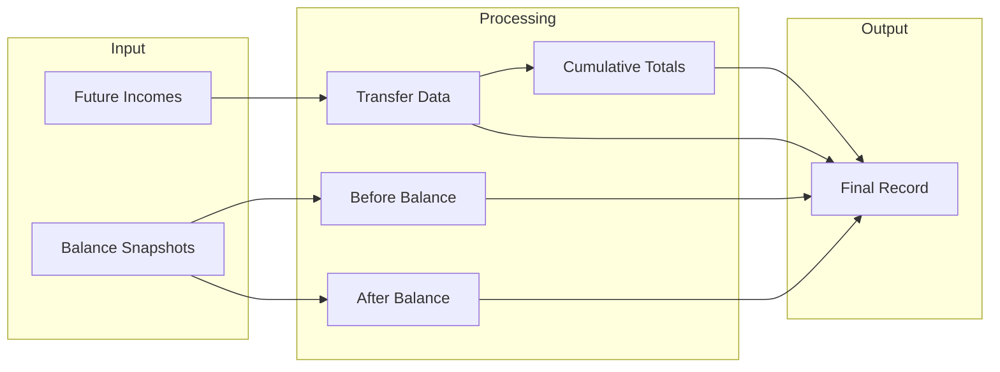
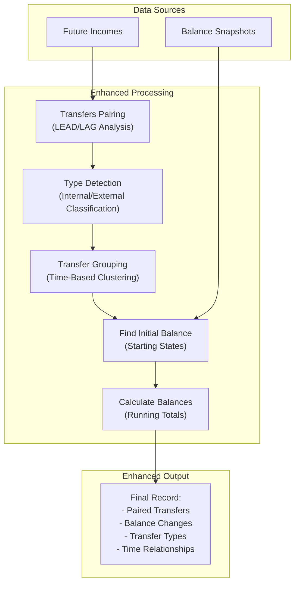

### **What is a logger, and why does it matter?**

A **logger** is a fundamental component of modern software systems, designed to record system events, user actions, and issues in real-time. It’s like the memory of an application, enabling both users and administrators to trace activities. Loggers serve two main purposes:

> - **For users**: They provide notifications or updates about events like successful transfers, errors, or system changes.
> - **For developers and support teams**: They offer a detailed record of system behavior, aiding in debugging and monitoring.

Without a logger, understanding the flow of actions or diagnosing issues would be like navigating a dark room without a flashlight.

---

### **What makes an effective logger?**

An effective logger goes beyond simply storing data. It organizes and presents information in a way that’s **useful and easy to understand**. To be effective, a logger must have the following qualities:

- **Consistency in format**  
	   Logs should maintain a uniform structure across the application, much like a well-organized manual where every chapter follows the same layout. This consistency makes it easier to identify patterns and quickly interpret information.

- **Clarity and self-documentation**  
	   Logs should be *self-explanatory*, requiring little to no additional context to understand their meaning. For instance, a good log entry is like a well-written headline: concise, clear, and informative.

- **Purposefulness and informativeness**  
	   Every log entry should serve a purpose. For example, instead of simply stating, "Transfer completed," a log should provide actionable insights, such as the accounts involved, the amount transferred, and timestamps.

---

### **Context: transfer logs in cryptocurrency applications**

Imagine a **cryptocurrency trading application** that enables users to manage multiple accounts on one platform. One of its core features is handling **transfers**, which can be categorized as follows:

- *Deposits*: Funds added to an account from an external source.
- *Withdrawals*: Funds removed from an account to an external destination.
- *Internal transfers*: Movement of funds between two accounts belonging to the same user.

Here’s an example scenario:  
A user transfers **$1,000 USDT** from their main account (**Account\_A**) to their savings account (**Account\_B**). The system generates two records in the database:  
1. A **withdrawal record** for Account\_A.  
2. A **deposit record** for Account\_B.

However, the current logs fail to establish a clear relationship between these records. Consider the following example:

```
Account_A | -1000 USDT | 2024-01-01 10:00:00  
Account_B | +1000 USDT | 2024-01-01 10:00:01  
-- Are these movements related? No way to tell!
```

From this log, users cannot deduce that the two entries are part of the same transfer. This ambiguity can cause confusion, especially in financial applications where clarity and transparency are paramount.

---

### **Why is this problematic?**

The lack of clear relationships between log entries creates the following issues:  

1. **User confusion**: Without context, users may struggle to understand the flow of their funds.
2. **Reduced trust**: Ambiguous logs can erode user confidence, especially in financial systems.
3. **Limited debugging capability**: Developers and support teams cannot efficiently diagnose issues or trace transactions without meaningful, connected data.

---

### **Why does this happen? A look at the current system**

The existing system focuses on individual transactions, treating withdrawals and deposits as **isolated events**. The process is outlined below:



This method records events but fails to link related transactions. For example, a withdrawal from one account and a deposit into another might appear as two separate, unrelated logs.

---

### **A solution: enhanced logging system**

To resolve these limitations, we propose an **enhanced logging system** that links related transactions and provides a clear view of asset movement. The process is illustrated below:



---

### **Key steps in the enhanced system**

1. **Data sources (input)**
   2. **Future incomes**: Primary source of transfer records containing the raw transaction data including amounts, timestamps, and account IDs
   3. **Balance snapshots**: Historical balance records at specific timestamps

2. **Transfers pairing**
```sql
WITH ranked_transfers AS (
    SELECT
        ...,
        LEAD(...) OVER (ORDER BY fi.time) AS next_...,
        LAG(...) OVER (ORDER BY fi.time) AS prev_...,
```
   - Uses SQL window functions (LEAD/LAG) to look at adjacent transfers
   - Connects incoming and outgoing transfers by analyzing their temporal relationships
   - Creates pairs of transactions by matching withdrawals with corresponding deposits
   - Examines transactions within a period window to identify related transfers

3. **Type detection**
```sql
CASE
    WHEN amount < 0
        AND next_amount > 0
        AND (amount + next_amount = 0)
        AND (next_time - time < interval '5 seconds')
    THEN 'INTERNAL_TRANSFER'
```
   - Classifies transfers into three categories:
	 * Internal transfers (between accounts)
	 * External transfers out (withdrawals)
	 * External transfers in (deposits)
   - Uses some simple time-based matching logic combining amount matching and timing
   - Considers both previous and next transactions to ensure accurate classification

4. **Transfer grouping**
```sql
SUM(CASE
    WHEN sender_time_gap > interval '20 seconds' THEN 1
    ELSE 0
END) OVER (
    PARTITION BY from_account
    ORDER BY time
) AS sender_group
```
   - Groups related transfers using a period window
   - Maintains separate groups for sender and receiver accounts
   - Helps handle high-frequency trading scenarios
   - Ensures accurate balance tracking during concurrent transfers

5. **Find first balance of group**
```sql
FIRST_VALUE(
    COALESCE(
        (SELECT current_balance
         FROM account_current_balance_snapshots bs
         WHERE bs.account_id = from_account
             AND bs.created_at <= time
         ORDER BY bs.created_at DESC
         LIMIT 1),
        0
    )
) OVER (...)
```
   - Identifies the starting balance for each transfer group
   - Uses the most recent balance snapshot before the transfer
   - Handles both sender and receiver balances independently
   - Ensures accurate balance baseline for calculations

6. **Calculate balance for each transfer**
```sql
GREATEST(0, (
    sender_initial_balance +
    SUM(signed_amount) OVER (
        PARTITION BY from_account, sender_group
        ORDER BY time
        ROWS BETWEEN UNBOUNDED PRECEDING AND CURRENT ROW
    )
))
```
   - Computes running balances for both sender and receiver
   - Maintains non-negative balance constraints
   - Calculates both before and after states for each transfer
   - Uses window functions for running totals within groups

---

### **Benefits of the enhanced logger**

1. **Enhanced clarity**
   2. Logs clearly link related transactions.
   3. Users see the complete flow of funds, from source to destination.

2. **Improved accuracy**
   2. Tracks balances with precision, even during concurrent transfers.
   3. Uses historical snapshots to ensure reliable calculations.

3. **Better user experience**
   2. Provides actionable insights in a user-friendly format.
   3. Differentiates between internal and external transactions.

---

### **Conclusion**

The proposed enhancements transform the logging system from disconnected entries into a **comprehensive, user-friendly narrative**. By applying advanced processing techniques, the enhanced system offers:

- **Consistency**: Uniform formatting for all logs.
- **Clarity**: Clear relationships between transactions.
- **Purposefulness**: Meaningful, actionable data for users and developers.

This system not only addresses current logging limitations but also sets a solid foundation for future improvements in transaction tracking and user notifications.
