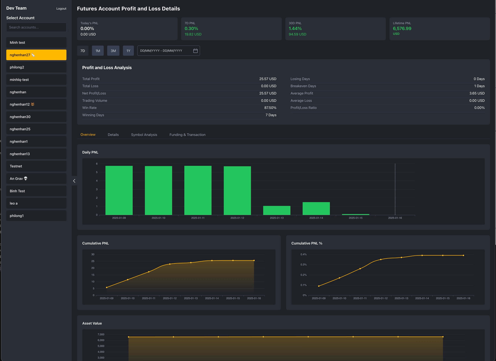
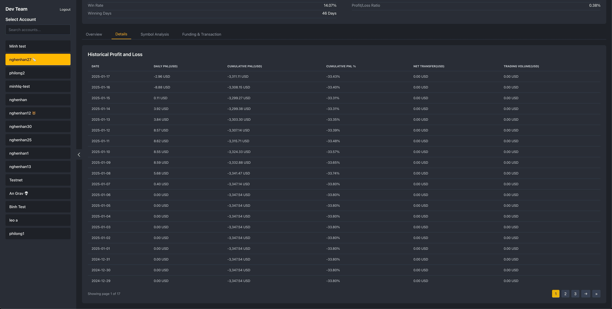
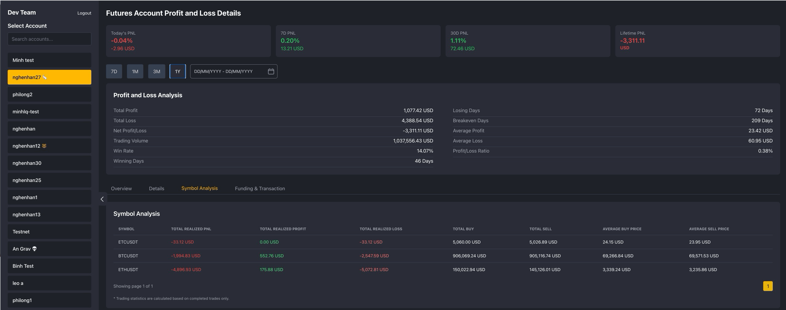
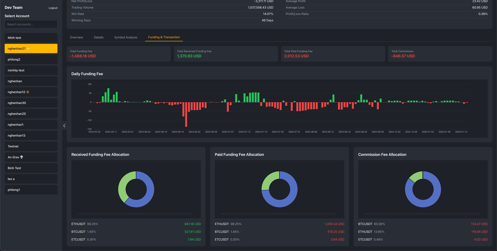

As Binance doesn't allow Master Account see MSA account Future PNL Analysis, so we decide to clone Binance Future PNL Analysis page with Phoenix Live View to show all Account Future PNL

## Why we use Phoenix Live View for Binance Future PNL Analysis page

### Real-Time Data Handling
- Phoenix Live View has built-in Websocket management so we can update data realtime with price or position update
- Efficient handling of continuous data streams from Binance
- Automatic connection management and recovery

### Server-Side State Management
- Keeps sensitive trading data secure on the server
- Ensures calculation accuracy for PNL computations
- Prevents client-side manipulation of important data

### Complex Calculations
- Handles all PnL calculations server-side
- Better precision for financial calculations
- Centralized calculation logic

### Development Efficiency
- Single technology stack (Elixir)
- No need for separate frontend framework
- Simplified state management

## How to optimize query with timescale

### Data Source
Base on [Binance Docs](https://www.binance.com/en/support/faq/how-are-pnl-calculated-on-binance-futures-and-options-pnl-analysis-dbb171c4db1e4626863ec8bc545be46a) we have compound data from 2 timescale tables: `ts_user_trades` and `ts_future_incomes`

- ts_user_trades: to calculate realized pnl, commission, and trading volume
- ts_future_incomes: to calculate funding fee and net inflow

### Timescale table
- ts_user_trades and ts_future_incomes are large data tables so if we use normal table with indexing it will be slower by time that why we use timescale to hyper chunks to prevent this issue

- ts_user_trades is hyper by 1 day
- ts_future_incomes is hyper by 30 days

### Use timescale style query to get summary data in date range
Ecto query to calculate PnL data from `ts_user_trades` and `ts_future_incomes`

```elixir
from(t in TsUserTrades,
  where: t.account_id in ^account_ids,
  where: t.time >= ^start_time and t.time <= ^end_time,
  group_by: [
    t.account_id,
    fragment("time_bucket('1 day', ?)::date", t.time)
  ],
  select: %{
    account_id: t.account_id,
    date: fragment("time_bucket('1 day', ?)::date", t.time),
    commission: fragment("COALESCE(-1 * ABS(SUM(?)), 0)", t.commission),
    realized_pnl: coalesce(sum(t.realized_pnl), 0),
    trade_volume:
      fragment(
        "COALESCE(SUM(CASE WHEN ? IS NOT NULL THEN ? ELSE 0 END), 0)",
        t.quote_qty,
        t.quote_qty
      )
  }
)

from(i in TsFutureIncomes,
  where: i.account_id in ^account_ids,
  where: i.time >= ^start_time and i.time <= ^end_time,
  group_by: [
    i.account_id,
    fragment("time_bucket('1 day', ?)::date", i.time)
  ],
  select: %{
    account_id: i.account_id,
    date: fragment("time_bucket('1 day', ?)::date", i.time),
    net_inflow:
      sum(fragment("CASE WHEN ? = 'TRANSFER' THEN ? ELSE 0 END", i.income_type, i.income)),
    received_funding_fee:
      sum(
        fragment(
          "CASE WHEN ? = 'FUNDING_FEE' AND ? > 0 THEN ? ELSE 0 END",
          i.income_type,
          i.income,
          i.income
        )
      ),
    paid_funding_fee:
      sum(
        fragment(
          "CASE WHEN ? = 'FUNDING_FEE' AND ? < 0 THEN ? ELSE 0 END",
          i.income_type,
          i.income,
          i.income
        )
      ),
    insurance_clear:
      sum(
        fragment(
          "CASE WHEN ? = 'INSURANCE_CLEAR' THEN ? ELSE 0 END",
          i.income_type,
          i.income
        )
      )
  }
)
```

Because timescale table will be spitted into multiple chunks so if we use normal query it will have timeout issue if range too long. So we have to use `time_bucket` to let it join multiple chunks.

### Create cronjob to fill ts_account_pnl_analysis
- We implement account_pnl_analysis_cronjob to backfill from today until oldest date has ts_user_trades order ts_future_incomes to calculate daily pnl

- For current day, we will run interval 1 hour to update data

- With this cronjob it will help us no need to recalculate from 2 tables every request so it will be fast and don't make database pressure

## Screenshots

*Figure 1: Future PNL Analysis Overview Tab*


*Figure 2: Future PNL Detail Tab*


*Figure 3: Future PNL Analysis Symbol Tab*


*Figure 4: Future PNL Funding and Transaction Tab*
