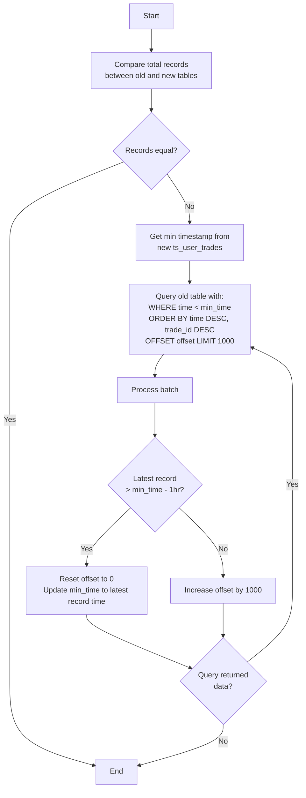

Due to increasing trading volume, the `user_trades` and `incomes` tables have grown significantly, causing slower performance in our reporting queries. To address this, we propose migrating these tables to TimescaleDB, which will allow us to partition the data into time-based chunks. This partitioning strategy should optimize our report query performance.

## We create new timescale tables
Because current tables have large data so we can't migrate it in one SQL Query so that why we have create new table with new timescale structure and this is new table structures

### New ts_user_trades
```sql
CREATE TABLE "public"."ts_user_trades" (
    "id" uuid NOT NULL DEFAULT uuid_generate_v4(),
    "buyer" bool,
    "commission" numeric,
    "commission_asset" text,
    "trade_id" int8 NOT NULL,
    "maker" bool,
    "order_id" int8,
    "price" numeric,
    "qty" numeric,
    "quote_qty" numeric,
    "realized_pnl" numeric,
    "side" text,
    "position_side" text,
    "symbol" text,
    "time" timestamptz NOT NULL,
    "time_unix" int8,
    "account_id" uuid,
    "is_locked_position" bool DEFAULT false,
    "created_at" timestamptz NOT NULL DEFAULT now(),
    "updated_at" timestamptz NOT NULL DEFAULT now(),
    CONSTRAINT "ts_user_trades_account_id_fkey" FOREIGN KEY ("account_id") REFERENCES "public"."accounts"("id"),
    PRIMARY KEY ("id","time")
);

-- Indices
CREATE UNIQUE INDEX ts_user_trades_account_id_symbol_trade_id_time_index ON public.ts_user_trades USING btree (account_id, symbol, trade_id, "time");

CREATE INDEX ts_user_trades_account_id_time_index ON public.ts_user_trades USING btree (account_id, "time");

CREATE INDEX ts_user_trades_account_id_symbol_time_index ON public.ts_user_trades USING btree (account_id, symbol, "time");

SELECT create_hypertable('ts_user_trades', 'time',
  chunk_time_interval => INTERVAL '1 day',
  if_not_exists => TRUE
);
```
#### ts_user_trades indices explain

**1. Unique index**

```SQL
CREATE UNIQUE INDEX ts_user_trades_account_id_symbol_trade_id_time_index ON public.ts_user_trades USING btree (account_id, symbol, trade_id, "time");
```
Three columns `account_id`, `symbol`, `trade_id` can detect duplicate data but we need to add time to unique index for hypertable also

**2. Index `account_id`, `time`**
```sql
CREATE INDEX ts_user_trades_account_id_time_index ON public.ts_user_trades USING btree (account_id, "time");
```
This index for optimize query `WHERE account_id = {id} AND time BETWEEN {time1} and {time2}`

**3. Index `account_id`, `time`, `symbol`**
```sql
CREATE INDEX ts_user_trades_account_id_symbol_time_index ON public.ts_user_trades USING btree (account_id, symbol, "time");
```
This index for optimize query `WHERE account_id = {id} AND symbol in {symbols} AND time BETWEEN {time1} and {time2}`

**4. Hypertable**
```sql
SELECT create_hypertable('ts_user_trades', 'time',
  chunk_time_interval => INTERVAL '1 day',
  if_not_exists => TRUE
);
```
User trading activity is sporadic, but when trades occur, they tend to cluster into periods of high volume within the same minute.

We choose interval 1 day to balance chunk number and size per chunk to make sure each chunk less than 300MB for optimized query

### New ts_future_incomes
```sql
CREATE TABLE "public"."ts_future_incomes" (
    "id" uuid NOT NULL DEFAULT uuid_generate_v4(),
    "account_id" uuid NOT NULL,
    "symbol" text,
    "income_type" text NOT NULL,
    "income" numeric,
    "asset" text,
    "info" text,
    "time" timestamptz,
    "time_unix" int8 NOT NULL,
    "trade_id" text,
    "tran_id" text,
    "is_locked_position" bool DEFAULT false,
    "is_notify" bool DEFAULT false,
    "created_at" timestamptz NOT NULL DEFAULT now(),
    "updated_at" timestamptz NOT NULL DEFAULT now(),
    CONSTRAINT "ts_future_incomes_account_id_fkey" FOREIGN KEY ("account_id") REFERENCES "public"."accounts"("id"),
    PRIMARY KEY ("id","account_id","income_type","time_unix")
);

-- Indices
CREATE UNIQUE INDEX ts_future_incomes_account_id_income_type_tran_id_time_unix_inde ON public.ts_future_incomes USING btree (account_id, income_type, tran_id, time_unix);

-- This index for optimize query WHERE account_id = {id} AND income_type = {income_type} AND time BETWEEN {time1} and {time2}
CREATE INDEX ts_future_incomes_account_id_income_type_time_index ON public.ts_future_incomes USING btree (account_id, income_type, "time");

-- This index for optimize query WHERE account_id = {id} AND income_type = {income_type} AND time BETWEEN {time1} and {time2} and symbol = {symbol}
CREATE INDEX ts_future_incomes_account_id_symbol_income_type_time_index ON public.ts_future_incomes USING btree (account_id, symbol, income_type, "time");

SELECT create_hypertable(
  'ts_future_incomes',
  'time_unix',
  chunk_time_interval => 604800000, -- 7 days in milliseconds
  create_default_indexes => false
)
```


#### ts_user_trades indices explain

**1. Unique index**

```SQL
CREATE UNIQUE INDEX ts_future_incomes_account_id_income_type_tran_id_time_unix_inde ON public.ts_future_incomes USING btree (account_id, income_type, tran_id, time_unix);
```
Avoid duplicate data

**2. Index `account_id`, `income_type`, and `time`**
```sql
CREATE INDEX ts_future_incomes_account_id_income_type_time_index ON public.ts_future_incomes USING btree (account_id, income_type, "time");
```
This index for optimize query `WHERE account_id = {id} AND income_type = {income_type} AND time BETWEEN {time1} and {time2}`

**3. Index `account_id`, `symbol`, `income_type`, and `time`**
```sql
CREATE INDEX ts_future_incomes_account_id_symbol_income_type_time_index ON public.ts_future_incomes USING btree (account_id, symbol, income_type, "time");
```
This index for optimize query `WHERE account_id = {id} AND symbol in {symbols} AND income_type = {income_type} AND time BETWEEN {time1} and {time2} AND `

**4. Hypertable**
```sql
SELECT create_hypertable(
  'ts_future_incomes',
  'time_unix',
  chunk_time_interval => 604800000, -- 7 days in milliseconds
  create_default_indexes => false
)
```
We store two types of transactions in ts_future_incomes: FUNDING_FEE and TRANSFER.

For FUNDING_FEE transactions:
- Each symbol generates 4-8 fees per account per day
- With 320 positions per account across 200 accounts, this results in:
  - Daily records: 320 × 200 × 8 = 512,000
  - Weekly chunk size: 512,000 × 7 = 3,584,000

The resulting chunk size is within acceptable limits.

## Migration plan

### Dual Write
To make sure new tables have new data same as old tables we insert both of tables to make sure we don't lost new data and can rollback to old table if we have problem

### Backfilling

#### Create migrator to import data from old table from new timescale table

**How migrator work**
1. Compare total record between old and new
2. If not equal we will get min time from new ts_user_trades to continue backfill
3. Get data from old table with query `WHERE time < {min_time} ORDER BY time DESC, trade_id DESC OFFSET {offset} LIMIT 1000`
4. Increase min_time if latest record oldest than min_time 1 hours to reset offset back to 0 (The offset is bigger, the query time is longer)
5. Backfill until no data in query



### Validate data
We need to replace new query to old query function by function to retest to make sure correct data and acceptable query time

### Change primary table to new table
After everything is work fine, we can replace primary table to new table then consider to remove old tables if needed to save data storage
