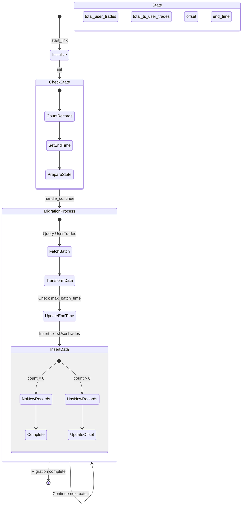

As high trading volume the data in 2 tables `user_trades` and `incomes` are bigger so it will make our report is slower every day. With this problem, we consider to move these tables to timescale tables to split into multiple chunks by time so it will optimized our query report

## We create new timescale tables
Because current tables have large data so we can't migrate it in one SQL Query so that why we have create new table with new timescale structure and this is new table structures

### New ts_user_trades
```sql
CREATE TABLE "public"."ts_user_trades" (
    "id" uuid NOT NULL DEFAULT uuid_generate_v4(),
    "buyer" bool,
    "commission" numeric,
    "commission_asset" text,
    "trade_id" int8 NOT NULL,
    "maker" bool,
    "order_id" int8,
    "price" numeric,
    "qty" numeric,
    "quote_qty" numeric,
    "realized_pnl" numeric,
    "side" text,
    "position_side" text,
    "symbol" text,
    "time" timestamptz NOT NULL,
    "time_unix" int8,
    "account_id" uuid,
    "is_locked_position" bool DEFAULT false,
    "created_at" timestamptz NOT NULL DEFAULT now(),
    "updated_at" timestamptz NOT NULL DEFAULT now(),
    CONSTRAINT "ts_user_trades_account_id_fkey" FOREIGN KEY ("account_id") REFERENCES "public"."accounts"("id"),
    PRIMARY KEY ("id","time")
);

-- Indices
CREATE UNIQUE INDEX ts_user_trades_account_id_symbol_trade_id_time_index ON public.ts_user_trades USING btree (account_id, symbol, trade_id, "time");
CREATE INDEX ts_user_trades_account_id_time_index ON public.ts_user_trades USING btree (account_id, "time");
CREATE INDEX ts_user_trades_symbol_index ON public.ts_user_trades USING btree (symbol);
CREATE INDEX ts_user_trades_trade_id_index ON public.ts_user_trades USING btree (trade_id);
CREATE INDEX ts_user_trades_time_unix_index ON public.ts_user_trades USING btree (time_unix);
CREATE INDEX ts_user_trades_time_idx ON public.ts_user_trades USING btree ("time" DESC);
CREATE INDEX ts_user_trades_account_id_symbol_time_index ON public.ts_user_trades USING btree (account_id, symbol, "time");

SELECT create_hypertable('ts_user_trades', 'time',
  chunk_time_interval => INTERVAL '1 day',
  if_not_exists => TRUE
);
```

### New ts_future_incomes
```sql
CREATE TABLE "public"."ts_future_incomes" (
    "id" uuid NOT NULL DEFAULT uuid_generate_v4(),
    "account_id" uuid NOT NULL,
    "symbol" text,
    "income_type" text NOT NULL,
    "income" numeric,
    "asset" text,
    "info" text,
    "time" timestamptz,
    "time_unix" int8 NOT NULL,
    "trade_id" text,
    "tran_id" text,
    "is_locked_position" bool DEFAULT false,
    "is_notify" bool DEFAULT false,
    "created_at" timestamptz NOT NULL DEFAULT now(),
    "updated_at" timestamptz NOT NULL DEFAULT now(),
    CONSTRAINT "ts_future_incomes_account_id_fkey" FOREIGN KEY ("account_id") REFERENCES "public"."accounts"("id"),
    PRIMARY KEY ("id","account_id","income_type","time_unix")
);

-- Indices
CREATE UNIQUE INDEX ts_future_incomes_account_id_income_type_tran_id_time_unix_inde ON public.ts_future_incomes USING btree (account_id, income_type, tran_id, time_unix);
CREATE INDEX ts_future_incomes_account_id_income_type_time_index ON public.ts_future_incomes USING btree (account_id, income_type, "time");
CREATE INDEX ts_future_incomes_account_id_symbol_income_type_time_index ON public.ts_future_incomes USING btree (account_id, symbol, income_type, "time");

SELECT create_hypertable(
  'ts_future_incomes',
  'time_unix',
  chunk_time_interval => 604800000, -- 7 days in milliseconds
  create_default_indexes => false
)
```

## Create migrator to import data from old table from new timescale table



## Replace old by new step by step

### Duplicate insert function same as old table
To make sure new tables have new data same as old tables we insert both of tables to make sure we don't lost new data and can rollback to old table if we have problem

### Clone all query function from old table when replace all current code are using old query
We need to replace new query to old query function by function to retest to make sure correct data and acceptable query time

### Remove old tables to reduce storage size
After everything is work fine, we can consider to remove old tables if needed to save data storage
