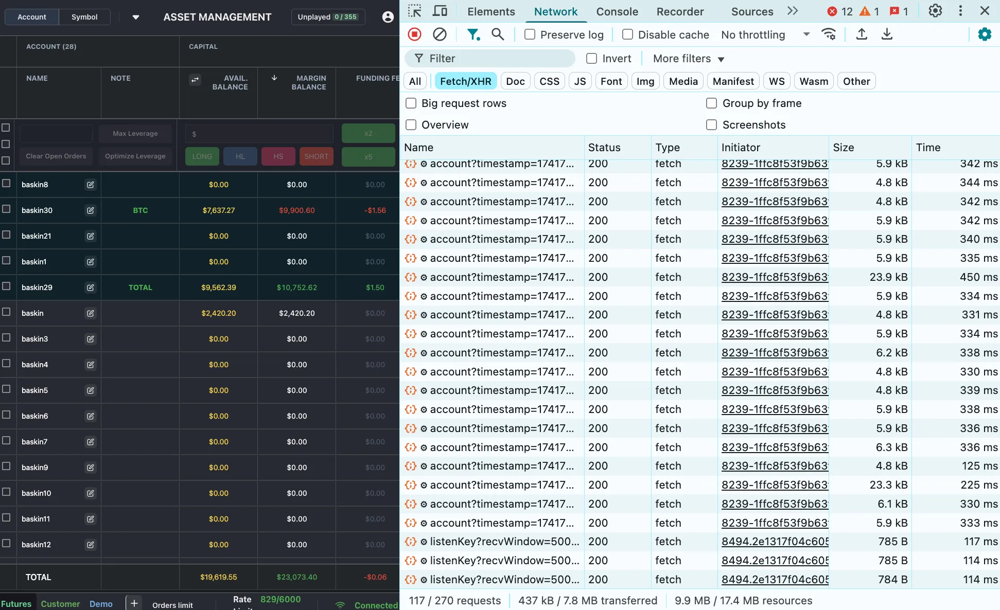
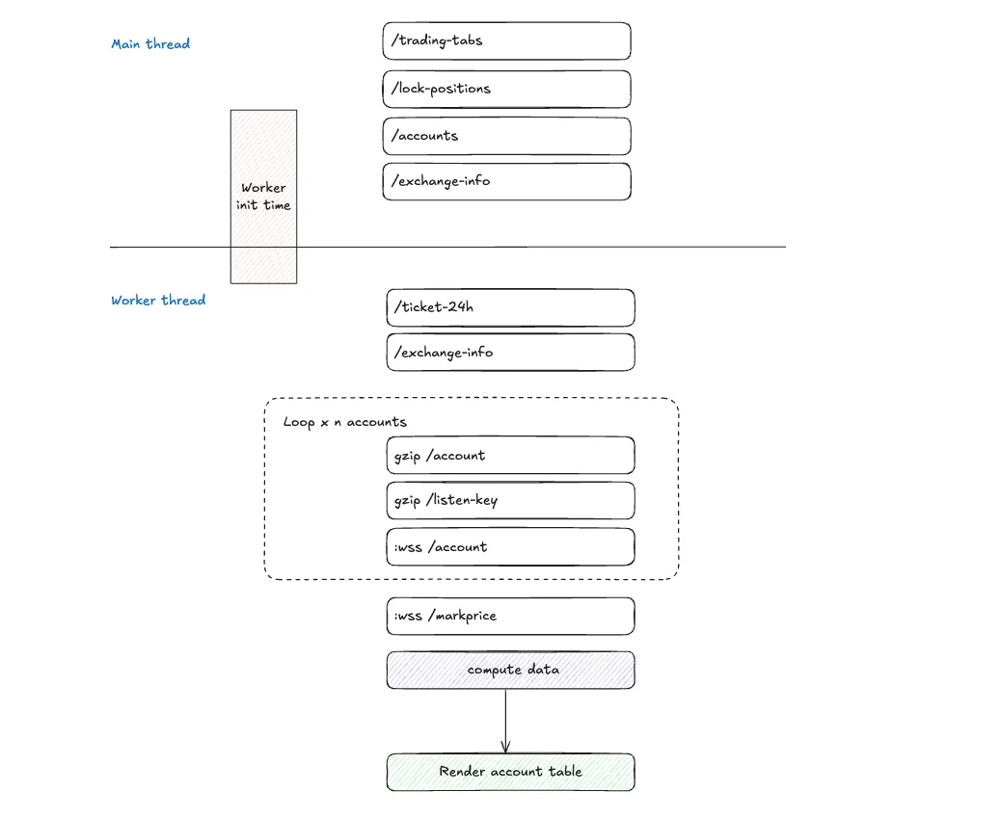
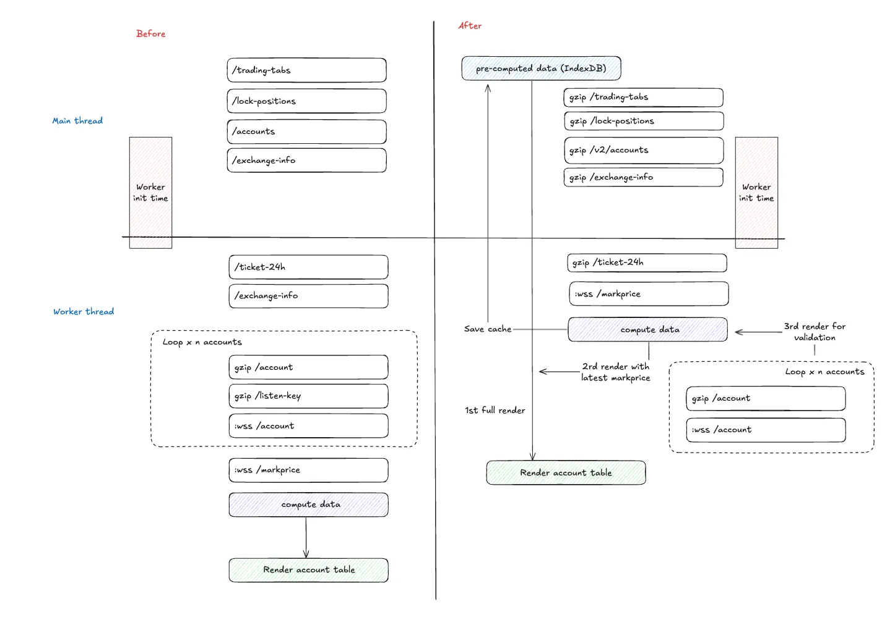
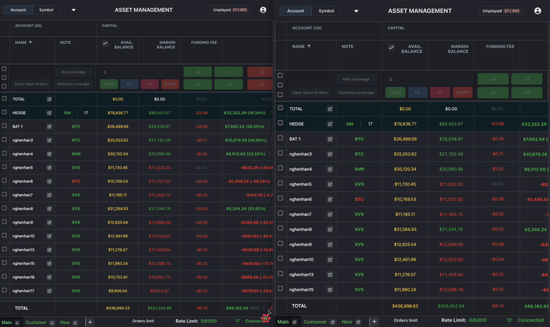
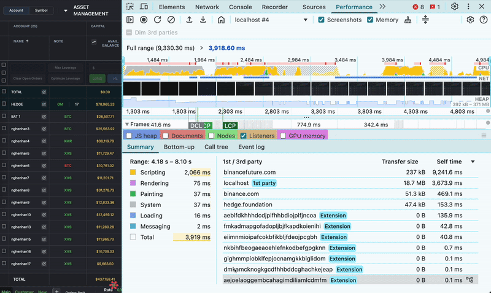
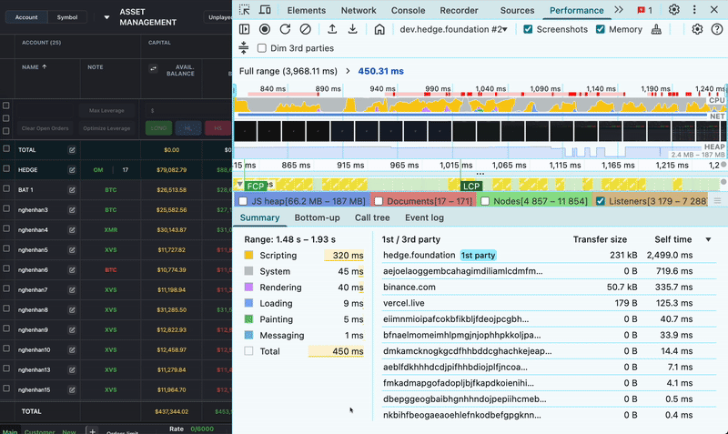

---
authors:
  - 'thanh'
date: '2025-03-12'
description: 'Discover the technical strategies behind optimizing a Binance trading platform, reducing initial load times to under 1 second for enhanced trader productivity.'
tags:
  - fintech
  - performance
title: 'Optimizing initial load time for a Trading Platform'
---

Our development team recently optimized the frontend performance of a trading platform designed for Binance traders. A key performance bottleneck was the long initial load time, which worsened as users managed more accounts. This sluggish start directly impacted the platform's responsiveness, unacceptable for real-time trading. This report outlines our solutions to this primary problem of lengthy initial load times, resulting in a much faster and more dependable user experience. Solving this required overcoming complex network and browser-side rendering limitations. Ultimately, we achieved a dramatic reduction in load times: initial content now appears in under a second, and full platform usability is reached in approximately 1.5 seconds, a significant improvement from the previous 2.5-3 seconds. The following sections explain our approach and its importance.

## Why speed matters

This platform serves serious traders demanding high precision. They often handle many accounts, sometimes 50 or more, to swiftly place large orders and capitalize on market shifts. Importantly, the platform performs real-time calculations like balances and price updates directly in the user's browser, offering great power. However, this frontend focus means users need to frequently refresh the page to ensure all information is completely up-to-date, unintentionally worsening load times when managing numerous accounts and large datasets. Slow loading wasn't just an inconvenience; it became a major obstacle. Traders must react instantly to market changes, and our data revealed user frustration escalating with each loading delay. Given our dedicated user base, every delay chipped away at satisfaction and threatened platform use. This requires us to confront two key performance challenges: **slow network connections** and the **browser's rendering workload**.

### Slow network connections: Too many requests

Getting data from Binance was the first bottleneck. For each account, we were making several requests to Binance – one to get account details (`/account`) and another to set up real-time updates (`/listenKey`). Each of these took some time, around 100–300 milliseconds. When a user had 50 accounts, this meant hundreds of requests. Web browsers can only send a few requests at the same time to one website. This meant most requests had to wait, adding up to long delays

| **Endpoint** | **Purpose**              | **Response Time** | **Problem with many accounts?** |
| ------------ | ------------------------ | ----------------- | ------------------------------- |
| `/account`   | Get account info         | 100–300ms         | Yes                             |
| `/listenKey` | Set up real-time updates | 50–100ms          | Yes                             |

_A waterfall of requests to fetch account infos and listen keys_

### Slow rendering workload: Rendering struggles

Once the data arrived, the browser had a lot to do. It had to process large amounts of code, apply styles to make the platform look good, and show information for 50 accounts. This made the browser take a long time to display everything. We were using Web Workers to handle some data processing in the background to try and keep the platform responsive. But there was a problem: it took 500 milliseconds for these background workers to even start.

This delay meant that even with our code optimizations, the initial display was still taking over 1 second – longer than we wanted. We tried to reduce the amount of code and styles, which helped a little, but the main tasks for the browser – processing code, running it, and displaying things – still took a significant amount of time. We figured we could only save about 0.5 seconds this way, so fixing the network delays was more important.

The following diagram shows the sequence of tasks a browser must complete before displaying a full webpage:

## How we solved the problem

Our first approach was simple: get data, process it in the background, and show it on the screen. But the delay in starting the background processing showed us that just doing processing in the background wasn't enough for the initial load. To get the initial display under 1 second, we needed to drastically reduce network delays and change how we handled data from the start. Using cache became key, but we also needed to make sure traders still got up-to-date information. Here’s what we did.

### Enhance backend API speed

We moved some of the work from the user's web browser to our backend system by improving our API:

- **Caching data:** Account information is now saved in a backend cache. This means we don't have to ask Binance for the same data every time, which reduces external requests. The cache is updated smartly to ensure traders see almost real-time data without always fetching everything again. However, we know that in very active markets, data changes quickly, and the cached data might become slightly out of date compared to the live data on Binance.
- **Request batching:** Instead of making 50+ separate requests for account data, we now make just one request to get all account data at once. This greatly reduces the number of round-trips and avoids the browser's request limits.
- **Data compression:** We used Gzip to compress the data we send, making it smaller and faster to transfer without losing any information.
- **Combined WebSocket setup:** We included the WebSocket setup information (`listenKey`) in the initial data response. This removed the need for a separate request, making setup faster.

These changes turned many network requests into a single, efficient process, making data quickly available for the platform to use.

### Faster WebSocket initialization

Real-time updates are essential, and delays in setting up these updates were not acceptable. By including the `listenKey` in the batched response, the real-time connections now start immediately. Traders get live data as soon as the platform loads – which is very important. Even though we are using cached data initially, these WebSocket updates quickly bring in the very latest information.

### Caching processed data

Caching the raw data from Binance helped, but we still had to wait for the background workers to process it. Our key insight was to also cache the _processed_ data – the data that is already prepared to be displayed. When the page loads, the platform quickly grabs this pre-processed data, completely skipping the background worker startup time for the initial display. While the very first view might show slightly older data, this is quickly updated with real-time WebSocket updates, so traders get fresh data very quickly. Because the market can change fast, especially in peak times, and there might be a slight delay between our backend cache and Binance's servers, we still need to re-verify the account data. To do this, after the initial data from the socket arrives and is displayed, we make a quick, non-blocking call to the `/account` API to double-check and update the data if needed. This ensures the data is as accurate as possible without slowing down the initial loading of the platform.

Here’s the new data flow:

1. **Backend:** Gets account data in batches, caches it, processes key information, and saves the results.
2. **Frontend:** Loads the cached, processed data instantly and displays the platform.
3. **WebSocket:** Streams real-time updates to keep the displayed data in sync.
4. **Revalidation:** After the initial load and socket data display, a non-blocking call to `/account` is made to revalidate data.

## What we achieved

The impact was clear right away. Testing with 50 accounts, we achieved an initial display in under 1 second and a fully usable platform in about 1.5 seconds. This is much faster than the previous 2.5–4 seconds – a significant improvement:

In the old version, loading a full view sometimes took almost 4 seconds:

After the update, it takes less than 1 second:

## **Conclusion**

In the trading world, platform speed is essential. By directly addressing slow network connections and browser display issues, we transformed our platform's frontend from a problem into a strength. Caching, batching requests, and optimizing real-time updates were not complicated solutions, but they were effective. This shows that practical engineering solutions are often more valuable than complex, theoretical approaches.
