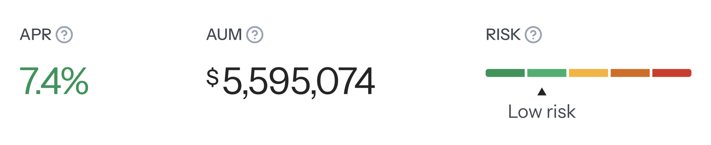

Designing the UI for a blockchain-based hedge fund platform like [**Hedge Foundation**](https://www.hedge.foundation/) is not just about creating a visually appealing interface. The real challenge lies in ensuring that complex financial data is **presented in an intuitive, understandable way that helps users make quick investment decisions**. Optimizing the UI plays a crucial role in allowing investors to access accurate data without feeling overwhelmed by excessive information.

## UI design principles for data visualization

Before starting the design, we focused on understanding who our users are and what problems they face. We divided our users into three main groups:

- **Individual investors:** Need simple tools to protect their assets.
- **Institutional investors:** Need the best hedging strategies for large portfolios.
- **Professional traders:** Want to use hedging tools to maximize profits.

When looking at other hedge fund platforms, we noticed many had overly complex interfaces that made it hard for new users. For example, some platforms required too many steps to make a simple trade, causing users to leave. Also, many platforms didn't clearly show important information like BTC Dominance, Market Trends, and Volatility Index, forcing users to look for data from different sources. Based on these findings, we decided to make trading simpler and add easy-to-read charts right on the main screen to help investors make faster decisions.

To make this work well, we focused on these key principles:

1. **Highlight key data ([Information Hierarchy](https://www.bridgewaterlearning.co.za/2013/04/16/design-principles-hierarchy-of-information/))**: We use dynamic charts and interactive dashboards to help users quickly grasp market trends.
2. **Minimize information overload ([Cognitive Load Reduction](https://www.nngroup.com/articles/minimize-cognitive-load/))**: We keep the layout simple and only show necessary information to avoid overwhelming users.
3. **Enhance data recognition ([Recognition Over Recall](https://www.nngroup.com/articles/recognition-and-recall/))**: Important indicators like BTC Dominance, Market Trends, and Volatility Price are always visible on the main screen, so investors don't have to search through multiple pages.

## Three key UI design for Hedge Foundation

To improve data visualization and usability, we have implemented the following key UI design considerations:

### 1. Integrate an interactive dashboard with dynamic charts

**Problem**: Investors found it difficult to track market movements because key data was fragmented across multiple sections. This forced them to navigate between several pages, increasing the time required to make informed decisions. The lack of a centralized view also made it harder to identify trends and compare portfolio performance efficiently.

**Solution**: We designed a centralized dashboard that consolidates all critical data on a single screen, allowing users to get an overview without navigating between multiple pages.

**Charts Used**: Trend analysis charts are essential for helping individual and institutional investors monitor asset performance and assess risk management strategies. Key implementations include:

- For **long-term patterns**, we use **Trend Lines** to show good times to buy or sell.
- For **investment performance**, the **Portfolio Return** chart shows how much money you're making over time.
- To check **risk levels**, the **Volatility Chart** and **Drawdown Analysis** help investors understand how risky their investments are.
- To see **where money is moving**, the **Liquidity Flow** and **Heatmap Chart** show which areas have the most trading activity.

💡 Tip: We used [i Charts Generate](https://www.figma.com/community/plugin/1370606842652257742/i-charts-generate-line-chart-bar-chart-pie-cahrt-radar-chart-scatter-radial) in Figma to create charts quickly and easily, saving design time and keeping charts consistent throughout the project.

### 2. Enhance readability through color & layout hierarchy

**Problem**: Too much information on the screen can overwhelm users, causing difficulty in focusing on key insights. Without a structured layout, investors struggle to accurately compare values. Tracking performance metrics and identifying market trends also becomes more challenging.

**Solution**:

- Use **colors meaningfully** to help investors understand quickly:
    - Green shows strong growth
    - Blue shows slight growth
    - Yellow shows steady markets
    - Red shows decline
    - Gray shows stable or predicted numbers
    - Purple shows when a stock price hits its upper limit

On price charts, we use different shades of red to show how big a drop is.

- Apply appropriate font sizes and contrast levels to **highlight** essential information:
    - Using bigger text for total investment value
        
        
        
    - Using smaller text for extra details like **Total Yield** and **Performance%**
        
        
        
- Arrange information in ways that are natural to read:
    - **Z-pattern**: Perfect for comparing different investments side by side
    - **F-pattern**: Makes it easy to scan long lists of numbers from left to right
    
    
    
### 3. Select the right chart types for different data sets

**Problem**: Different types of data require specific visualization methods. Choosing the wrong chart type can cause confusion, making it hard for investors to interpret trends, compare assets, and evaluate risks effectively. Poor data representation can lead to misinformed investment decisions and missed opportunities.

**Solution**:

- **Show one big number**: For example, showing **Assets Under Management** right on the dashboard helps investors quickly see how much money is being managed.
- **Compare values within and between groups**: **Bar Charts** and **Stacked Bar Charts** allow investors to analyze and compare the performance of different portfolios or asset groups side by side, making it easier to spot trends and discrepancies.
- **Show relative composition of data**: **Pie Charts** and **Treemaps** illustrate portfolio allocations by asset type or industry.
- **Display change over time**: **Line Charts** and **Candlestick Charts** track price trends and portfolio fluctuations over time.
- **Explain relationships between metrics**: **Scatter Plots** and **Correlation Matrices** help investors see how BTC Dominance relates to altcoin volatility.
- **Plot geographical data**: For hedge funds with global asset distribution, **Map Charts** visualize investment flows across regions.
- **Show detailed data for multiple assets**: **Tables** provide investors with a structured way to analyze asset details, compare performance metrics, and assess risk across different holdings efficiently.

*Source: [Medium](https://medium.com/gooddata-developers/how-to-choose-the-best-chart-type-to-visualize-your-data-85c866ca13a1)*

## AI-based UI evaluation tools

After completing the design, we utilized various AI tools to predict user interactions and assess UI effectiveness. This allowed us to refine the interface for better usability. One example is **Attention Insight**, which provides heatmaps that highlight areas attracting the most user attention. Warmer colors indicate high engagement, while cooler colors suggest areas receiving less attention. Areas with no color indicate almost zero engagement.

To ensure an optimal user experience, we analyzed heatmaps generated by AI-based tools to identify **attention hotspots** and assess whether **key areas** were effectively capturing user focus. This data-driven approach allowed us to refine the **visual hierarchy**, ensuring that critical information was immediately noticeable. Additionally, we used tools like Predict by Neurons and 3M's Visual Attention System (VAS) to compare accuracy levels, and Heurix to conduct automated UX evaluations for the website.

*The heatmap from Attention Insight shows 90-96% accuracy in predicting where visitors will look in the first 3-5 seconds of seeing the design.
© Attention Insight*

## Key lessons from designing UI for Hedge Foundation

From research and UI optimization, we have identified several important takeaways:

1. **Good information layout speeds up decision-making**: Investors can understand data faster when charts and information are shown in a clear way.
2. **Show less information**: By hiding less important data and only showing what's needed, we help users focus better.
3. **Color and layout choices significantly impact UX**: Even small design adjustments can change how users interpret data and make investment decisions.
4. **AI in design workflow**: Automates repetitive tasks to help designers focus on key improvements. It evaluates designs based on industry standards, detects usability issues, and generates predictive heatmaps to improve user engagement.

## Conclusion

By using the right charts, showing less information, and making data easy to understand, Hedge Foundation makes things better for users. Better dashboards, clear information, and good charts make trading simpler, reduce mistakes, and help with investment results.

Looking ahead, integrating AI and advanced data analytics will continue to refine UI/UX, enabling hedge funds to optimize their strategies and deliver greater value to investors.