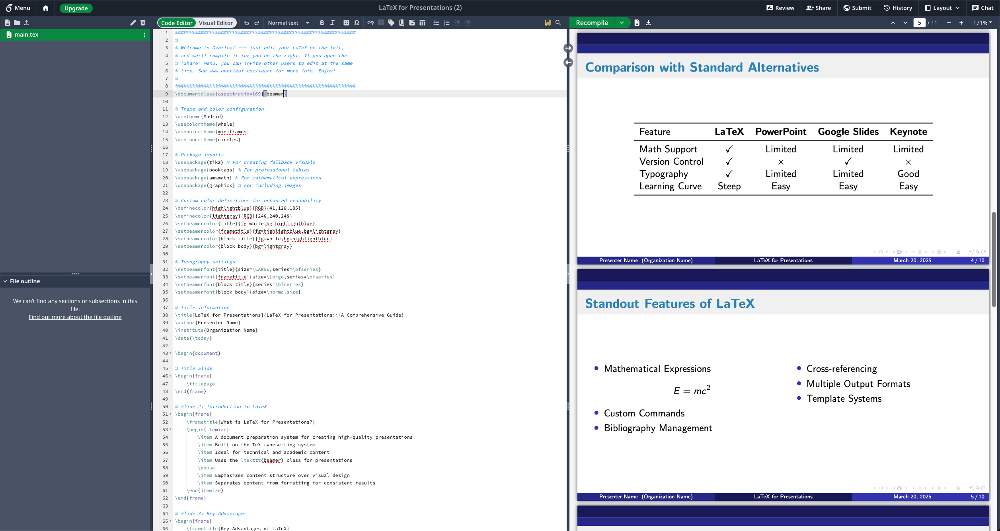
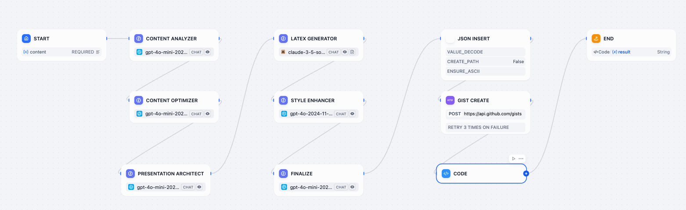

This blog post introduces an innovative and remarkably efficient workflow that seamlessly integrates the strengths of two powerful platforms: **Overleaf**, the leading collaborative LaTeX editor renowned for its academic focus and precision, and **Dify**, an open-source LLM application development platform designed to simplify the creation and deployment of AI-powered solutions. By strategically combining these tools, researchers can significantly streamline and elevate their academic presentation creation process.

## Overleaf - the collaborative, online LaTeX editor that anyone can use

**Overleaf** empowers users to create visually engaging presentations using LaTeX's Beamer class. Its popularity stems from providing simplified access to LaTeX through both visual and code editors, alongside an extensive library of professionally designed templates for academic presentations. Overleaf also facilitates seamless real-time collaboration with features like integrated commenting and in-document chat, and ensures reliable version control to track changes. Furthermore, its unrestricted cloud accessibility allows users to work on their presentations from any location or device. Ultimately, Overleaf ensures academic presentations benefit from LaTeX's impeccable formatting and adherence to rigorous academic standards.

## Dify - the AI ops platform

**Dify** is a robust and versatile open-source LLMOps platform designed to simplify and accelerate the development of AI-powered applications. It offers flexible LLM orchestration, allowing users to integrate with various leading LLMs, and features an intuitive visual workflow construction interface that requires no extensive coding. Dify also provides flexible customization options through custom tools and plugins, lowering the technical barrier for researchers to build powerful AI-driven pipelines for presentation creation.

## The AI-enhanced workflow: step-by-step

Here's how you can leverage the synergy between **Dify** and **Overleaf** to revolutionize your academic presentation creation process.

**Step 1: Content analysis with LLM**

* **Process:** Upload your research paper, notes, or manuscript into Dify. The platform extracts the raw text, and an LLM, guided by a precise prompt, identifies the most pertinent findings, key methodologies, and crucial conclusions.
* **Benefit:** Saves valuable research time by automating the initial sifting and summarization of your source material.

**Step 2: Content optimization with LLM**

* **Process:** The extracted information is fed into another LLM, prompted to adapt the content for a presentation format. This involves condensing paragraphs into bullet points, simplifying complex language, and highlighting key takeaways.
* **Benefit:** Ensures your research content is clear, concise, engaging, and tailored for a presentation audience.

**Step 3: Presentation argument generation with LLM**

* **Process:** The optimized content is then used by an LLM to generate a logical flow and overall structure for your presentation. This includes creating a detailed outline with sections, sub-sections, and a logical sequence of arguments.
* **Benefit:** Alleviates the challenging task of structural planning, allowing you to focus on content delivery.

**Step 4: LaTeX generation with LLM**

* **Process:** The finalized presentation outline is passed to an LLM specifically prompted to convert it into valid LaTeX code compatible with Overleaf's Beamer class. This includes generating commands for slides, titles, author information, sections, bullet points, and potentially equations and figures.
* **Benefit:** Saves significant time and reduces the likelihood of syntax errors associated with manual LaTeX coding.

**Step 5: LaTeX syntax enhancement with LLM (Optional)**

* **Process:** The generated LaTeX code is reviewed by another LLM to identify potential syntax errors, formatting inconsistencies, and deviations from best practices. The LLM provides suggestions for corrections and improvements.
* **Benefit:** Ensures robust, error-free LaTeX code that compiles cleanly and produces the intended visual output.

**Step 6: GitHub gist creation via API**

* **Process:** **Dify** automatically creates a new Gist on GitHub (either private or public) to store the complete LaTeX source code of your presentation. This requires configuring **Dify** with your GitHub authentication credentials.
* **Benefit:** Provides a secure and efficient intermediary step for transferring the LaTeX code to Overleaf, eliminating manual copying and pasting.

**Step 7: Publishing to Overleaf via API**

* **Process:** **Dify** instructs Overleaf to retrieve and import the LaTeX code directly from the newly created GitHub Gist using the Overleaf API. This automatically generates a new Overleaf project containing your presentation.
* **Benefit:** Delivers a truly seamless and end-to-end workflow, automating the final publishing stage and minimizing the potential for human error.

This integrated workflow offers several benefits to researchers. It enhances efficiency by automating tasks like content analysis and LaTeX generation, reduces manual effort by allowing researchers to focus on content rather than formatting, and improves presentation quality through LLM-driven clarity and logical flow. It also facilitates collaboration by making the LaTeX code readily available on Overleaf and increases accessibility to advanced AI capabilities through Dify's low-code interface.

## Conclusion

The integration of AI into academic workflows is rapidly evolving, offering exciting new possibilities for enhancing productivity and the quality of research communication. This workflow, leveraging the power of Overleaf and Dify, is a prime example of how researchers can embrace these advancements to streamline their presentation creation process. As AI technology continues to mature, we can expect even more sophisticated tools and integrations to emerge, further transforming how academics share their invaluable work. We encourage you to explore these platforms and experiment with AI-powered workflows to discover how they can revolutionize your own presentation creation journey.
