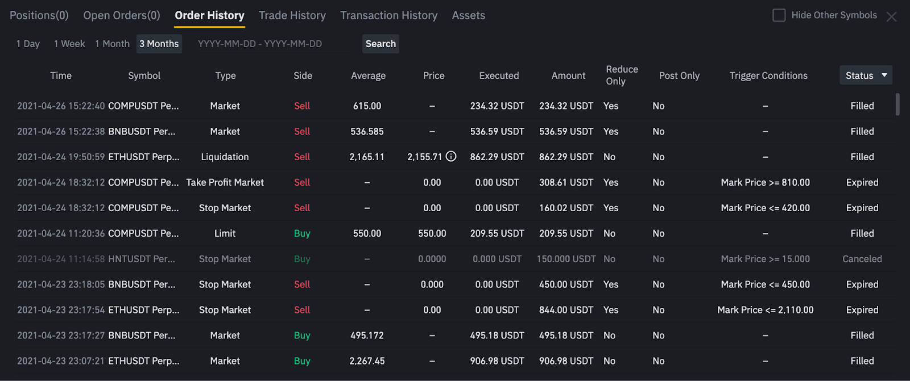
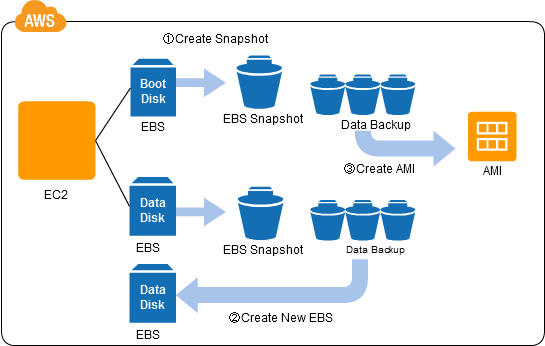
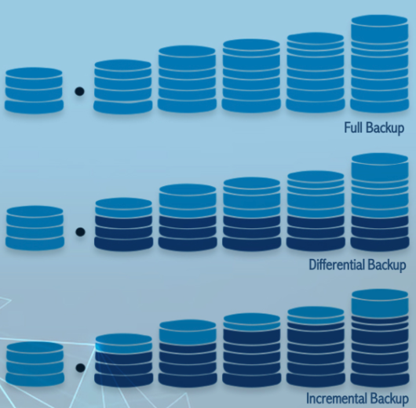

With the growth of financial models, transactional data has become larger and increasingly diverse. It includes a wide range of fields:

- Stock purchases and sales
- E-commerce site transaction history 
- Cryptocurrency purchases on the blockchain marketplace
- Manufacturer's materials orders

The common point is the requirement of reporting each time a phase is completed. For each specific period, the transactional data must be aggregated, computed, and analyzed to produce the final summary for the user. From this report, the user can gain insight, evaluate the cost in the previous period, estimate, and plan for the future.

The "report" and "summary" are the "historical data" that is mentioned in the title. This post is the strange yet familiar journey to remind the name of the techniques we use to "persist historical data" in our transactional system.

### Data persistence, why do we need to persist our historical data?
The longevity of data after the application or process that created it is done or crashed is the data persistence. Once data is persisted, each time the application is opened again, the same data is retrieved from the data storage, giving a seamless experience to the user no matter how much time has passed.

*Figure 1: Order history on the Binance, a popular trading marketplace. Each transaction is affected by the asset's price. If it is not persisted, it may wrong in the next query*

For example, in a cryptocurrency marketplace, as a normal user, once I make an order, a transaction is created with an amount of fee. By aggregating entire transactions in each month, a monthly report can be produced easily. In this way, I can reproduce the report of a specific month in the past without storing any additional things such as monthly reports.

But the marketplace is more than just normal transactions. Imagine, I am not a normal user, but a gold badge V.I.P. With this badge, I am discounted 20% of the fee on each transaction. One month later, because my total trading value increased spectacularly, I was promoted to the next V.I.P level with 50% of the fee on each transaction. At the end of this month, we still easily produce the current month's report with new applied discount. But when I click to see the previous month's report, it is wrong because the discount percentage has changed. It is the same as when we think about  "How can we produce the quarterly or yearly summary?". This is the reason why we need to convert transactional data to historical data and persist it cyclically.

The idea of long-time reports brings us to another question. Unlike a nascent market like cryptocurrencies, the stock market has hundreds of years of history. How much computing power is enough for us to analyze the market trend over 50 years? This question is another aspect that we will answer later.

### Snapshot pattern, data snapshot
A snapshot aka memento is normally mentioned as a complete copy of a dataset or system at a specific point in its life cycle. As a "photograph" of the data that represents its exact state at that moment. It is typically used in rolling back to the previous object's state once something goes wrong; running tests or analysis data in the production-like environment; or backup and preserving data for compliance or audit purposes. Data snapshot means the applying of snapshot pattern in the data processing. Depending on the use case, we choose proper strategy type of snapshot.

*Figure 2: AWS EBS snapshot mechanism showing how complete data states are captured and stored in S3 for recovery purposes*

These are 3 popular types of data snapshots. Firstly, the **full snapshot** copies all data in the system at a specific time. Because of its data integrity characteristic,  it is often used in backup and restore data before major upgrades, compliance audits that require the complete system state, or data warehouse periodic loads. 

In another scenario, when we don't want to snapshot the entire database but just the data that has changed since the last snapshot, we use **incremental snapshot**. This type of snapshot is typically used in monitoring systems, data reporting/summary, project documentation versioning, or database recovery.

*Figure 3: Visualization of the way each data snapshot strategy works when it is implemented to backup database*

The final type is the **differential snapshot**. As its name, this strategy stores all changes in the database since the original baseline snapshot. Its purpose is nearly similar to incremental snapshots. But they have a bit of difference. Let me make it more transparent with an example.

Imagine our system has implemented all 3 types of snapshot strategies: full snapshot each Monday, daily incremental snapshots, and daily differential snapshot. In this way, on the Tuesday, we have the following snapshot data:

- Full snapshot on Monday aka the weekly baseline snapshot
- Two snapshots that contain data generated on Monday and Tuesday separately that are produced by the incremental snapshots
- Two snapshots that are produced by the differential snapshots. First, keep the data for the Monday. Another keep data for both Monday and Tuesday. 

After Tuesday, a problem happens in the system that requires us to recover data. We can choose to use the incremental Tuesday snapshot to recover Tuesday's data or use the differential Tuesday snapshot to recover data for both Monday and Tuesday. It depends on the use case and your strategy.

## Use snapshot pattern to persist historical data
Back to the problem at the beginning of this post, we don't want to re-calculate our finance report which is affected by multiple factors over time, each time a user makes a new request. So we need to persist the summary to historical data. In simple words, it is the progress of collecting transactional data, aggregating and calculating the report for each period. Finally, we store these reports in the database as snapshot records.

You may think that this progress looks familiar to your experiences when developing applications in your career. And it does not relate to any strategy that is mentioned above. If you feel it, you are right but wrong. Firstly, it is actually a normal practice when developing this type of application. We implement this feature as a feasible part of our database. But rarely think about it seriously. Second, the next story is one of the cases in which we use **incremental snapshot** to persist our historical data. Lets go to our hypothetical problem.

### Hypothetic: simple cryptocurrency trading system
Imagine we are required to implement a simple cryptocurrency trading application. In this application, a user can open BUY orders to purchase supported assets. Once the order is opened, it finds SELL orders that match prices together to execute the transaction continuously until the entire amount of BUY orders is served. It is typically the order-matching engine. We will not discuss it here. The main point I want to mention is that we have a lot of transaction records under the hood once a transaction happens on the application. Besides, the transactions that result from trading, the transfers between accounts and some other types of fees can also affect the trading process. 

### Problem: the profit report is inconsistent over time
It is not a problem until the trade is considered completed. And users in the trading group begin sharing the profit. In a few first trade periods, it is still simple and easy to share because every user is a normal user, each type of fee is fixed. The system just only needs to sum the profit or loss and share it to users equally.

Over time, the new features are applied. Users are promoted to V.I.P with proper service discounts. And the amount of transactions becomes large. Each time a user requests to see the report, a large computing power is required. However, the result is not even true because the current user's V.I.P level is different from the time these transactions are executed.

### Solution: persist the trading history each time a trade is done
To address the above challenge, as I mentioned at the beginning of this part, we use the **incremental snapshot** to persist trading history and prevent the result from recalculation. In this way, we can ensure that reports accurately reflect the conditions that were in place at the time of the trade. 

This **incremental snapshot** does not just capture all additional data in the database from the previous trade period until now such as all orders, all fees, all transfers, and every profit and loss. It also aggregates all of these data into a few records and distributes them to proper snapshot tables in the database such as the `account_trade_sets` table that represents everything related to a completed trade like `opened_at`, `closed_at`, `profit_and_loss`, `total_fees`; or the `trade_set_sharing` table that contains profit sharing information to distribute proper profit to users in the same trading group.

Once this solution is implemented, our application can show the exact trading report of any trading period in the past without doing any calculations that lead to the wrong result.

### Beyond just correct the reporting process
You can be aware that this solution does not just correct the trading report but also helps to improve user experience by decreasing the response time. It is possible because all values are pre-calculated. So we do not need to calculate them again. It is evident. But having one more thing we may missed that is mentioned in the question mentioned in the first part.

> How much computing power is enough for us to analyze the market trend over 50 years? 

When applying the snapshot pattern to the application, we accidentally resolve another problem that looks similar to the above question. We can statement it as follows 

> "How can we export trading reports for a long period?"

Since snapshots store pre-calculated summaries for each trading period, generating long-term reports involves retrieving and consolidating these snapshots without recalculating historical data.

> "How can we monitor the accumulated profit and loss on the proper time series trading chart with minimum computing power?".

Instead of recalculating the sum of profit and loss from a massive volume of transactions for each point on the chart, we leverage snapshots. By summing the pre-aggregated values from all snapshots up to the desired point and combining them with the relevant transactions between the last snapshot's end time and the target point, we efficiently calculate the accumulated profit and loss with minimal computational effort. 

We can considered that we are using DB-lvl **memoization** incidentally. That is an optimization technique used in programming where the results of expensive function calls are stored in a cache. When the function is called again with the same inputs, the result is retrieved from the cache instead of recomputing it.

### Conclusions
The snapshot pattern is deceptively simple. This is the reason why it is often overlooked during development. We are often focus on solving immediate problems, implementing features without considering the long-term implications of recalculations and data inconsistency. The simplicity of this approach masks its power to address complex issues like historical data accuracy and computational efficiency.

It ensures accurate and consistent data, reduces computational overhead, and improves user experience by delivering faster query responses. Moreover, by persisting historical data, businesses gain a robust foundation for long-term analytics, such as trend analysis and strategic decision-making. It highlights the importance of viewing data as a long-term asset, requiring strategies like snapshots to ensure its reliability and usability over time.

Whether you are building financial applications, e-commerce platforms, or any system requiring accurate historical records, understanding and applying the snapshot pattern can elevate your application's performance and reliability.