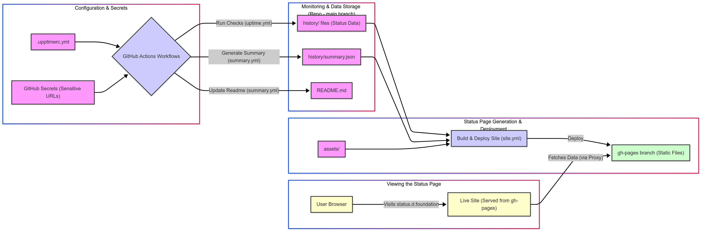

At Dwarves Foundation, ensuring our services are up and running is crucial. But how do you monitor *everything*, including internal tools and sensitive APIs, without exposing them to the world? This is the story of how we adopted Upptime, leveraging the power of GitHub Actions and Secrets to achieve comprehensive and secure uptime monitoring.

## Monitor public and private services

We needed a reliable way to monitor the uptime and performance of all our services, which included both public-facing services and internal services with sensitive endpoints. For public-facing services, such as our website and public APIs, transparency was crucial. Users rely on knowing if there's a disruption. On the other hand, internal services and sensitive endpoints, which include tools used by our team or APIs that should remain inaccessible to the public, had to be handled more discreetly. Directly exposing their status endpoints could lead to security vulnerabilities or invite unwanted attention.

**Why hide certain endpoints?**

*   **Security:** Many internal endpoints are not designed for public exposure. Hiding them reduces the potential attack surface.
*   **Privacy:** Some endpoints might reveal internal infrastructure details.
*   **Preventing noise:** Keeping internal endpoints out of public configuration prevents automated scanners and bots from hitting them unnecessarily.
*   **Complexity:** Some internal checks might require specific headers or authentication tokens that are best kept secret.

We needed a solution that could handle both scenarios: transparent monitoring for public services and secure, hidden monitoring for private ones.

## Using Upptime as a monitoring tool

We found our answer in [Upptime](https://upptime.js.org). It's an open-source uptime monitor and status page powered entirely by GitHub Actions, Issues, and Pages. The **GitOps approach** allows configuration to live in a Git repository, making changes trackable and collaborative. It's **cost-effective**, as it runs primarily on free GitHub Actions tiers, although we use self-hosted runners for more control. **Automation** is another benefit, with checks running automatically on a schedule. Additionally, **transparency** is enhanced as it generates a static status page easily deployable via GitHub Pages. Lastly, it excels in **secret management** by integrating seamlessly with GitHub Secrets.

## Configure `.upptimerc.yml` File

The heart of our Upptime setup is the `.upptimerc.yml` file in our `dwarvesf/upptime` repository:

```yaml
# Change these first
owner: dwarvesf # Our GitHub organization
repo: upptime # The repository hosting Upptime
user-agent: lmquang # A custom user agent for checks
runner: self-hosted # We use our own runners for reliability

# Add your sites here
sites:
  # Publicly visible services - URL is directly in the config
  - name: Public API
    url: https://public-api.domain./healthz

  # Sensitive internal services - URL is stored securely
  - name: My Secret API
    url: ${{ secrets.SECRET_API_URL }} # Magic! Reads from GitHub Secrets
  - name: Another Internal Tool
    url: ${{ secrets.INTERNAL_TOOL_HEALTH }}

assignees: # Assign issues to these folks on downtime
  - lmquang

status-website:
  publish: true # Yes, publish the status page
  # Custom domain pointing to the GitHub Pages site
  cname: status.d.foundation
  # Branding and messaging
  favicon: https:/storage.host/uploads/-/system/appearance/favicon/1/LogoD_1024.png
  logoUrl: https://storage.host/company-logo/32c5b772aec460924dbe0d60ce73f1c6.png
  name: Dwarves Foundation Status
  introMessage: This is the status page which uses **real-time** data from [Dwarves Foundation](https://dwarves.foundation) services. Internal services are monitored but not listed here.
  # navbar: ... (optional custom links)

i18n:
  footer: Powered by [Upptime](https://upptime.js.org)

# See https://upptime.js.org/docs/configuration for more options
```

**The Key:** Notice how `My Secret API` uses `url: ${{ secrets.SECRET_API_URL }}`. When the GitHub Actions workflow runs, it securely injects the actual URL from the repository's secrets settings. The sensitive URL *never* appears in the public configuration file.

## How GitHub Actions automation actually works

Upptime relies on a set of workflows defined in `.github/workflows/`:

1.  **`uptime.yml` (Runs every 5 mins):** This is the core checker. It fetches the site list from `.upptimerc.yml`, securely resolving any `${{ secrets.* }}` variables. It pings each URL, records the status (up/down) and response time, and commits this data to the `history/` directory. If a site is down, it automatically creates a GitHub Issue and assigns it.
2.  **`response-time.yml` & `summary.yml` (Run daily):** These workflows process the raw data in `history/`, calculating historical performance metrics and generating summary files (like `history/summary.json`). They also update the status badges in the `README.md`.
3.  **`site.yml` (Runs daily):** This workflow takes the processed data and builds the static HTML/CSS/JS status website. It then deploys this website to the `gh-pages` branch, making it live on `status.d.foundation`.




## A transparent (and secure) status page

Upon visiting `status.d.foundation`, your browser retrieves the static website constructed using `site.yml` from the `gh-pages` branch. The JavaScript code on the page directly fetches public status data, including `summary.json` and recent history, from the `dwarvesf/upptime` repository via GitHub’s raw file access or API. Subsequently, the page dynamically displays the status of our publicly available services.

Crucially, the status page *only* displays information about the services configured with public URLs in `.upptimerc.yml`. The sensitive endpoints, while monitored constantly by the `uptime.yml` workflow using secrets, are never exposed on the public status page or in the repository's version history.

This setup gives us the best of both worlds: transparent, real-time status updates for our public-facing services, and secure, automated monitoring for our internal infrastructure, all managed through a simple, code-based system.

