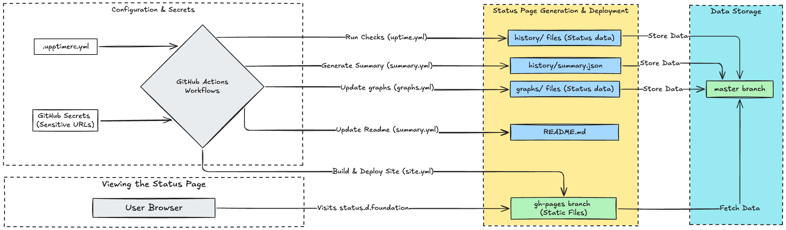

This document explains how Dwarves Foundation utilizes Upptime, hosted on GitHub Actions, to monitor service uptime while keeping sensitive endpoints secure.

## 1. Understanding `.upptimerc.yml` configuration

The `.upptimerc.yml` file is the primary configuration for Upptime. Here's a breakdown of the key settings in your repository (`dwarvesf/upptime`):

```yaml
# Change these first
owner: dwarvesf # Your GitHub username or organization
repo: upptime # Your GitHub repository name
user-agent: lmquang # Custom user agent for checks
runner: self-hosted # Using self-hosted GitHub Actions runners

# Add your sites here
sites:
  - name: Public API
    url: https://public-api.domain./healthz
  # Add sensitive sites using secrets (see section 2)
  - name: My Secret API
    url: ${{ secrets.SECRET_API_URL }}

assignees: # Users to assign downtime issues (optional)
  - lmquang

status-website:
  publish: true # Publish the status website
  # URL from which the status page fetches data (potentially via a proxy)
  # Custom domain for the status page
  cname: status.d.foundation
  # Cosmetic settings
  favicon: https:/storage.host/uploads/-/system/appearance/favicon/1/LogoD_1024.png
  logoUrl: https://storage.host/company-logo/32c5b772aec460924dbe0d60ce73f1c6.png
  name: Dwarves Foundation Status
  introMessage: This is status page which uses **real-time** data from [Dwarves Foundation](https://dwarves.foundation) services
  # navbar: ... (custom navigation links)

i18n:
  footer: Powered by [Upptime](https://upptime.js.org)

# See https://upptime.js.org/docs/configuration for more options
```

**Key points:**

*   `owner`/`repo`: Identifies the repository.
*   `sites`: Lists services to monitor. Public URLs can be listed directly.
*   `status-website`: Configures the generated static status page, including the custom domain (`status.d.foundation`).
*   `runner: self-hosted`: Indicates reliance on your own infrastructure for running checks.

## 2. GitHub actions workflow overview

Upptime uses several GitHub actions workflows (located in `.github/workflows/`) to automate monitoring and site generation:

*   **`uptime.yml` (Every 5 mins):** Checks endpoint status using URLs from `.upptimerc.yml` (resolving secrets). Commits results (up/down, latency) to individual files in the `history/` directory. Creates issues on downtime.
*   **`response-time.yml` (Daily):** Calculates historical response times from `history/` data and commits updates, likely for graph generation.
*   **`summary.yml` (Daily):** Aggregates uptime statistics into `history/summary.json` and updates the `README.md` with status badges.
*   **`site.yml` (Daily):** Builds the static status website using data from `history/` and assets from `assets/`. Deploys the built site to the `gh-pages` branch.
*   Other workflows (`graphs.yml`, `updates.yml`, etc.) handle auxiliary tasks like graph generation and template updates.

## 3. Workflow and data flow diagram



## 4. How the static status page gets data

1.  A user visits `status.d.foundation`.
2.  The browser loads the static HTML, CSS, and JavaScript from the `gh-pages` branch (served by GitHub Pages).
3.  The site's JavaScript needs uptime data (e.g., `summary.json`) to display status.
4.  It makes requests to the `https://api.github.com/` and `https://raw.githubusercontent.com/` endpoints to fetch the required data.
5.  The JavaScript parses the data and dynamically updates the status page.
