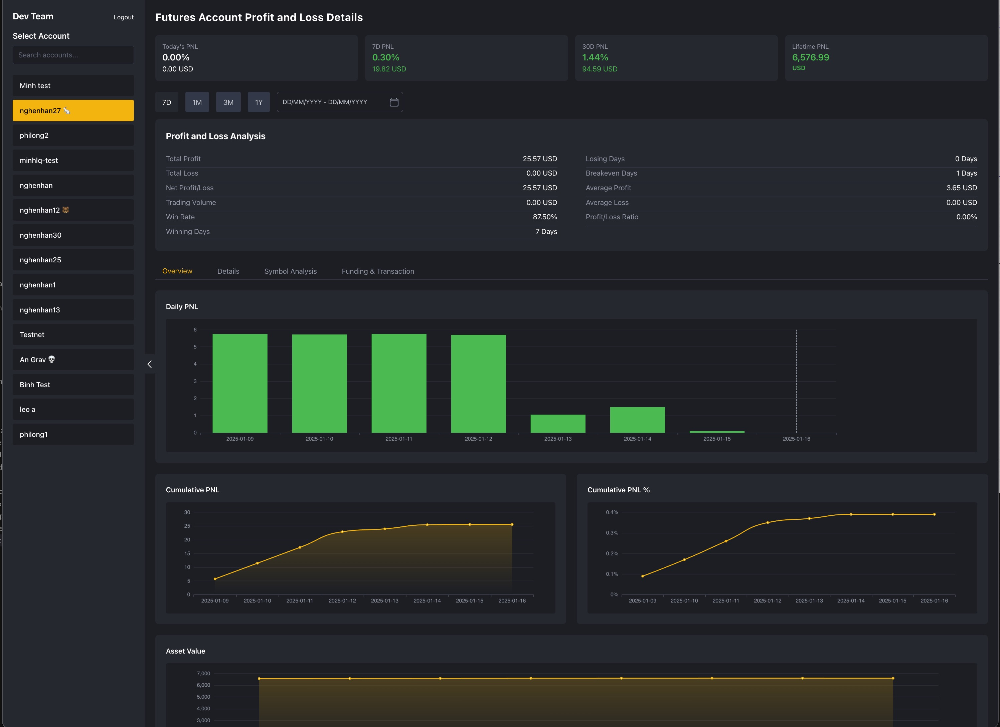

With our current tech stack, for every site we need 2 services, one for Frontend and one for Backend. It take more time and resources like developers, deployment, and increase request time between 2 services. So we decide to use Phoenix Live View which support realtime update  to increase development speed, simplified deployment. This article will show how we work with Phoenix Live View

## What is "Phoenix Live View"?

Phoenix LiveView is a powerful web framework feature, which allows developers to build rich, interactive web interfaces using primarily server-side Elixir code. It maintains a live connection between the browser and server, automatically synchronizing state changes and updating the DOM.

## What is Binance Future PNL Analysis page?
The PNL Analysis page is a crucial component of the Binance Futures Trading Analytics platform that provides traders with detailed insights into their trading performance.
It calculates and visualizes realized and unrealized profits/losses, win rates, and other key performance metrics.

## Why we use Phoenix Live View for Binance Future PNL Analysis page?

### Real-Time Data Handling
- Phoenix Live View has built-in Websocket management so we can update data realtime with price or position update
- Efficient handling of continuous data streams from Binance
- Automatic connection management and recovery

### Server-Side State Management
- Keeps sensitive trading data secure on the server
- Ensures calculation accuracy for PnL computations
- Prevents client-side manipulation of important data

### Complex Calculations
- Handles all PnL calculations server-side
- Better precision for financial calculations
- Centralized calculation logic

### Development Efficiency
- Single technology stack (Elixir)
- No need for separate frontend framework
- Simplified state management

## How do we implement?

### 1. Create live view for layout and contain all components inside

```elixir
defmodule AnalyticWeb.AnalyticLiveView do
  use AnalyticWeb, :live_view
  ...
  def render(assigns) do
    ~H"""
      <.layout>
        <div id="left-col">
          <.live_component
            module={SelectAccountComponent}
            id="account-select"
            user={@user}
            accounts={@accounts}
            selected_account={@selected_account}
          />
        </div>
        <div id="right-col">
          <.live_component
            module={TimeRangeSelectorComponent}
            id="time-range-select"
          />
          <.live_component
            module={AccountDetailComponent}
            id="account-select"
            user={@user}
            accounts={@accounts}
            selected_account={@selected_account}
          />
        </div>
      <./layout>
    """
  end
end
```

Add to router.ex
```elixir
defmodule AnalyticWeb.Router do
  ...
  scope "/", AnalyticWeb do
    pipe_through(:browser_authenticated)

    live("/", AnalyticLiveView, :home)
  end
end
```

### 2. Handle state changes between components

Phoenix live view and live component not only allow each component can manage state itself but also can publish event to other components via `send(pid, data)` then destination process can listen it by `handle_info(data, socket)`

```elixir

defmodule AnalyticWeb.LiveComponents.SelectAccountComponent do
  use AnalyticWeb, :live_component
  ...

  def handle_event("select-account", %{"account-id" => account_id}, socket) do
    send(self(), {:account_selected, account_id})
    {:noreply, assign(socket, :selected_account, account_id)}
  end
end

defmodule AnalyticWeb.AnalyticLiveView do
  use AnalyticWeb, :live_view
  ...

  def handle_info({:account_selected, account_id}, socket) do
    {:noreply, assign(socket, :selected_account, account_id)}
  end
end

```

### 3. Fetch data when state changed only

We allow components to fetch data only when they are mounted or when any state affecting this component changes, which helps reduce database query pressure when calculating with large data.

```elixir
defmodule AnalyticWeb.LiveComponents.Pnl.ProfitLossAnalysisComponent do
  use AnalyticWeb, :live_component

  def update(
        %{
          account_id: account_id,
          start_date: start_date,
          end_date: end_date
        },
        socket
      ) do
    account_pnl =
      case TsAccountPnlAnalysis.get_range_pnl_summary(account_id, start_date, end_date) do
        {:ok, pnl_data} -> pnl_data
        _ -> get_empty_pnl()
      end

    {:ok,
     socket
     |> assign(:account_pnl, account_pnl)
     |> assign(:loading, false)}
  end

  def render(assign) do
  ...
  end
end
```

## Result

*Binance Future PNL Analysis page screenshot*

## Conclusion

Phoenix LiveView helped us build the Binance Future PNL Analysis page faster and simpler. Instead of managing separate frontend and backend services, we now have a single Elixir codebase that handles real-time updates efficiently. Its component system and WebSocket management made it easy to build interactive features while keeping the code clean and maintainable.
Overall, this tech choice has worked well for our use case, saving development time and reducing deployment complexity.


