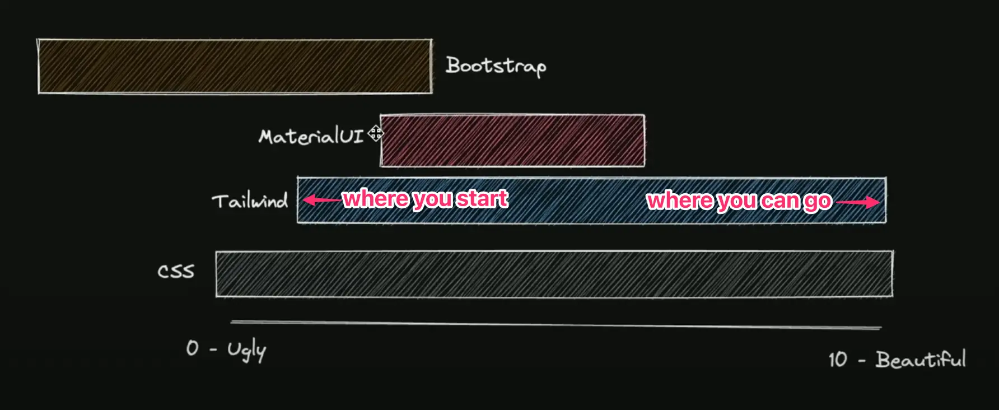

https://www.youtube.com/watch?v=CQuTF-bkOgc
tl;dr

three main categories that most UI libraries fall into
a/ pure:  pure css, no javascript/composite styling, what you write is what you get when compile  (tailwind, SASS), focus on **how they look**
b/ behavioral: pure javascript for a11y purpose, unstyled (no css at all) components to make them work the same across different browsers (headlessUI, radix, react-aria), in other words - focus on how they work
c/ style system: predefined components that are built upon a layer of pure css (tailwindUI, bootstrap, mantineUI, daisyUI), **opinionated a.k.a they (the library author) will mostly decide how their components look**  

the problem with bootstrap
*"wHy uSe tAiLwInD WhEn yOu aLrEaDy hAvE BoOtStRaP"*
- tailwind is not another bootstrap, a `justify-center` class maps exactly to 1 line of css code, you have total control over what is being shipped to the user, whereas a `.btn` class in bootstrap expands to +50 line of css styles and custom variables, you can customize it but it will not be a joyful experience.

the problem with MUI
-material ui is the hybrid version of (b) and (c) category: it has predefined components that look a certain way, it also has javascript underneath to handle all of its component interaction (datepicker, button, input, etc...) -> it gives you a decent head start but it also limits your ability to go far, once your reach the cap a.k.a "I want my component to look and behave sightly different then the one in example" then you start look for solution, tweaks, hacks, workarounds and find out that it will require a huge effort or even sometimes impossible.

TL;DR when in doubt use tailwind, if you're new to css it'll help you learn css faster, if you already know css it'll help you go faster **and** improve the quality of your component output.

@brain master 
#uilibraries

