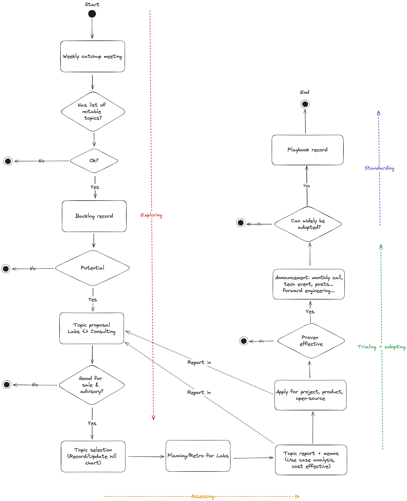

---
tags:
  - labs
  - process
title: Labs x Consulting Workflow
date: 2023-11-21
description: This workflow consolidates how new tech is introduced through the Labs team and how it gets processed to Consulting team to apply for projects and bring awareness of our tech expertise.
authors:
  - thanh
menu: labs
type: labs
hide_frontmatter: false
---

This workflow consolidates how new tech is introduced through the Labs team and how it gets processed to Consulting team to apply for projects and bring awareness of our tech expertise.

**Labs:**

- Be able to introduce new tech to help enrich our engineers’ expertise
- Be able to understand what tech is trending and how we can use them

**Consulting:**

- Be able understand landscape of tech expertise across engineers
- Be able to use our engineer’s tech expertise in helping to get new deals

**Operations:**

- Be able to understand our company’s journey on tech for our objective statements
- Be able to understand tech resources across the company

This workflow summarizes the **three recommended meetings** we must have to be able to take advantage of our engineer’s expertise:

1. **Weekly Catch-Up Meetings**: Conducted by the Labs team, these meetings focus on the progress of technology adoption, potentially including demos.
2. **Ranking and Feedback with Labs & Consulting Team**: A monthly joint meeting between Labs and Consulting teams to review tech adoption progress, suggest topics, and gather feedback.
3. **Planning/Retro for Labs**: Organized by the Labs team to reflect on past decisions, plan future reports, and publications for our community, like "Forward Engineering".

> To ensure these meetings are productive, it's vital to have a clear agenda outlining the topics and presenters. Participants should review the agenda in advance and prepare questions, fostering an environment of open discussion.

The timeline for the adoption of new technology typically spans approximately 45 days, though this can vary depending on the complexity and nature of the technology. Here's a general outline of the process:

