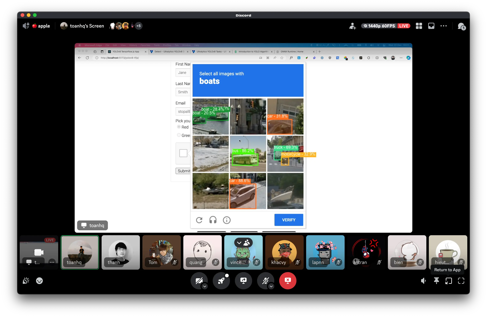
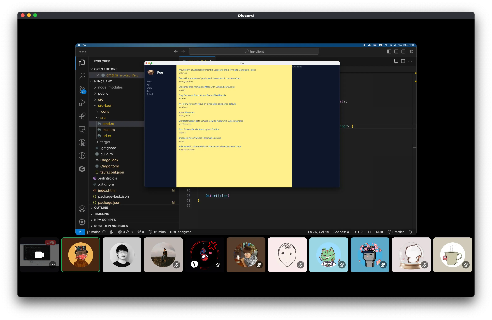

---
tags:
  - dwarves
  - work
  - internal
  - discussion
  - event
  - labs
  - catchup
  - rust
  - elixir
  - LLM
  - tauri
title: "Labs Weekly Catchup #3"
date: 2023-12-21
description: Our third weekly catchup. We organize an agenda the day beforehand and consolidate our findings, notable research progress, possibly new tech, insight or technique everyone should know.
authors:
  - monotykamary
event_date: 2023-12-13
---

| Event Date                                                                                                                                                                                                                                                                                                                                                                                                                                                                                                                                                                                                                                                                                                                                                                                                    | Discord Channel | Type     |
| ------------------------------------------------------------------------------------------------------------------------------------------------------------------------------------------------------------------------------------------------------------------------------------------------------------------------------------------------------------------------------------------------------------------------------------------------------------------------------------------------------------------------------------------------------------------------------------------------------------------------------------------------------------------------------------------------------------------------------------------------------------------------------------------------------------- | --------------- | -------- |
| 20/12/2023 | 🍎 apple   | Internal |

Our third weekly catchup. We organize an agenda the day beforehand and consolidate our findings, notable research progress, possibly new tech, insight or technique everyone should know.

### Agenda:
- Rise on chatbot alternatives, LibreChat to use OpenAI and custom LLMs by @Tom
- Bypass reCaptcha using self-hosted AI model by @Toan
- Shared query processing through DuckDB WASM by @Tom
- Build desktop app with Tauri by @Vy

### Output:
- Understand the research progress and passions of the labs team
- Understand any shortcomings or things to improve for the next weekly catchup

---

## Notes from the catchup
weekly meeting #3 - 20/12/2023:

🧠 **Rise on chatbot alternatives**
- @Tom Investigated a few chat UIs, like [LibreChat](https://docs.librechat.ai/) + [Ollama Web UI](https://github.com/ollama-webui/ollama-webui) to help simplify testing and personal usage and reduce costs from subscribing to ChatGPT

🔍 **Shared Query Processing through DuckDB WASM**
- @Tom demo'ed DuckDB over WASM to introduce use cases for infographics and real-time analytics
- @Tom's first demo uses DuckDB to process and convert data to readable arrays to pass to Observable Plot to plot the chart
	- 
- @Tom's second demo uses DuckDB inside Observable Notebooks to do real-time analytics inside the browser
	- 

🥽 **Bypassing reCaptcha using self-hosted AI model YoloV8**
- @Toan Demo'ed YoloV8 over Tensorflow.js, using WebGPU as the backend, to do object detection over recaptcha images
- 

🏗️ **Building Desktop apps with Tauri**
- @Vy introduced Tauri, an app construction toolkit to help deploy frontend applications over multiple platforms
- @Vy Demo'ed a simple Tauri app with React + Tailwind and will open source soon
	- 
- He also mentioned an app called Spacedrive is desktop app built with Tauri
	- 
- (Vy) RSPC is also an interesting typesafe router to build APIs in Rust for React or TypeScript frontends to call on it

---

💭 **Thoughts and actions for next week**
- @An + @Vincent Will have an action + repository for passwordless next week
- @Hieu wants to apply GenState and a few other tools in Elixir to help with scalability, next week will have a demo to improve the alarm on NgheNhan