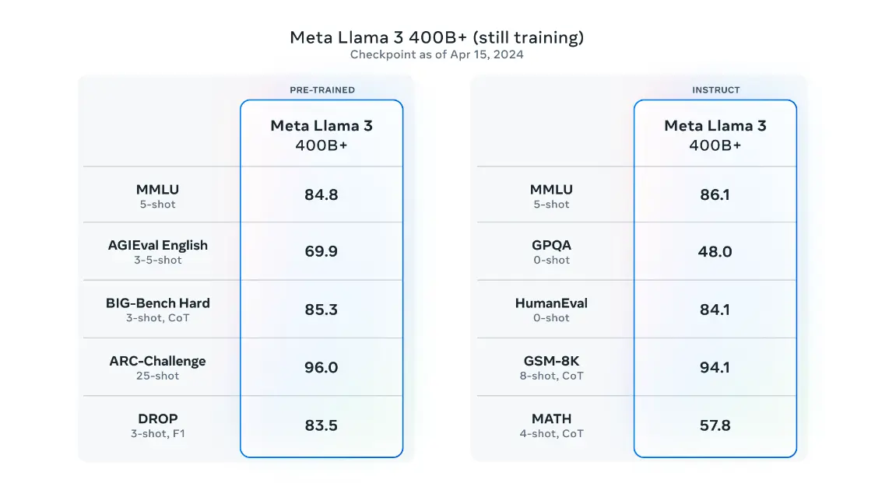

---
tags:
  - labs
  - market-report
  - AI
  - LLM
title: Market Report April 2024
date: 2024-04-01
description: In april’s market report, we explore the evolving landscape of Meta's Llama 3, LLM, the shirt to edge computing, the new Bun 1.1, the trend of copy-pates UI. 
authors: 
  - monotykamary
  - thanh
menu: labs
type: labs
hide_frontmatter: false
pinned: true
hide_title: false
---

## Key Takeaways
- Meta's Llama 3, Databricks' DBRX, and Mixtral 8x22B are setting new standards in AI capabilities, offering high-quality options for self-hosted LLM applications.
- Large Language Models (LLMs) are increasingly used to generate precise structured outputs like JSON and SQL, automating complex processes.
- The shift to edge computing in modern web architectures provides more cost-effective solutions for building the next generation of web applications.
- The new Bun 1.1 enhances stability and performance in the JavaScript ecosystem, making it ready for mass adoption in the developer community.
- The trend of copy-paste UI development allows developers to customize UI components fully while minimizing bootstrap time.

## LLM: Lightweight Models Dominate the Scene
This month, we've seen significant advancements in the release of open-source AI models with the introduction of **[Llama 3](https://llama.meta.com/llama3/)** by Meta. Available in 8B and 70B pretrained and instruction-tuned versions, Llama 3 is one of the current top open-source models, deployed across all major platforms, including cloud services.

**Databricks** has stepped up with **[DBRX](https://www.databricks.com/blog/introducing-dbrx-new-state-art-open-llm)**, a model that outperforms older versions like LLaMA2-70B, and Grok-1 in areas such as language understanding, programming, math, and logic. 

**[Mixtral 8x22B](https://mistral.ai/news/mixtral-8x22b/)** is another notable entry, offering multilingual support with a 64K tokens context window, robust mathematics, programming skills, and native function-calling capabilities.

We see companies increasingly able to integrate or develop their AI solutions as these technologies become more affordable. Concerns like data privacy or training costs can be addressed, although data safety remains a concern. Lightweight models are cheaper to refine and moderate, and we expect a surge in the advancement of self-hosted solutions for software and infrastructure to meet these needs.

## RAG advancement will focus on Retrieval processes
Retrieval Augmented Generation **(RAG)** systems are revolutionizing the use of large language models by integrating real-time, accurate external data into their responses. This method significantly reduces the incidence of inaccurate generations (hallucinations) and is crucial in contexts requiring high reliability.

We believe that RAG remains the most trustworthy method for providing up-to-date and rich context to LLMs. As RAG solutions have been developed and widely used in production AI applications, we think the next advancements in this architecture to focus on scaling and optimizing user experience. The emphasis will likely be on refining retrieval processes to manage the growing expanse of online information, including multimodal data integration, enhancing RAG's applicability across various domains.

*Taxonomy tree of RAG’s core techniques*

## Demand for Structured Data with LLM Models
The use of Large Language Models (LLMs) for generating structured outputs like JSON or SQL from natural language is becoming increasingly practical. These models are crucial for automating complex workflows and data pipelines, significantly enhancing productivity and reducing operational costs.

The well-defined method currently leading in reliably generating structured data is the architecture of Function Calling, pioneered by OpenAI. This approach is gradually being adopted by other AI models from Cohere, Mistral, and Google. For models not supporting this architecture, achieving reliable structured outputs is challenging due to the inherent variability in LLM responses. Therefore, we think there will be more advancements in outputting structured data, making it more accessible and reliable for various applications.

## The Shift to Edge Computing in Modern Web Architectures
Edge computing is enhancing performance by reducing latency between users and the data or compute resources they are accessing. Starting from the original static file caching in CDNs, it's now possible to run real-time operations in Edge Functions. Platforms like [Cloudflare](https://www.cloudflare.com/), [Fly.io](http://fly.io/), and [Vercel](https://vercel.com/) are at the forefront of simplifying edge computing for developers.

Rather than merely reacting to latency issues, solutions are increasingly being designed for the edge. For instance, authentication flows are often the first point to measure time-to-interactive metrics. Placing authentication services at the edge could be a primary step to consider.

Furthermore, building Serverless applications typically reduces infrastructure maintenance costs by eliminating the need to set up and maintain servers. With mature infrastructure services, this shift not only improves user experience but also offers cost efficiency and increased reliability.

### Migration to Bun
[Bun 1.1](https://bun.sh/blog/bun-v1.1) marks a significant upgrade in the JavaScript ecosystem, providing enhanced stability and compatibility with Node.js, especially on Windows platforms. Its performance benchmarks, such as package installation speeds surpassing those of Yarn and NPM, are compelling for developers seeking efficient development tools.

We anticipate more developers adopting Bun, initially as an alternative package management tool. Our tests in several projects show impressive speed improvements. However, one downside is that Bun's CLI is not as feature-rich as other tools like Yarn or PNPM, lacking functionalities such as interactive upgrade mode. Despite this, Bun is worth exploring for its potential benefits.

*Time spent installing dependencies in a vite react app using `--ignore-scripts` on Windows.*

### The Trend of Copy-Paste UI Development
When the copy-paste approach first emerged, led by [Shadcn](https://ui.shadcn.com/), we didn't think it could become a mainstream UI development method. This approach eliminates the need for downloadable component libraries. Developers can now directly integrate required UI components into their projects, offering unprecedented flexibility and customization.

We still think popular UI libraries like MUI and AntD have strong positions as they provide a wide range of ready-to-use components that cover most cases when building web applications. However, the cost of providing too many options makes these libraries heavy to use both in learning and especially in app performance. We've experienced that projects bootstrap with MUI have significantly longer build times compared to other lightweight solutions such as UI components built with Shadcn.

## References
- https://llama.meta.com/llama3/
- https://mistral.ai/news/mixtral-8x22b/
- https://www.databricks.com/blog/introducing-dbrx-new-state-art-open-llm
- [A Survey on Self-Evolution of Large Language Models](https://arxiv.org/abs/2404.14387)
- https://bun.sh/blog/bun-v1.1
- [A Survey on Retrieval-Augmented Text Generation for Large Language Models](https://arxiv.org/abs/2404.10981)
- https://foundationcapital.com/ai-service-as-software
- [How faithful are RAG models? Quantifying the tug-of-war between RAG and LLMs' internal prior](https://arxiv.org/abs/2404.10198)
- [Reducing hallucination in structured outputs via Retrieval-Augmented Generation](https://arxiv.org/abs/2404.08189)
- https://ui.shadcn.com/docs/changelog#april-2024---introducing-lift-mode
- https://www.infoq.com/articles/architecture-trends-2024/