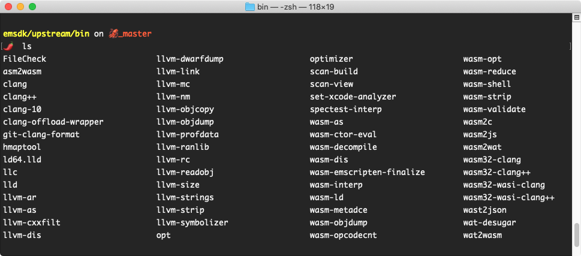

If you haven’t heard of WebAssembly yet, then you will soon. It’s one of the industry’s best-kept secrets, but it’s everywhere. It’s supported by all the major browsers, and it’s coming to the server-side, too. It’s fast. It’s being used for gaming. It’s an open standard from the World Wide Web Consortium (W3C), the main international standards organization for the web.

## Format Definition
WebAssembly (abbreviated Wasm) is a **binary instruction format** for a stack-based virtual machine. Wasm is designed as a portable target for compilation of high-level languages like C/C++/Rust, enabling deployment on the web for client and server applications.

## Why WebAssembly?
### Recall of Assembly
In the old days, when you had to work on a computer to do something like for example, add two numbers and print the result, you had to write instructions in the binary language. These instructions were specific to an architecture of a processor like the 8086 microprocessor or x86 processor. These binary instructions are collectively called the machine code. However, writing machine code with bare hands was a tedious and error-prone task. Also, reading a machine code was at times impossible.

Hence, the text-based Assembly language was created. This **Assembly language was human-readable and one could easily program or read the Assembly language**. To convert the Assembly code into machine code, a compiler AKA assembler is used (along with the linker). **Assembly language is the lowest form of abstraction over machine code since it directly compiles to the machine code of the given processor architecture.**

Other compiled languages like C or C++ also compile to machine code, however, these languages are processor agnostic. This means the compiler used by these languages does the actual job of compilation to machine code.

However, these languages don’t always guarantee the performance similar to the Assembly language because as the program grows larger and many program files are involved, the compiler has to make predictions on how to best compile the program.

Hence, the machine code generated from these languages may not be very optimized and may run slower. This also means, no language like C or C++ gets close to generating a very optimized machine code like the Assembly language can do.

### What WebAssembly actually is
The term **WebAssembly (AKA Wasm)** is inspired by the Assembly language since it is the lowest form of text-based human-readable language which generates very optimized and blazing fast programs in machine code.

What WebAssembly is trying to achieve is **to create a language that can run as fast as possible, closer to Assembly speeds but on the Web. Even though WebAssembly is a language in itself, its main intention is to create a toolchain for other programming languages like C, C++, Rust, etc. to compile directly to WebAssembly**. This way, web programmers can write programs in the language of their choice and run inside a browser. But as we know, only JavaScript language can be understood by the web browsers and JavaScript is not so popular when it comes to speed, then how WebAssembly is going to run inside a browser and speed things up?

### What about Javascript?
JavaScript is an **interpreted language**. This means we do not have to compile the JavaScript source code before sending it to the browser. An interpreter can take the raw JavaScript code and run it for you.

JavaScript is also a **dynamically typed language**, unlike C and C++. This means variables declared using var can store any type of data type like int, string, boolean and also complex data types like object and array. **The lack of type system is what makes JavaScript slow to run**. A statically typed language can produce a much efficient machine code because of the information it has about the data like its type and size.

**So whenever you think, a statically typed language like C or C++ is making your life a living hell for no reason, think about the performance.**

### Historical reason of poor performance in Javascript
You might ask, why JavaScript was designed this way if it is so poor when it comes to speed? For that, we need to understand its history.

In the initial days of Web, web browsers were used to display static pages. Normally these pages were non-interactive. **To add some interaction**, a new language was introduced in the Netscape browser back in 1995 by Brendan Eich. This new language was **JavaScript (previously called the LiveScript) and it took 10 days for him to design it.**

Knowing that Java was a rich, complex, compiled language aimed at professional programmers, Netscape and others also wanted a lightweight interpreted language to complement Java. This language would need to appeal to nonprofessional programmers much like Microsoft's Visual Basic and interpretable for easy embedding in webpages

>
> If I had done classes in JavaScript back in May 1995, I would have been told that it was too much like Java or that JavaScript was competing with Java … I was under marketing orders to make it look like Java but not make it too big for its britches … [it] needed to be a silly little brother language.

**Nothing good can come out of 10 days but for 10 days worth of effort, JavaScript was a marvel**. Other languages and plugins like ActionScript, Silverlight, and Flash came along but **JavaScript won the battle.**

JavaScript was not designed by considering the performance in mind. It had to just work inside a browser and provide API to work with DOM. But since many browsers tried to adopt it in their own way, it had to be standardized.

**Ecma International is the standards organization that standardizes JavaScript and the Technical Committee 39 (TC39) manages this standard**. This standard is known as EcmaScript and the EcmaScript phrase is also used interchangeably with JavaScript since JavaScript trademark is owned by Oracle Corporation.

### How does Javascript work?
**EcmaScript specification tells how JavaScript should be implemented by the browser so that a JavaScript program runs exactly the same in all the browsers, but it does not tell how JavaScript should run inside these browsers. It is up to the browser vendor to decide.**

Every browser provides a JavaScript engine that runs the JavaScript code. The Netscape browser used the SpiderMonkey JavaScript engine. This engine was a rudimentary interpreter with no optimizations. Running the JavaScript code with this engine was slow but it worked.

As you can see from the diagram above, the job of the first JavaScript engine was to take the JavaScript source code and compile it to the binary instructions (machine code) that a CPU can understand.

A rudimentary JavaScript engine contains a baseline compiler whose job is to compile JavaScript source code into an intermediate representation (IR) which is also called the bytecode and feeds this bytecode to the interpreter. The interpreter takes this bytecode and converts to the machine code which is eventually run on the machine’s hardware (CPU).

This is *just like how Java works but the bytecode generation is done by the programmer and bytecode is shared universally rather than the source code*.

A baseline compiler’s job is to compile code as fast as possible and generate less-optimized bytecode (or machine code in other cases). **Since the interpreter has an unoptimized bytecode to work with, the application speed will be slow, however, the application bootstrap time will be very less.**

>
> *SpiderMoney JavaScript has evolved into a piece of complex machinery to produce highly optimized machine code and currently used in the Firefox browser. You can follow this documentation for the source code.*

When it comes to a **highly dynamic and interactive web application,** the user experience is very poor with this model of JavaScript execution. This problem was faced by **Google’s Chrome browser while displaying Google Maps on the web**. To increase the JavaScript performance on the web, they had to come up with a better approach. Google Chrome from the early days uses the **V8 JavaScript engine.** In the beginning, to improve the JavaScript performance, they added two pieces in their JavaScript engine pipeline as shown below.

In the 2010 version of the V8 JavaScript engine, there were two main pieces of machinery that did the heavy lifting for the engine. The full-codegen was the **baseline compiler** whose job was to **spit out unoptimized machine code as fast as possible for faster application bootstrap.** As the application was running, the **crankshaft compiler** would **kick in and optimize the source code and replace the parts of the machine code generated by the baseline compiler**. This optimization would result in better application performance as better and better machine code is generated. *However, this process comes with the cost of large CPU overhead and memory consumption. Hence V8 has to come up with another model.*

The above version of the JavaScript engine does not contain an interpreter. **This is a JIT (Just-In-Time) compilation model** as code is compiled to the machine level on the fly and later optimized, also to the machine code.

## How JavaScript is optimized?
There are various criteria for optimizing JavaScript code. Before JavaScript code is passed to the interpreter or baseline compiler, it has to first get parsed into an Abstract Syntax Tree (AST) which is a tree-like structure of the code.

*When we run a JavaScript application, we do not need all the code at the application startup time*. For example, if we have a function that is called on the user action, like a button click, that code can be parsed later.

Identifying things that need to be parsed immediately and generating machine code is the best strategy for faster application bootstrap. Sometimes, JavaScript code contains unnecessary complex logic that can be simplified. For example, a `for` to increment an integer can be inlined using `+` operations n number of times. This process is called Loop unrolling. Similar optimizations can be made using function inlining.

**The lack of type system in JavaScript is what makes JavaScript engine produce less optimized machine code.** Hence, based on already defined values, a JavaScript engine can guess the data types of the variables and generate better machine code.

Meanwhile, what JavaScript engine can also do is **gather profiling data of the code execution and look for the code that runs slower.** This code is called **the “Hot” code** perhaps because it burns the CPU. This code can be further optimized and replaced with an optimized machine code. Considering these things in mind and other problems caused by full-codegen and crankshaft, the V8 team created a new version of the V8 engine from the ground up. This new version of the JavaScript engine was released in 2017.

As you can see from the above figure, the V8 team introduced a new interpreter pipeline Ignition whose job was to generate the bytecode from the JavaScript source code using a baseline compiler and later interpret that bytecode using an interpreter.

The **TurboFan optimization compiler can optimize this bytecode in the background** (in separate threads) as the application is running and generate a very optimized machine code that will be replaced eventually. Turbofan receives the profiling data from the Ignition interpreter and looks for the code that is Hot. **It can make the guesses on how to optimize the code better (by guessing the data types) and optimize or de-optimize the code**.

## The invention of asm.js
So far we have understood that a lot of throughs, efforts and money have been put into developing JavaScript engines to cope up with complex JavaScript applications and somehow, make it faster.

When everybody was working hard to develop faster JavaScript engines, a team at Mozilla went off the books. Back in 2013, they created a subset of JavaScripti which has the feature of statically typed language and manual memory management. They called it the asm.js.

```javascript
function add (a, b) {return a + b}
```

The add function takes two values and returns the concatenated value (sum). When we want to generate a highly optimized machine code, we need the data type of the variable arguments a and b. However, we don’t have that in JavaScript.

Even if had to make guess, we can’t be sure. *Because a and b can be integers or strings or a mix of both. But let’s say, we were expecting only 32-bit integers, how possibly we can inform this to a JavaScript engine?*

This is where asm.js specifications come into the picture

```javascript
function add(a, b) {
a = a|0;
b = b|0;
return (a + b) |0;
}
```

In the modified code above, we are overriding `a` and `b` with the value of `a` and `b` value respectively but with a binary or condition. What this would do is to convert the values of `a and b int 32-bit integers`.

The asm.js specification specifies *only 3 types* that you can use in your JavaScript code, `the 32-bit integer`, and `the 32-bit` & `64-bit floating-point numbers`. This makes your code easy to compile with high precision.

However, how this code is compiled and converted to machine code depends on the JavaScript engine behind the scenes. The first support of asm.js came in the SpiderMonkey engine of the Firefox browser.

If our JavaScript code contains `"use asm";` annotation and the JavaScript code has been written according to asm.js specifications, SpiderMonkey could efficiently convert the JavaScript code into optimized machine code.

After the successful proof-of-concept demonstration by the Mozilla team, other browser vendors like Chrome and Edge rolled out support for the asm.js specifications. Applications written in asm.js were relatively faster than their counterparts written in normal JavaScript.

Apart from a virtual type system, asm.js specification tells us to write our JavaScript code inside a function called as a module. We need to **instantiate this module by providing an ArrayBuffer which acts like a heap memory.** **By abstracting the memory of our module from the memory of the main JavaScript thread**, we don’t have the necessary overhead of dynamic memory management and garbage collection provided by the JavaScript engines. Let’s write a sample asm.js module by hand.

But first, let's understand the asm.js module structure

```javascript
function MyAsmModule (stdlib, foreign, heap) {
	"use asm";

	// module body...
	return {
		export1: f1,
		export2: f2,
		// ...
	};
}
```

From the example above, `MyAsmModule` function is the `asm.js` module that we will *instantiate later*. Let’s understand the arguments to this function and return value.

- The `stdlib` argument is an object that contains standard JavaScript libraries accepted in asm.js specifications (listed here).
- The `foreign` object contains references to the external JavaScript functions that our module depends on, also called the foreign function interface (FFI).
- The `heap` argument is the raw ArrayBuffer which will be used as a heap for memory storage optionally required by the module.

In the end, our asm.js module has to export some functions which will be consumed by a JavaScript program. Let’s use the add function as one of the exports of our asm.js module and instantiate with a *1kb heap memory.*

```javascript
function Calc(stdlib, foreign, heap) {
	"use asm";
	function add(a, b) {
		a = a|0;
		b = b|0;
		return (a + b) |0;
	}
return {
	add: add
	};
}

var stdlib = null;
var foreign = null;
var heap = new ArrayBuffer(1000); // 1kb

// create module instance
var calc = Calc(stdlib. foreign, heap );

// call `add` function
var result = calc.add( 1, 2 );
console.log( result );
 
```

In the above example, we are telling the JavaScript engine that *we want to run this JavaScript code as asm.js module with the help of* `"use asm";` annotation. We have also provided data types of the function parameters and return value. This works just fine, as you can see the result in the console.

However, even though you can write asm.js modules by hand, *it is not feasible for large scale projects*. But, *there are some toolchains available to compile programs* written in a statically typed language to asm.js. For example, the add function can be compiled from this C code.

```javascript
int add( int a, int b ) {
	return a + b;
}
```

## How asm.js code Runs Faster
If a **browser’s JavaScript engine** is capable of understanding asm.js code, then it will **treat asm.js JavaScript differently** than other normal JavaScript code.

The first thing it will do is **compile JavaScript code to machine code with high precision since the** `asm.js` code contains type information beforehand. The machine code generated from the asm.js code is close to the Assembly machine code.

Also, it will **keep heap of the asm.js module different from the main JavaScript thread since it does not need garbage collection and tracking**. Since an `asm.js` module manages its memory manually, the overall performance of the code will be better than code that needs dynamic memory allocations and management. Even after with such convincing reasons, *`asm.js` specifications were never standardized` and it needed a fresher perspective. This is **where WebAssembly comes in and solves the problems of asm.js.**

*The asm.js specifications are not standardized and it is obsoleted by WebAssembly.*

### The Inception of WebAssembly
`asm.js` was a successful experiment *but writing optimized JavaScript code by hand was tough and error-prone*. There are *no standard build-toolchains to convert your JavaScript code into* `asm`.js, because it’s not an easy road either.

On the other hand, `asm.js` code *adds extra complexity in the application* and may at times, *the optimized JavaScript code size is larger than the unoptimized one*, making it harder to transfer over the network.

Considering these things in mind, `asm.js` needed an overhaul. This optimized code that a JavaScript engine can run should be as light as possible. Also, *it needed to be standardized* so that all the browsers can support it. To address these issues, `the Minimal Viable Product (MVP) development of WebAssembly started as a collaborative effort between Mozilla, Google, and other teams around 2015.`

In this effort, the first blueprint of WebAssembly was conceptualized. **WebAssembly is a binary format of instructions just like a machine code but for a stack machine.**

**What is a stack machine?**

A `stack machine`, unlike a `register machine`, works with a `stack`. A stack is a data structure to store some data in linear order. You can push a value on the stack and it will go on the top of the previous value in the stack. However, you can not pull a value from anywhere. You can only pop or pull the value that is on the top of the stack.

You can compare the stack with a stack of plates. You can put a plate on the top and only take out (pull) it from the top. Hence `stack is last-in, first-out (LIFO)` data structure. You can visualize it from the diagram below.

A `stack machine` is a **virtual machine (like a processor)** that `takes one instruction at a time and pushes it on the stack`. When an operation is needed to be performed, it will pop values from the stack and compute the result. Let’s take a simple example of addition. When we want to compute the `sum` of two integers `A` and `B`, we need to write the below instructions.

NoneBashCSSCC#HTMLJavaJavaScriptJSONPHPPowershellPythonRubyTypeScriptCopy

```
push A
push B
add
```

These first two instructions will instruct a stack machine to push A and B values on the stack and the last add instruction will pop two values from the stack and perform addition. Once the addition is performed, the stack machine will push the result C back in the stack.

Even though WebAssembly is written for a stack machine,how WebAssembly code is interpreted by JavaSctipt engines is up to the engine itself to decide.

### WebAssembly Instructions Set and Data Types

Since WebAssembly is a `stack machine`, it *needed a standard for its instructions and data types* it can work with. `WebAssembly` is an open standard and not related to JavaScript at all.

But since it is intended to work on the Web, `W3C` maintains its standard and you can find it here. However, `WebAssembly` also has its own independent website that contains the standard specifications, explanations, release notes, and other important information.

`WebAssembly`, at the moment, works with only 4 data types, viz. `32-bit` & `64-bit integers` and `32-bit & 64-bit floating-point` numbers. You can find binary instructions for a WebAssembly stack machine [here](https://webassembly.github.io/spec/core/binary/index.html).

**WebAssembly vs asm.js**

`WebAssembly` is **heavily inspired by** `asm.js` specifications. At the moment, `WebAssembly` works just like `asm.js` would *but with an independent and standardized instructions-set as well as wider browser support.*

Since `WebAssembly` is based on `asm.js` specifications, it is even possible to compile WebAssembly code to asm.js JavaScript code with a set of tools.

Like `asm.js`, a `WebAssembly` program is also a module which needs to be instantiated. It also takes imports like `stdlib` and `heap memory` and exports function that can be used by a program.

**WebAssembly File Formats**

Since `WebAssebly file` is a `binary file` of standard WebAssembly instruction, it is *not meant to be written by hand, just like machine code*. Instead, **it should be compiled from programs** written in the language of your choice.

Hence, along with WebAssembly specifications, the team working on WebAssembly also had to come up with a set of standard tools to compile code written in a programming language like `C`, `C++` or `Rust` which support `static typing` and `manual memory management` into WebAssembly.

A `WebAssembly` file generally ends with `.wasm` and it **contains the binary instructions as well as data (memory) generated during compilation**. This data will be *available in the heap of the running* `WebAssembly` program, just like how an asm.js module works. Since **reading a** `WebAssembly binary format` (file) can be difficult, `WebAssembly` also supports a **Text Format** called **Wat** that can be read by us humans. You can find the specifications of that from [here](https://webassembly.github.io/spec/core/text/index.html).

This text file with human-readable instructions has a **symbiotic relationship** with the format of the binary instructions. These text-based instructions are written in **S-expressions**. A `WebAssembly Text Format` file ends with `.wat` extension which stands for `WebAssembly Text`.

## Key concepts
There are several key concepts needed to understand how WebAssembly runs in the browser. All of these concepts are **reflected 1:1** in the `WebAssembly JavaScript API`.

1. `Module`: Represents a **WebAssembly binary that has been compiled by the browser into executable machine code**. A Module is stateless and thus, like a Blob, can be explicitly shared between windows and workers (via postMessage()). A Module declares imports and exports just like an `ES2015module`.
2. `Memory`: A **resizable ArrayBuffer** that contains the **linear array of bytes read and written** by WebAssembly’s low-level memory access instructions.
3. `Table`: A **resizable typed array of references** (e.g. to functions) that could not otherwise be stored as raw bytes in Memory (for safety and portability reasons).
4. `Instance`: A **Module paired with all the state it uses at runtime** including a *Memory, Table, and set of imported values*. An Instance is like an `ES2015` module that has been loaded into a particular global with a particular set of imports.

The JavaScript API provides developers with the **ability to create modules, memories, tables, and instances**. Given a WebAssembly instance, JavaScript code can synchronously call its exports, which are exposed as normal JavaScript functions. Arbitrary JavaScript functions can also be synchronously called by WebAssembly code by passing in those JavaScript functions as the imports to a WebAssembly instance.

Since JavaScript has complete control over how WebAssembly code is downloaded, compiled and run, JavaScript developers could even think of WebAssembly as just a JavaScript feature for efficiently generating high-performance functions

## How WebAssembly works?
Every browser has a `JavaScript engine` which runs JavaScript. It has multiple parts that do the processing and optimization of our JavaScript code. It can also understand `asm.js` JavaScript code and generate an optimized machine code that can run super fast.

How it can run WebAssembly binary instructions? For that, browsers have introduced a **new baseline compiler to compile** `WebAssembly` to a `bytecode` that `JavaScript interpreter` can understand. Let’s look at what `V8` does.

In 2018, V8 integrated Liftoff, their WebAssembly baseline compiler whose job is to compile WebAssembly into an unoptimized bytecode as quick as possible. This bytecode is different from the bytecode generated by the baseline compiler in the Ignition and it is meant to be read by TurboFan.

This `bytecode` is then **fed** to `TurboFan` which does the **optimization on the code as quickly as possible and generates the highly optimized machine code** that can be run closer to near-native speeds.

`SpiderMonkey JavaScript` follows the same approach but it uses the `Cranelift` baseline compiler for `WebAssembly`. You can follow [this document](https://github.com/bytecodealliance/cranelift/blob/master/spidermonkey.md) to see how Cranelift fits in the SpiderMonkey engine.

## Common misconceptions about WebAssembly
1. `WebAssembly` *runs inside its own separate* `Virtual Machine (VM)`. **No, it does not**. At least not inside the browser. **WebAssembly and JavaScript, both shares the same runtime.**
2. `WebAssemply` runs inside a *separate thread*. **No, it runs on the same JavaScript execution thread.**
3. `WebAssembly` *directly runs on the processor*. **No, it does not.** As we have seen so far, `WebAssembly` is a platform-agnostic standard. It has to go through a baseline compilation step inside the JavaScript engine.

### How to run WebAssembly code?
Since **WebAssembly is not JavaScript**, there must be a mechanism to instruct the JavaScript engine to run WebAssembly code. Gladly, **the JavaScript engine exposes WebAssembly interface globally** (and in web workers) through which we can run a WebAssembly module.

You can find Web API specification from W3C [documentation here](https://www.w3.org/TR/2019/REC-wasm-web-api-1-20191205/#streaming-modules) as well as JavaScript interface [specifications here](https://www.w3.org/TR/2019/REC-wasm-js-api-1-20191205/). However, you should follow this [MDN documentation](https://developer.mozilla.org/en-US/docs/Web/JavaScript/Reference/Global_Objects/WebAssembly) for a detailed explanation of this interface.

For example, if we have a WebAssembly module `calc.wasm` and we want to run this module in a JavaScript engine, we need to follow these steps.

1. **Load a WebAssembly module over the network** using fetch API or any other AJAX API of your choice. This network *response contains the binary instructions* of the WebAssembly module.
2. Using WebAssembly JavaScript interface, **compile the WebAssebly module from the binary instructions** (network response).
3. **Instantiate this module by providing imports** `(stdlib)` and `heap memory size`. This instance of the WebAssembly module contains exports that we can use in the JavaScript programming environment.

You can see these steps in action in the following program.

NoneBashCSSCC#HTMLJavaJavaScriptJSONPHPPowershellPythonRubyTypeScriptCopy

```
etch( '/calc.wasm' ).then( ( response ) => {
  return response.arrayBuffer(); // convert stream to ArrayBuffer
} ).then( ( wasmBuffer ) => {
  return WebAssembly.instantiate( wasmBuffer ); // compile and instantiate WASM module
} ).then( ( { instance, module } ) => {
  console.log( instance.exports.add( 1, 2 ) ); // 3
} );
```

In the above example, we have **fetched the** `calc.wasm` file from the server using fetch Web API and **converted the response stream to binary buffer**. This buffer contains the binary code of our WebAssembly module.

Using `WebAssmbly.instantiate()` function, we **compiled and instantiated the WebAssembly module** in just one step. This returns a promise which resolves with the WebAssembly module and instance.

*You can compile a WebAssembly module without instantiating it using WebAssembly.compile() method.*

The **WebAssembly instance contains the** `heap` and `exports` properties. The exports object contains the **list of functions our WebAssembly modules have exported and we can call them like regular JavaScript functions.**

These `exported functions` are **compiled to machine code** and since they were written in WebAssembly, their machine code is very fast. Hence when we call these functions, they perform very well, some close to **near-native speeds.**

## Compile to WebAssembly
The main motivation behind the inception of WebAssembly was to create a language that modern JavaScript engines can understand and run programs to near-native speeds.

But it also had the **vision to create a toolchain** so that a **non-JavaScript programmer can write a program in his/her favorite language** (well not all the languages) and **run it on the Web.** So the question remains, how we can compile a program written in `C` or `C++` and to a `.wasm` module? For that, we need to understand the `LLVM toolchain`.

### What is LLVM?
The `LLVM` (abbreviation for `Low-Level Virtual Machine`) is a **set of compilers and a toolchain** used to **convert a program written in any programming language** to a variety of **build targets.**

The main vision of `LLVM` is to **compile programs written in any language into literally anything**. For that, LLVM has a modular structure of frontends and backends as explained in the above diagram.

A `frontend module` designed for a specific language **takes the source code of that language and compiles to an intermediate bytecode that LLVM can understand**. This bytecode is called `LLVM Intermediate Representation (IR)`.

A `backend module` **takes this bytecode and converts it to a specific build target** that can either run on a system or is a program in a completely different language itself.

Using `LLVM`, `Kotlin` can be compiled to `Java` bytecode and `Rust can be compiled to **multiple build targets**. If we combine different frontend and backend modules, we can generate pretty much anything.

### Official WebAssembly Toolchain
To abstract users from getting into the trouble of the `LLVM toolchain`, `Emscripten` toolchain was created as a **collaborative effort between different WebAssembly teams**.

This toolchain **contains the** `LLVM` core and the `fastcomp` backend module to generate WebAssembly code. However, it **can only** compile `C` and `C++` code into `LLVM IR` using the `Clang` frontend provided by `LLVM`.

The `Emscripten` tool **first takes** `C` or `C++` code and **compile it to** `asm.js` JavaScript code using LLVM. Using the `Binaryen` compiler from its toolchain `(asm2wasm)`, it **converts** `asm.js` code into a WebAssembly module.

However, this **intermediate conversion** from `asm.js` to WebAssembly comes with **performance costs**. Hence, a **new** `LLVM` WebAssembly backend is going to roll out pretty soon which will be enabled by default in Emscripten. Using this approach, much optimized WebAssembly code can be generated quickly (source) **without having to go through asm.js compilation step**.

`LLVM WebAssembly backend` will also enable developers to convert generic `LLVM IR` to `WebAssembly`.

Downloading and installing `Emscripten` can be a little tricky. You can follow [this official documentation](https://emscripten.org/docs/getting_started/downloads.html) to install Emscripten on your system. Make sure to follow all the instructions. Once you installed it, your installation directory should look like this.

Once the installation is complete, it will print the logs with instructions to add some environment variables and PATH directories in your Bash profile. However, you can append the below code in your ~/.bash_profile file.

```jsx
# Emscripten WebAssembly toolchain
export EMSDK="$HOME/emsdk"
WASM_UTILS_BIN="$HOME/emsdk/upstream/bin"
EMSCRIPTEN_BIN="$HOME/emsdk/upstream/emscripten"
EMSDK_NODE_BIN="$HOME/emsdk/node/12.9.1_64bit/bin"
export PATH=$PATH:$WASM_UTILS_BIN:$EMSCRIPTEN_BIN:$EMSDK_NODE_BIN
```



As you can see from the above screenshot, `Emscripten` has installed all the necessary tools like `LLVM`, `Clang`, `asm2wasm`, etc. to compile `C` or `C++` code into `WebAssembly`.

### Compile WebAssembly Natively
Now that we have a set of official tools to compile `WebAssembly` from `C` or `C++` source code, let’s get cracking. We will create .wasm module manually.

Let’s create a `fib.c` file and write the same `Fibonacci` program but with a `printf` statement to print the result.

```jsx
#include <stdio.h>

long long fib(int n) {
  if (n <= 1) return 1;
  return fib(n - 1) + fib(n - 2);
}

int main() {
    printf("%lld\n", fib(45));
    return 0;
}
```

Let’s first compile this program to an executable file and run it on the local machine to see how it performs natively. Since Emscripten has installed Clang which can also compile C or C++ to binary executable, we can use the below command with -O3 optimization flag.

```jsx
$ clang -03 fib.c -o text.exe
```

This command creates `test.exe` file which can be run natively using `./test.exe` command

If you want to see the `LLVM IR` of `fib.c` file, then you can use `-S -emit-llvm` flags which generates `fib.ll` file. You can follow [this documentation](https://clang.llvm.org/docs/CommandGuide/clang.html) on various command-line options of `clang`.

Now, let’s try to compile a `WebAssembly` module from the same `C` program code. But first, get rid of the main method and *include directives*. `Emscripten` exposes `emcc` tool which compiles `C` or `C++` programs to `asm.js` and `WebAssemly`. To generate `.wasm` file (WebAssembly module) from our `C` program, use the below command.

```jsx
$ emcc -O3 -s "EXPORTED_FUNCTIONS=['_fib']" -o test.wasm fib.c
```

You can also generate `asm.js` module and `.html` file using `-o` flag. Follow [this documentation](https://emscripten.org/docs/tools_reference/emcc.html) for various command-line options provided by `emcc`. You should also read [FAQs](https://emscripten.org/docs/getting_started/FAQ.html#why-do-functions-in-my-c-c-source-code-vanish-when-i-compile-to-javascript-and-or-i-get-no-functions-to-process) for other information on `emcc`

If you are wondering, what `EXPORTED_FUNCTIONS=['_fib']` part is doing, it **tells the** `emcc` to export `fib function` else it would be **dropped out of C compilation** as it is not used anywhere in the program (dead code elimination).

The `underscore (_)` needs to be added because `emcc` at the moment does not honor `.c` extension and mangles the function names with an underscore prefix. You can avoid that using extern `"c"` block as explained here.

The above command generates `test.wasm` file in the current directory. We can use the same web application we created before to test the WebAssembly module we created using `WasmExplorer` tool.

## Benefits and Limitations
So far, we have seen that the `WebAssembly` comes very close to native speeds and that’s a big deal when it comes to Web. A `JavaScript` program that returns a result in **16 seconds** vs a program **written in** `C` finishes the same job in **7 seconds** is a kind of a big deal for us web developers.

This performance improvement and speed bring a world of possibilities on the Web. For example, games can be written in WebAssembly to provide a better user experience. **Heavy computations and background jobs can be performed in WebAssembly** like the **[Reconciliation](https://reactjs.org/docs/reconciliation.html)** process of the React framework. You can even ship an entire **Image Processing** library as a `Wasm` module.

However, there are **certain limitations** you might face while running a WebAssembly program. They are as follows.

1. `WebAssembly` **has only 4 types** and as we have seen earlier, string is not one of them. This makes *working with strings harder* and we need to make use of the encoding technique to solve this problem.
2. `WebAssembly` **does not have access to Web APIs like DOM, Fetch, Service Worker**, etc. This makes working with Web APIs harder.
3. `WebAssembly` **has its own heap which is not tracked by the main JavaScript thread**, hence not garbage collected. This means we have to **manage the heap of our WebAssembly instance manually** which is `error-prone` if you don’t know what you are doing.
4. `WebAssembly` toolchain and JavaScript engines **at the moment do not support source maps**. This makes debugging things harder when the WebAssembly module refuses to work. The world would be better if we could inspect our `C` program directly from the browser.
5. `WebAssembly` **does not have support for multithreading**. *Most modern browsers have support for [Web Workers](https://developer.mozilla.org/en-US/docs/Web/API/Web_Workers_API/Using_web_workers)*. This Web API enables us to run JavaScript code inside a separate thread, apart from the main JavaScript thread. Similar can be done in WebAssembly. But you can run WebAssembly from a Web Worker.
6. `WebAssembly` d**oes not have support for Exception Handling**. However, if a WebAssembly module refused to work, JavaScript will throw some generic errors but that’s the best we can hope for.
7. Since a `WebAssembly` module is **analogous to ES6 modules**, we should be able to import `.wasm` file using import syntax. This proposal has been under active development (source) and yet to be standardized by `Ecma`.

Despite these limitations, `WebAssembly` has a bright future and WebAssembly teams and open-source contributors are addressing these issues. These issues and other enhancements will be part of the post-MVP phase of WebAssembly.

Despite all the great stuff to the web with its core features and native speed, WebAssembly is still young. There are many breakthrough needs to get done before we can use its production scale. But it is very less likely to overtake JS. Whether you like it or not, JavaScript will continue to dominate the web development realm.

WebAssembly removes the significant obstacle where users don't have to install an app. It helps distribute native code without code signing, app stores, and development kits. In short, it's an enabler for the web application, competing with App store and installers.