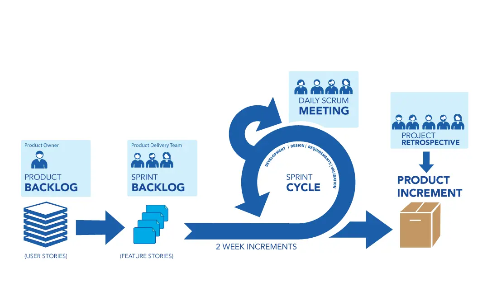

Is software engineering "really" engineering? As the Dwarves asked this question during the [Apprenticeship Training Program](https://github.com/dwarvesf/WeAreHiring/blob/master/open-positions/Apprentice.md), we had a chance to dig more into the topic. Many professionals discuss this, but there's not a full answer. The engineers strictly follow the engineering process, apply math to solve the problem, and build products. We software engineers don't feel like the same as described. I found the originated articles from [Hillel Wayne](https://www.hillelwayne.com/post/crossover-project/are-we-really-engineers/), and it perfectly answers the question.

## Engineering is mathematical
The claim is that engineering involves a lot of hard math, while software involves very little math. The confusion here comes from our misunderstanding of mathematics. Much of the math that mechanical engineers use is **continuous math**. This is where we work over a continuous domain, like real numbers. Things like calculus, trigonometry, and differential equations are in this category. This is what most people in the US learn in high school, codifying it as what they think of as “math”.

In software, we don’t use these things, leading to the conception that we don’t use math. But we actually use **discrete math**, where we deal exclusively with non-continuous numbers. This includes things like graph theory, logic, and combinatorics. You might not realize that you are using these, but you do. They’re just so internalized in software that we don’t see them as math! In fact most of computer science is viewable as a branch of mathematics. Every time you simplify a conditional or work through the performance complexity of an algorithm, you are using math. Just because there are no integrals doesn’t mean we are mathless.

This falls in line with the rest of engineering. Different branches use different kinds of math in different ways. Industrial engineers are concerned with very different things than mechanical engineers are. Just because we use a different branch of math doesn’t mean we’re not doing engineering.

## The other differences
Engineers work on predictable projects with a lot of upfront planning and rigorous requirements. Software is dynamic, constantly changing, unpredictable. If we try to apply engineering practice to software, then software would be 10 times as expensive and stuck in 1970.
* Traditional engineering is best done in a Waterfall style, while software is best done in an Agile one.
* Trad engineering is very predictable, while software is very unpredictable.
* Engineering is mostly about manufacture, while code is mostly about design, because "the code is the design".
* Trad engineering is much more rigorous than software engineering is.
* Software moves much faster than traditional engineering does.

All the differences people give between software and "real" engineering don't accurately reflect what "real" engineering looks like.

Traditional is waterfall, software is agile. If there's one thing we think is uniquely software, it's Agile. Waterfall says that you should do everything in a strict order, only progressing to the next stage of development when the current stage is completed. You only develop after you complete the design, only test after you finish development, etc. This works for "real" engineering but utterly fails for software, where requirements change and often the customer doesn't know what they want before you build it.

It's true that traditional engineers do a lot more upfront design and spend more time in dedicated testing than software engineers do. But this doesn't mean they have Waterfall level rigidity, nor does it mean that our Agile is alien to them. Rather, spending a lot of time in phases is a natural consequence of the economic model. When iterations are longer and more expensive it makes more sense to spend more time planning them out.

While there are many ways we are different, there's a difference between being "different" and being "special". Yes, mechanical and electrical engineers don't have to deal with the same security concerns we do. They also don't have to deal with weather patterns to the same degree that civil engineers need to, and none of those three need to deal with the problems inherent in chemical engineering. Every field of engineering has unique challenges and software is no different.

But they are all much more similar than they are different. Every field values upfront, abstract thinking, tidy work, and a good kludge in just the right place. Every field faces shifting requirements and unknown unknowns.

## So what to learn from other engineering branches?
### More methodical processes
It means we should prepare more. I'd like to see a lot more thought and planning go into stuff. I'm sure the Agile people are gonna freak out and be like, "You're doing waterfall!" No, we're not. We're just thinking about what we want to build and why. Of course, there's technical reasons why we don't need to plan as much as trad engineers do. In software, we can iterate much faster, meaning we can use completed prototypes to help guide the requirements from client feedback.

The usual response to this is that software is inherently unknowable, so we cannot plan as engineers. As discussed in the previous essay, this underestimates just how uncertain and unpredictable trad engineering is. It's not like engineers strictly follow their plans. Trad engineers are just as likely to make last-minute changes, hack things together, and run into unforeseen circumstances as we are. The response to plans being imperfect is to make flexible, dynamic plans, not to throw away planning entirely. It would be a mistake to plan as thoroughly as traditional engineers. It would be just as much a mistake not to plan at all.

### Professionalism
Everybody who saw issues with our process also saw it as a symptom of a deeper problem, which is our lack of professionalism. Most trad engineering is physical, while most software is intangible.

That makes it harder to feel responsible for its impact. Much as they tried, many people felt that they “cared less” about the software they produced than about the things they built. It’s easier to wave off a frustrating bug with “oh, that’s just computers being bad” as opposed to “we did something wrong”.

You might notice this is similar to some Agile claims. Indeed, this sense that we need to take more “pride in our work” is pervasive in many modern software movements. We culturally don’t feel the same degree of responsibility trad engineers do.

## And what to inspire them
### The Openness
Having a community that you can learn from, it's the reason I was able to get into software engineering so quickly and so easily.

We software engineers take the existence of nonacademic, noncorporate conferences for granted. But we're unique here. In most engineering fields, there are only two kinds of conferences: academic conferences and vendor trade shows.

There's nothing like Deconstruct or Pycon or !!con, a practitioner-oriented conference run solely for the joy of the craft.

In addition to helping us improve our skills, software conferences also break down silos in software. Electrical engineers would only know about the experiences of them and their friends. This was even cited as one of the major reasons why people left traditional engineering: the lack of diverse career opportunities.

> When I gave up on physics grad school, I was able to teach myself software development through the huge amount of free material software engineers share online. Later, I was able to switch between two very different software fields, web development to formal verification, because of that free information. And when I decided to contribute information back, for free, that wasn't considered odd or anything. It's just what enthusiastic software developers do.

I'm not the only person who "fell into" software. In fact, that's one big reason our discipline places less emphasis on formal education. Most households have computers and most of our tools are open source.

People can, and do, download all the tools of the trade and learn how to program on their own. In contrast, you would need to buy a lot of additional equipment if you want to learn electrical engineering. It's unsurprising that so many more software engineers are self-taught.

### Version Control
Version control is the single most innovative, most revolutionary, most paradigm-shifting tool that is uniquely ours.

Some other fields have proto-VCS, things with a fraction of the power and versatility of git, and the rest are still saving files as form-draft-3.docx.

Part of this is our preference for plaintext source code. Our VCS tools aren't nearly as suited for things like diagrams and spreadsheets, which are more common in trad fields. But that doesn't preclude version control on other formats: after all, GitHub can diff CAD files. And many engineering artifacts are also written in plaintext. A requisition form or an SVG diagram can easily be version controlled in git.

On top of this, our tooling surrounding version control is extraordinary. If I'm hosting a project on GitHub, I can make every pull request kick off a test suite for a dozen different OSes, check for merge conflicts, and ping a coworker for review. One chemical engineer talked about how, whenever he needed sign off on a project at his old job, he had to get everybody to physically sign an authorization form. If someone was working remotely that day, the authorization would be delayed by a day. He is very happy to now have pull requests and automated builds.

## To summary
So, we software engineers are "really" engineers. All the differences people give between software and "real" engineering don't accurately reflect what "real" engineering looks like. And the biggest difference, licensure, is a political construct, not a technical one. At the same time, there is a difference between the different ways people make software, and it makes sense to think of software developers and software engineers as distinct concepts. But even then, it's very easy for a software developer to become a software engineer and vice versa.

Some aspects of software engineering are unique to software, such as the speed of iteration, loose constraints, and the consistency of our material. But software engineering has far more in common with the other forms of engineering than it has differences. The same ideas that engineers use to advance their craft are equally useful in our own domain.

Engineering processes are more sophisticated than ours in ways that we can extract lessons from. Traditional engineers have a stronger sense of professionalism and responsibility than we tend to. In contrast, our culture is much more open and our communities much stronger than what exists in trad engineering. And our developments in version control have the potential to revolutionize traditional engineering.

Back to the [Apprenticeship Program](https://github.com/dwarvesf/WeAreHiring/blob/master/open-positions/Apprentice.md), this primary question is once thing I feel necessary to discuss with apprentices and the practitioners. Getting to know the industry we are working on and might spend years with it, will help to form the foundation for the future. It will also help us as an engineer to make a better decisions
