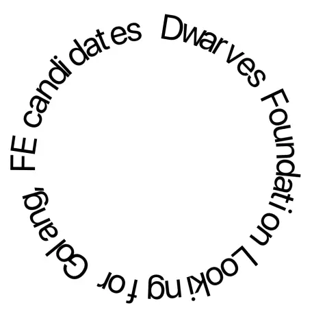
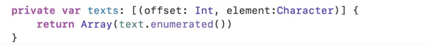
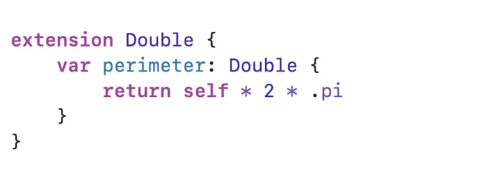
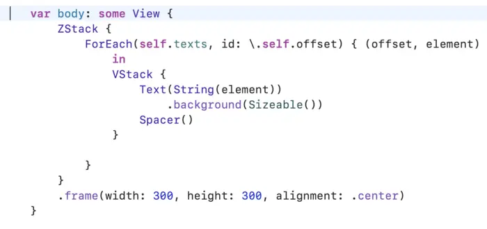
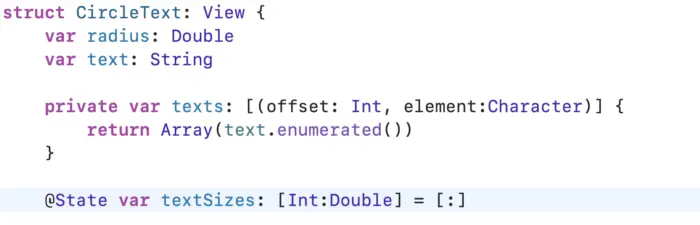
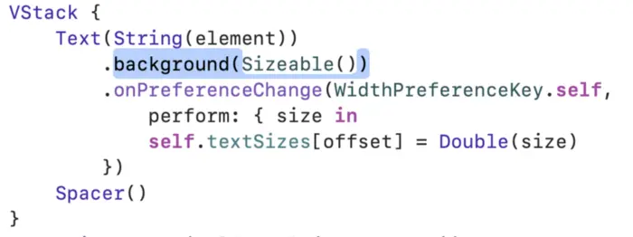
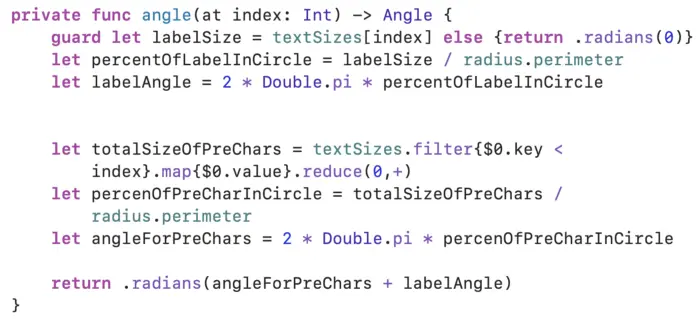
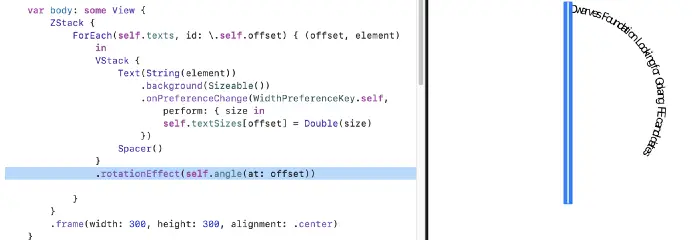
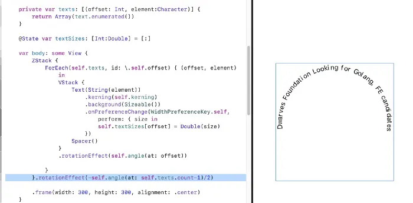

This is what we have when finished.

Fire up your Xcode and create new SwiftUI Project.

Create new SwiftUI file and named it CircularText.

The first two attributes for our control of course is String and Radius for our circular.

Add 2 Attribute named

To make a circle text we split out string to array of character, each character will have it own Text control then we going to rotate the text to match circle.

Define computer property to split string to array of character:

Using enumerated to get offset using later.
To calculate angle using to make rotation later we need 2 things: perimeter of circle and width of each character.

Later we will use it as radius.perimeter

For Width of each character is a bit complicate. We need place it in some control and get size of that control somehow. Text is the best candidate for this case.

Embed Text and Spacer in Vstack we have a custom control as tall as parent view and the text at top of control, this make us easy to make rotation later because we just need rotation at center of control.

Now we have List of Text, the next thing is get it width value. SwiftUI let us get size from control using GeometryReader, and we send it to outside using PreferenceKey

We going to place custom Sizeable View as background of Text, because Sizable View actually a Color, it going to fill the parent (which is background of Text)so we got exactly size of Text
To store that sizes let add a Dictionary to save it, the key will be the position of Character. Add a dictionary named textSizes

Update our VStacks to save sizes when preference changed

We have perimeter and with of each character, now calculate angle of each character by it position

This function simple calculate how many percentages of size.with compare to perimeter of circular, then figure out angle by that percent.

We have angle, now make rotation and see results:

Look like the space between characters have problem. This because of it just fit enough for horizontal Text, when we make circle, the rotation angle make it close together. Luckily the building kerning Modifier make us easily to adjust it.

If you want to make it center, simple ask the angle of last character divide by 2 then rotation it anticlockwise.

We are done, hope you enjoy and have fun with SwiftUI.

View more at: [https://github.com/viettrungphan/SwiftUIGeometryPractice](https://github.com/viettrungphan/SwiftUIGeometryPractice)
