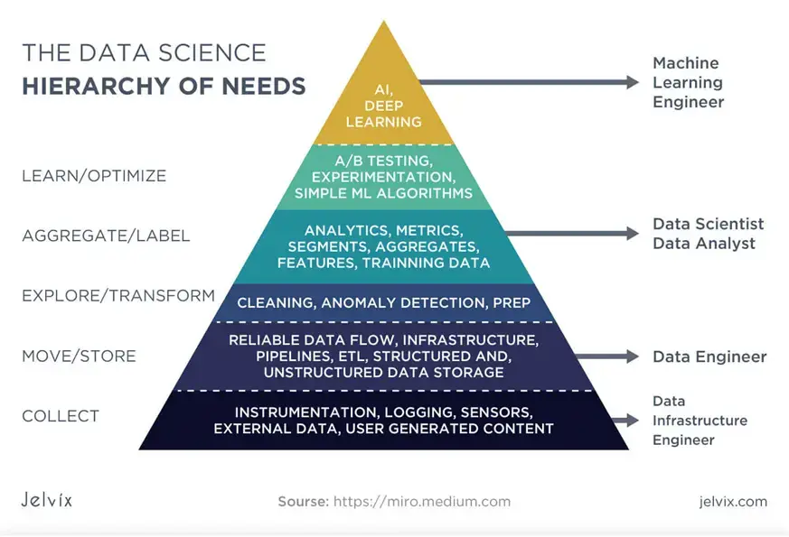
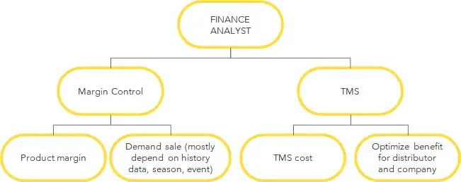
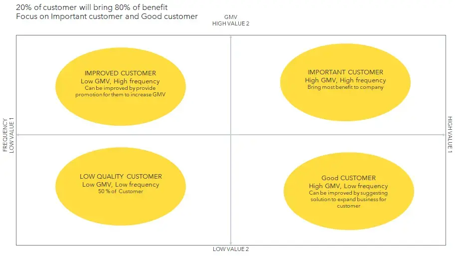

> I am Bach Phuong and I work at Dwarves Foundation as a Data Analyst, helping partner companies realize insights and understand their business better.

## What does a Data Analyst do?
A Data Analyst is a gatekeeper for an organization’s data. They are tasked to explore, transform, aggregate data to create business insights from that data to then create reports to stakeholders. Thanks to these reports, companies can make more informed business decisions.

## What tools do I use?
I use tools ranging from ETL Tools, Query layer Tools, and BI Tools. For ETL Tools, I have experience in using Oracle Data Integrator (ODI) and Apache Airflow in the past. Using these tools do not require programming skills, but does require you to understand the system behind it.

After data is transferred to a data warehouse, I use query layer tools such as Dremio to explore data. Dremio is an SQL engine that also allows us to compose virtual datasets from many sources.

For BI tools, I am familiar with Power BI, Tableau and Google Data Studio for making reports. All tools have their advantages and disadvantages. For instance, Power BI is good for portability, Tableau is often easy to use, and Google Data Studio has features specific to their ecosystem to help generate diagrams or consolidate data sources on Google Cloud.

## Data Science Hierarchy of Needs

This diagram show what all the general departments in data do. Firstly, **Data Infrastructure Engineers** will set up infrastructures for data systems such as setup for databases, Kafka, etc. Secondly, **Data Engineers** will then create data pipelines, ETL process and convert raw data to modeled data for transfer to data warehouses. Then **Data Analysts** prepare data from those sources. This involves cleaning, transforming, and analyzing data to curate and compose metrics, infographics, and insights for reports. After that, other tasks regarding machine learning, AI, and deep learning are handled by **Data Scientists**.

## Case Study: Data Analyst in Retail Trading
A good Data Analyst should understand how a company does business and an understanding of everything surrounding it. In order to get insight for a report, you will need to know how your company makes money. One case study I would like to cover is of a retail trading company, specifically of one that sell perishables such as beverages and snacks to small vendors. Our suppliers in this case will be companies that provide these beverages and snacks, such as Habeco, Coca-Cola, Tide, etc.

### System Overview

Understanding the overall system can help Data Analysts get a feel for where data resides across databases and how they relate with each other. Each system is designed differently fitted for its business use case, but there are typically 2 main types: the core system and services/microservices.

Examples of core system solutions are Hybris, POS systems, SAP, TMS, etc. For services/microservices, these can be system for sales management, warehouse management, promotion services, etc.

## Data Process

The data process to creating the report as a data analyst is dependent on 12 steps, where responsibilities are shared between the Data Engineer, Analytics Engineer, and Data Analyst.

**Steps 1–3: Data Engineer**

1. Raw data : Acquired raw data from an object store or database
2. ETL to Staging : Step to transform data near 1:1 from the object store or database to the staging environment in the data warehouse
3. Incremental: The incremental step is where data is stored for a limited time period, in our case 7 days. It has the same metadata as the staging environment, but with lower capacity. The purpose of this is to increase the speed in which we load data into the model

**Steps 4–6: Analytics Engineer**

4. Data Model: Models raw data into schemas in the data warehouse. We have 2 types of data models: Snowflake schema, and Star schema. (I had previous experience in modelling Star schemas in data warehouses.)
5. Data Warehouse: A data repository consolidated from multiple sources.
6. Data Mart : Transformed or mirrored data from data warehouses aimed for holding single subject or line of business data. The purpose of this is to allow users to access data and gain insights faster.

**Steps 7–12: Data Analyst**

7. Query Layer: Interface to get and use data from Data Marts
8. BI Tool: Tool to compose dashboards from data sources
9. Clean and transform data: A necessary step to make sure data is consistent across the mode
10. Visualization: Reformat and repurpose clean data for better understanding
11. Insight: Human step to acquire insight from dashboards and visual infographics
12. Report: Final step to generate a general report of findings

## Types of Data Analysts
There are mainly 3 types of Data Analysts with regard to retail trading: Operation Data Analyst, Finance Data Analyst, and Marketing Data Analyst.

### Operation Data Analyst

Operation Data Analyst are responsible for tracking for daily sales of the company and its general operations. For instance, they need to be able to explain for volatility of company sales, give sale insights as to which product brings the highest Gross Merchandise Value (GMV), which vendor has the highest growth rate, etc.

They also help track for risk and fraud. This includes, but is not limited to, tracking for fraud in marketing campaigns, anomalies in sales, vendor collusion, employee theft, etc. In addition, they also track for product and warehouse related concerns. This includes tracking for product performance, inventory in warehouse, warehouse operating expenses, etc.

### Finance Data Analyst

Finance Data Analysts have two main concerns: margin control and transport management system (TMS):

**Margin Model**
This model is used to track the margin of each product or transaction. We need to control this margin carefully as it directly affects the profit/loss of the company:

$ \text{Margin} = \text{Revenue} - \text{Cost} $

→ Revenues can consist of Sales, back margin from supplier, and other revenue;
→ Costs can consist of TMS costs, warehouse costs, promotion costs, and cost of goods sold (COGS)

Transportation cost is based on route distance, cargo volume, distribution rate of the distributor, bonus, or payoff for distributor with the data aggregated from the TMS system and manual input. Warehouse cost is based on amount of space, rental rate, operational cost, etc. Promotion costs refer to marketing campaign costs.

**Transport Management System**
You need to optimize the rate of distributor gains against your company gains. If your company pays a low rate for the distributor, they may not distribute your product to your customer or settle with low quality service level agreement (SLA). By contrast, if you pay your distributor too high, your margins will be lower as a consequence.

### Marketing Data Analyst
Marketing Data Analysts are concerned with tracking consumer related data, that includes tracking customers through funnel processes and customer segmentation:

**Customer Funnel**
Tracking processes to acquire customer and customer conversion rate. In the example chart below, we can see the process of how a company acquires a customer. With this funnel and data, we can know which stage has the lowest conversion rate and improve upon it.

**Customer Segmentation**
Taken from the Pareto principle, we see that 20% of big customers will bring 80% of benefits to the company. We segment and compartmentalize customer behavior to find who are our most important customers for the company.

For the improved customer and good customer group, we have different strategies to improve their standings, such as deploying marketing campaigns or investment in sales. For the rest, we see that 50% of all customers generally fill the low quality group. This group often trials the product and see few repeat purchases, so spending resources and money on improving their standing may prove wasteful.

## Conclusion
Hopefully, you were able to understand Data Analysts a little better, through the lens of retail trading. Data Analysts are one of the few jobs where they focus on gathering requirements and are dependent on those who collect and aggregate data. There are many types of Data Analysts, and they serve their role best in helping business gain better insight into how they operate and understand critical areas of concerns better.
