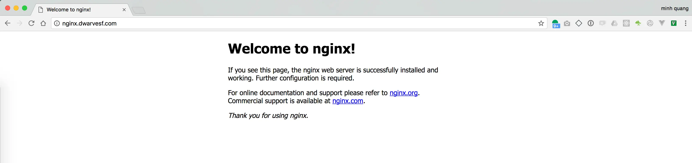

The Mesosphere Datacenter Operating System (DCOS) provides useful tooling for service discovery and load balancing. One of the primary tools is Marathon Load Balancer, which will be the focus of this post.

After you boot a DCOS cluster, all tasks can be discovered by using Mesos-DNS. Discovery through DNS, however, has some limitations that include:

* DNS does not identify service ports, unless you use an SRV query; most apps are not able to use SRV records “out of the box.”
* DNS does not have fast failover.
* DNS records have a TTL (time to live) and Mesos-DNS uses polling to create the DNS records; this can result in stale records.
* DNS records do not provide any service health data.
* Some applications and libraries do not correctly handle multiple A records; in some cases the query might be cached and not correctly reloaded as required.
* To address these concerns, we provide a tool for Marathon called Marathon Load Balancer, or marathon-lb for short.

Marathon-lb is based on HAProxy, a rapid proxy and load balancer. HAProxy provides proxying and load balancing for TCP and HTTP based applications, with features such as SSL support, HTTP compression, health checking, Lua scripting and more. Marathon-lb subscribes to Marathon’s event bus and updates the HAProxy configuration in real time.

The marathon-lb tool is available as a package from DC/OS’s universe. To install marathon-lb

```javascript
$ dcos package install marathon-lb
```

To check that marathon-lb is working, find the IP for your public slave and navigate to `http://<public-slave-ip>:9090/haproxy?stats.` You’ll see a statistics report page.

Next, we’ll set up our internal LB. To do this, we must first specify some configuration options for the marathon-lb package. Create a file called `options.json` with the following contents

```javascript
{
  "marathon-lb":{
    "name":"marathon-lb-internal",
    "haproxy-group":"internal",
    "bind-http-https":false,
    "role":""
  }
}
```

In this options file, we’re changing a) the name of the app instance, b) the name of the HAProxy group, and b) we’re disabling the HTTP and HTTPS forwarding on ports 80 and 443 (because it’s unneeded).

Next, run the install command with our new options

```plain_text
$ dcos package install --options=options.json marathon-lb
```

Now we’ll have 2 load balancers: an external LB, and an internal LB. Let’s launch a sample application to demonstrate the features. Here’s our external instance of nginx:

```plain_text
{
  "id": "nginx-external",
  "container": {
    "type": "DOCKER",
    "docker": {
      "image": "nginx:1.7.7",
      "network": "BRIDGE",
      "portMappings": [
        { "hostPort": 0, "containerPort": 80, "servicePort": 10000 }
      ],
      "forcePullImage":true
    }
  },
  "instances": 1,
  "cpus": 0.1,
  "mem": 65,
  "healthChecks": [{
      "protocol": "HTTP",
      "path": "/",
      "portIndex": 0,
      "timeoutSeconds": 10,
      "gracePeriodSeconds": 10,
      "intervalSeconds": 2,
      "maxConsecutiveFailures": 10
  }],
  "labels":{
    "HAPROXY_GROUP":"external"
  }
}
```

You can launch this app on DCOS by pasting the JSON above into a file (called nginx-external.json), and running:

```plain_text
$ dcos marathon app add nginx-external.json
```

The application definition includes a special label with the key HAPROXY_GROUP. This label tells marathon-lb whether or not to expose the application. The external marathon-lb was started with the –group parameter set to external, which is the default. You can inspect the code here, if you’d like.

And here’s our internal nginx:

```plain_text
{
  "id": "nginx-internal",
  "container": {
    "type": "DOCKER",
    "docker": {
      "image": "nginx:1.7.7",
      "network": "BRIDGE",
      "portMappings": [
        { "hostPort": 0, "containerPort": 80, "servicePort": 10001 }
      ],
      "forcePullImage":true
    }
  },
  "instances": 1,
  "cpus": 0.1,
  "mem": 65,
  "healthChecks": [{
      "protocol": "HTTP",
      "path": "/",
      "portIndex": 0,
      "timeoutSeconds": 10,
      "gracePeriodSeconds": 10,
      "intervalSeconds": 2,
      "maxConsecutiveFailures": 10
  }],
  "labels":{
    "HAPROXY_GROUP":"internal"
  }
}
```

Notice that we’re specifying a servicePort parameter. The servicePort is the port that exposes this service on marathon-lb. By default, port 10000 through to 10100 are reserved for marathon-lb services, so you should begin numbering your service ports from 10000 (that’s 101 service ports, if you’re counting). You may want to use a spreadsheet to keep track of which ports have been allocated to which services for each set of LBs.

Let’s add one more instance of nginx:

```plain_text
{
  "id": "nginx-everywhere",
  "container": {
    "type": "DOCKER",
    "docker": {
      "image": "nginx:1.7.7",
      "network": "BRIDGE",
      "portMappings": [
        { "hostPort": 0, "containerPort": 80, "servicePort": 10002 }
      ],
      "forcePullImage":true
    }
  },
  "instances": 1,
  "cpus": 0.1,
  "mem": 65,
  "healthChecks": [{
      "protocol": "HTTP",
      "path": "/",
      "portIndex": 0,
      "timeoutSeconds": 10,
      "gracePeriodSeconds": 10,
      "intervalSeconds": 2,
      "maxConsecutiveFailures": 10
  }],
  "labels":{
    "HAPROXY_GROUP":"external,internal"
  }
}
```

This instance of nginx is going to be exposed everywhere. Note that we’ve changed the servicePort so it does not overlap with the other nginx instances.

Service ports can be defined either by using port mappings (as in the examples above), or with the ports parameter in the Marathon app definition.

To test our configuration, SSH into one of the instances in the cluster (such as a master), and try curl-ing the endpoints:

```plain_text
$ curl http://marathon-lb.marathon.mesos:10000/

$ curl http://marathon-lb-internal.marathon.mesos:10001/

$ curl http://marathon-lb.marathon.mesos:10002/

$ curl http://marathon-lb-internal.marathon.mesos:10002/
```

Each of these should return the nginx ‘Welcome’ page.

## Virtual host
An important feature of marathon-lb is support for virtual hosts. This allows you to route HTTP traffic for multiple hosts (FQDNs) and route requests to the correct endpoint. For example, you could have two distinct web properties, nginx.dwarvesf.com, with DNS for both pointing to the same LB on the same port, and HAProxy will route traffic to the correct endpoint based on the domain name.

To do so, we need to do 2 things:

1. Point your domain to public node which in running `marathon-lb`
1. Add this config to marathon JSON configuration file:

```plain_text
  "HAPROXY_0_VHOST":"nginx.dwarvesf.com"
}
```

So, your configuration file will be like this:

```plain_text
{
  "id": "nginx-external",
  "container": {
    "type": "DOCKER",
    "docker": {
      "image": "nginx:1.7.7",
      "network": "BRIDGE",
      "portMappings": [
        { "hostPort": 0, "containerPort": 80, "servicePort": 10000 }
      ],
      "forcePullImage":true
    }
  },
  "instances": 1,
  "cpus": 0.1,
  "mem": 65,
  "healthChecks": [{
      "protocol": "HTTP",
      "path": "/",
      "portIndex": 0,
      "timeoutSeconds": 10,
      "gracePeriodSeconds": 10,
      "intervalSeconds": 2,
      "maxConsecutiveFailures": 10
  }],
  "labels":{
    "HAPROXY_GROUP": "external",
    "HAPROXY_0_VHOST": "nginx.dwarvesf.com"
  }
}
```

1. Deploy it and let’s check `nginx.dwarvesf.com`



or, you also can access by this way `<public-node-elb>`:`<service-port>`


