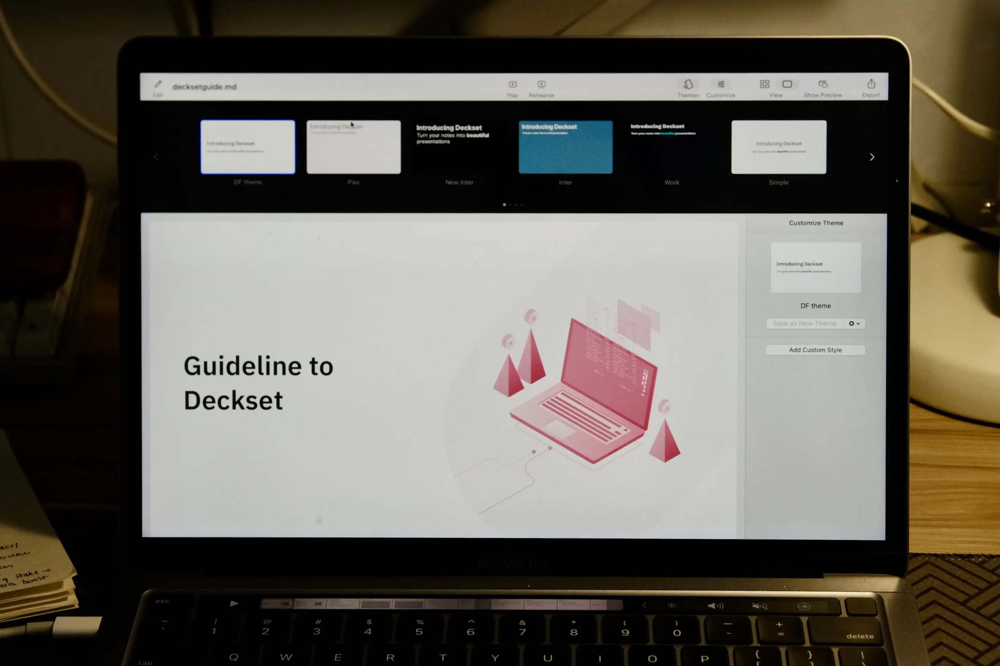
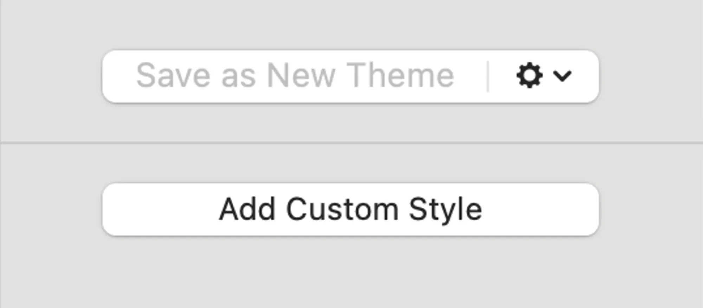
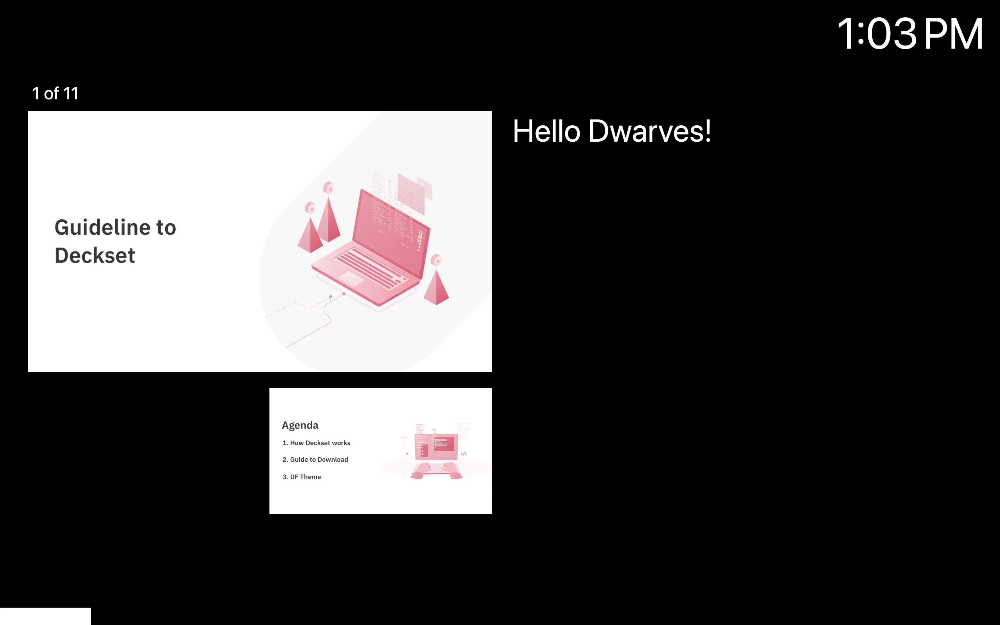
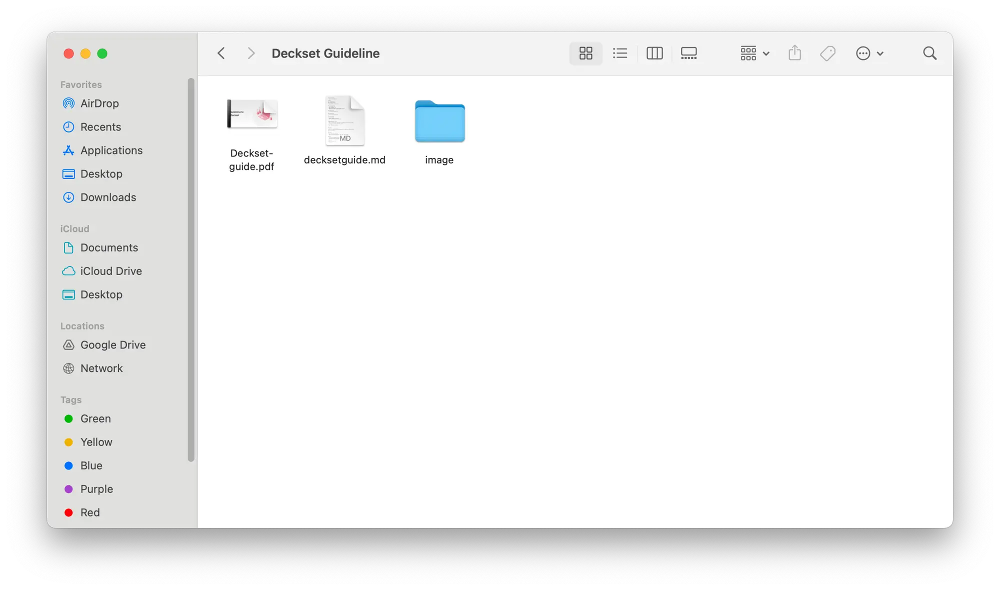

Do you ever feel overwhelmed by the myriad of design tools and options in PowerPoint, or the countless books and tutorials dedicated to beautifying a single sentence on a 100-inch screen?You're not alone! As a designer myself, I used to get caught up in the "beautification" trap, spending hours tweaking layouts, colors, fonts, and more, only to realize that the content of my presentation was the key factor.

My search for a simpler, more efficient solution led me to Deckset, a Markdown-based presentation app for Mac. With Deckset, creating slides becomes easier than ever. You simply write your content using Markdown - a simple, easy-to-learn markup language, and Deckset automatically converts it into beautiful presentations.

Imagine being able to focus entirely on your message without having to worry about complex design tools. Deckset is my "savior" that has freed me from the burden of slide design, allowing me to dedicate all my time and energy to creating quality content.

I’ve also uploaded two resources which you may find helpful:

- Deckset Documentation to learn more syntax for formatting text: https://docs.deckset.com/English.lproj/getting-started.html
- The Deckset Guideline of DF: https://drive.google.com/drive/folders/1bakuk7-BRTaOlqVu5Jbk_QRbR42Ym2g6?usp=drive_link

So let’s get started.

## Install Deckset



To install Deckset, first download the [software version](https://drive.google.com/file/d/16aOzaQ6YxySsGEjCwVVDSVbt3dSYSdAT/view?usp=drive_link) compatible with your operating system from the Drive. Once the download is complete, run the installer and follow the on-screen instructions to complete the installation process.

## Import theme
**Step 1:** Open Deckset and select **New Presentation**.

**Step 2:** Select **Import Theme** from the **File** menu.

**Step 3:** Select the theme file you want to add. Theme files are usually in **.dstheme** format.

**Step 4:** Deckset will automatically install the theme and add it to the list of available themes.

**Step 5:** Select the theme you want to use and start creating your presentation.

## Add content to slides

The beauty of Deckset is, it lets you focus on what truly matters – the content of your presentation! Don't worry about fiddling with design elements; Deckset gives you a handy preview of each slide. Want to see a full view? Just double click on it. Made a typo or have more ideas? Click "Edit" and Deckset will open your presentation in your markdown document (like VSCode). 

Here's the cool part: you get a tiny Deckset preview window floating beside you as you edit. Even better, the preview updates live as you make changes! This makes editing text a breeze and lets you experiment with quotes, code, and other content types to see how they translate into Deckset's stylish themes. It's a small feature, but a powerful one that builds confidence in your editing and lets you explore the unique styles your presentation can take.

Deckset also provides a variety of tools to add content to your slides, including:

**Images:** 
```bash
    # ![inline/left/right 100%] (image.png)
```
**Videos/Audio** 
```bash
    # ![] (video.mov)
    # ![] (audio.mp3)
```
**Code block:** 
```bash
    ```javascript
    $.ajax({
    url: "/api/getWeather",
    data: {
    zipcode: 97201
  },
  success: function( data ) {
    $( "#weather-temp" ).html( "" + data + " degrees" );
  }
});
```
**Table:** 
```bash
    | Header 1 | Header 2 | Header 3 |
    | --- | --- | --- |
    | Cell 1 | Cell 2 | Cell 3 |
    | Cell 4 | Cell 5 | Cell 6 |
```
**Custom theming** 

You can customize the formatting of your content using the tools on the toolbar.



## Presenting your presentation

When you're ready to present, simply click **Play** or **Rehearse** on the toolbar. Deckset will switch to full screen and you can navigate between slides using the arrow buttons or keyboard shortcuts.



Deckset takes Markdown presentations to the next level with presenter mode. This mode provides a clean interface, showing the current and upcoming slides alongside the elapsed time. Even better, [presenter notes](https://docs.deckset.com/English.lproj/Presenting/presenter-notes.html) embedded within your Markdown text will appear below the slide in this view. It’s everything you could have wanted from a simple Markdown presentations experience.

## Save your file

Once you have finished presenting, select **File** > **Export Presentation...** to save your presentation. You can save your presentation as a **.md** file or export it to other formats such as **PDF, PNG**, or **JPEG**.

**A set of export files to upload to Dwarves Drive will include:**

- **PDF file:** This is the primary file format for documents, and it can be opened on any device with a PDF reader.
- **Markdown file:** This is a text-based file format that can be used to create and edit documents. It is a popular format for technical documentation and README files (optional).
- **Image folder:** This folder will contain all of the images that are used in the document. The images should be in a format that is supported by Deckset, such as JPEG, PNG, or GIF.



> **Note**: Markdown file and image folder must stay together to avoid missing images in your final presentation.

While Deckset doesn't allow you to customize everything to your heart's desire, such as adding custom quotation marks around block quotes, for example. Sometimes, I also wish for more flexibility in slide design.

However, Deckset is still a great tool that helps me create beautiful presentations quickly and easily. It allows me to have a moderate level of control, focusing on the content without getting distracted by complex design details.

Therefore, even though Deckset is not truly perfect, I still hope you will like it. Give Deckset a try and share your experience with me!