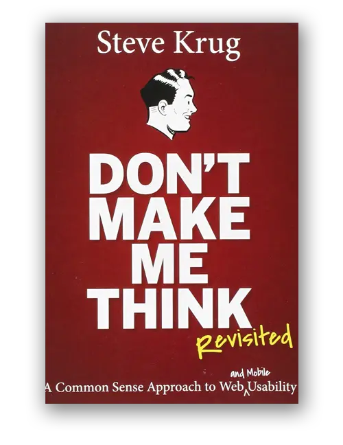

Besides learning the UI design, the most important thing is to learn UX design to create a good user experience. Helps the user get the goal when in your app.

This compilation is synthetic all the websites or tools to help you improve your knowledge of UX Design. All of these websites where UX designers around the world often go to learn, just as you usually do on Behance or Dribbble to find trends, styles or ideas.

## UX Design 
### Information and guides
**Publications**

 * **[Nielsen Norman Group](https://www.nngroup.com/articles/)**: Original research from one of the most respected authorities in UX.
 * **[Luke W](https://www.lukew.com/ff/)**: Very short, straightforward, and visual articles from a Product Design veteran.
 * **[Smashing Magazine](https://www.smashingmagazine.com/)**: High quality, vetted design content from a collection of experts.
 * **[UX Magazine](https://uxmag.com/)**: A large collection of articles covering virtually every UX subset.
 * **[UX Matters](https://www.uxmatters.com/)**: Long form, evergreen articles dating back to before UX was a thing.
 * **[Usability Geek](https://usabilitygeek.com/)**: Wide range of usability and tech related articles and guides.
 * **[UX Mastery](https://uxmastery.com/)**: A giant guide covering all of the basics for getting started in UX.
 * **[52 Weeks of UX](http://52weeksofux.com/tagged/week_1)**: Thought-provoking niche UX topics from Josh Porter and Josh Brewer.
 * **[InVision Blog](https://www.invisionapp.com/blog)**: High quality design articles, guides, and interviews.

**Communities**

 * **[Designer News](https://www.designernews.co/)**: Board for design discussion, critique, and content sharing.
 * **Designer Hangout**: Slack community (more than 6,000 members) that is focused on UX
 * **[/r/UserExperience](https://www.reddit.com/r/userexperience/)**: Subreddit for UX related content, tools, and conversation

**Podcasts**

 * **[UX and Growth Podcast](https://austinknight.com/podcast/)**: A tactical, actionable UX podcast that I co-host with two friends.
 * **[User Defenders](https://userdefenders.com/)**: In-depth interviews with influential UX designers, hosted by Jason Ogle.
 * **[Design Review](http://www.designreviewpodcast.com/)**: Weekly reviews of products and their user experiences.
 * **[What Is Wrong with UX?](https://itunes.apple.com/us/podcast/what-is-wrong-ux-users-know/id980133198?mt=2)**: Laura Klein and Kate Rutter discuss current issues in UX.
 * **[Design Details](https://spec.fm/podcasts/design-details)**: Casual interviews with designers and product creators.
 * **[Dorm Room Tycoon](https://drt.fm/)**: Interviews with major influencers in design, business, and technology.

**Books**

A foundational book on UX and Design, introducing design as a competitive advantage in business.

A straightforward book on usability, serving as a great introduction to UX.

An introduction to statistics and data visualization (and how they can both be manipulated).

Part of the Lean Startup movement, this book introduces the process for Lean UX.

### Tool and resources 
**Quantitative**
 * **[Google Analytics](https://www.google.com/analytics/#?modal_active=none)**: Free, standard yet robust web analytics with wide adoption.
 * **[HubSpot](https://www.hubspot.com/)**: In-depth analytics, A/B testing, SEO, CRO, and more.
 * **[Mix panel](https://mixpanel.com/)**: Free, fully custom and integrated mobile & web analytics platform.
 * **[Heap](https://heapanalytics.com/?referral=5djmk)**: Automated analytics platform that captures every action.
 * **[Crazy Egg](https://www.crazyegg.com/)**: Heat mapping, click mapping, scroll mapping, and more.
 * **[KISS metrics](https://www.kissmetrics.com/)**: Easily configured funnels and reports based on user behavior.
 * **[Optimizely](https://www.optimizely.com/)**: Javascript-based A/B testing and multivariate testing platform.
 * **[Google Optimize](https://optimize.google.com/optimize/home/#/accounts/2740283315/containers/8631801)**: Free A/B testing platform that’s integrated with Google Analytics.

**Testing**
 * **[UserTesting.com](http://usertesting.com/)**: Fully integrated user testing platform with a participant panel.
 * **[UserZoom](https://www.userzoom.com/)**: All-in-one qualitative research and user testing platform.
 * **[TryMyUI](https://www.trymyui.com/)**: Remote unmoderated usability testing panel and platform.
 * **[Verify App](https://verifyapp.com/)**: Quickly test where users would click in wireframes and mockups.
 * **[Loop11](https://www.loop11.com/)**: Platform for testing wireframes and prototypes, usability, and accessibility.

**Diagrams**

 * **[Gliffy](https://www.gliffy.com/)**: Free Chrome plugin for drawing diagrams, flowcharts, and more.
 * **[Google Drawings](https://docs.google.com/drawings/d/1saUBNhMvr-v-nunOZ73Pp-rqrPp-r4EeT2Ml2p2lcng/edit)**: Create, share, and collaborate on drawings in your Google Drive.
 * **[Coggle.it](http://coggle.it/)**: Visually map out concepts during brainstorming sessions.
 * **[XMind](http://www.xmind.net/)**: Free tool for quick and easy to edit Mind Mapping.
 * **[Keynote](https://www.apple.com/keynote/)**: Great for creating personas, task and competitive analyses, etc.

**Wireframes**

 * **[Balsamiq](https://balsamiq.com/)**: Basic, straightforward wireframe tool with web and desktop versions.
 * **[Axure](https://www.axure.com)**: Robust interactive wireframe tool with prototyping functionality.
 * **[Omnigraffle](https://www.omnigroup.com/omnigraffle/)**: Robust diagram and stencil tool that can be used for wireframes.

**Mockups**

 * **Sketch**: Streamlined, flexible interface design tool that is optimized for web.
 * **Photoshop**: Bitmap editing tool that can be used for image and interface editing.
 * **Illustrator**: Vector-based design tool that is ideal for scalable elements like icons.

**Prototypes**

 * **InVision**: Prototyping, collaboration, and project management tool for teams.
 * **Adobe XD**: Design, interaction, and prototyping tool from Adobe.
 * **UXPin**: Wireframe, prototyping, and collaboration tool in the browser.
 * **Framer**: Code-based prototyping framework with interactions and animations
 * **Marvel**: Prototyping, collaboration, feedback, and design tool.
 * **Flinto**: Visual, responsive design tool that produces code.
 * **Origami**: Free prototyping tool that is used and developed by Facebook.
 * **Avocado**: An open source prototyping toolbox, built by IDEO on top of Origami.
  
## UI Design
### Information and guides 
**Communities**

 * [**Medium**](https://medium.muz.li): More knowledge of UX/UI
 * [**Design thinking**](http://designthinking.vn/)
 * **[Facebook Design](http://facebook.design/)**
This is blog's designer at Facebook, share more case study and useful resources for UI.

**Best Youtube Channels**

 - **[Sketch Together](https://www.youtube.com/channel/UCZHkx_OyRXHb1D3XTqOidRw)**: A channel dedicated to all things related to User Experience and User Interface design.
 * [**Web flow**](https://www.youtube.com/channel/UCELSb-IYi_d5rYFOxWeOz5g): Design and develop for the web — visually. Build dynamic, responsive websites without writing code. Launch with a click, and enjoy the fastest, most reliable hosting on the web. Or export clean, semantic code to hand off to your devs.
 * [**Adobe Photoshop**](https://www.youtube.com/user/Photoshop/): Adobe Photoshop software is the industry standard in digital imaging and is used worldwide for design, photography, video editing and more.
 * **[CareerFoundry](https://www.youtube.com/channel/UCzAF54cHk1ZO82af-8E3qOQ)**: CareerFoundry and The UX School are the leading online communities for career change, dedicated to educating the next generation of tech talent.
 * **[Mackenzie Child](https://www.youtube.com/user/mackenziechild/)**: Mackenzie share his process for creating illustrations.
 * **[UX Mastery](https://www.youtube.com/user/uxmastery)**: Live Q&A with Don Norman (Author of The Design of Everyday Things)
 * **[Expose UX](https://www.youtube.com/channel/UCUENikUsH4h7k3msqupNjgQ/)**: Expose UX is a new User Experience web series where startup founders seek help from UX experts.

## UI Patterns

* [**Calltoidea**](http://calltoidea.com)
* **[UI Patterns](http://ui-patterns.com/patterns)**
* **[Mobile Patterns](http://www.mobile-patterns.com)**
* **[Design System](https://www.notion.so/d796d37c92554af19555f5cf9b5a3a9d?pvs=21)**
* **[Design Workflow](https://www.notion.so/a3ea93c8fadc409387156cae8f63bc1d?pvs=21)**

## [UI Design Fundamental](https://www.notion.so/a71ff7f303dc4f5ba4375814771dfa4b?pvs=21)
### Tool and resources
**Free Photos**

 * **[Unsplash](https://unsplash.com/search/photos/party)**
 * **[Pexels](https://www.pexels.com/search/flash/)**
 * **[Pixapay](https://pixabay.com/en/photos/)**
 * **New Old Stock**
 * **SplitShire**
 * **Death to Stock Photos**

**Free Graphics**

 * **The Noun Project**
 * **[Vecteezy](http://www.vecteezy.com/)**
 * **Brusheezy**

**Free Icon**

 * **[Orion Icon](https://orioniconlibrary.com) (4515 Free Icons)**
 * **[Flaticons](http://www.flaticon.com/)**
 * **[Iconjar](http://geticonjar.com/)**

**Free Infographics**

 * **Easel.ly**
 * **Vizualize.me**
 * **Piktochart**
 * **Infogram**
 * **Venngage**
 * **Visme**
 * **Visage**
 * **Draw.io**
 * **Gliffy**

**Free Collaboration**

 * **Invision**
 * **Zeplin**
 * **Marvel**

**Color**

 * **Adobe Color CC**
 * **Color Hunt**
 * **Color Zilla**
 * **Pictaculous**
 * **Coolors**
 * **The Color App**

**Inspiration**

 * **Muzli**
 * **Awwwards**
 * **Design Spiration**
 * **Design You Trust**
 * **One Page Love**
 * **Material Up**