Now having a Design System in place unites product teams around a common visual language, accelerates your design process ten-fold and gives you a strong foundation to build any project. Learn how you can create a design system and help your team improve product quality when increase the speed of your workflow.

## Introduction
Today there are many the companies products compete with each other, the company should have one of the conditions:

* Make good and famous products
* Design fast and quality
* Have experience consultant and solve problems for customers

So apart from those two conditions, design systems enable a team to increase products faster by making design reusable makes scale possible. A design system is a collection of reusable components, guided by clear standards, that can be assembled together to build any number of applications.

When you first start working with a new system you may find yourself slightly hindered, because it is a different way of approaching a project, and something a little different than you’ve maybe become accustomed to.

But honestly, if you devote one's time to create this Design System, you'll find yourself working on auto-pilot. You can drive all projects and it will seem like your child. 

## Design
Starting a design system can feel daunting. There are so many things to consider: the design style, how to design for modularity and scalability, how it will be used by other teams, how to sell the idea to the decision makers in the company. Where is a designer to start?

### 1. Who should be involved
Before beginning work on your design system, take a moment to think about the team you’ll need to bring it to life. Who needs to be involved? Spoiler alert! You’re going to need more than just designers.

Here’s a quick list of the disciplines that can be represented in your team to create an effective design system:

* **Designers** to define the visual elements of the system
* **Front-end developers** to create modular, efficient code
* **Content strategists** who can help the team nail the voice and tone of the system
* **Researchers** who can help you understand customer needs
* **Performance experts** who can ensure your system loads quickly on all devices
* **Product managers** to ensure the system is aligned with customer needs
* **Leaders** (VPs and directors) to champion and align the vision throughout the company, including up to executive leadership

### 2. Choosing the right team model
* **The solitary model:** an “overlord” rules the design system.

The team model that brings people together is as important as the team creating the design system. In “Team Models for Scaling a Design System,” design systems veteran Nathan Curtis outlines 3 popular team models used by many companies.

* **The centralized team model:** a single team maintains the design system as their full-time job.

* **The federated model:** team members from across the company come together to work on the system.

* Other model

A hybrid design system team model that we used at Salesforce—a central team and members of other teams come together to manage and govern the system.

### 3. Interviewing customers
Like any product in a design process, it’s important to do your research. Who will be using your design system and how will they use it? Answer this question is the customer. [You should difference between the Customer and the User](https://www.uxpin.com/studio/blog/customer-experience-vs-user-experience-why-the-difference-matters/). The customer will use your design system. So your design system will get used much more often if you create it to fit into the workflow of other teams. By interviewing customers, you can pinpoint problems ahead of time, define principles that will help others use the system properly, and focus your energies on the most important things.

This process can include:

* **Interviews** of key (potential) contributors, influencers and leaders to assess perspective, attitudes, culture, and existing practices.
* **Survey**ing a broader organization of stakeholders attitudes and posture towards a system, priorities/needs, aspirations, and threats.
* **Requirements** gathering via task analysis, tech planning, and convention setting (using tools like [Brad Frost](https://twitter.com/brad_frost)’s [Front End Questionnaire](https://github.com/bradfrost/frontend-guidelines-questionnaire)).
* **Product tours** to immerse in as-is products and in-flight designs to which the system will apply, taking screenshots and notes.
* **System(s) reviews** assessing as-is design assets, code libraries, standards documentation depth and quality, and governance models.

### 4. Creating a visual inventory
With insights in hand from customer interviews, it’s time to take an inventory. There are 2 types of interface inventories to be created:

* An inventory of the visual attributes (such as spacing, color, and typography), which will help create a codified visual language
* An inventory of each UI element (such as buttons, cards, and modals), which will help create a UI library of components

Creating the visual identity isn’t something that will be created overnight. It takes time. Sometimes it’s as clear as day as to what is needed, other times it takes time for the building blocks to fall into place. Once in place, it’s important that the fundamentals are captured and documented at a high level. The likes of use of color, typography and style of iconography is key to creating consistency across a platform.

As we start to take inventory, it’s good practice to take a look at the CSS used to create all of those elements you just captured in your visual inventory. Use a tool like **[CSS Stats](http://cssstats.com/)** to see how many rules, selectors, declarations, and properties you have in your style sheets. More relevant, it will show you how many unique colors, font sizes, and font families you have. It also shows a bar chart for the number of spacing and sizing values. This is a great way to see where you can merge or remove values.

**Do a UI inventory audit**

Before you start anything, its best to identify how inconsistent the current build is. This works in two ways. It helps identify the reason as to why you’re doing it, to identify how inconsistent everything is but it should help you get the backing of the business as to why exactly you’re creating the design system; to create consistency across the platform.

* **Colors:** What is the color palette used on the platform? Explain how, where and why we use certain colors.
* **Typography:** What typeface is used on the platform? Summarizes rules around weighting, sizing, vertical alignment etc?
* **Iconography:** What is the generic style for icons? It will explain the rational as to why we have specific styles for different icon families.
* **Grid/Layouts:** What grid system is used across the platform? Explain the use of the grid and the high level idealism of our layouts.
* **Interactions:** What do people expect to see when they interact with our site? Give an overview of our standard interactions.
* **Animations:** How do we approach animations? Explain the reason for animations on the platform and our constraints around using them.
* **Design Resources**: A central point for assets to be easily downloaded for external partners. Color swatches, logo’s, icon sets etc.

An example of a UI Audit: Brad Frost has put together a great article around how you go about doing a UI audit.

Link source: [http://bradfrost.com/blog/post/interface-inventory/](http://bradfrost.com/blog/post/interface-inventory/)

### 5. Creating a visual design language
If we break apart each component of a design system we find that these fundamental elements make up its visual design language:

* Colors
* Typography (size, leading, typefaces, and so on)
* Spacing (margins, paddings, positioning coordinates, border spacing)
* Images (icons, illustrations)

Depending on your needs, you may also include the following to further standardize the user experience:

* Visual form (depth, elevation, shadows, rounded corners, texture)
* Motion
* Sound

### 6. Design token
Before we dive into visual design standards, you should discuss design tokens. Design tokens are the “subatomic” foundation of a design system implementation. At its simplest, they’re name and value pairs stored as data to abstract the design properties you want to manage. With the values for all design tokens stored in a single place, it’s easier to achieve consistency while reducing the burden of managing your design system.

Example of design token: [https://www.lightningdesignsystem.com/design-tokens/](https://www.lightningdesignsystem.com/design-tokens/)

[https://uxdesign.cc/design-tokens-for-dummies-8acebf010d71](https://uxdesign.cc/design-tokens-for-dummies-8acebf010d71)

The workflow of design tokens would look like: 

1) The designer would update the color in the design tool.

2) The design tool updates design tokens files according to targeted platform.

3) Developers only have to retrieve or “pull” updated files and use it in their project.

Currently, the only way to create a design tokens is by using [Theo](https://github.com/salesforce-ux/theo), it made by Salesforce. What Theo does is simple: it takes as input a tech agnostic file format like JSON or YAML and outputs tech specific files for each platforms.

### 7. UI Library (Pattern Library)
After you complete the inventory, you can merge and remove what you don’t need (either in a spreadsheet or even directly in a code refactor if you want more immediate change). Also, document what the component is and when to use it. This will become your UI library (or pattern library, or component library, depending on what your organization chooses to call it.).

Most design system documentation includes the component’s name, description, example, and code. Others may show meta data, release histories, examples, and more. What matters most is that you show what’s necessary for your team to get your work done.

Process: [https://medium.com/@jgunnison/pattern-library-workflow-ba9cc486159e](https://medium.com/@jgunnison/pattern-library-workflow-ba9cc486159e)

### 8. Style Guide
[https://medium.muz.li/how-to-create-a-style-guide-from-scratch-tips-and-tricks-e00f25b423bf](https://medium.muz.li/how-to-create-a-style-guide-from-scratch-tips-and-tricks-e00f25b423bf)

---

After you understand this process of the design system, this guide will help you create a UI library in Sketch  

Let’s take a step-by-step below here how you can create your design system.

## Color System
### 1. Create a Color Palette
Binary Design color palette learns from elementary color percepts of human vision — the psychological primaries (blue, red, green, yellow), with addition of contrasting neutral colors (slate, gray, sand).

Refer to color palette scheme: https://color.adobe.com/create/color-wheel/ or http://khroma.co/train/ 

The whole point of creating a design system in the first place is to have a refined library of elements and styles that keep things much tighter when working on any project. A point of reference that keeps you away from the dark side of working with 12 different colors and a multitude of slightly different font sizes from one screen to the next. I’ve been guilty of it in the past.

 

### 2. Create Rectangle Fill/Primary, Border/Primary and Color Overlays

This would then allow me in the future to quickly select both shapes (with Fill and Border styles applied) and make the relevant Style changes at once.

Create a simple Colour Overlay at 60% Opacity which could be then applied to any images in a project, and this was as simple as taking the Hex Value from my Base Colours.

## Typography

When you’re working with typography on the web, the two major things you want to pay attention to are the font sizes and line heights. Although there’s so much else that goes along with those two things, these are your two key components to creating a better vertical rhythm on your page design. If your font sizes don’t fit together well - by having massive heading sizes and ridiculously tiny body paragraph text sizes, for example - then this is going to make the content that much harder to read or scan through quickly. Similarly, if your content has a line height that makes text awkward to read - either through being spaced too closely together or being too far apart - that will turn your users off, when you want to be engaging with them.

You can use tools for Building Vertical Rhythm: http://typecast.com

Applying this scale to some basic typographic CSS, we might get:

h1 { font-size: 36px }
h2 { font-size: 24px }
h3 { font-size: 18px }
h4 { font-size: 14px }
p { font-size: 11px }
small { font-size: 9px }

Establishing a modular scale is the best way to determine typographic sizes, with the Body text size set at 18pt, and using a Ratio of 1.2.

As well as the headings and body styles, You can add styles for Lead, Small, Caption and Tiny. Sticking to the default Character Spacing for all of the aforementioned aside from Caption.

Creating both a Regular and Bold weight for each of the styles (Uber, Hero, H1, H2, Body etc…)and making sure for both font families that you can also create a Text Style for Left, Center and Right.

Setting color versions all Text Styled and at the ready. Using the Hex Color Values like this image attachment with the following colors applied:

* *Grey*
* *Light Grey*
* *White*
* *Primary*
* *Red (Error)*
* *Green (Success)*

## Various
**1. Shadows**

In the various sections of the Design System, you should focus on Box Shadows for elements first. The ability to quickly create a shape in Sketch and assign it a shadow of varying strengths within a matter of seconds massively cut down on the time it usually took to create shadows in the Sketch Inspector.

**2. Gradients**

Admittedly with the Gradients you can see this was a trend mission of sorts. Let’s not got into the whole Gradient debate. They still have their uses and can be used to great effect when used in moderation.

**3. Dtone Image**

**4. 8pt grid** 

In this comparison you can see an 8pt grid system vertically aligning the elements of a form versus a popular design system that utilizes arbitrary numbers to space and size elements. With an 8pt Grid System in place you were able to size and space elements on the page in increments of 8 (8, 16, 24, 32 and so on).

Bootstrap is an opinionated library of components that allows designers/developers to focus on the content and user experience. It has raised the quality of countless websites across the web. But not having a consistent unit of measurement can lead to layout inconsistencies between pages, particularly on projects with two or more designers.

When building own brand aesthetic at Pivotal we often need to create unique components and layouts. While recently working to unite our UI system we came across the fact that the branding in the top corner of all of our products is slightly different. Built by separate teams around the world, the overall concept is the same but the execution is slightly different.

If you want to know reason why 8pt, you can refer to link: https://builttoadapt.io/intro-to-the-8-point-grid-system-d2573cde8632

**8-Point Grid: Borders and Layouts** - read more: https://builttoadapt.io/8-point-grid-borders-and-layouts-e91eb97f5091

## Color Symbols

Firstly, you create a Symbols page yourself and then draw out a Rectangle (100x100) and apply the Fill/Primary Shared Style, then rename that layer to Base.

You create a new Symbol and name it Color/Primary.

After, it is simply a matter of duplicating that new Symbol, selecting the Base layer, choosing the other Fill Shared Styles, and then renaming the Symbol in the Layer List.

## Text Symbols

First before we do, let’s create some Text Symbols. As it stands this is something that you have to do manually until Sketch creates an amazing update that lets us bypass this rather mundane process.

Choosing specific Text Styles and using this colors:

- *Black*
- *Green*
- *Grey*
- *Light Grey*
- *Primary*
- *Red*
- *White*

Then opting for 3 sizes for each of your Text Symbols: Large, Medium and Small. And then break these down even further into Symbols for Left, Right and Centre align text.

Following a Symbol naming convention of -

- *Text/Button/Large/Center/Black*
- *Text/Button/Medium/Center/Black*
- *Text/Button/Small/Center/Black*

And then pinning the Text Layer to the left and right edges of the Symbol so it would align correctly when use inside of a Button Symbol.

Making the same as the Input Symbols:

## Icon Symbols
You simply create a Rectangle (24x24, which adheres to the 8pt Grid System), which will act as a bounding box for your Icons to aid with alignment and visual consistency going forward.

You place Color/Primary Symbol over the top of this, and resize it to the same (24x24)…

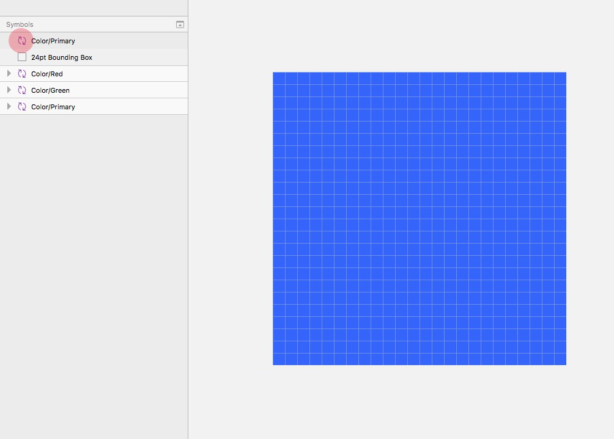

You then go ahead and drag in the relevant Icon, and resize and align it accordingly. It is bring in inside of a folder so you take the Shape Layers out of this folder and the delete the folder.

You then remove the icons Fill from the Inspector Panel, and turn it into a Mask (right-clicking on the icon and selecting Mask).

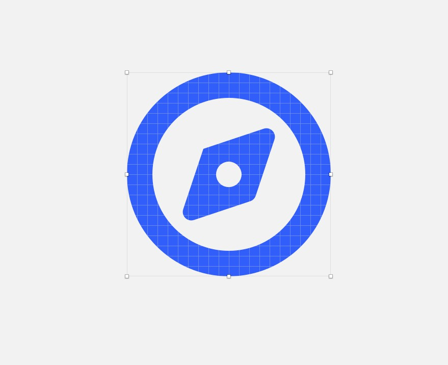

Then you select all the elements (Color Symbol, Icon Shape, and Bounding Box Shape), and convert to a Symbol…

You delete the original until you are left with the fresh Symbol, and then finally select the Bounding Box Layer and using the Resizing Constraints, pin it to all sides.

You delete the original until you are left with the fresh Symbol, and then finally select the Bounding Box Layer and using the Resizing Constraints, pin it to all sides.

## Button states

For the Button States you draw out a Rectangle (R) around 190x50px (this is just dimensions I suggest, feel free to choose your own).

And then give it a Fill Color you want.

You then create a new Shared Style and labelle it Button State/Disabled.

You rename the Layer to Base, and then convert it to a Symbol with the label State/Button/Disabled.

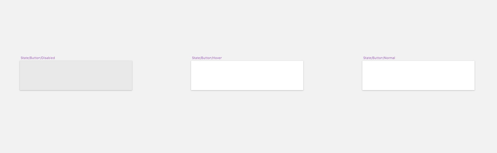

For the Button States you draw out a Rectangle (R) around 190x50px (this is just dimensions I suggest, feel free to choose your own).

And then give it a Fill Color you want.

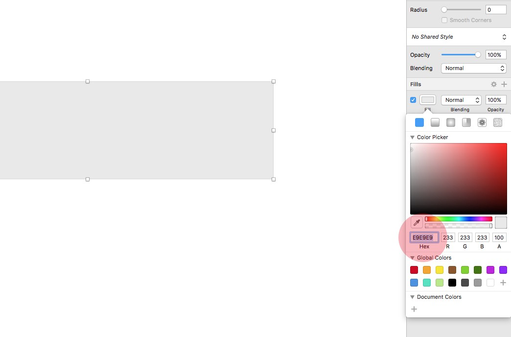

You then create a new Shared Style and labelle it Button State/Disabled.

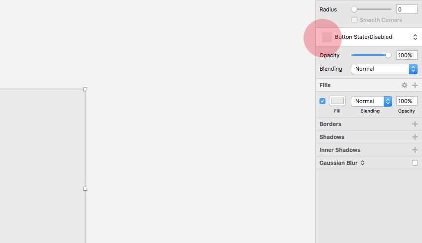

You rename the Layer to Base, and then convert it to a Symbol with the label State/Button/Disabled.

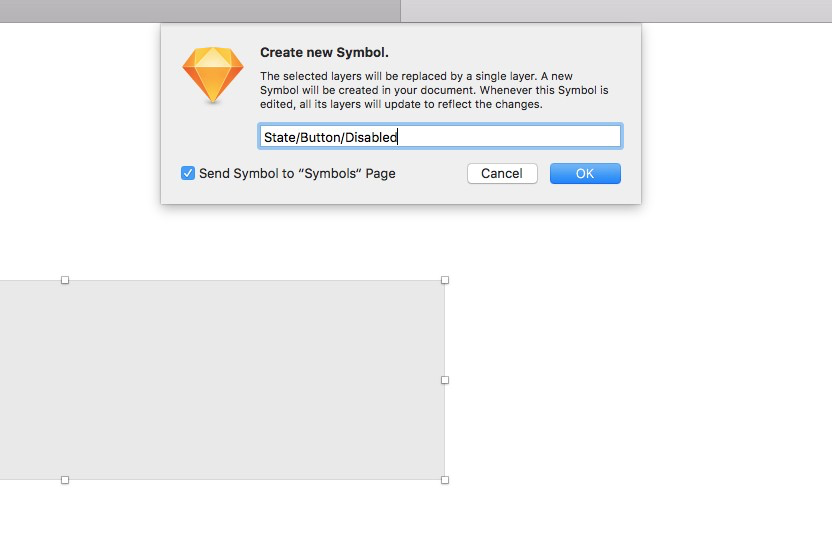

You then repeat a similar process for the Hover and Normal Button States (creating a new shape, a new Shared Style, and then a new Symbol), but choose a White Fill Color for the Hover and Normal States, with the Hover State at White with 25% Opacity and the Normal with White at 0% Opacity.

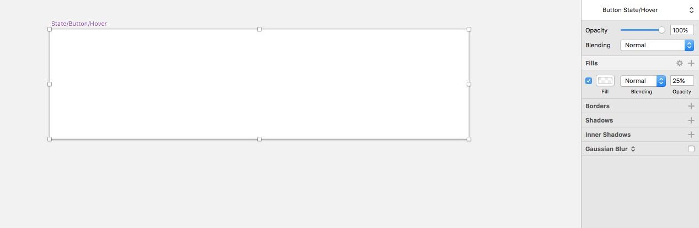

And now we have the Button States in place, and which you can now call upon, when building out your Button Components.

***Quick Tip:*** When creating Symbol Overrides. Make sure that if you want a certain set of Symbols to appear in an Override (ie; Disabled, Hover, Normal) that they are exactly the same dimensions. One pixel out and they just won’t appear in the Override dropdown. Not cool. So show those pixels some love!

## Button Shape (Fill)
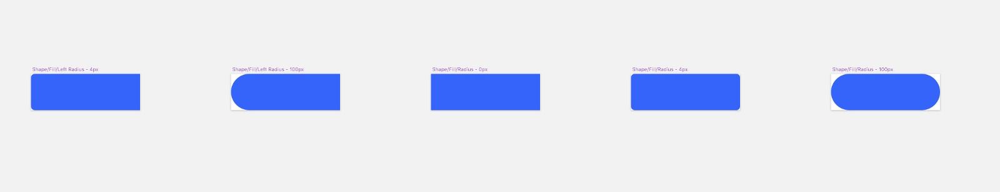

For the first of the Button Shape (Fill) Symbols I draw out a Rectangle (R) 120x40px and then rename the Layer to Base.

You then drop in both the Color Symbol and the State Symbols you have created previously.

You choose the Primary color, and Normal State Symbols (Color/Primary and State/Button/Normal).

Resize both of the elements to the same as the Base Layer, and then align them over the top.

Finally, you create a Mask on the Base Layer, shorten the Layer Names (ie; Color & State), and then, with all the Layers select, convert to a Symbol with the label Shape/Fill/Radius — 0px.

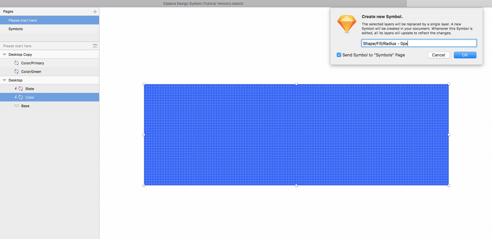

You then follow the same procedure for a Button Shape (Fill) with a 4px Radius and a 100px Radius, adjusting the shape layer accordingly.

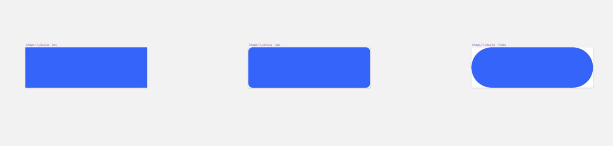

You now have a Symbol form which I can simply Override both its State, and Color from the Inspector.

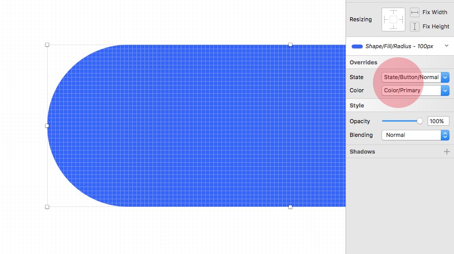

## Button Shape (Border)

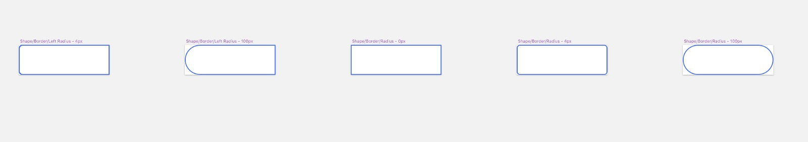

Firstly you create a Rectangle (R), the same dimensions as the Button Shape (Fill) Symbols; 120x40px.

Then you duplicate this layer (CMD + D) and align them atop one another.

With the top layer select, you reduce its size down to 118x38px and then move it 1px down, and 1px to the left, until you have something like the following…

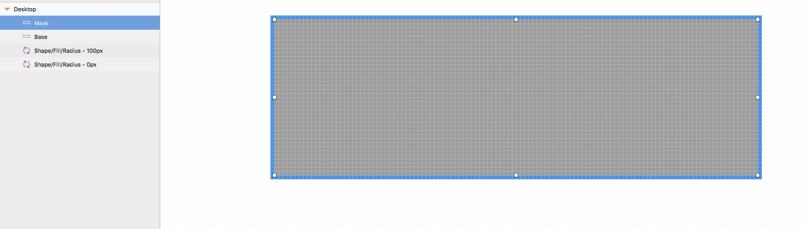

You then select both shape layers and use Subtract, and then rename the Combined Shape layer to Base.

You then insert the Color/Primary, and State/Button/Normal Symbols resize them accordingly, place them over the top of the shape layers, and then create a Mask from the Base Layer.

Finally you select all Layers and Symbols and convert to a new Symbol with the label Shape/Border/Radius — 0px.

You then follow the same procedure for a Button Shape (Border) with a 4px Radius and a 100px Radius, adjusting the shape layer accordingly.

## Input States

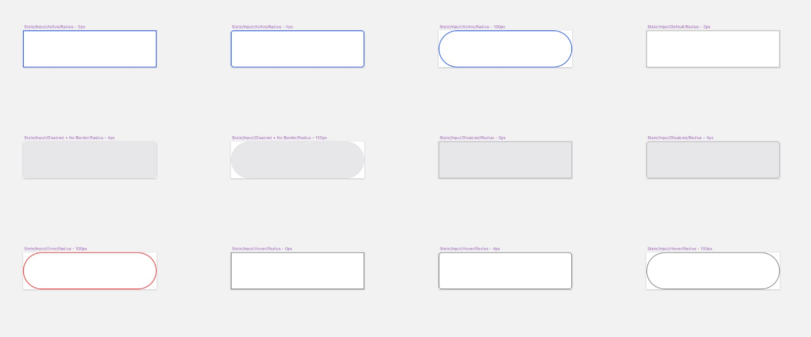

This tutorial will help you create some buttons easily. You shouldn't make it too complicated when working on the colors for Inputs. Stick to certain colors (Primary, Default, Error, Success) when building Input States, whereas with buttons allow yourself a little more freedom in the color department.

Starting with the Default Input States, you create a Rectangle (R) 180x50px and apply the Border/Light Grey Shared Style you have created previously.

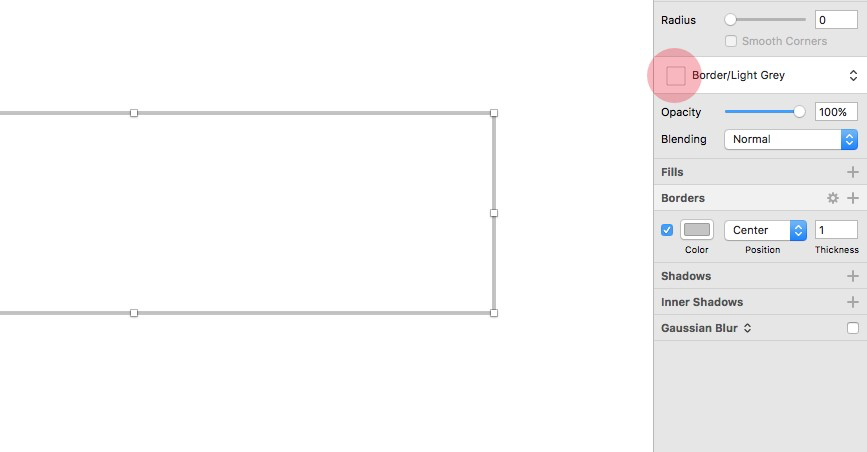

You then convert this to a Symbol with the label State/Input/Default/Radius — 0px.

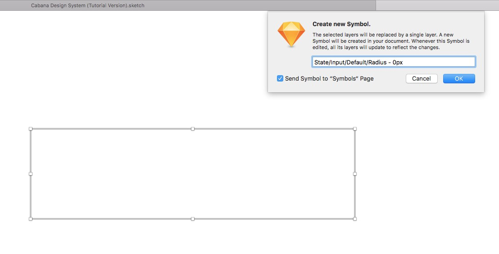

Then following similar steps, you create Symbols with the same Shared Style, but with a 4px and 100px Radius.

Then, calling upon the other Border Shared Styles you have created previously (ie; Primary, Grey, Error, Success), created Input Symbols for the following states…

- *State/Input/Active/Radius (0, 4px, and 100px)*
- *State/Input/Disabled/Radius (0, 4px, and 100px) you use a Grey Fill Color here with an Opacity of 40%, and then created a Mask with the Border Layer*
- *State/Input/Error/Radius (0, 4px, and 100px)*
- *State/Input/Success/Radius (0, 4px, and 100px)*

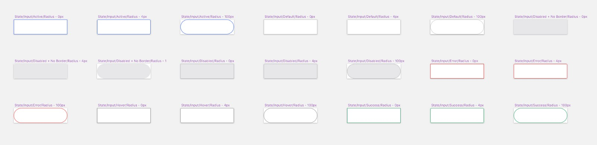

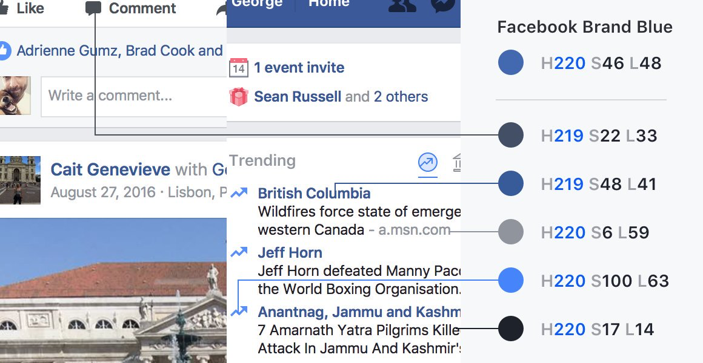

## Building out your Components

In the previous articles showed you how to build the foundations of what will become your Design System in Sketch, including the creation of base elements such as Color and Typography and then onto the base Symbols such Icons and Text which can then be implemented into countless other Symbols as you move forward.

For the Button Components you opt for 3 sizes (Small, Medium and Large) to give myself some adaptability when creating artwork for various screen sizes.

You also should follow the 8pt Grid System into play here once more, to keep an element of uniformity throughout.

Starting with the Large Buttons, you choose to create 4 Component variants -

- *Default (No Icon)*
- *Icon (No Text)*
- *Left Icon (With Text)*
- *Right Icon (With Text)*

And next to the Large/Default Button Component, you firstly drop in the Shape/Fill/Radius — 4px that you have created previously. Now you can choose the Symbol with 0px or 100px Radius to be your default that’s entirely up to you.

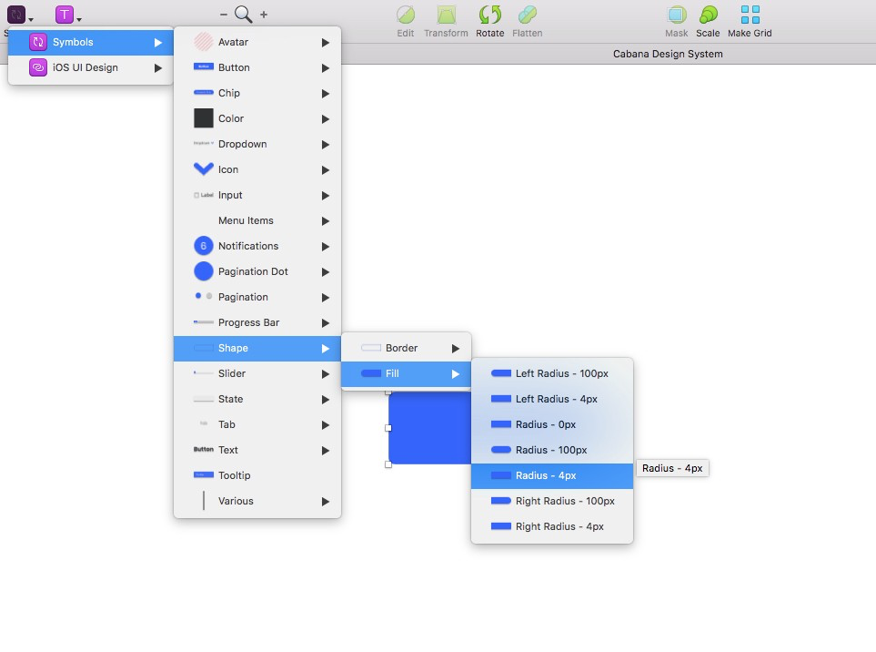

You then rename the Layer simply to Button, and note that with just this Layer in place that you also have the Symbol Overrides (Button State & Color) at your disposal moving forward. Very handy indeed!

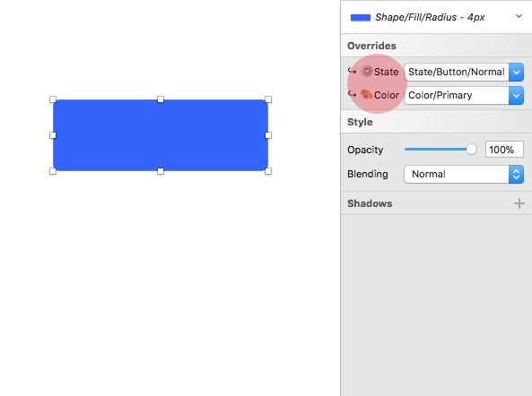

From the Text Symbols you have created previously you drop in the Text/Button/Large/Center/White Symbol, and simply rename the Layer to Text.

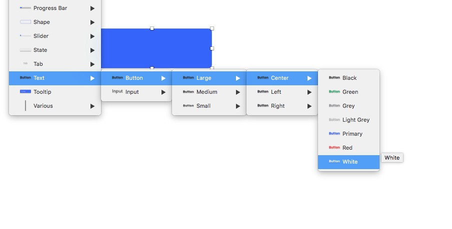

Now, wanting to adhere to the 8pt Grid System, and using a little bit of calculation you adjust the width and height of the button Layer so the text Layer that you just add aligned 8pt from the top and bottom of the button, and 32pt from the left and right edges.

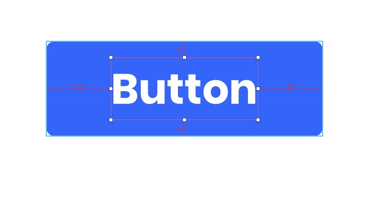

With the Button Layer resized accordingly, and the Text Layer aligned correctly, you select both layers and convert to a Symbol naming it as such — Button/Large/Default.

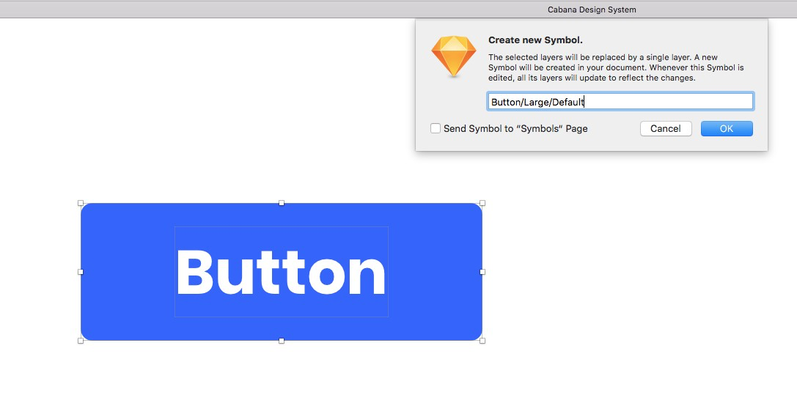

Now working with the freshly created Button Symbol, you select the Text Symbol inside of it…

…and from the Resizing Constraints in the Inspector Panel, Pin it to the Left and Right edges, and fix the Height. Now whenever you resize this Button Symbol, you only know that the text inside of it is going to align perfectly.

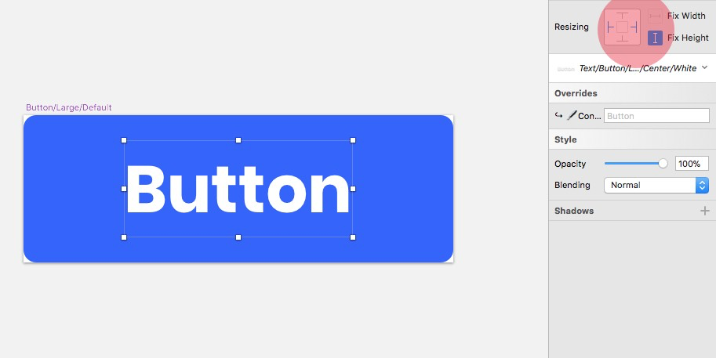

Now, inserting this Symbol into a project you have a multitude of options (Overrides), enabling me to tweak away at this Component with minimal effort. Huzzah with sprinkles on!!

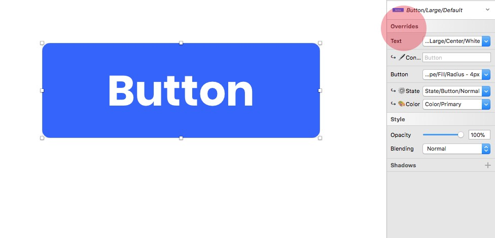

Onto the Icon Button. Again, You simply insert the *Shape/Fill/Radius — 4px*Symbol you should create previously, rename it, and then adjust it to more of a square shape.

Then from your Symbols, drop in one of the Icons you should create previously, rename the Layer (Icon), change its Color Override to White…

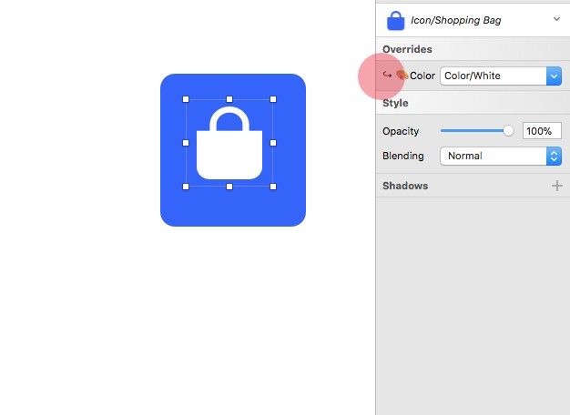

…and then, using the Scale tool, increase its size to 32 x 32px

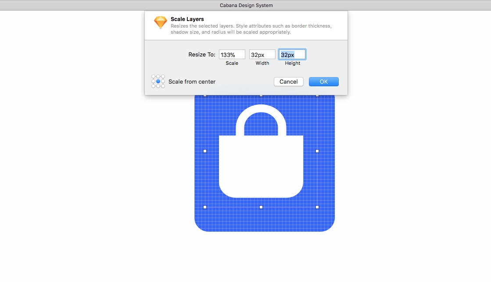

You then adjust the dimensions of the shape layer, so the Icon Symbol align 8pt from all edges.

With the Button Layer and Text Layer align correctly, you select both layers and convert to a Symbol naming it as such — *Button/Large/Icon*.

Now working with the newly create Button Symbol, I selected the Icon Symbol inside of it, and using Resizing Constraints fixed the Width and Height. This just avoids distortion of the icon when the Symbol is resized inside of your projects.

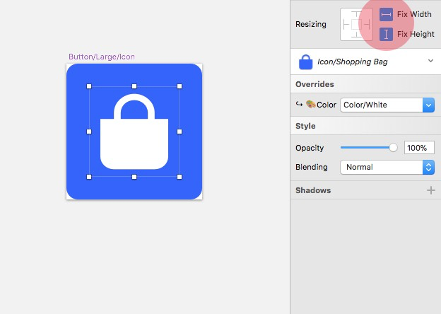

Moving onto the Button/Large/Left Icon Symbol, following similar steps to the previous buttons you’d created, you insert a Shape/Fill/Radius — 4px Symbol and then adjust its dimensions slightly (180px x 47px if you want to know the exact dimensions)…

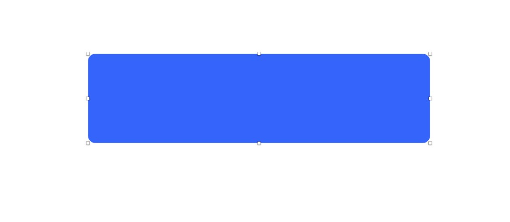

You then insert an Icon Symbol, rename it, scale it to 32 x 32px and change the color Override to White.

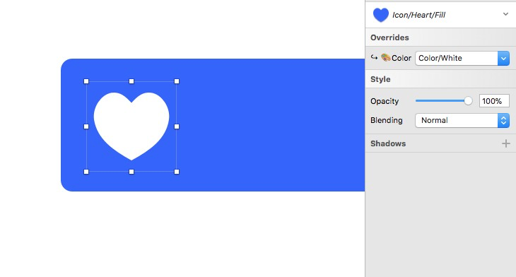

And from the Text Symbols you’d create previously, you drop in the Text/Button/Large/Left/White Symbol, and rename the Layer to Text.

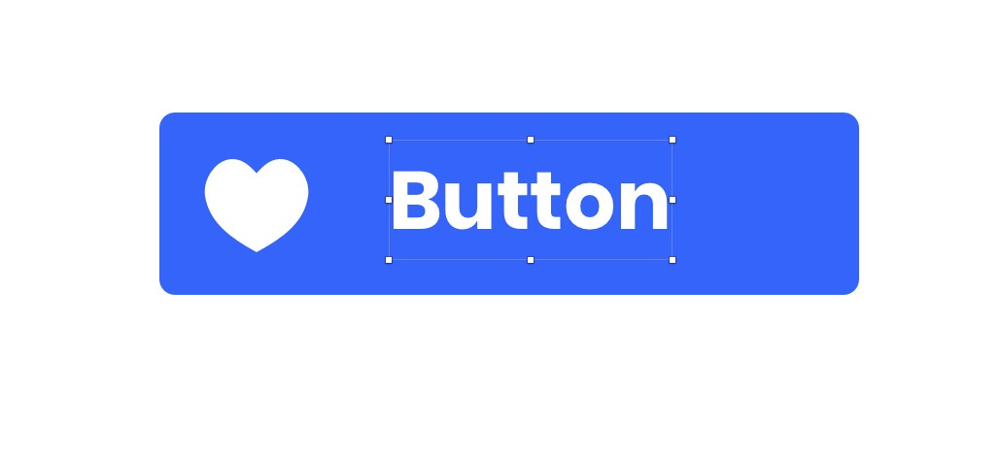

And once more, adhering to the 8pt Grid System, you align the Icon Symbol, so it is 8pt from the top, bottom and left edge.

Now, with all 3 Layers select (Text, Icon and Button), you convert to a Symbol and name it *Button/Large/Left Icon*.

Working from the newly create Button Symbol, you first select the Icon and pin it to the left edge, and then fix its Width and Height.

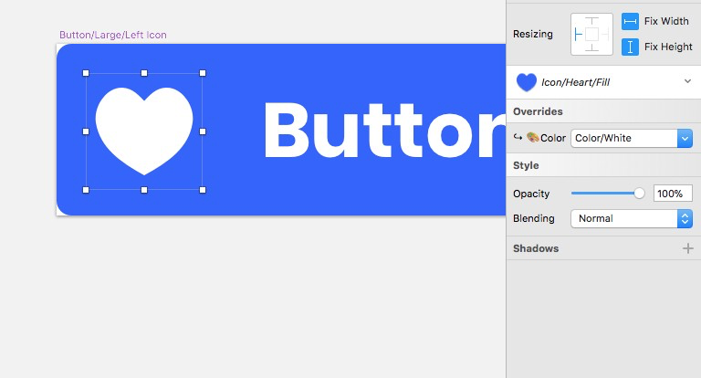

Then with the Text Symbol select, I pin it to the left and right edges, and fix the Height.

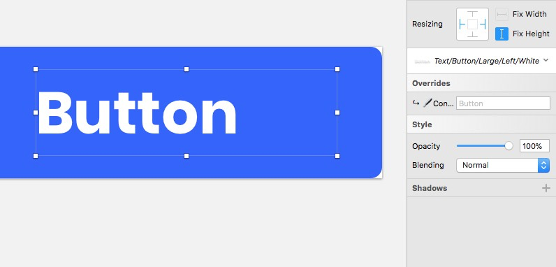

Finally, for the *Button/Large/Right Icon* Symbol, you follow a similar process to the previous buttons.

- *Inserting a Shape Fill Symbol and adjusting its dimensions*
- *Inserting an Icon Symbol, scaling it up and overriding its Color*
- *Inserting a Text Symbol (again using the Left aligned variant)*

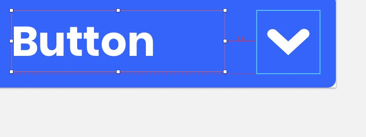

And for the Icon Symbol, so it is 8pt from the right, top and bottom edge of the Button.

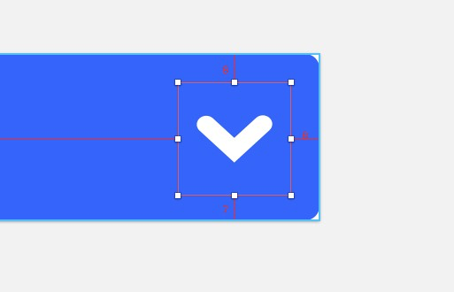

Then you select all 3 Layers (Text, Icon & Button), and once more convert to a Symbol *Button/Large/Right Icon*.

And finally, with the Resizing Constraints, pin the Text Layer to the left and right edges, and fix its Height.

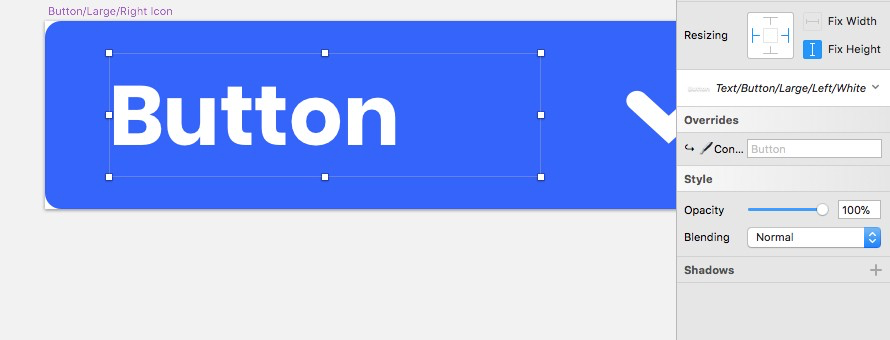

And for the Icon, pin it to the right edge, and fix its Width & Height.

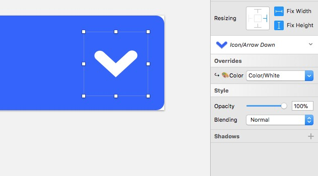

After getting the Large Button Symbols into play, you then go down through the Medium and Small variants following a very similar process, but this time inserting, for example, the Text/Button/Medium/Center/White Symbol, and scaling the Icon Symbol accordingly, but still adhering to the 8pt Grid System throughout.

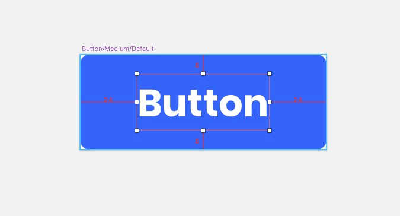

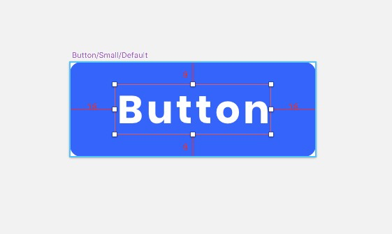

Until you have 12 rather fine Components now at my disposal.

You then create Components such as Form elements, Menus & Drop downs, Navigation, Pagination and more. Key elements for any project you’re working on, but it in a form that is now easily customizable and allow me to stay on point when working through a project.

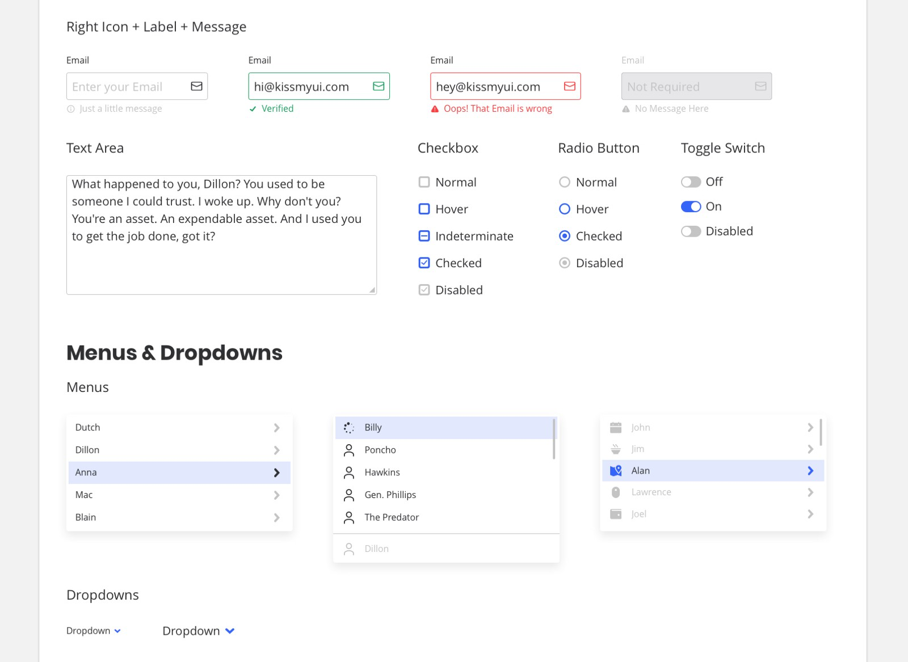

## Form Field (with Label & Message)

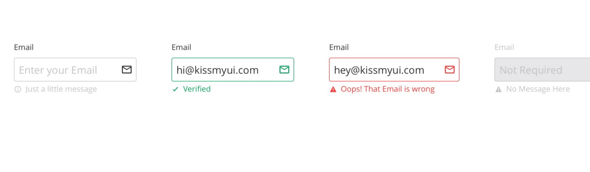

Which you label in its final Symbol state as Input/Right Icon + Label + Message (rolls off the tongue you admit, but easier to find in the Symbol drop down later on, believe me).

And here you can see it in its untouched Symbol state, before the many Overrides available to it have been tweaked…

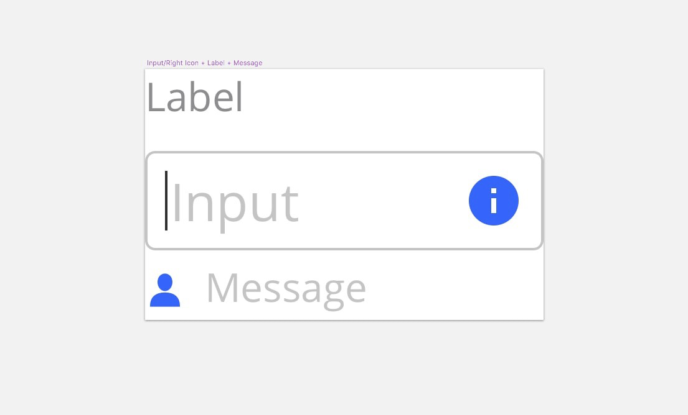

With the final Component made up of 3 separate Symbols…

- *Label*
- *Input*
- *Message*

## Input Symbol

The Input Symbol is comprised of 4 separate Symbols…

- *Cursor*
- *Text*
- *Icon*
- *State*

So firstly, you drop in one of the State Symbols that you created before

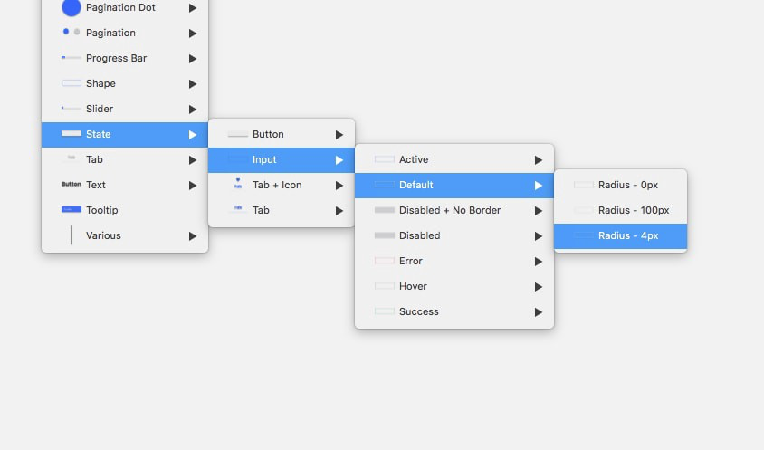

Rename the Layer simply to State, and resize it to 160x40.

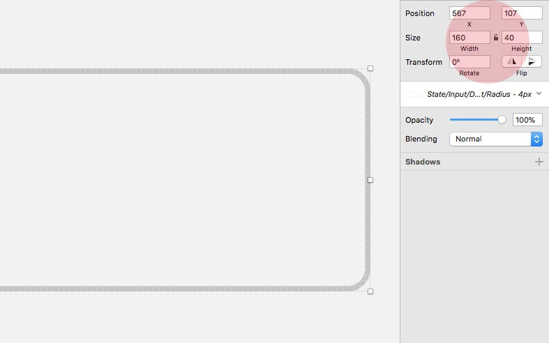

You then insert a Cursor Symbol you also created previously (this is simply a Shape Layer at 1x24 built off of a Fill Color Symbol. Nothing too over zealous.), rename it simply to Cursor, and position it 8 pts from the Left, Top & Bottom of the State Symbol.

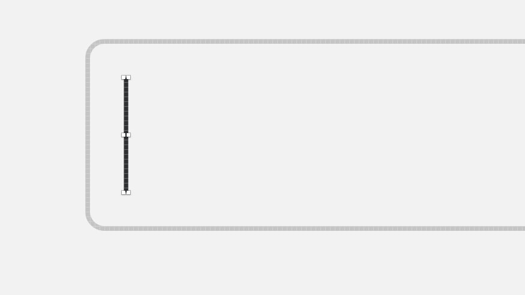

For the Placeholder text you insert one of my existing Text Symbols, and opt for the Light Grey color.

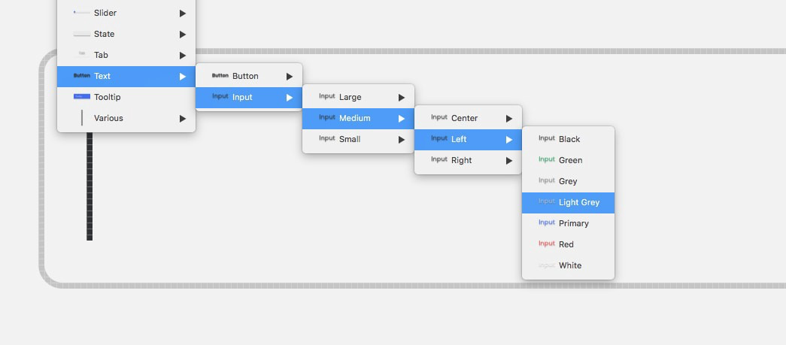

Rename the Layer, and then position it accordingly.

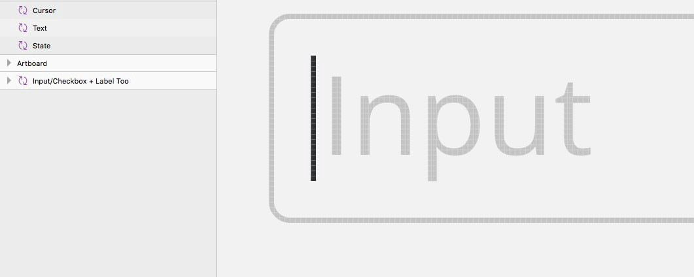

Then you increase the Width of its Bounding Box so it is 40pts from the right edge of the State Symbol, this will also make it 8pts from the left edge of the Icon Symbol that you add next. 

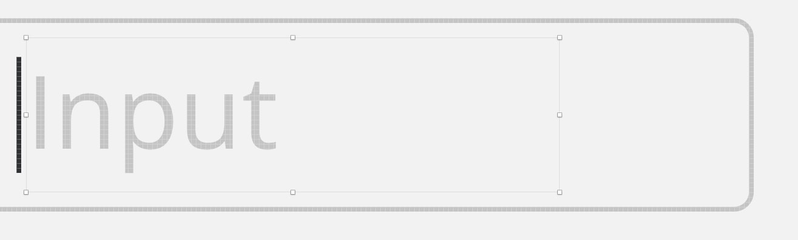

And finally you insert one of your Icon Symbols, rename it, and then position it 8pts from the Top, Bottom & Right edge of the State Symbol.

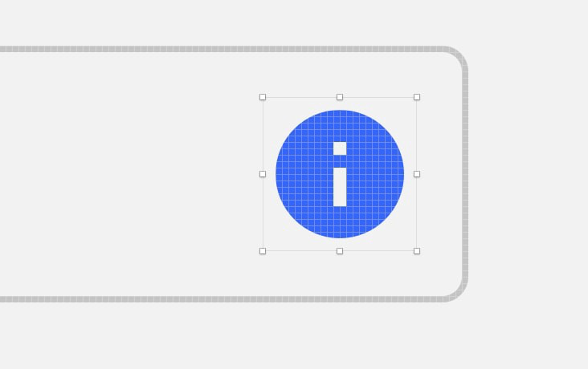

Then to finish things up, you select all Layers, convert to a Symbol, and name it Input/Right Icon.

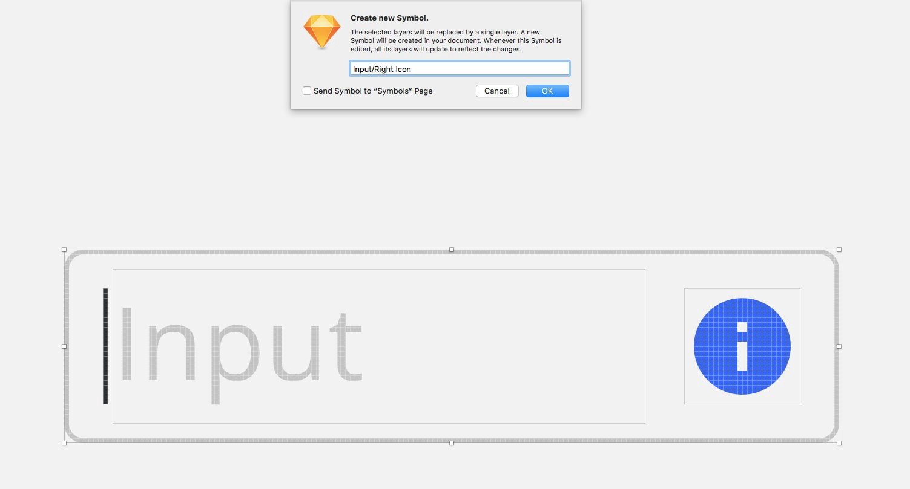

With your freshly made Symbol in place you then simply add some Resizing Constraints to finish things up.

For the Cursor, you pin it to the Left Edge, and fix the Width & Height…


For the Text, you pin it to the Left Edge, and fix the Height…


And for the Icon, you pin it to the Right Edge, and fix the Width & Height…


## Message Symbol

The Message Symbol is comprise of an Icon, and Text Symbol.

Firstly you insert an Icon Symbol that you created previously, rename it, and then Scale it down to 16x16.


Then you add one of the Text Symbols, opting for a smaller text size here due to context it is to appear in.


I then rename the Text Symbol, select both Layers and convert to a Symbol, naming it Input/Message.


With my new Symbol at the ready, it is again, like you show you before, a case of adjusting the Art board size to snap to the Height of the Icon Symbol (16pt)…


Adjusting the wording (via Overrides) of the Text Symbol, and adjusting the Art board Width accordingly…


…then to finish things up, it is a simple case of adding in some Resizing Constraints.

For the Icon, you pin it to the Top & Left Edges, and fix the Width & Height…


And for the Text, you pin it to the Top, Left & Right Edges…


So with the 3 Symbols at the ready…

- *Label*
- *Input*
- *Message*

So firstly for the Label, you insert a Text Symbol, again opting for a smaller text size, and rename the Layer to Label.


You then insert the Input Symbol, rename it simply to Input, and place this below the Label.

Then finally, insert the Message Symbol, rename to *Message*, and place this below the Input.

You don't worry about alignment, and spacing just yet. That can all be dealt with once the 3 Symbols are packaged up into a fresh, new Symbol.


All you did do was make sure the Layers were organize in a logical way…

- *Label*
- *Input*
- *Message*

Which in turn, places the Overrides in a more manageable order for you later on.

you then select all 3 Symbols, and create a new Symbol.


With the final Symbol construct (from the 3 Nest Symbols), it is just a case of, like before, doing a little Artboard resizing, adjusting resizing constraints, and other minor tweaks.

Firstly, you resize the Artboard so it snaps to the Left and Right edges of the Input…

then with the Input Symbol still select, and using the Resizing Constraints, pin it to All Edges.


For the Message Symbol, and like the Label before, increase its Width to the full width of the Artboard, and then snap it to the bottom edge.

You then adjust the text Override to read *Message*, and then pin it to the Bottom, Left & Right Edges, and Fix the Height using the Constraints.


The final thing to do is then simply align the elements vertically to one another using **8pts** between each element, and re-adjusting the Artboard size if require.

With this Component finally construct you now have an abundance of Overrides within easy reach…


And this enables you to customize with the greatest of ease when working your way through a project.


## Checkbox


For the Checkboxes it is simply a case of bringing together 2 existing elements from inside of my System; *Icon, and Text Symbols*, creating the necessary Overrides, and then applying the required Resizing Constraints.

The 5 different States you're aiming for in Component form were the usual suspects…

- *Normal*
- *Hover*
- *Indeterminate*
- *Checked*
- *Disabled*

Firstly you reference the Icon/Checkbox Symbols that you created before…


And from those you insert the Checkbox/Normal State.


You then reference the Text Symbols you also created previously…


And drop in one of those

You then rename the Layers to something a little more manageable (Icon, and Text), select both, and convert to a new Symbol (Input/Checkbox + Label).


Once you have this new Symbol up & ready, it's then a case of doing a lil’ bit of tweaking to get the sizing and spacing just right.

You adjust the Artboard so it snaps to the height of the Icon Symbol (**24pt**)


Then using the Overrides on the Text Symbol, rename that to ‘Label’ and (once more calling upon the almighty power of Grayskull, you mean 8pt Grid System) position it 8pts to the right of the Icon, and then tweak the Artboard width so the right edge snap to the right edge of the Text Symbol…


Finally, to keep everything in happy resize mode moving forward, you pin the Icon to the Top and Left Edge, and fix the Width & Height.


And for the Text Symbol, pin it to the Top, Left, and Right edges.


You now have a Checkbox Component that you can easily (with a number of Overrides at my disposal), adjust the States, edit the Text, resize with ease, and more…


You then follow a very similar process for both the Radio Button, and Toggle Switch Components…


Choosing 4 States for the Radio Buttons…

- *Normal*
- *Hover*
- *Checked*
- *Disabled*

…and for the Toggle Switch…

- *Off*
- *On*
- *Disabled*


[**Flat Icon Set**](https://www.notion.so/Flat-Icon-Set-2b28ad7050bf4e7286b694d3ca8aac4c?pvs=21)