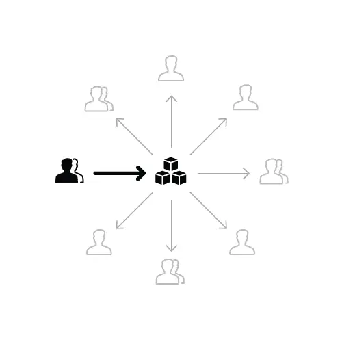
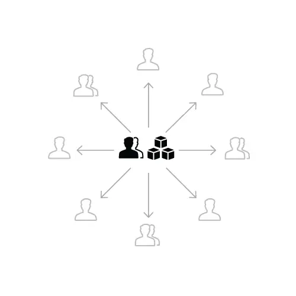
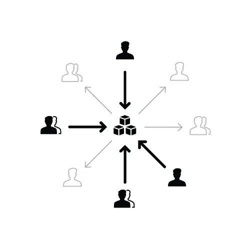
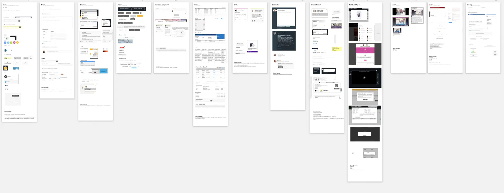

Now having a Design System in place unites product teams around a common visual language, accelerates your design process ten-fold and gives you a strong foundation to build any project. Learn how you can create a design system and help your team improve product quality when increase the speed of your workflow.

## Introduction
Today there are many the companies products compete with each other, the company should have one of the conditions:
* Make good and famous products
* Design fast and quality
* Have experience consultant and solve problems for customers

So apart from those two conditions, design systems enable a team to increase products faster by making design reusable makes scale possible. A design system is a collection of reusable components, guided by clear standards, that can be assembled together to build any number of applications.

When you first start working with a new system you may find yourself slightly hindered, because it is a different way of approaching a project, and something a little different than you’ve maybe become accustomed to.

But honestly, if you devote one's time to create this Design System, you'll find yourself working on auto-pilot. You can drive all projects and it will seem like your child. 

## Design
Starting a design system can feel daunting. There are so many things to consider: the design style, how to design for modularity and scalability, how it will be used by other teams, how to sell the idea to the decision makers in the company. Where is a designer to start?

### 1.Who should be involved
Before beginning work on your design system, take a moment to think about the team you’ll need to bring it to life. Who needs to be involved? Spoiler alert! You’re going to need more than just designers.

Here’s a quick list of the disciplines that can be represented in your team to create an effective design system:

* **Designers** to define the visual elements of the system
* **Front-end developers** to create modular, efficient code
* **Content strategists** who can help the team nail the voice and tone of the system
* **Researchers** who can help you understand customer needs
* **Performance experts** who can ensure your system loads quickly on all devices
* **Product managers** to ensure the system is aligned with customer needs
* **Leaders** (VPs and directors) to champion and align the vision throughout the company, including up to executive leadership

### 2. Choosing the right team model
* **The solitary model:** an “overlord” rules the design system.

The team model that brings people together is as important as the team creating the design system. In “Team Models for Scaling a Design System,” design systems veteran Nathan Curtis outlines 3 popular team models used by many companies.

* **The centralized team model:** a single team maintains the design system as their full-time job.

* **The federated model:** team members from across the company come together to work on the system.

* Other model

A hybrid design system team model that we used at Salesforce—a central team and members of other teams come together to manage and govern the system.

### 3. Interviewing customers
Like any product in a design process, it’s important to do your research. Who will be using your design system and how will they use it? Answer this question is the customer. [You should difference between the Customer and the User](https://www.uxpin.com/studio/blog/customer-experience-vs-user-experience-why-the-difference-matters/). The customer will use your design system. So your design system will get used much more often if you create it to fit into the workflow of other teams. By interviewing customers, you can pinpoint problems ahead of time, define principles that will help others use the system properly, and focus your energies on the most important things.

This process can include:
* **Interviews** of key (potential) contributors, influencers and leaders to assess perspective, attitudes, culture, and existing practices.
* **Survey**ing a broader organization of stakeholders attitudes and posture towards a system, priorities/needs, aspirations, and threats.
* **Requirements** gathering via task analysis, tech planning, and convention setting (using tools like [Brad Frost](https://twitter.com/brad_frost)’s [Front End Questionnaire](https://github.com/bradfrost/frontend-guidelines-questionnaire)).
* **Product tours** to immerse in as-is products and in-flight designs to which the system will apply, taking screenshots and notes.
* **System(s) reviews** assessing as-is design assets, code libraries, standards documentation depth and quality, and governance models.

### 4. Creating a visual inventory
With insights in hand from customer interviews, it’s time to take an inventory. There are 2 types of interface inventories to be created:
* An inventory of the visual attributes (such as spacing, color, and typography), which will help create a codified visual language
* An inventory of each UI element (such as buttons, cards, and modals), which will help create a UI library of components

Creating the visual identity isn’t something that will be created overnight. It takes time. Sometimes it’s as clear as day as to what is needed, other times it takes time for the building blocks to fall into place. Once in place, it’s important that the fundamentals are captured and documented at a high level. The likes of use of color, typography and style of iconography is key to creating consistency across a platform.

As we start to take inventory, it’s good practice to take a look at the CSS used to create all of those elements you just captured in your visual inventory. Use a tool like **[CSS Stats](http://cssstats.com/)** to see how many rules, selectors, declarations, and properties you have in your style sheets. More relevant, it will show you how many unique colors, font sizes, and font families you have. It also shows a bar chart for the number of spacing and sizing values. This is a great way to see where you can merge or remove values.

**Do a UI inventory audit**
Before you start anything, its best to identify how inconsistent the current build is. This works in two ways. It helps identify the reason as to why you’re doing it, to identify how inconsistent everything is but it should help you get the backing of the business as to why exactly you’re creating the design system; to create consistency across the platform.

* **Colors:** What is the color palette used on the platform? Explain how, where and why we use certain colors.
* **Typography:** What typeface is used on the platform? Summarizes rules around weighting, sizing, vertical alignment etc?
* **Iconography:** What is the generic style for icons? It will explain the rational as to why we have specific styles for different icon families.
* **Grid/Layouts:** What grid system is used across the platform? Explain the use of the grid and the high level idealism of our layouts.
* **Interactions:** What do people expect to see when they interact with our site? Give an overview of our standard interactions.
* **Animations:** How do we approach animations? Explain the reason for animations on the platform and our constraints around using them.
* **Design Resources**: A central point for assets to be easily downloaded for external partners. Color swatches, logo’s, icon sets etc.

An example of a UI Audit: Brad Frost has put together a great article around how you go about doing a UI audit.

Link source: [http://bradfrost.com/blog/post/interface-inventory/](http://bradfrost.com/blog/post/interface-inventory/)

### 5. Creating a visual design language
If we break apart each component of a design system we find that these fundamental elements make up its visual design language:

* Colors
* Typography (size, leading, typefaces, and so on)
* Spacing (margins, paddings, positioning coordinates, border spacing)
* Images (icons, illustrations)

Depending on your needs, you may also include the following to further standardize the user experience:

* Visual form (depth, elevation, shadows, rounded corners, texture)
* Motion
* Sound

### 6.  Design token
Before we dive into visual design standards, you should discuss design tokens. Design tokens are the “subatomic” foundation of a design system implementation. At its simplest, they’re name and value pairs stored as data to abstract the design properties you want to manage. With the values for all design tokens stored in a single place, it’s easier to achieve consistency while reducing the burden of managing your design system.

Example of design token: [https://www.lightningdesignsystem.com/design-tokens/](https://www.lightningdesignsystem.com/design-tokens/)

[https://uxdesign.cc/design-tokens-for-dummies-8acebf010d71](https://uxdesign.cc/design-tokens-for-dummies-8acebf010d71)

The workflow of design tokens would look like: 

1) The designer would update the color in the design tool.
2) The design tool updates design tokens files according to targeted platform.
3) Developers only have to retrieve or “pull” updated files and use it in their project.

Currently, the only way to create a design tokens is by using [Theo](https://github.com/salesforce-ux/theo), it made by Salesforce. What Theo does is simple: it takes as input a tech agnostic file format like JSON or YAML and outputs tech specific files for each platforms.

### 7. UI Library (Pattern Library)
After you complete the inventory, you can merge and remove what you don’t need (either in a spreadsheet or even directly in a code refactor if you want more immediate change). Also, document what the component is and when to use it. This will become your UI library (or pattern library, or component library, depending on what your organization chooses to call it.).

Most design system documentation includes the component’s name, description, example, and code. Others may show meta data, release histories, examples, and more. What matters most is that you show what’s necessary for your team to get your work done.

Process: [https://medium.com/@jgunnison/pattern-library-workflow-ba9cc486159e](https://medium.com/@jgunnison/pattern-library-workflow-ba9cc486159e)

### 8. Style Guide
[https://medium.muz.li/how-to-create-a-style-guide-from-scratch-tips-and-tricks-e00f25b423bf](https://medium.muz.li/how-to-create-a-style-guide-from-scratch-tips-and-tricks-e00f25b423bf)

After you understand this process of the design system, this guide will help you create a UI library in Sketch. 
Let’s take a step-by-step below here how you can create your design system.

