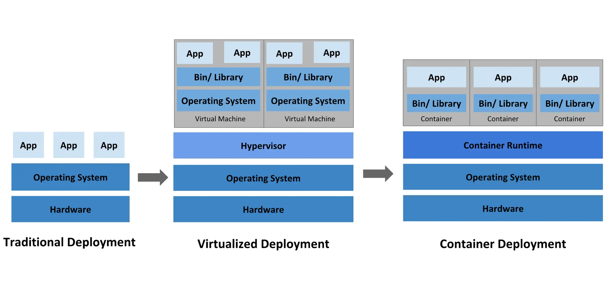

From the beginning, the desire to produce an isolated environment is raised to provide ability for multiple users accessing a computer concurrently with full resource utilization via a singular application. Over time, various other purposes have been explored and implemented. With the introduction of Docker, container technology became extensively utilized in software development. Two of the most popular uses are creating reproducible development environments and enabling continuous deployment.

## Container Deployment Era

Compare to other traditional solutions for creating isolated environments, Docker container offers a lot of superior advantages. It requires a significantly smaller resource footprint with the ability to spin up and down faster by using the same OS kernel instead of encapsulating independent OS. This approach allows for leveraging numerous benefits of containerization in the software deployment process.

Currently, creating and deploying entire applications becomes simple through the use of Docker. With the available immutability characteristics of the Docker image, we can also decouple applications from infrastructure by generating application container images at release time rather than at deployment time.

Furthermore, owing to the preeminence of Docker containers, a lot of services supporting them have experienced robust growth. With millions of pre-packaged applications available on DockerHub, initiating a project becomes swift with just a few commands. Numerous public and private cloud providers offer managed container services, enabling immediate deployment of our applications online. Moreover, an extensive ecosystem has emerged around containers and Docker, providing support for monitoring, security, networking, storage, and integration, letting us have the ability to create a smooth process from development, integration to deployment and testing.

## Docker in Development

Sounds massive! But I know some of us will never touch on the entire benefits of Docker containers except if we are a DevOps professional. So, to be more developer-friendly, why don't we take a closer look at the development environment aspect?

When beginning my software development career, I had the opportunity to work in a team with almost all previous-generation developers. In this environment, durability and certainty are prioritized above all else, so everyone is fine with installing a bunch of stuff on their computers to get the project off the ground. I actually needed over 3 days to get the project running, despite having quite detailed documents. After that, I knew others also needed more time. It is acceptable when this is the onboarding phase. The nightmare actually begins when your laptop encounters issues and the deadline is looming. Regardless of how familiar you are with the project, you still need at least 1 day to reinstall everything the risk of not remembering the dependency version. But that's not even the end of it. After I left the project, my laptop became polluted, and I actually didn’t know how to deal with it except by reinstalling my OS.

In another Golang project, a similar situation occurred. When we attempted to install all dependencies locally for development, one of us unwittingly upgraded the version of the Protobuf generator. Consequently, when the code is committed, thousands of changes are generated, even if only one line of code was updated. After this issue arose, we adopted Docker as a lifesaver.

Docker provides an easy way to define and start a local development environment with just a few instructions using a Dockerfile. Through this transparent approach, you can precisely control any library, version, and related resources required to run your application and lock down configurations as needed. So, once you identify the specific library update that caused issues, resolving it becomes straightforward.

Utilizing Docker simplifies the creation of a reproducible development environment. By initializing dependencies as containers and connecting our application to them, we ensure consistency. However, in this way, the code is actually running in the local environment. For maximum container isolation, we can encapsulate our application in its own container and integrate it with others. Sharing the development environment then becomes as simple as sharing Docker configuration and scripts, enabling seamless collaboration among team members, regardless of location.

It is not just for the backend side; on the frontend, containerization is also widely applied. Docker can be used to create containers that contain the frontend code, dependencies, and any related configurations to run the application, such as images for building specific APIs integrated with this website for use in local development with proper datasets.

However, nothing is perfect, Docker container has its own concerns.

## Nothing is perfect!

Yeah, Docker is really fast. It only takes anywhere from a few milliseconds to a few seconds to start a Docker container from a Docker image. But how do you feel when every time you change the code, you have to rebuild the Docker image and restart the container again for debugging? That would be a real nightmare. To avoid it, you can only run the application locally with Docker container dependencies, or rack your brain to find a way to optimize the Dockerfile. Most of the time, it's fine, but the real problem occurs in edge cases.

The same issue arises when our team tries to pack all related development tools into a Docker image. While it successfully avoids the problem of different versions of dependencies, this approach encounters a bottleneck as the time to start the application is longer than usual.

So what is actually happening? In the Docker, each modification to the codebase necessitates rebuilding the image and restarting the container. Despite leveraging build caching, this process can be time-consuming if not managed carefully. It's crucial to recognize that even a minor change in any layer prompts Docker to rebuild all subsequent layers, irrespective of whether alterations were made to those lower layers.

Furthermore, incorporating packages into a Docker image without proper consideration can lead to inefficiencies. Executing `apt-get upgrade` at the onset of your Docker build might replace files within the container image. Consequently, these surplus files generate redundant shadow copies, gradually consuming additional storage space over time.

One significant issue that is often overlooked is that Docker builds have access to the public internet. If dependencies are pulled directly from the internet during builds, it can make it difficult to ensure reproducibility of builds over time. Different versions of dependencies may be pulled, leading to inconsistencies between builds.

For example, we often include something like `RUN apt-get install ...` in the Dockerfile. This command handles everything necessary for your container to successfully execute your application. However, as mentioned above, this approach doesn't ensure complete reproducibility of the Docker image over time. Each time this command is run, the version of dependencies installed may vary. To mitigate this, we can specify the version of dependencies. However, if that exact version is no longer available, Docker will throw an error.

## What’s new gate?

So, with all the challenges mentioned above, do we have any way to avoid them in a peaceful manner? Certainly, there are various ways to address these problems, but none of them are perfect or bad.

Most of them involve optimizing your approach to using Docker. However, I would like to introduce another approach that keeps us away from Docker during development but still allows us to leverage Docker for deployment. We'll explore that in the next section.
