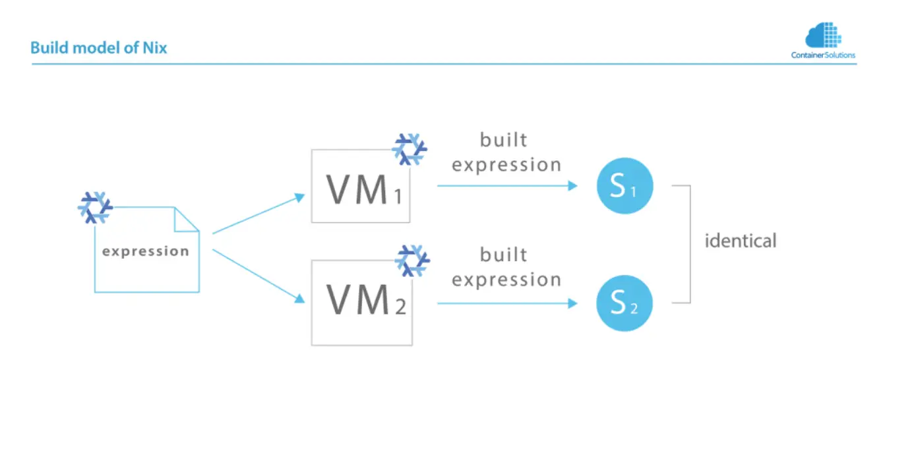
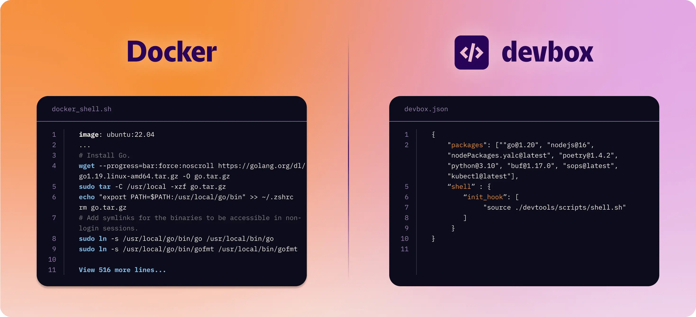
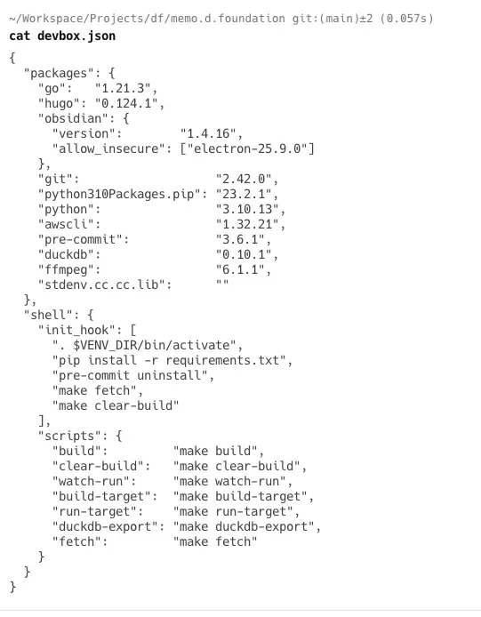
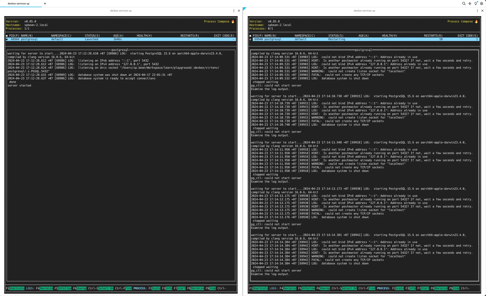

This is the 3rd post of Devbox series includes

- [Devbox #1: The world before Docker](https://memo.d.foundation/playground/_memo/devbox-a-world-before-docker)
- [Devbox #2: Our Docker adoption and its challenges](https://memo.d.foundation/playground/_memo/devbox-docker-adoption-and-challenges)
- [Devbox #3: The overview into Nix & how we use Devbox @ Dwawrves](https://memo.d.foundation/playground/_memo/devbox-nix-and-our-devbox-adoption)

In the previous session, that is [Devbox #2: Our Docker adoption and its challenges](https://memo.d.foundation/playground/_memo/devbox-docker-adoption-and-challenges) , we talked about “How Docker is adopted in my development team and its challenges encountered along the way?” And I also talked about a solution to separate us from Docker and containers in setup a local software development environment. And now, It is coming!

As known as a command-line tool, Devbox lets you easily create isolated shells for development. But it doesn't work alone. Because of powering by Nix under the hood, whether you're a newbie or an experienced Nix user, we we need to dissect Devbox beginning by taking about Nix and it power that is superior than Docker.

## Nix is more than a cross-platform package manager

From the [official Nix website](https://nixos.org/), we learn that Nix is a unique cross-platform package management tool that takes a reproducible, declarative and reliable approach to system configuration. However, there's more to Nix than just being a package manager. In fact, the holy trinity of Nix includes Nixpkgs, NixDSL, and NixOS. While they are all called Nix, you can break them down into their respective components for a clearer understanding. With Nix, you use the NixDLS to make Nixpkgs build packages that can be anything from software to entire NixOS images.

Nix builds packages in isolation from each other. This means that if a package works on one machine, it will also work on another. Nix is also declarative and reliable, making it easy to share development and build environments for your projects regardless of the programming languages and tools you're using. Additionally, Nix ensures that installing or upgrading one package doesn't break other packages, allowing you to roll back to previous versions if needed and preventing any inconsistent state during upgrades.

So, what sets Nix apart from Docker?

## Docker build is linear history

In Docker, each line in the Dockerfile is built into a separate Docker layer when it's executed. It's important to understand that even a minor change in any layer will prompt Docker to rebuild all subsequent layers, regardless of whether changes were made to those lower layers.

Let's take a look at the following Dockerfile.

```BASH
FROM ubuntu
# ...
RUN apt-get install -yq gcc
RUN apt-get install -yq vim mc
RUN apt-get install -yq big package
RUN some-expensive-operation
# ...
```

When you modify any line in a Dockerfile, the underlying layers are rebuilt from scratch, regardless of whether those lower layers have changed or not as in the following diagram. Once `RUN apt-get install -yq vim`  is modified to `RUN apt-get install -yq vim mc`, the big package is also rebuilt after that.


## Nix build is dependency graph

In contrast to Docker, Nix build works differently. It uses symlinks to achieve atomic deployment of new versions of the system configuration. This makes rollbacks easy to perform and reduces the complexity of managing dependencies. Under the hood, Nix creates a "map" of all the packages and their dependencies, providing a high-level view of the entire system.


Imagine you have a big box full of toys. Inside the box, there are lots of different toys that are connected to each other in different ways. For example, one toy might be connected to another toy by a string. If you want to play with just one toy, you need to find it in the box and take it out. But if you want to play with all the toys at once, you need to open the box and take them all out.


Nix works the same way. It creates a "map" of all the packages on your computer, and how they depend on each other. When you want to use a package, Nix finds it in the map and uses it. If you want to update a package, Nix changes the map to reflect the new version.

The magic of Nix is that it makes sure that everything works together correctly. It's like having a special box that knows how all the toys are connected, so it can help you play with them without getting confused or losing any of them.

## Docker can access internet while building image

As we discussed in the [Devbox #2: Our Docker adoption and its challenges](https://memo.d.foundation/playground/_memo/devbox-docker-adoption-and-challenges), Docker builds can access the public internet, so we can't guarantee that the same image will be built every time, as everything on the internet can change in minutes. Additionally, there are no checks to ensure that the files being fetched are actually the ones you intended for your Docker image. Even if we can push the image to a registry and pull it for running identical containers on different computers. In some edge cases when we can’t access to the online repository so need to build another one,  we may not be able to build the required image again if some dependencies have changed on the internet.

## Nix ensures external sources are Immutable

Take a look at the following diagram, we can see with the same build expression, Nix can result in the same images. In contrast, we can just only build a Docker Image one time and bring this result everywhere if don’t want any change to happen. How can Nix make it happen?




Nix restricts external sources from being changed without being detected. As a result, Nix build always produces functionally the same output each time they are run. This also makes making changes safer, as a change requires a rebuild. The reason for this is that Nix provides the ability to configure the system state using Nix expressions in the Nix language. Essentially, it's an instruction to Nix on how should it build the package and what the final result should look like.

To further illustrate the point that Nix builds produce the same output each time, we can understand that Nix is implemented as a pure function that always returns the same result for the same input parameters. This means that if you run the same Nix expression multiple times, you will always get the same output.

## Nix also can build Docker image better than Docker build

Nix can build Docker images better than Docker build, here's why: Nix takes advantage of a dirty secret deep within Docker - a content-aware store. However, since Docker build isn't designed to utilize this feature. Nix, on the other hand, can create layered images that only upload the changed layers, making updates more efficient.

A layered image puts every dependency into its own image layer so you only upload the parts of your image that have actually changed. For example, making an update to the webp library to fix a trivial bounds checking vulnerability because nobody writes those libraries in memory-safe languages? The only thing that'd need to be uploaded is that single webp library layer.


Additionally, if you have multiple services in the same repository, they'll share Docker layers with each other without any extra configuration. It's not possible to achieve this level of efficiency with Docker without creating multiple common base images, each containing a bunch of tools and unnecessary bloat that some of your services may never use.

## But Nix needs effort, Devbox is more easy

After all, Nix looks superior to Docker. But not everything is perfect. Nix is more complex, If you and your team do not want to destroy everything and start again, migrating to Nix needs a lot of effort. But we have another simple way to apply Nix in the local development environment, that is using Devbox.

Powered by Nix, Devbox is a command-line tool that makes it easy to create isolated shells for development. By defining the list of packages needed for your development environment, Devbox creates a dedicated space for your application to run without anything related to container or VM.



In practice, Devbox works similarly to a package manager like Yarn - except the packages it manages are at the operating system level (something you would normally install with brew or apt-get). With Devbox, you can access over 400,000 package versions from the Nix Package Registry.

Devbox offers an intuitive interface for creating development environments using the Nix Package Manager, without requiring any knowledge of the Nix language. So, how can we incorporate Devbox into our team's workflow?

## Case Study: memo.d.foundation

Looking at [memo.d.foundation](https://github.com/dwarvesf/memo.d.foundation), we use Devbox as a tool to create reproducible development environments, making it easy for new team members to get started with minimal effort. By setting up a Devbox shell config with needed dependencies, new joiners can quickly get started without installing anything beyond Devbox. They can then focus on making the application run locally, avoiding the issue of "It works on my machine." Non-tech team members working on content for this repository can also easily run the project without any concerns.

All above ideas are proved by below transparent configuration file. 



Jut only need to bring it to anywhere then using `devbox shell` to setup an reproduced development environment without any outstanding steps likes following.


Finally, easy to run our project without installing any other stuffs


## Case Study: docker-less development with Devbox services

In addition, we use Devbox to create a containerless development environment by leveraging Devbox services. Under the hood, it takes advantage of Process-Compose, a simple and flexible scheduler and orchestrator written in Nix, to manage non-containerized applications. With Devbox, we can create and manage servers in the shell using a Docker-compose-like approach without any actual Docker containers needed.

When we install a package using Devbox, it creates a file `process-compose.yaml` in the `./.devbox/virtualenv/` directory. This allows Devbox to manage every package installed inside the shell.

For example, when installing PostgreSQL using Devbox add Postgresql, the resulting `process-compose.yaml` file contains instructions for executing the DB, as shown in the following code.

```BASH
version: "0.5"

processes:
  postgresql:
    command: "pg_ctl start -o \"-k $PGHOST\""
    is_daemon: true
    shutdown:
      command: "pg_ctl stop -m fast"
    availability:
      restart: "always"%   

```

If you familiar with docker-compose,  I think it is easy to understand process-compose as well. By standing all `process-compose.yaml` both from the root of project and in the  `.devbox/`, you can manage how many services are ready to serve by using `devbox services ls`. Then when you enter `devbox services up`, all services in this project will be instructed to run. The special point here is that you can custom the `process-compose.yaml` at the root of project to get the same result as docker-compose without using container.


You also can run different Devbox shells parallel, but can’t run different services from different shells using the same port because we have no separate network here. Take a look at the following example when I try running 2 Postgresql services in different shells with the same port.



So depending on what applications you are running, you will have the proper way to config different ports. For example, can change add one more argument to change the default port of Postgresql in the `process-compose.yaml` to get parallel processes.

```BASH
version: "0.5"

processes:
  postgresql:
    command: "pg_ctl start -o \"-k $PGHOST -p 5433\""
    is_daemon: true
    shutdown: 
      command: "pg_ctl stop -m fast"
    availability:
      restart: "always"

```


For now, this is the list of usecases I can provide. As I continue to learn and adapt, I will introduce more in the future.

## Conclusion

In summary, Nix and Devbox offer exciting new possibilities for streamlining software development processes. By providing a more efficient way to create reproducible development environments, Nix and Devbox can help teams overcome challenges and improve overall workflow. While they may not completely replace Docker, they can effectively address different problems and provide additional support where Docker may be struggling.
